Quản trị Red Hat OpenShift I: Vận hành Cụm Môi trường Sản xuất
--------------------------------------------------------------

# Chương 1. Giới thiệu về Kubernetes và OpenShift
## Container và Kubernetes
### Giới thiệu về Container và Kubernetes
Red Hat OpenShift Container Platform (RHOCP) là một nền tảng toàn diện để vận hành các ứng dụng trên các cụm máy chủ. OpenShift được xây dựng dựa trên các công nghệ hiện có như container và Kubernetes. Container cung cấp phương thức đóng gói ứng dụng cùng các thành phần phụ thuộc, cho phép chúng thực thi trên bất kỳ hệ thống nào có hỗ trợ môi trường thực thi container (container runtime).

Kubernetes cung cấp nhiều tính năng để xây dựng các cụm máy chủ vận hành những ứng dụng dạng container. Tuy nhiên, Kubernetes không hướng tới việc cung cấp một giải pháp trọn gói mà thay vào đó cung cấp các điểm mở rộng để quản trị viên hệ thống có thể hoàn thiện nền tảng này. OpenShift tận dụng các điểm mở rộng của Kubernetes để mang lại một nền tảng hoàn chỉnh.

### Tổng quan về Container
Container là một tiến trình chạy ứng dụng một cách độc lập với các container khác trên máy chủ (host). Các container được tạo ra từ một container image – thành phần bao gồm tất cả các phụ thuộc (dependencies) cần thiết để ứng dụng vận hành. Sau đó, các container này có thể được thực thi trên bất kỳ máy chủ nào mà không cần cài đặt các phụ thuộc trên máy chủ đó, cũng như không gây ra xung đột giữa các phụ thuộc của những container khác nhau.

**Hình 1.1: Các ứng dụng trong container so với trên hệ điều hành máy chủ**  
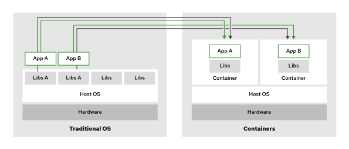

Các container sử dụng các tính năng của nhân Linux, chẳng hạn như namespace và control group (cgroup). Ví dụ, container sử dụng cgroup để quản lý tài nguyên, như phân bổ thời gian CPU và bộ nhớ hệ thống. Namespace giúp cô lập các tiến trình và tài nguyên của một container khỏi các container khác cũng như khỏi hệ thống máy chủ (host system).

Open Container Initiative (OCI) duy trì các tiêu chuẩn về container, image container và runtime container. Do hầu hết các triển khai container engine đều được thiết kế để tuân thủ các thông số kỹ thuật của OCI, nên các ứng dụng được đóng gói theo tiêu chuẩn này có thể chạy trên bất kỳ nền tảng nào tuân thủ các thông số đó.

### Tổng quan về Kubernetes
Kubernetes là một nền tảng giúp đơn giản hóa việc triển khai, quản lý và mở rộng quy mô các ứng dụng được đóng gói dưới dạng container.

Bạn có thể chạy các container trên bất kỳ hệ thống Linux nào bằng cách sử dụng các công cụ như Podman. Tuy nhiên, cần thực hiện thêm các bước để tạo ra các dịch vụ dạng container có khả năng, chẳng hạn như, chạy trên một cụm (cluster) để đảm bảo tính dự phòng.

Kubernetes tạo ra một cụm để chạy các ứng dụng trên nhiều node. Nếu một node gặp sự cố, Kubernetes có thể khởi động lại ứng dụng trên một node khác.

Kubernetes sử dụng mô hình cấu hình khai báo (declarative configuration model). Các quản trị viên Kubernetes viết bản định nghĩa cho các khối công việc (workload) cần thực thi trong cụm, và Kubernetes đảm bảo rằng các khối công việc đang chạy khớp với bản định nghĩa đó. Ví dụ, một quản trị viên định nghĩa một số khối công việc, trong đó mỗi khối quy định lượng bộ nhớ cần thiết. Sau đó, Kubernetes sẽ tạo các container cần thiết trên các node khác nhau để đáp ứng các yêu cầu về bộ nhớ này.

Kubernetes định nghĩa các khối công việc dưới dạng các "pod". Một pod bao gồm một hoặc nhiều container chạy trên cùng một node của cụm. Các pod chứa nhiều container rất hữu ích trong những tình huống nhất định, chẳng hạn như khi hai container cần chạy trên cùng một node để chia sẻ tài nguyên. Ví dụ, một "job" là một loại khối công việc thực hiện một tác vụ trong pod cho đến khi hoàn tất.

### Các tính năng của Kubernetes
Kubernetes cung cấp các tính năng sau đây trên nền tảng cơ sở hạ tầng container:

**Khám phá dịch vụ và cân bằng tải**  
Việc phân tán các ứng dụng trên nhiều node có thể làm phức tạp quá trình giao tiếp giữa các ứng dụng. 

Kubernetes tự động cấu hình mạng và cung cấp dịch vụ DNS cho các pod. Nhờ các tính năng này, các pod có thể giao tiếp với dịch vụ của những pod khác một cách liền mạch giữa các node mà chỉ cần sử dụng tên máy chủ (hostname) thay vì địa chỉ IP. Nhiều pod có thể cùng hỗ trợ một dịch vụ để đảm bảo hiệu năng và độ tin cậy. Ví dụ, Kubernetes có thể phân bổ đều các yêu cầu gửi đến máy chủ web NGINX dựa trên trạng thái sẵn sàng của các pod NGINX.

**Mở rộng theo chiều ngang (Horizontal scaling)**  
Kubernetes có thể giám sát tải của dịch vụ, đồng thời tạo hoặc xóa các pod để thích ứng với mức tải đó. Với một số cấu hình nhất định, Kubernetes cũng có thể cấp phát động các node để đáp ứng tải của cụm (cluster).
Mở rộng theo chiều dọc (Vertical scaling)

Bắt đầu từ phiên bản Kubernetes 1.35 và OpenShift Container Platform 4.22, Kubernetes có thể thay đổi dung lượng CPU và bộ nhớ được cấp phát cho các pod đang chạy mà không cần khởi động lại chúng. Tính năng này được gọi là thay đổi kích thước pod tại chỗ (in-place pod resize).

**Tự phục hồi (Self-healing)**  
Nếu các ứng dụng có khai báo quy trình kiểm tra trạng thái (health check), Kubernetes có thể giám sát, khởi động lại và lên lịch lại cho các ứng dụng bị lỗi hoặc không khả dụng. Khả năng tự phục hồi giúp bảo vệ ứng dụng trước cả lỗi nội bộ (ứng dụng dừng đột ngột) lẫn lỗi bên ngoài (node chạy ứng dụng bị mất kết nối hoặc ngừng hoạt động).

**Triển khai tự động (Automated rollout)**  
Kubernetes có thể dần dần triển khai các bản cập nhật cho các container của ứng dụng. Nếu xảy ra sự cố trong quá trình triển khai, Kubernetes có thể hoàn tác (roll back) về phiên bản triển khai trước đó. Kubernetes điều hướng các yêu cầu đến phiên bản ứng dụng mới được triển khai và xóa các pod thuộc phiên bản cũ khi quá trình triển khai hoàn tất.

**Quản lý cấu hình và thông tin bảo mật (Secrets)**  
Bạn có thể quản lý các thiết lập cấu hình và thông tin bảo mật (secrets) của ứng dụng mà không cần thay đổi các container. Các thông tin bảo mật của ứng dụng có thể bao gồm tên người dùng, mật khẩu, điểm cuối dịch vụ (service endpoint) hoặc bất kỳ thiết lập cấu hình nào cần được giữ kín.

> **Lưu ý:** Kubernetes không mã hóa các secret.

**Operator**  
Operator là các ứng dụng Kubernetes được đóng gói, có khả năng quản lý các khối lượng công việc (workload) trên Kubernetes theo phương thức khai báo. Ví dụ, một Operator có thể định nghĩa tài nguyên máy chủ cơ sở dữ liệu. Khi người dùng tạo tài nguyên cơ sở dữ liệu, Operator sẽ tự động tạo ra các khối lượng công việc cần thiết để triển khai cơ sở dữ liệu, cấu hình cơ chế sao chép dữ liệu (replication) và thực hiện sao lưu.

### Các khái niệm kiến trúc Kubernetes
Kubernetes sử dụng nhiều máy chủ (còn gọi là các node) để đảm bảo tính bền bỉ và khả năng mở rộng cho các ứng dụng mà nó quản lý. Các node này có thể là máy vật lý hoặc máy ảo. Có hai loại node, mỗi loại đảm nhiệm một khía cạnh khác nhau trong hoạt động của cụm (cluster).

Các node thuộc mặt phẳng điều khiển (control plane) thực hiện điều phối toàn cục cho cụm nhằm lập lịch thực thi các khối lượng công việc (workload) đã được triển khai. Các node này cũng quản lý trạng thái cấu hình của cụm để phản hồi lại các sự kiện và yêu cầu liên quan đến cụm.

Các node thuộc mặt phẳng tính toán (compute plane) chịu trách nhiệm chạy các khối lượng công việc của người dùng.

**Hình 1.2: Các thành phần của Kubernetes**  
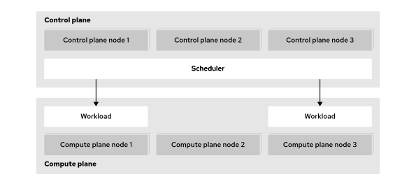

Mặc dù một máy chủ có thể đóng vai trò vừa là node mặt phẳng điều khiển (control plane node) vừa là node tính toán (compute node), hai vai trò này thường được tách biệt để tăng cường tính ổn định, bảo mật và khả năng quản lý. Các cụm Kubernetes có quy mô đa dạng, từ những cụm nhỏ chỉ gồm một node cho đến các cụm lớn với số lượng lên tới 5.000 node.

Trong khi các cụm tiêu chuẩn triển khai mặt phẳng điều khiển trực tiếp trên các node chuyên dụng, các kiến trúc nâng cao có thể sử dụng mô hình mặt phẳng điều khiển được lưu trữ (hosted control plane). Với mô hình này, mặt phẳng điều khiển được vận hành dưới dạng các pod biệt lập trên một cụm lưu trữ riêng biệt. Đây là phương pháp phổ biến đối với các mô hình đám mây chủ quyền (sovereign cloud) – nơi đòi hỏi sự phân tách nghiêm ngặt giữa các khách thuê (multitenancy).

### API và Mô hình Cấu hình Kubernetes
Kubernetes cung cấp một mô hình để định nghĩa các khối lượng công việc (workload) sẽ chạy trên một cụm (cluster).

Các quản trị viên định nghĩa các khối lượng công việc này dưới dạng các tài nguyên.

Tất cả các loại tài nguyên đều hoạt động theo cùng một cơ chế và sử dụng một API thống nhất. Các công cụ như lệnh `kubectl` có thể quản lý mọi loại tài nguyên, kể cả các loại tài nguyên tùy chỉnh.

Kubernetes cho phép nhập và xuất tài nguyên dưới dạng tệp văn bản. Bằng cách làm việc với các định nghĩa tài nguyên ở định dạng văn bản, quản trị viên có thể mô tả khối lượng công việc thay vì phải thực hiện chính xác một chuỗi các thao tác để tạo ra chúng. Phương pháp này được gọi là quản lý tài nguyên theo kiểu khai báo (declarative resource management).

**Hình 1.3: Quản lý tài nguyên theo phương thức khai báo**  
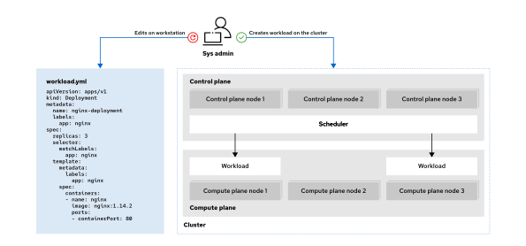

Việc quản lý tài nguyên theo phương thức khai báo (declarative) có thể giảm bớt khối lượng công việc khi tạo các workload (khối lượng công việc) và cải thiện khả năng bảo trì. Ngoài ra, khi sử dụng các tệp văn bản để mô tả tài nguyên, quản trị viên có thể tận dụng các công cụ phổ biến như hệ thống quản lý phiên bản để đạt được những lợi ích bổ sung, chẳng hạn như khả năng theo dõi các thay đổi.

Để hỗ trợ quản lý tài nguyên theo phương thức khai báo, Kubernetes sử dụng các bộ điều khiển (controller) liên tục theo dõi trạng thái của cụm (cluster) và thực hiện các bước cần thiết để duy trì cụm ở trạng thái mong muốn. Quy trình này đồng nghĩa với việc các thay đổi đối với tài nguyên thường cần một khoảng thời gian nhất định mới có hiệu lực. Tuy nhiên, Kubernetes có khả năng tự động áp dụng các thay đổi phức tạp. Ví dụ: nếu bạn tăng yêu cầu về RAM cho một ứng dụng mà node (node) hiện tại không thể đáp ứng, Kubernetes có thể chuyển ứng dụng đó sang một node khác có đủ dung lượng RAM. Kubernetes chỉ chuyển hướng lưu lượng truy cập đến instance (phiên bản chạy) mới sau khi quá trình di chuyển đã hoàn tất.

Kubernetes cũng hỗ trợ cơ chế namespace (không gian tên). Quản trị viên có thể tạo các namespace, và hầu hết các tài nguyên đều phải được tạo bên trong một namespace cụ thể. Bên cạnh việc giúp tổ chức số lượng lớn tài nguyên, namespace còn cung cấp nền tảng cho các tính năng như quản lý quyền truy cập tài nguyên. Quản trị viên có thể thiết lập quyền hạn cho từng namespace để cho phép những người dùng cụ thể xem hoặc chỉnh sửa các tài nguyên đó.

## Các thành phần và phiên bản của Red Hat OpenShift
### Giới thiệu về Red Hat OpenShift
Kubernetes cung cấp nhiều tính năng để vận hành các khối lượng công việc dạng container trên các cụm (cluster). Tuy nhiên, đối với một số tính năng, Kubernetes chỉ cung cấp các thành phần cơ bản để triển khai, do các môi trường khác nhau có thể đòi hỏi những giải pháp khác nhau. Các quản trị viên Kubernetes có thể lựa chọn giải pháp có sẵn hoặc tự triển khai giải pháp riêng để đáp ứng các yêu cầu cụ thể của mình.

OpenShift tận dụng khả năng mở rộng của Kubernetes để xây dựng một giải pháp toàn diện bằng cách bổ sung các tính năng sau vào cụm Kubernetes:

**Quy trình làm việc tích hợp dành cho nhà phát triển**  
Khi chạy các ứng dụng trên Kubernetes, bạn cần xây dựng và lưu trữ các image container cho ứng dụng. OpenShift tích hợp sẵn registry chứa container, các pipeline CI/CD và S2I – một công cụ giúp tạo ra các artifact (sản phẩm đầu ra) dưới dạng image container từ mã nguồn trong kho lưu trữ.

**Khả năng quan sát**  
Để đạt được mức độ tin cậy, hiệu năng và tính sẵn sàng mong muốn cho các ứng dụng, quản trị viên cụm có thể cần thêm các công cụ để ngăn ngừa và khắc phục sự cố. OpenShift tích hợp sẵn các dịch vụ giám sát và ghi nhật ký dành cho cả ứng dụng của bạn lẫn cụm hệ thống.

**Quản lý máy chủ**  
Kubernetes cần một hệ điều hành để vận hành; hệ điều hành này đòi hỏi phải được cài đặt, cấu hình và bảo trì. 

OpenShift cung cấp các quy trình cài đặt và cập nhật cho nhiều kịch bản triển khai khác nhau. 

Ngoài ra, các máy chủ (host) trong cụm sử dụng Red Hat Enterprise Linux CoreOS (RHEL CoreOS) làm hệ điều hành nền tảng. RHEL CoreOS là một hệ điều hành bất biến (immutable), được tối ưu hóa để chạy các ứng dụng dạng container. RHEL CoreOS sử dụng cùng loại nhân (kernel) và các gói phần mềm như Red Hat Enterprise Linux. OpenShift cũng cung cấp các tính năng để quản lý RHEL CoreOS theo mô hình cấu hình của Kubernetes.

OpenShift còn mang đến các công cụ thống nhất và giao diện điều khiển web trực quan để quản lý toàn bộ các khả năng đa dạng của hệ thống, cùng với những cải tiến bổ sung như các biện pháp bảo mật được tăng cường.

Sơ đồ dưới đây hiển thị nhiều dự án đảm nhiệm các chức năng khác nhau trong mỗi cụm OpenShift:

**Hình 1.4: Các dự án mã nguồn mở trong một bản phát hành OpenShift**  
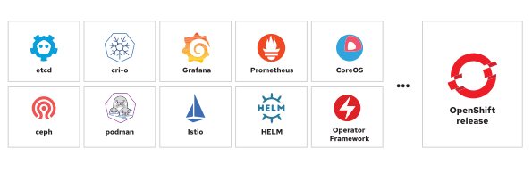

Do các tính năng của OpenShift được xây dựng dựa trên khả năng mở rộng của Kubernetes, các quản trị viên thường có thể vận hành chúng bằng cách tận dụng kiến thức sẵn có về Kubernetes. Bên cạnh kiến thức về Kubernetes, quản trị viên OpenShift còn có thể sử dụng hầu hết các sản phẩm hiện có được thiết kế cho Kubernetes.

### Các phiên bản Red Hat OpenShift
Khi mới bắt đầu tìm hiểu OpenShift, việc sử dụng Red Hat OpenShift Local là một giải pháp khả thi để triển khai cụm (cluster) trên máy tính cục bộ nhằm mục đích thử nghiệm và khám phá. Red Hat cũng cung cấp Developer Sandbox, cho phép bạn truy cập miễn phí vào một cụm OpenShift dùng chung trong vòng 30 ngày. Các tùy chọn này giúp bạn tiếp cận cụm OpenShift để thử nghiệm và tìm hiểu trong quá trình cân nhắc triển khai nền tảng này, nhưng chúng không phải là môi trường phù hợp để triển khai thực tế (production).

Khi đã sẵn sàng triển khai Red Hat OpenShift cho các khối lượng công việc thực tế, bạn có thể lựa chọn nhiều phiên bản khác nhau để đáp ứng mọi yêu cầu kinh doanh về việc triển khai cụm. OpenShift có sẵn các phiên bản dưới dạng dịch vụ đám mây và các phiên bản tự quản lý. Tất cả các phiên bản OpenShift đều sử dụng cùng một mã nguồn. Hầu hết nội dung trong khóa học này đều áp dụng cho tất cả các phiên bản OpenShift.

**Hình 1.5: Các phiên bản sản phẩm**  
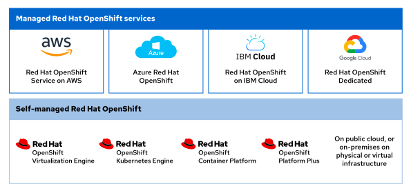

#### Các phiên bản dịch vụ đám mây
Các nhà cung cấp dịch vụ đám mây công cộng như Amazon, Microsoft, IBM và Google đều cung cấp khả năng triển khai Red Hat OpenShift theo nhu cầu một cách nhanh chóng. Các nền tảng ứng dụng được quản lý toàn diện này mang lại quyền truy cập nhanh vào cụm (cluster) trên cơ sở hạ tầng đáng tin cậy từ các nhà cung cấp đám mây được Red Hat công nhận.

Khi sử dụng các dịch vụ được quản lý, nhiều trách nhiệm sẽ được chuyển giao cho Red Hat và nhà cung cấp đám mây. Do quy trình cài đặt có sự tích hợp với nhà cung cấp đám mây, dịch vụ được quản lý sẽ tự động tạo và quản lý mọi tài nguyên đám mây cần thiết. Ví dụ, các nhóm Kỹ thuật Độ tin cậy Hệ thống (SRE) của Red Hat sẽ thực hiện cập nhật cụm và khắc phục mọi sự cố phát sinh trong quá trình cập nhật (mặc dù bạn vẫn tham gia vào việc lên lịch cập nhật). Mỗi phiên bản dịch vụ được quản lý đều quy định rõ trách nhiệm của khách hàng, Red Hat và nhà cung cấp đám mây.

Ngoài ra, để hỗ trợ quản lý cụm, dịch vụ tư vấn Red Hat Lightspeed cũng được cung cấp thông qua Red Hat Hybrid Cloud Console. Lightspeed advisor hỗ trợ quản trị viên xác định và khắc phục các vấn đề của cụm bằng cách phân tích dữ liệu do Insights Operator cung cấp. Dữ liệu từ operator này được tải lên Red Hat Hybrid Cloud Console, nơi bạn có thể xem xét kỹ hơn các khuyến nghị cũng như tác động của chúng đối với cụm.

#### Các phiên bản tự quản lý
Bạn có thể triển khai cụm Red Hat OpenShift bằng cách sử dụng các trình cài đặt có sẵn trên cơ sở hạ tầng vật lý hoặc ảo, dù là tại chỗ (on-premise) hay trong môi trường đám mây công cộng. Với các phiên bản do người dùng tự quản lý, bạn có quyền kiểm soát và sự linh hoạt cao hơn so với các dịch vụ được quản lý, nhưng đồng thời cũng phải gánh vác trách nhiệm lớn hơn đối với dịch vụ đó.

Các phiên bản Red Hat OpenShift do người dùng tự quản lý cung cấp nền tảng kiến trúc cho chủ quyền kỹ thuật số, đảm bảo tổ chức duy trì quyền kiểm soát tuyệt đối đối với cơ sở hạ tầng nền tảng và các ranh giới bảo mật. Chủ quyền kỹ thuật số bao gồm quyền kiểm soát việc lưu trú dữ liệu tại địa phương (data localization), sự độc lập về công nghệ, quyền kiểm soát vận hành đối với các tiêu chuẩn và chính sách, cũng như đảm bảo tính toàn vẹn và bảo mật của các hệ thống kỹ thuật số.

Red Hat OpenShift Virtualization Engine cung cấp chức năng ảo hóa có mặt trên tất cả các phiên bản OpenShift để triển khai, quản lý và mở rộng quy mô các máy ảo (VM). Giải pháp này mang lại cách tiếp cận chuyên biệt cho việc quản lý máy ảo và bao gồm các khả năng hỗ trợ VM quan trọng như bảng điều khiển dành riêng cho quản trị viên ảo hóa, Red Hat OpenShift GitOps, giám sát khối lượng công việc của người dùng và ghi nhật ký nền tảng.

Red Hat OpenShift Kubernetes Engine bao gồm phiên bản mới nhất của nền tảng Kubernetes cùng với các cải tiến tăng cường bảo mật và độ ổn định cấp doanh nghiệp vốn là thế mạnh của Red Hat. Việc triển khai này chạy trên hệ điều hành container bất biến (immutable) Red Hat Enterprise Linux CoreOS, sử dụng Red Hat OpenShift Virtualization để quản lý máy ảo, đồng thời cung cấp bảng điều khiển quản trị viên để hỗ trợ công tác vận hành.

Red Hat OpenShift Container Platform phát triển dựa trên các tính năng của OpenShift Kubernetes Engine, bổ sung khả năng quản lý cụm, tính bảo mật, độ ổn định và sự thuận tiện trong việc phát triển ứng dụng cho doanh nghiệp. Các tính năng bổ sung của cấp độ này bao gồm bảng điều khiển dành cho nhà phát triển, cũng như các công cụ quản lý nhật ký, quản lý chi phí và thông tin đo lường tài nguyên. Gói giải pháp này bổ sung Red Hat OpenShift Serverless (Knative), Red Hat OpenShift Service Mesh (Istio), Red Hat OpenShift Pipelines (Tekton) và Red Hat OpenShift GitOps (Argo CD) vào quá trình triển khai.

Red Hat OpenShift Platform Plus mở rộng hơn nữa các tính năng của gói giải pháp để mang lại những công cụ mạnh mẽ và giá trị nhất hiện có. Gói này bao gồm Red Hat OpenShift Data Foundation, Red Hat Advanced Cluster Management for Kubernetes, Red Hat Advanced Cluster Security for Kubernetes và nền tảng registry riêng (private registry) Red Hat Quay. Để có trải nghiệm container toàn diện và đầy đủ tính năng nhất, Red Hat OpenShift Platform Plus tích hợp tất cả các công cụ cần thiết cho quy trình phát triển và quản trị toàn diện trong việc quản lý nền tảng ứng dụng dạng container.

### Vòng đời hỗ trợ Red Hat OpenShift
Red Hat OpenShift Container Platform tuân theo chính sách vòng đời phát hành với các bản phát hành phụ (minor release) định kỳ. Red Hat chỉ định các bản phát hành phụ có số hiệu chẵn (ví dụ: 4.18, 4.20 và 4.22) là các bản phát hành thuộc diện Hỗ trợ Cập nhật Mở rộng (Extended Update Support - EUS), với thời gian hỗ trợ dài hơn so với các bản phát hành có số hiệu lẻ.

Bắt đầu từ phiên bản OpenShift Container Platform 4.14, giai đoạn EUS dành cho các bản phát hành số chẵn mang lại tổng vòng đời hỗ trợ là 24 tháng trên tất cả các kiến trúc được hỗ trợ. Một gói bổ sung tùy chọn kéo dài 12 tháng có thể nâng tổng thời gian hỗ trợ lên 36 tháng, qua đó đảm bảo sự ổn định cho các môi trường vận hành thực tế (production) mang tính trọng yếu.

## Điều hướng trong OpenShift Web Console
### Tổng quan về Red Hat OpenShift Web Console
Red Hat OpenShift Web Console cung cấp giao diện người dùng đồ họa để thực hiện nhiều tác vụ quản trị nhằm quản lý cụm (cluster). Web console này sử dụng các API của Kubernetes và các API mở rộng của OpenShift để mang lại trải nghiệm đồ họa mạnh mẽ. Các menu, tác vụ và tính năng có trong web console cũng luôn khả dụng thông qua giao diện dòng lệnh (CLI). Web console giúp việc truy cập và quản lý các tác vụ phức tạp trong quá trình quản trị cụm trở nên dễ dàng hơn.

Kubernetes cung cấp một bảng điều khiển (dashboard) dựa trên nền tảng web, nhưng thành phần này không được triển khai mặc định trong cụm. Bảng điều khiển của Kubernetes cung cấp các quyền bảo mật ở mức tối giản và chỉ chấp nhận xác thực dựa trên token. Bảng điều khiển này cũng yêu cầu thiết lập proxy, điều này giới hạn khả năng truy cập vào web console chỉ từ chính terminal hệ thống nơi tạo ra proxy đó. Trái ngược với những hạn chế nêu trên của web console Kubernetes, OpenShift cung cấp một web console với đầy đủ tính năng hơn.

Web console của OpenShift không liên quan đến bảng điều khiển của Kubernetes mà là một công cụ riêng biệt để quản lý các cụm OpenShift. Ngoài ra, người vận hành có thể mở rộng các tính năng và chức năng của web console để bổ sung thêm menu, chế độ xem và biểu mẫu nhằm hỗ trợ công tác quản trị cụm.

#### Truy cập OpenShift Web Console
Bạn có thể truy cập bảng điều khiển web bằng bất kỳ trình duyệt web hiện đại nào. URL của bảng điều khiển web thường có thể tùy chỉnh và sẽ do quản trị viên cụm cung cấp cho bạn. Nếu quản trị viên cụm cung cấp điểm cuối API của cụm thay vì URL bảng điều khiển web, bạn có thể xác định địa chỉ bảng điều khiển web bằng cách sử dụng giao diện dòng lệnh (CLI) `oc`.

Từ cửa sổ dòng lệnh (terminal), hãy xác thực với cụm bằng lệnh `oc login -u <USERNAME> <API_ENDPOINT>:<PORT>`:

```console
[user@host ~]$ oc login -u developer https://api.lab.example.com:6443
Console URL: https://api.lab.example.com:6443/console
Authentication required for https://api.lab.example.com:6443 (openshift)
Username: developer
Password: developer
Login successful.
...output omitted...
```

Kết quả của lệnh `oc login` hiển thị đường dẫn tắt đến Console URL. Điểm cuối (endpoint) dựa trên API này sẽ tự động chuyển hướng trình duyệt web của bạn đến địa chỉ web console do người vận hành console cấu hình.

Ngoài ra, bạn có thể lấy trực tiếp URL của web console bằng cách chạy lệnh `oc whoami --show-console`:

```console
[user@host ~]$ oc whoami --show-console
https://console-openshift-console.apps.lab.example.com
```

Cuối cùng, hãy sử dụng trình duyệt web để truy cập vào URL hiển thị trang xác thực:

**Hình 1.6: Trang xác thực OpenShift**  
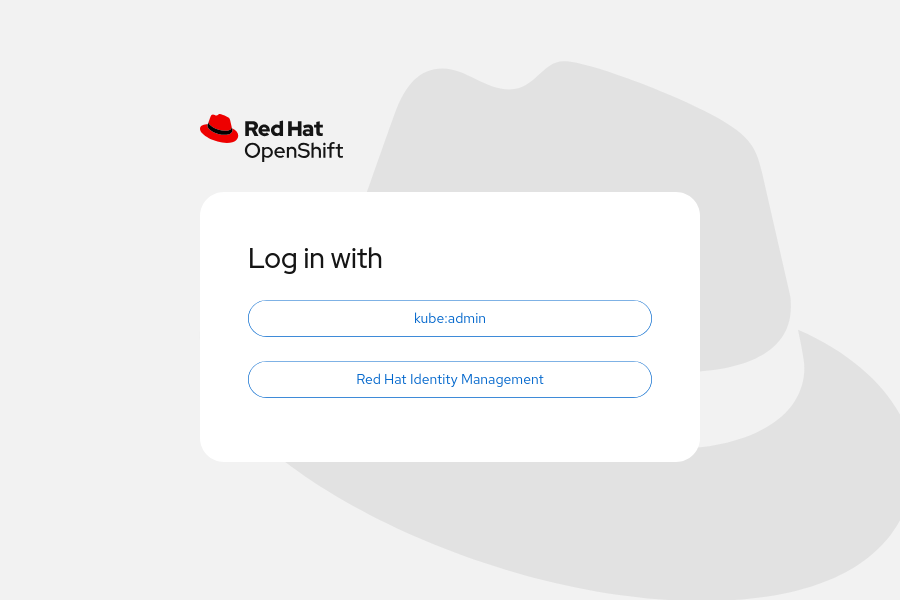

Việc sử dụng thông tin xác thực để truy cập cụm sẽ đưa bạn đến trang chủ của bảng điều khiển web.

**Hình 1.7: Trang chủ OpenShift**  
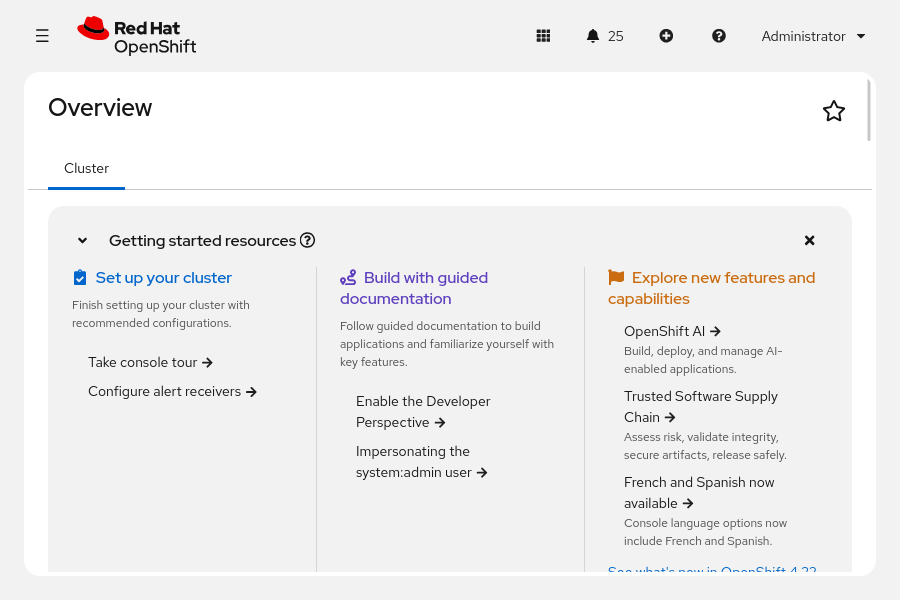

#### Bố cục Bảng điều khiển Web OpenShift
Bắt đầu từ phiên bản OpenShift Container Platform 4.19, giao diện web console sử dụng góc nhìn nền tảng cốt lõi (Core platform perspective); góc nhìn này hợp nhất quyền truy cập vào các tính năng quản trị cụm, triển khai ứng dụng và giám sát thông qua một giao diện thống nhất duy nhất, thay vì tách biệt các góc nhìn dành cho Quản trị viên (Administrator) và Nhà phát triển (Developer) như trước đây. Những người dùng không phải là quản trị viên cụm có thể cần yêu cầu cấp quyền từ quản trị viên cụm để truy cập vào một số tính năng quản trị nhất định. Tại các cụm đã cài đặt operator Red Hat OpenShift Virtualization, góc nhìn Ảo hóa (Virtualization perspective) sẽ khả dụng để người dùng tạo và quản lý các máy ảo.

> **Lưu ý:** Quản trị viên cụm có thể tùy chọn khôi phục hành vi trước đây của bảng điều khiển với chế độ xem Developer (Developer perspective) riêng biệt.  
> Để kích hoạt chế độ xem Developer, hãy truy cập Administration → Cluster Settings, chuyển sang tab Configuration, chọn tài nguyên Console operator và nhấp vào Customize. Sau đó, chuyển trạng thái của chế độ xem Developer sang Enabled. Có thể mất vài phút để các thay đổi có hiệu lực.

Tại trang chủ của bảng điều khiển web, phương thức điều hướng chính là thông qua thanh bên. Thanh bên này sắp xếp các chức năng và hoạt động quản trị cụm thành nhiều danh mục chính. Khi chọn một danh mục trên thanh bên, danh mục đó sẽ mở rộng để hiển thị các mục con, mỗi mục cung cấp thông tin, cấu hình hoặc chức năng cụ thể của cụm.

> **Lưu ý:** Khi đăng nhập lần đầu vào bảng điều khiển web, bạn sẽ thấy tùy chọn tham gia một chuyến tham quan ngắn để tìm hiểu thông tin. Hãy nhấp vào **Bỏ qua chuyến tham quan** (Skip Tour) nếu bạn muốn bỏ qua tùy chọn này vào lúc này.  
> **Hình 1.8: Giới thiệu sơ lược về bảng điều khiển web**  
> 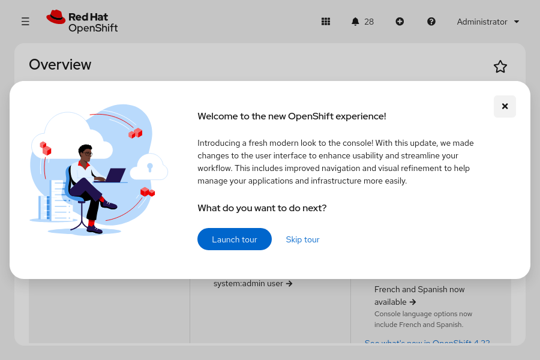

Theo mặc định, bảng điều khiển hiển thị trang **Home → Overview** (Trang chủ → Tổng quan), nơi cung cấp cái nhìn tổng quan nhanh về các cấu hình cụm ban đầu, tài liệu và trạng thái chung của cụm. Hãy truy cập **Home → Projects** (Trang chủ → Dự án) để liệt kê tất cả các dự án trong cụm khả dụng với thông tin xác thực đang được sử dụng.

Ban đầu, bạn có thể xem qua trang **Ecosystem → Software Catalog** (Hệ sinh thái → Danh mục Phần mềm); trang này cung cấp quyền truy cập vào bộ sưu tập các Operator, Helm chart và các phần mềm khác khả dụng cho cụm của bạn. Kể từ phiên bản OpenShift Container Platform 4.19, Software Catalog đã hợp nhất OperatorHub và Developer Catalog trước đây thành một nơi duy nhất để quản lý toàn bộ phần mềm của cụm.

**Hình 1.9: Danh mục phần mềm OpenShift**  
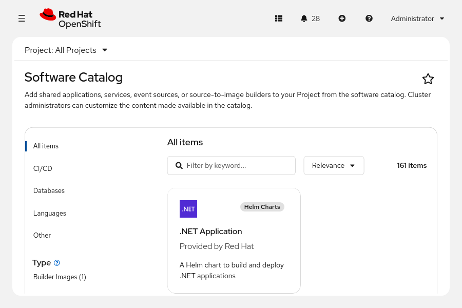

Bằng cách thêm các Operator và phần mềm khác vào cụm (cluster), bạn có thể mở rộng các tính năng và chức năng mà cụm OpenShift của mình cung cấp. Hãy sử dụng bộ lọc tìm kiếm và bộ lọc theo loại để tìm các phần mềm có sẵn giúp nâng cao khả năng của cụm và cung cấp các thành phần OpenShift mà bạn cần.

Để xem các Operator đã được cài đặt trên cụm, hãy truy cập **Ecosystem** → **Installed Operators**. Mỗi Operator cung cấp một chức năng cụ thể cho cụm.

Bảng điều khiển (console) hợp nhất cung cấp menu tạo nhanh (có biểu tượng dấu **+**) ở góc trên bên phải để triển khai ứng dụng một cách nhanh chóng. Menu này bao gồm các tùy chọn như triển khai từ image container và nhập từ kho lưu trữ Git.

#### Các khái niệm chính của Red Hat OpenShift
Khi thao tác trên giao diện web console của OpenShift, việc nắm bắt một số thuật ngữ cơ bản về OpenShift, Kubernetes và container sẽ rất hữu ích. Danh sách dưới đây bao gồm các khái niệm cơ bản giúp bạn dễ dàng sử dụng giao diện web console của OpenShift.

* Pods: Đơn vị nhỏ nhất của một ứng dụng chạy trong container được Kubernetes quản lý. Một pod bao gồm một hoặc nhiều container.
* Deployments: Đơn vị vận hành cho phép quản lý chi tiết một ứng dụng đang chạy.
*  Projects: Một namespace trong Kubernetes đi kèm các chú thích (annotation) bổ sung, giúp thiết lập phạm vi đa người thuê (multitenancy) cho các ứng dụng.
* Routes: Cấu hình mạng dùng để hiển thị (expose) các ứng dụng và dịch vụ của bạn ra các tài nguyên bên ngoài cụm (cluster).
* Operators: Các ứng dụng Kubernetes được đóng gói nhằm mở rộng chức năng của cụm.

Các khái niệm này được đề cập chi tiết hơn trong suốt khóa học. Bạn có thể bắt gặp các khái niệm này trên giao diện web console khi khám phá các tính năng của cụm OpenShift thông qua môi trường đồ họa.

## Giám sát cụm OpenShift
### Tổng quan về các node, máy và cấu hình máy
Trong Kubernetes, node là bất kỳ hệ thống đơn lẻ nào trong cụm (cluster) nơi các pod có thể hoạt động. Các hệ thống này có thể là máy chủ vật lý (bare-metal), máy ảo hoặc máy chủ trên nền tảng đám mây thuộc thành phần của cụm. Các node thực thi những dịch vụ cần thiết để giao tiếp nội bộ trong cụm và tiếp nhận các yêu cầu vận hành từ mặt phẳng điều khiển (control plane). Khi bạn triển khai một pod, một node khả dụng sẽ chịu trách nhiệm đáp ứng yêu cầu đó.

Mặc dù thuật ngữ "node" và "machine" thường được dùng thay thế cho nhau, Red Hat OpenShift Container Platform (RHOCP) sử dụng thuật ngữ "machine" theo một nghĩa cụ thể hơn. Trong OpenShift, "machine" là tài nguyên mô tả một node của cụm. Việc sử dụng tài nguyên machine đặc biệt hữu ích khi triển khai cơ sở hạ tầng thông qua các nhà cung cấp dịch vụ đám mây công cộng.

Tài nguyên MachineConfig xác định trạng thái ban đầu cũng như mọi thay đổi đối với các tệp tin, dịch vụ, bản cập nhật hệ điều hành và các phiên bản dịch vụ OpenShift quan trọng dành cho kubelet và cri-o. OpenShift dựa vào Machine Config Operator (MCO) để duy trì hệ điều hành và cấu hình cho các máy (machine) trong cụm. MCO là một operator cấp cụm, có nhiệm vụ đảm bảo cấu hình chính xác cho từng máy. Operator này cũng thực hiện các tác vụ quản trị định kỳ, chẳng hạn như cập nhật hệ thống. Nó sử dụng các định nghĩa máy trong tài nguyên MachineConfig để liên tục kiểm tra và điều chỉnh trạng thái của các máy trong cụm về trạng thái mong muốn. Sau khi có thay đổi trong MachineConfig, MCO sẽ điều phối việc thực thi các thay đổi đó trên tất cả các node bị ảnh hưởng.

> **Lưu ý:** Việc điều phối các thay đổi MachineConfig thông qua MCO được ưu tiên theo thứ tự bảng chữ cái của vùng (zone), dựa trên nhãn node `topology.kubernetes.io/zone`.

### Xác định lỗi từ các node
Các quản trị viên thường xuyên xem nhật ký và kết nối với các nút trong cụm thông qua giao diện dòng lệnh (terminal). Thao tác này rất cần thiết để quản lý cụm và khắc phục các sự cố phát sinh. Từ bảng điều khiển web, hãy truy cập mục **Compute** → **Nodes** để xem danh sách tất cả các nút trong cụm.

> **Lưu ý:** Đối với các cụm sử dụng mặt phẳng điều khiển được lưu trữ (hosted control planes), các nút mặt phẳng điều khiển không hiển thị với quản trị viên cụm. Mặt phẳng điều khiển chạy trong một cụm lưu trữ riêng biệt, do đó trang Compute → Nodes chỉ hiển thị các nút tính toán.

**Hình 1.35: Danh sách nút trong bảng điều khiển web**  
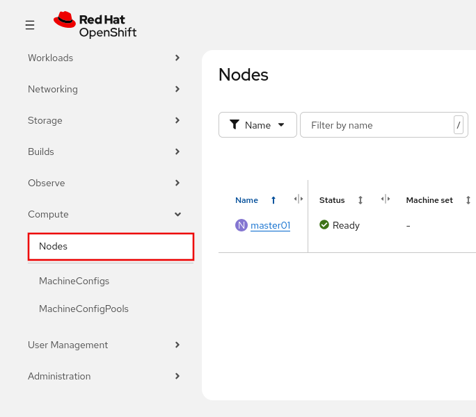

Nhấp vào tên của một node để truy cập trang tổng quan về node đó. Tại trang tổng quan của node, bạn có thể xem nhật ký (log) của node hoặc kết nối với node thông qua terminal.

**Hình 1.36: Trang nhật ký trên bảng điều khiển web**  
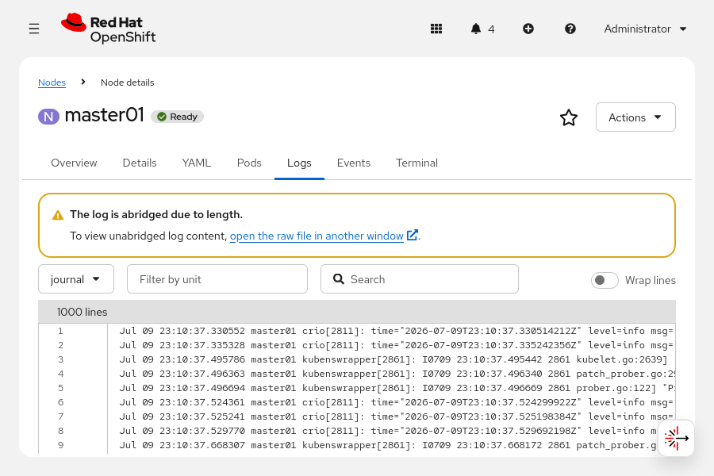

Từ trang trước trong bảng điều khiển web, hãy xem nhật ký của nút và kiểm tra thông tin hệ thống để hỗ trợ việc chẩn đoán và khắc phục các sự cố liên quan đến nút.

**Hình 1.37: Terminal shell trong bảng điều khiển web**  
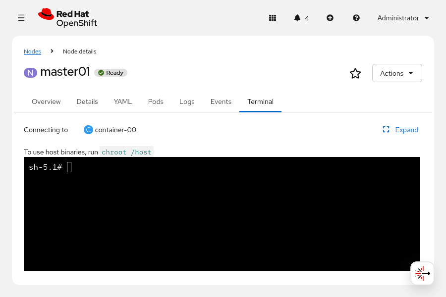

Trang trước hiển thị terminal của bảng điều khiển web (web console) đang kết nối với node của cụm (cluster node). Tại tab này, bạn có thể truy cập vào pod gỡ lỗi (debug pod) và sử dụng các lệnh từ các tệp nhị phân của host để xem trạng thái các dịch vụ trên node. Pod gỡ lỗi node trong OpenShift đóng vai trò là giao diện kết nối với một container đang chạy trên node đó.

Mặc dù việc thực hiện thay đổi trực tiếp trên node của cụm thông qua terminal không được khuyến nghị, nhưng việc kết nối với node để chẩn đoán và khắc phục sự cố lại là một thao tác phổ biến. Từ terminal này, bạn có thể sử dụng chính các tệp nhị phân có sẵn ngay trên node của cụm.

Ngoài ra, các tab trên trang tổng quan về node còn hiển thị các chỉ số (metrics), sự kiện (events) và tệp định nghĩa YAML của node.

#### Truy cập nhật ký Pod
Quản trị viên thường xem xét nhật ký (log) của pod để đánh giá tình trạng của pod đã triển khai hoặc để khắc phục các sự cố liên quan đến việc triển khai pod. Hãy truy cập trang Workloads → Pods để xem danh sách tất cả các pod trong cụm (cluster).

**Hình 1.38: Trang Pods trong bảng điều khiển web**  
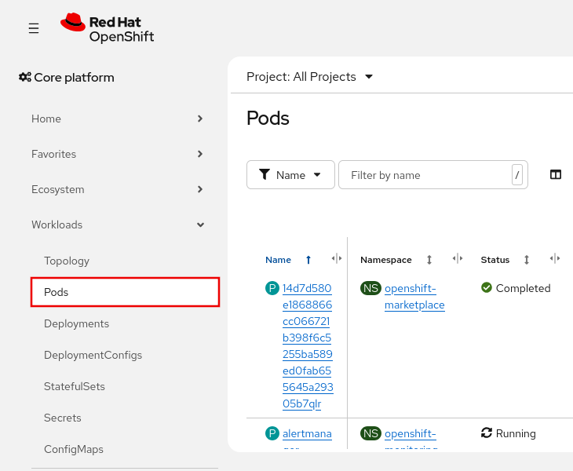

Bạn có thể lọc và sắp xếp các pod theo dự án cũng như các trường khác. Để xem trang chi tiết của pod, hãy nhấp vào tên pod trong danh sách.

**Hình 1.39: Trang chi tiết Pod**  
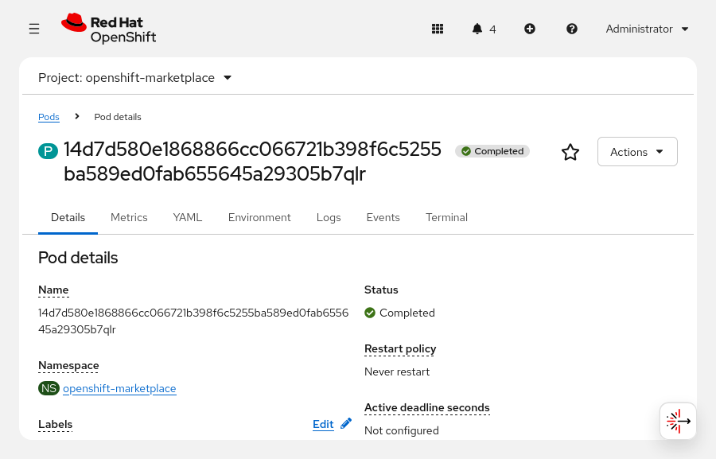

Trang chi tiết về pod bao gồm các liên kết dẫn đến số liệu thống kê (metrics), biến môi trường, nhật ký (logs), sự kiện (events), terminal và định nghĩa YAML của pod. Nhật ký của pod có sẵn tại tab Logs và cung cấp thông tin về trạng thái của pod. Tab Terminal mở kết nối shell tới pod để phục vụ việc kiểm tra và khắc phục sự cố. Mặc dù không khuyến khích việc thay đổi một pod đang chạy, nhưng terminal lại rất hữu ích cho việc chẩn đoán và xử lý các vấn đề của pod. Để khắc phục sự cố cho pod, hãy cập nhật cấu hình pod để phản ánh các thay đổi cần thiết và triển khai lại pod đó.

#### Các chỉ số và cảnh báo của Red Hat OpenShift Container Platform
Trong cụm RHOCP, các điểm cuối (endpoint) dịch vụ HTTP cung cấp dữ liệu chỉ số (metrics) được thu thập để phục vụ việc giám sát hiệu năng của cụm và ứng dụng. Các chỉ số này được thiết lập ở cấp độ ứng dụng cho từng dịch vụ thông qua việc sử dụng các thư viện client do Prometheus – một bộ công cụ giám sát và cảnh báo mã nguồn mở – cung cấp. Dữ liệu chỉ số có sẵn tại điểm cuối `/metrics` của dịch vụ. Bạn có thể sử dụng dữ liệu này để tạo các bộ giám sát (monitor) nhằm phát cảnh báo khi hiệu năng dịch vụ bị suy giảm. Bộ giám sát là các tiến trình liên tục đánh giá giá trị của một chỉ số cụ thể và đưa ra cảnh báo dựa trên các điều kiện đã định nghĩa trước, nhằm báo hiệu sự suy giảm chất lượng dịch vụ hoặc các vấn đề về hiệu năng. Việc tạo tài nguyên `ServiceMonitor` giúp xác định cách một dịch vụ cụ thể sử dụng các chỉ số để thiết lập bộ giám sát và các ngưỡng cảnh báo. Phương thức tương tự cũng được áp dụng để giám sát các pod thông qua việc định nghĩa tài nguyên `PodMonitor`, sử dụng các chỉ số được thu thập từ chính pod đó.

Tùy thuộc vào định nghĩa của bộ giám sát, hệ thống sẽ đưa ra cảnh báo dựa trên chỉ số được truy vấn và các tiêu chí thành công đã thiết lập. Bộ giám sát liên tục so sánh chỉ số thu thập được và tạo cảnh báo khi các tiêu chí thành công không còn được đáp ứng. Ví dụ: một bộ giám sát dịch vụ web sẽ truy vấn cổng đang lắng nghe (cổng 80) và chỉ phát cảnh báo nếu phản hồi từ cổng đó không hợp lệ.

Từ giao diện web (web console), hãy truy cập mục **Observe → Metrics** để trực quan hóa các chỉ số đã thu thập bằng giao diện truy vấn chỉ số tích hợp sẵn. Tại trang này, người dùng có thể thực hiện các truy vấn để tạo biểu đồ dữ liệu và bảng điều khiển (dashboard), giúp quản trị viên nắm bắt các số liệu thống kê quan trọng về cụm và ứng dụng.

Đối với các bộ giám sát đã được cấu hình, hãy truy cập mục **Observe → Alerting** để xem các cảnh báo đang kích hoạt; bạn có thể lọc theo mức độ nghiêm trọng để tập trung vào những cảnh báo cần xử lý. Dữ liệu cảnh báo là thành phần then chốt giúp quản trị viên đảm bảo khả năng truy cập và chức năng hoạt động của cụm cũng như các ứng dụng.

OpenShift Cluster Observability Operator (COO) là một thành phần tùy chọn của OpenShift Container Platform, cung cấp các tính năng bổ sung—chẳng hạn như tương quan tín hiệu quan sát (observability signal correlation) và nhóm phát hiện sự cố—nhằm tạo và quản lý các hệ thống giám sát có khả năng tùy biến cao. COO mang lại cái nhìn chi tiết và phù hợp với nhu cầu cụ thể của từng namespace hơn so với hệ thống giám sát mặc định của OpenShift Container Platform.

#### Sự kiện Kubernetes
Các quản trị viên thường đã quen thuộc với nội dung các tệp nhật ký (log) của dịch vụ—vốn chứa thông tin cực kỳ chi tiết và cụ thể. Trong khi đó, các sự kiện (event) cung cấp cái nhìn tổng quan về các tệp nhật ký và thông tin về những thay đổi quan trọng hơn. Sự kiện giúp nắm bắt nhanh hiệu năng và hành vi của cụm (cluster), các nút (node), dự án (project) hoặc pod. Sự kiện cung cấp thông tin chi tiết để hiểu về hiệu năng tổng thể và làm nổi bật các vấn đề đáng chú ý, còn nhật ký cung cấp thông tin chi tiết chuyên sâu hơn để khắc phục các vấn đề cụ thể.

Trang Home → Events hiển thị các sự kiện của tất cả các dự án hoặc của một dự án cụ thể. Bạn cũng có thể thực hiện lọc và tìm kiếm các sự kiện này.

**Hình 1.40: Bảng điều khiển Sự kiện RHOCP**  
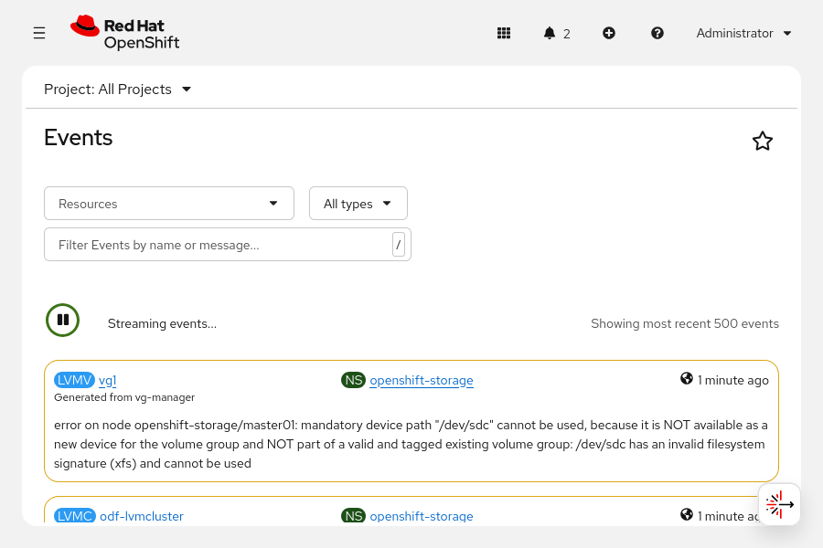

#### Trình khám phá API Red Hat OpenShift Container Platform
Bắt đầu từ phiên bản 4, RHOCP tích hợp tính năng API Explorer, cho phép người dùng xem danh mục các loại tài nguyên Kubernetes hiện có trong cụm. Bằng cách truy cập vào mục Home → API Explorer, bạn có thể xem và khám phá chi tiết về các tài nguyên. Các thông tin chi tiết này bao gồm mô tả, lược đồ (schema) và các siêu dữ liệu khác của tài nguyên. Tính năng này hữu ích cho mọi người dùng, đặc biệt là các quản trị viên mới.

**Hình 1.41: RHOCP API Explorer**  
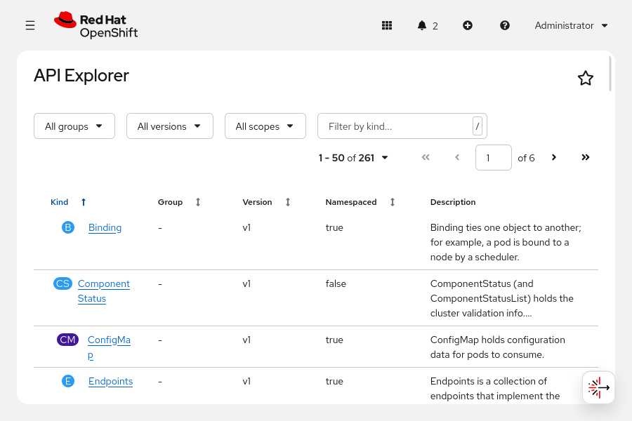
