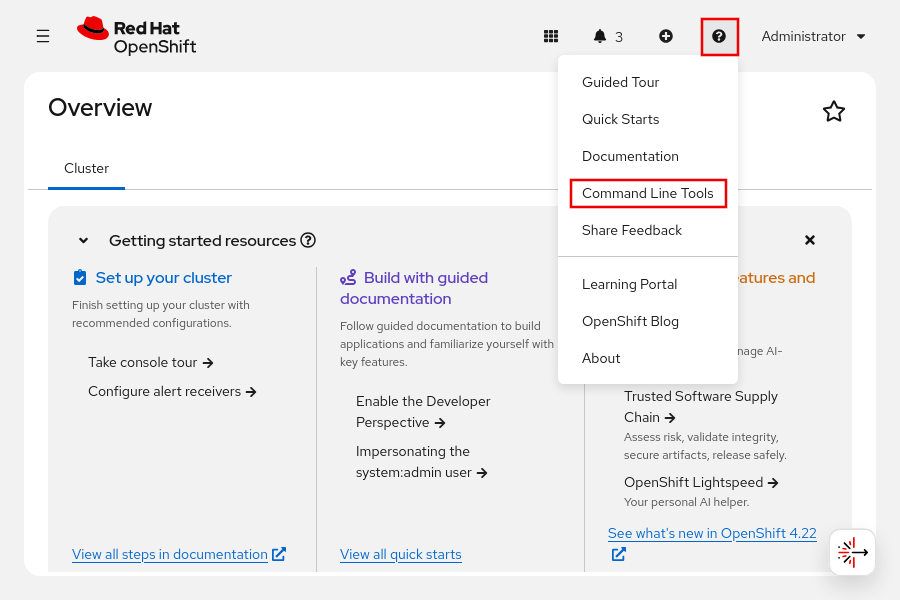
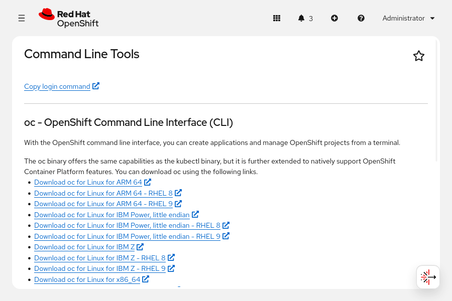
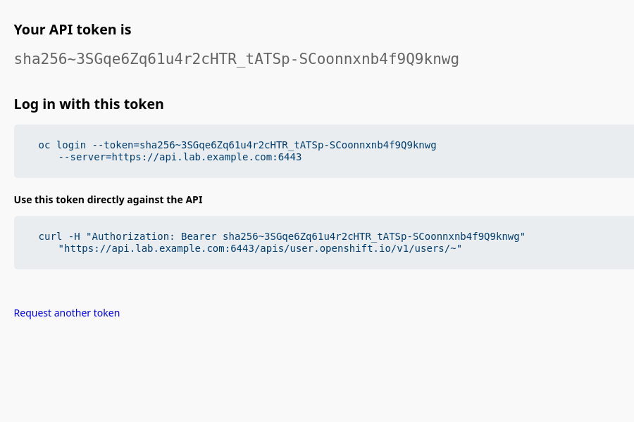
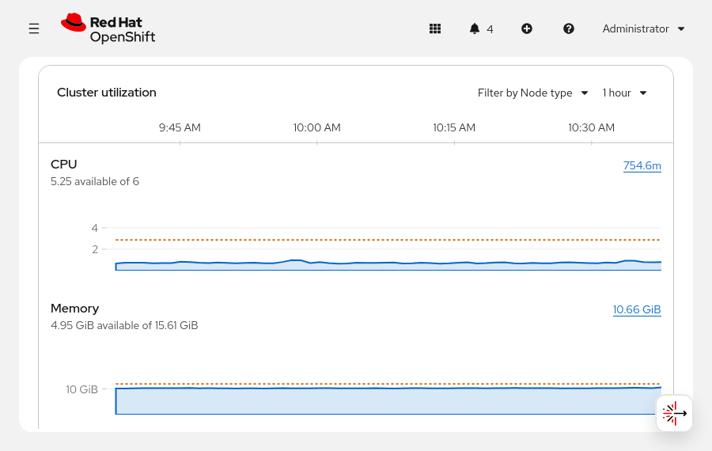
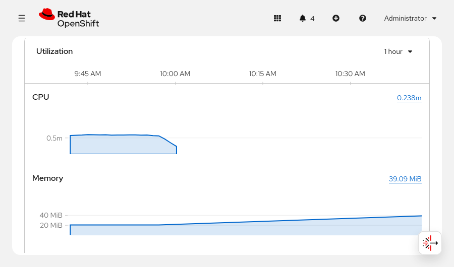
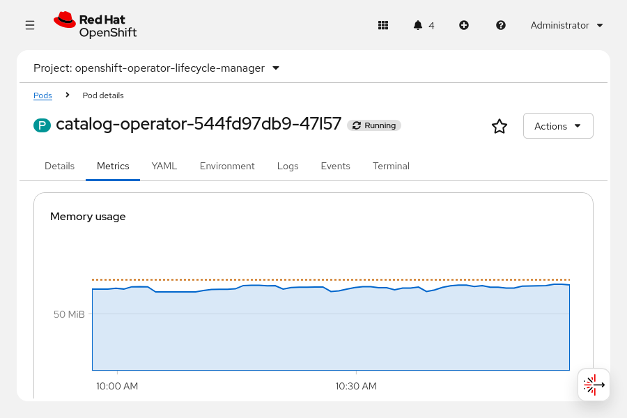
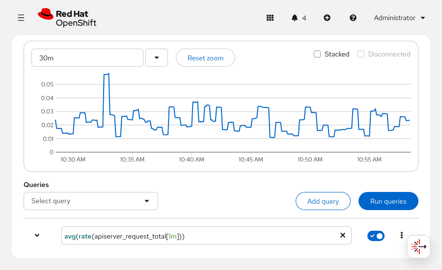

Quản trị Red Hat OpenShift I: Vận hành Cụm Môi trường Sản xuất
--------------------------------------------------------------

# Chương 2. Các giao diện dòng lệnh và API của Kubernetes và OpenShift
## Các giao diện dòng lệnh Kubernetes và OpenShift
### Giao diện dòng lệnh Kubernetes
Bạn có thể quản lý cụm OpenShift thông qua giao diện web console hoặc sử dụng các giao diện dòng lệnh (CLI) như `kubectl` hoặc `oc`. Các lệnh `kubectl` là lệnh gốc của Kubernetes và đóng vai trò như một lớp bao bọc nhẹ (thin wrapper) trên Kubernetes API. Các lệnh oc của OpenShift bao hàm toàn bộ tập lệnh `kubectl` (là một tập siêu của `kubectl`) và bổ sung thêm các lệnh dành cho những tính năng đặc thù của OpenShift. Trong khóa học này, các ví dụ về cả lệnh `kubectl` và `oc` sẽ được trình bày để làm nổi bật sự khác biệt giữa chúng.

Với lệnh oc, bạn có thể tạo ứng dụng và quản lý các dự án Red Hat OpenShift Container Platform (RHOCP) ngay từ giao diện dòng lệnh (terminal). OpenShift CLI là lựa chọn lý tưởng trong các trường hợp sau:

* Làm việc trực tiếp với mã nguồn dự án
* Viết script cho các thao tác trên OpenShift Container Platform
* Quản lý các dự án bị giới hạn băng thông
* Khi không thể truy cập giao diện web (web console)
* Làm việc với các tài nguyên OpenShift, chẳng hạn như route và dự án

#### Công cụ dòng lệnh Kubernetes
Quá trình cài đặt oc CLI cũng bao gồm việc cài đặt `kubectl` CLI; đây là phương pháp được khuyến nghị để cài đặt `kubectl` CLI cho người dùng OpenShift.

Bạn cũng có thể cài đặt `kubectl` CLI một cách độc lập, không phụ thuộc vào oc CLI. Bạn cần sử dụng phiên bản `kubectl` CLI có sự chênh lệch không quá một phiên bản phụ (minor version) so với phiên bản của cụm (cluster). Ví dụ: client phiên bản v1.34 có thể giao tiếp với các control plane phiên bản v1.33, v1.34 và v1.35. Việc sử dụng phiên bản `kubectl` CLI tương thích mới nhất sẽ giúp tránh được các sự cố ngoài ý muốn.

Để cài đặt thủ công tệp nhị phân `kubectl` trên hệ thống Linux, trước tiên bạn cần tải xuống bản phát hành mới nhất bằng lệnh curl.

```console
[user@host ~]$ curl -LO "https://dl.k8s.io/release/$(curl -L \
  -s https://dl.k8s.io/release/stable.txt)/bin/linux/amd64/kubectl"
```

Sau đó, bạn phải tải xuống tệp checksum của `kubectl` và xác thực tệp nhị phân `kubectl` dựa trên tệp checksum đó.

```console
[user@host ~]$ curl -LO "https://dl.k8s.io/$(curl -L \
-s https://dl.k8s.io/release/stable.txt)/bin/linux/amd64/kubectl.sha256"

[user@host ~]$ echo "$(cat kubectl.sha256)  kubectl" | sha256sum --check
kubectl: OK
```

Nếu quá trình kiểm tra không thành công, lệnh `sha256sum` sẽ thoát với mã trạng thái khác không và hiển thị thông báo `kubectl: FAILED`.

Sau đó, bạn có thể cài đặt `kubectl` CLI.

```console
[user@host ~]$ sudo install -o root -g root -m 0755 kubectl \
  /usr/local/bin/kubectl
```

> **Lưu ý:** Nếu bạn không có quyền root trên hệ thống đích, bạn vẫn có thể cài đặt `kubectl` CLI vào thư mục ~/.local/bin. Để biết thêm thông tin, hãy tham khảo https://kubernetes.io/docs/tasks/tools/install-kubectl-linux/.

Cuối cùng, hãy sử dụng lệnh `kubectl version` để kiểm tra phiên bản đã cài đặt. Lệnh này hiển thị phiên bản của cả client và server. Hãy sử dụng tùy chọn `--client` nếu chỉ muốn xem phiên bản client.

```console
[user@host ~]$ kubectl version --client
Client Version: v1.35.2
Kustomize Version: v5.7.1
```

Ngoài ra, đối với các bản phân phối dựa trên Red Hat Enterprise Linux (RHEL), bạn có thể cài đặt `kubectl` CLI bằng lệnh sau:

```console
[user@host ~]$ cat <<EOF | sudo tee /etc/yum.repos.d/kubernetes.repo
[kubernetes]
name=Kubernetes
baseurl=https://pkgs.k8s.io/core:/stable:/v1.35/rpm/
enabled=1
gpgcheck=1
gpgkey=https://pkgs.k8s.io/core:/stable:/v1.35/rpm/repodata/repomd.xml.key
EOF
[user@host ~]$ sudo yum install -y kubectl
```

Để xem danh sách các lệnh `kubectl` khả dụng, hãy sử dụng lệnh `kubectl --help`.

```console
[user@host ~]$ kubectl --help
kubectl controls the Kubernetes cluster manager.

 Find more information at:
https://kubernetes.io/docs/reference/kubectl/

Basic Commands (Beginner):
  create        Create a resource from a file or from stdin
  expose        Take a replication controller, service, deployment or pod and
expose it as a new Kubernetes Service
  run           Run a particular image on the cluster
  set           Set specific features on objects

Basic Commands (Intermediate):
...output omitted...
```

Bạn cũng có thể sử dụng tùy chọn `--help` với bất kỳ lệnh nào để xem thông tin chi tiết về lệnh đó, bao gồm mục đích, các ví dụ, các lệnh con và các tùy chọn có sẵn.

Ví dụ, lệnh dưới đây cung cấp thông tin về lệnh `kubectl create` và cách sử dụng lệnh này.

```console
[user@host ~]$ kubectl create --help
Create a resource from a file or from stdin.

 JSON and YAML formats are accepted.

Examples:
  # Create a pod using the data in pod.json
  kubectl create -f ./pod.json

  # Create a pod based on the JSON passed into stdin
  cat pod.json | kubectl create -f -

  # Edit the data in registry.yaml in JSON then create the resource using the edited data
  kubectl create -f registry.yaml --edit -o json

Available Commands:
  clusterrole              Create a cluster role
  clusterrolebinding   	   Create a cluster role binding for a particular cluster role
...output omitted...
```

Kubernetes sử dụng nhiều thành phần tài nguyên để hỗ trợ các ứng dụng. Lệnh `kubectl explain` cung cấp thông tin chi tiết về các thuộc tính của một tài nguyên cụ thể. Ví dụ, hãy sử dụng lệnh sau để tìm hiểu thêm về các thuộc tính của tài nguyên pod.

```console
[user@host ~]$ kubectl explain pod
KIND:     Pod
VERSION:  v1

DESCRIPTION:
     Pod is a collection of containers that can run on a host. This resource is
     created by clients and scheduled onto hosts.
FIELDS:
   apiVersion	<string>
     APIVersion defines the versioned schema of this representation of an
     object.
...output omitted...
```

Hãy tham khảo tài liệu Kubernetes tại https://kubernetes.io/docs/reference/kubectl/generated/ để biết thêm thông tin về các lệnh `kubectl`.

### Giao diện dòng lệnh OpenShift
Phương thức chính để tương tác với cụm RHOCP là sử dụng lệnh `oc`.

Bạn có thể tải xuống công cụ dòng lệnh (CLI) `oc` từ giao diện web OpenShift để đảm bảo tính tương thích giữa các công cụ CLI và cụm RHOCP. Tại giao diện web OpenShift, hãy truy cập mục **Help** (Trợ giúp) → **Command Line tools** (Công cụ dòng lệnh). Menu **Help** được biểu thị bằng biểu tượng dấu chấm hỏi (?).



Bảng điều khiển web cung cấp một số tùy chọn cài đặt cho ứng dụng khách `oc`, chẳng hạn như các bản tải xuống dành cho những hệ điều hành sau:

* Hệ thống Windows, Mac và Linux (x86_64)
* Hệ thống Linux và Mac (ARM 64)
* Linux cho IBM Z, IBM Power và kiến trúc little-endian



Cách sử dụng cơ bản của lệnh `oc` là thông qua các lệnh con của nó theo cú pháp sau:

```console
[user@host ~]$ oc command
```

Do `oc` CLI là một tập mở rộng (superset) của kubectl CLI, nên các lệnh như version, --help và explain hoạt động giống hệt nhau trên cả hai công cụ này. Tuy nhiên, `oc` CLI bao gồm các lệnh bổ sung không có trong kubectl CLI, chẳng hạn như `oc login` và `oc new-project`.

Các nhà phát triển đã quen thuộc với Kubernetes có thể sử dụng công cụ kubectl để quản lý cụm RHOCP. Khóa học này sử dụng công cụ dòng lệnh `oc` để tận dụng các tính năng bổ sung của RHOCP. Các lệnh `oc` được dùng để quản lý những tài nguyên đặc thù của RHOCP, chẳng hạn như project, route và image stream.

> **Lưu ý:** Một số dịch vụ OpenShift được quản lý cung cấp thêm các công cụ dòng lệnh (CLI) phục vụ các tác vụ quản trị cụm. Các cụm Red Hat OpenShift Service on AWS (ROSA) sử dụng CLI `rosa`, còn các cụm Red Hat OpenShift Dedicated (OSD) sử dụng CLI `ocm`. Các CLI này đóng vai trò bổ trợ cho `oc` và `kubectl` chứ không thay thế chúng.

#### Các phương thức xác thực
Trước khi có thể tương tác với cụm RHOCP, bạn cần xác thực các yêu cầu của mình. Lớp xác thực có nhiệm vụ nhận diện người dùng thực hiện các yêu cầu gửi tới API của RHOCP. Sau khi xác thực hoàn tất, lớp ủy quyền sẽ sử dụng thông tin về người dùng đó để quyết định xem yêu cầu có được phép thực hiện hay không.

Trong OpenShift, người dùng là một thực thể có khả năng gửi yêu cầu đến API của RHOCP. Đối tượng User (Người dùng) trong RHOCP đại diện cho một chủ thể có thể được cấp quyền trong hệ thống thông qua việc gán các vai trò (role) cho chính người dùng đó hoặc cho các nhóm mà người dùng thuộc về. Thông thường, thực thể này đại diện cho tài khoản của một nhà phát triển hoặc một quản trị viên.

Có thể tồn tại nhiều loại người dùng khác nhau.

**Người dùng thông thường**  
Phần lớn người dùng tương tác với RHOCP thuộc loại người dùng này. Một đối tượng User trong RHOCP đại diện cho một người dùng thông thường.

**Người dùng hệ thống**  
Hệ thống sử dụng các tài khoản người dùng hệ thống để tương tác với API một cách an toàn. Một số người dùng hệ thống được tạo tự động, bao gồm cả quản trị viên cụm (cluster administrator) với quyền truy cập vào mọi thành phần. Theo mặc định, các yêu cầu không được xác thực sẽ sử dụng một người dùng hệ thống ẩn danh.

**Tài khoản dịch vụ**  
Các đối tượng `ServiceAccount` đại diện cho những tài khoản cho phép ứng dụng truy cập API mà không cần chia sẻ thông tin xác thực của người dùng thông thường. RHOCP tự động tạo các tài khoản dịch vụ khi một dự án được tạo. Quản trị viên dự án có thể tạo thêm các tài khoản dịch vụ để xác định quyền truy cập vào nội dung của từng dự án.

Mỗi người dùng phải xác thực để truy cập vào một cụm (cluster). Sau khi xác thực, chính sách sẽ xác định những gì người dùng được phép thực hiện.

> **Lưu ý:** Các nội dung về xác thực và ủy quyền được đề cập chi tiết hơn trong khóa học Quản trị Red Hat OpenShift II: Vận hành Cụm Kubernetes trong Môi trường Sản xuất (DO280).

Sử dụng lệnh `oc login` để xác thực các yêu cầu của bạn. Lệnh `oc login` cung cấp cơ chế xác thực và ủy quyền dựa trên vai trò nhằm bảo vệ cụm RHOCP khỏi sự truy cập trái phép.

Lệnh `oc login` hỗ trợ nhiều phương thức xác thực khác nhau.

**Xác thực bằng tên người dùng và mật khẩu**  
Cú pháp xác thực bằng tên người dùng và mật khẩu như sau:

```console
[user@host ~]$ oc login -u username api-url
```

Sau đó, lệnh `oc login` sẽ yêu cầu nhập mật khẩu.

Ví dụ, trong khóa học này, bạn có thể sử dụng lệnh sau:

```console
[user@host ~]$ oc login -u admin https://api.lab.example.com:6443
Console URL: https://api.lab.example.com:6443/console
Authentication required for https://api.lab.example.com:6443 (openshift)
Username: admin
Password: redhatocp
Login successful.
...output omitted...
```

**Xác thực dựa trên token**  
Control plane của RHOCP bao gồm một máy chủ OAuth tích hợp sẵn. Để xác thực với API, người dùng cần lấy các token truy cập OAuth. Xác thực bằng token là phương thức được khuyến nghị cho môi trường sản xuất, quy trình tự động hóa và các pipeline CI/CD nhằm tăng cường bảo mật cũng như loại bỏ việc lưu trữ mật khẩu trong các tập lệnh (script). Bạn có thể sử dụng phương thức xác thực dựa trên token để đăng nhập vào cụm (cluster) như sau:

```console
[user@host ~]$ oc login --token=your-token --server=cluster-url
```

Để lấy token, hãy mở trình duyệt web và truy cập https://oauth-openshift.apps.cluster-url/oauth/token/request. Đăng nhập và nhấp vào **Display token** để hiển thị lệnh đăng nhập.



**Xác thực qua Web**  
Bạn cũng có thể sử dụng tùy chọn `--web` để đăng nhập vào cụm (cluster) thông qua trình duyệt web, như sau:

```console
[user@host ~]$ oc login --web api-url
```

Lệnh này mở một cửa sổ trình duyệt dẫn đến trang xác thực OpenShift để bạn đăng nhập bằng tên người dùng và mật khẩu, hoặc phương thức xác thực khác. Sau đó, lệnh sẽ tự động trả mã thông báo xác thực về dòng lệnh để hoàn tất quá trình đăng nhập.

> **Lưu ý quan trọng:** Để đơn giản hóa, khóa học này sử dụng phương thức xác thực bằng tên người dùng và mật khẩu, trong đó mật khẩu được cung cấp dưới dạng văn bản thuần (plain text), cụ thể như sau:
> 
> ```console
> [user@host ~]$ oc login -u admin -p redhatocp \
>   https://api.lab.example.com:6443
> ```
> 
> Tuy nhiên, phương pháp này không an toàn và Red Hat không khuyến nghị sử dụng nó cho các môi trường vận hành thực tế (production). Do đó, đối với các môi trường này, hãy sử dụng phương pháp an toàn hơn, chẳng hạn như xác thực dựa trên token.

#### Quản lý tài nguyên tại dòng lệnh
Sau khi xác thực vào cụm RHOCP, bạn có thể tạo một dự án bằng lệnh `oc new-project`. Các dự án giúp cách ly các tài nguyên ứng dụng của bạn. Về bản chất, dự án là các namespace Kubernetes có thêm các chú thích (annotation) nhằm cung cấp phạm vi đa người thuê (multitenancy) cho ứng dụng.

```console
[user@host ~]$ oc new-project myapp
```
Một số lệnh thiết yếu có thể quản lý tài nguyên RHOCP và Kubernetes, như được mô tả ở đây. Trừ khi có quy định khác, các lệnh sau tương thích với cả CLI oc và kubectl.

Một số lệnh yêu cầu người dùng có quyền truy cập quản trị viên cụm. Danh sách sau đây bao gồm một số lệnh oc hữu ích dành cho quản trị viên cụm.

**oc cluster-info**  
Lệnh `oc cluster-info` hiển thị địa chỉ của control plane và các dịch vụ khác của cụm. Lệnh `oc cluster-info dump` mở rộng thông tin đầu ra, bao gồm các chi tiết hữu ích để gỡ lỗi các vấn đề của cụm.

```console
[user@host ~]$ oc cluster-info
Kubernetes control plane is running at https://api.lab.example.com:6443
...output omitted...
```

**oc api-versions**  
Cấu trúc của các tài nguyên cụm có phiên bản API tương ứng, và lệnh `oc api-versions` sẽ hiển thị thông tin này. Lệnh này liệt kê các phiên bản API được máy chủ hỗ trợ theo định dạng "group/version" (nhóm/phiên bản). 

Trong ví dụ dưới đây, nhóm là `admissionregistration.k8s.io` và phiên bản là `v1`:

```console
[user@host ~]$ oc api-versions
admissionregistration.k8s.io/v1
...output omitted...
```

**oc get clusteroperator**  
Các cluster operator do Red Hat cung cấp đóng vai trò là nền tảng kiến trúc cho RHOCP. RHOCP cài đặt sẵn các cluster operator theo mặc định. Hãy sử dụng lệnh `oc get clusteroperator` để xem danh sách các cluster operator:

```console
[user@host ~]$ oc get clusteroperator
NAME                     VERSION    AVAILABLE PROGRESSING DEGRADED SINCE ...
authentication           4.22.4     True      False       False    18d
baremetal                4.22.4     True      False       False    18d
...output omitted...
```

Các lệnh hữu ích khác cũng có sẵn cho cả người dùng thông thường và người dùng có quyền quản trị:

**oc get**  
Sử dụng lệnh `get` để truy xuất thông tin về các tài nguyên trong dự án đã chọn. Thông thường, lệnh này chỉ hiển thị những đặc điểm quan trọng nhất của tài nguyên và lược bỏ các thông tin chi tiết. 

Lệnh `oc get RESOURCE_TYPE` hiển thị bản tóm tắt về tất cả các tài nguyên thuộc loại được chỉ định. 

Ví dụ, lệnh sau đây trả về danh sách các tài nguyên pod trong dự án hiện tại:

```console
[user@host ~]$ oc get pod
NAME                          READY   STATUS    RESTARTS   AGE
quotes-api-6c9f758574-nk8kd   1/1     Running   0          39m
quotes-ui-d7d457674-rbkl7     1/1     Running   0          67s
```

Bạn có thể sử dụng lệnh `oc get RESOURCE_TYPE RESOURCE_NAME` để xuất định nghĩa tài nguyên. Các trường hợp sử dụng phổ biến bao gồm tạo bản sao lưu hoặc sửa đổi định nghĩa. Tùy chọn `-o yaml` sẽ hiển thị biểu diễn của đối tượng dưới định dạng YAML. Bạn có thể chuyển sang định dạng JSON bằng cách sử dụng tùy chọn `-o json`.

**oc get all**  
Sử dụng lệnh `oc get all` để lấy thông tin tóm tắt về các tài nguyên quan trọng nhất trong một dự án. Lệnh này duyệt qua các loại tài nguyên chính của dự án hiện tại và hiển thị thông tin tóm tắt về chúng:

```console
[user@host ~]$ oc get all
...output omitted...
NAME                         READY   STATUS    RESTARTS   AGE
pod/mysql-6bb757c595-qj5ng   1/1     Running   0          16s

NAME            TYPE        CLUSTER-IP      EXTERNAL-IP   PORT(S)              AGE
service/mysql   ClusterIP   172.30.173.61   <none>        3306/TCP,33060/TCP   2m21s

NAME                    READY   UP-TO-DATE   AVAILABLE   AGE
deployment.apps/mysql   1/1     1            1           2m21s

NAME                               DESIRED   CURRENT   READY   AGE
replicaset.apps/mysql-55dc44b4c9   0         0         0       2m21s
replicaset.apps/mysql-6bb757c595   1         1         1       16s
replicaset.apps/mysql-7d9b6b5996   0         0         0       2m21s

NAME                                   IMAGE REPOSITORY                          TAGS     UPDATED
imagestream.image.openshift.io/mysql   image-registry.../mysql-openshift/mysql   latest   2 minutes ago
```

**oc describe**  
Nếu các thông tin tóm tắt từ lệnh `get` là chưa đủ, bạn có thể sử dụng lệnh `oc describe RESOURCE_TYPE RESOURCE_NAME` để truy xuất thêm thông tin. Khác với lệnh `get`, lệnh `describe` cho phép bạn duyệt qua tất cả các tài nguyên khác nhau dựa trên loại tài nguyên. Mặc dù hầu hết các tài nguyên chính đều có thể được mô tả chi tiết, nhưng chức năng này không áp dụng cho tất cả các loại tài nguyên. Ví dụ dưới đây minh họa cách mô tả chi tiết một tài nguyên pod:

```console
[user@host ~]$ oc describe pod mysql-6bb757c595-qj5ng
Name:             mysql-6bb757c595-qj5ng
Namespace:        mysql-openshift
Priority:         0
Service Account:  default
Node:             master01/192.168.50.10
Start Time:       Mon, 16 Jun 2025 16:07:00 -0400
Labels:           db=mysql
                  deployment=mysql
...output omitted...
Status:             Running
SeccompProfile:     RuntimeDefault
IP:                 10.129.0.85
...output omitted...
```

**oc explain**  
Để tìm hiểu về các trường của một đối tượng tài nguyên API, hãy sử dụng lệnh `oc explain`. Lệnh này mô tả mục đích và các trường liên quan đến từng tài nguyên API được hỗ trợ. Bạn cũng có thể sử dụng lệnh này để hiển thị tài liệu về một trường cụ thể của tài nguyên. Các trường được xác định thông qua định danh JSONPath. Ví dụ sau đây hiển thị tài liệu cho trường `.spec.containers.resources` của loại tài nguyên pod:

```console
[user@host ~]$ oc explain pods.spec.containers.resources
KIND:     Pod
VERSION:  v1

FIELD: resources <ResourceRequirements>

DESCRIPTION:
     Compute Resources required by this container. Cannot be updated. More info:
     https://kubernetes.io/docs/concepts/configuration/manage-resources-containers/

     ResourceRequirements describes the compute resource requirements.

FIELDS:
   claims       <[]ResourceClaim>
     Claims lists the names of resources, defined in spec.resourceClaims, that
     are used by this container.

     This field is immutable. It can only be set for containers.

   limits <map[string]Quantity>
     Limits describes the maximum amount of compute resources allowed. More
     info:
     https://kubernetes.io/docs/concepts/configuration/manage-resources-containers/

   requests <map[string]Quantity>
     Requests describes the minimum amount of compute resources required. If
     Requests is omitted for a container, it defaults to Limits if that is
     explicitly specified, otherwise to an implementation-defined value. Requests
    cannot exceed Limits. More info:
     https://kubernetes.io/docs/concepts/configuration/manage-resources-containers/
```

Thêm cờ `--recursive` để hiển thị tất cả các trường của một tài nguyên mà không kèm theo mô tả. Thông tin về từng trường được lấy từ máy chủ ở định dạng OpenAPI.

**oc create**  
Sử dụng lệnh `create` để tạo tài nguyên RHOCP trong dự án hiện tại. Lệnh này tạo tài nguyên dựa trên định nghĩa tài nguyên. Thông thường, lệnh này được sử dụng kết hợp với lệnh `oc get RESOURCE_TYPE RESOURCE_NAME -o yaml` để chỉnh sửa các định nghĩa. Các nhà phát triển thường dùng cờ `-f` để chỉ định tệp chứa nội dung mô tả tài nguyên RHOCP dưới định dạng JSON hoặc YAML. 

Ví dụ: để tạo tài nguyên từ tệp `pod.yaml`, hãy sử dụng lệnh sau:

```console
[user@host ~]$ oc create -f pod.yaml
pod/quotes-pod created
```

Các tài nguyên RHOCP ở định dạng YAML sẽ được thảo luận sau.

**oc status**  
Lệnh `oc status` cung cấp cái nhìn tổng quan về dự án hiện tại. Lệnh này hiển thị các dịch vụ, triển khai (deployment), cấu hình bản dựng (build configuration) và các triển khai đang hoạt động. Thông tin về các thành phần bị cấu hình sai cũng được hiển thị. Tùy chọn `--suggest` cung cấp thêm chi tiết về các vấn đề được phát hiện.

**oc delete**  
Sử dụng lệnh delete để xóa một tài nguyên RHOCP hiện có khỏi dự án hiện tại. Bạn cần chỉ định loại tài nguyên và tên tài nguyên. 

Ví dụ: để xóa pod quotes-ui, hãy sử dụng lệnh sau:

```console
[user@host ~]$ oc delete pod quotes-ui
pod/quotes-ui deleted
```

Cần có hiểu biết cơ bản về kiến trúc RHOCP, vì việc xóa các tài nguyên được quản lý (chẳng hạn như pod) sẽ dẫn đến việc tự động tạo ra các phiên bản mới của những tài nguyên đó. Khi một dự án bị xóa, tất cả các tài nguyên và ứng dụng bên trong dự án đó cũng sẽ bị xóa theo.

Mỗi lệnh này được thực thi trong dự án hiện đang được chọn. Để thực thi lệnh trong một dự án khác, bạn cần sử dụng tùy chọn `--namespace` hoặc `-n`.

```console
[user@host ~]$ oc get pods -n openshift-apiserver
NAME                         READY   STATUS    RESTARTS   AGE
apiserver-68c9485699-ndqlc   2/2     Running   2          18d
```

Hãy tham khảo phần tài liệu tham khảo để biết danh sách đầy đủ các lệnh oc.

## Kiểm tra các tài nguyên Kubernetes
### Các tài nguyên Kubernetes và OpenShift
Kubernetes sử dụng các đối tượng tài nguyên API để thể hiện trạng thái mong muốn của mọi thành phần trong cụm (cluster). Mọi tác vụ quản trị đều đòi hỏi việc tạo, xem và thay đổi các tài nguyên API này. Hãy sử dụng lệnh `oc api-resources` để xem các tài nguyên Kubernetes.

> **Lưu ý:** Các lệnh `oc` trong các ví dụ giống hệt với các lệnh `kubectl` tương ứng.

```console
[user@host ~]$ oc api-resources
NAME                    SHORTNAMES   APIVERSION   NAMESPACED   KIND
bindings                             v1           true         Binding
componentstatuses       cs           v1           false        ComponentStatus
configmaps              cm           v1           true         ConfigMap
endpoints               ep           v1           true         Endpoints
...output omitted...
daemonsets              ds           apps/v1      true         DaemonSet
deployments             deploy       apps/v1      true         Deployment
replicasets             rs           apps/v1      true         ReplicaSet
statefulsets            sts          apps/v1      true         StatefulSet
...output omitted...
```

SHORTNAME của một thành phần giúp giảm thiểu việc phải gõ các lệnh CLI dài. Ví dụ: bạn có thể sử dụng `oc get cm` thay vì `oc get configmaps`.

Cột APIVERSION phân loại các đối tượng vào các nhóm API. Cột này sử dụng định dạng `API-Group/API-Version`. Phần `API-Group` sẽ để trống đối với các đối tượng tài nguyên cốt lõi của Kubernetes.

Nhiều tài nguyên Kubernetes tồn tại trong phạm vi của một namespace Kubernetes. Namespace Kubernetes và dự án OpenShift về cơ bản là tương đồng; luôn tồn tại mối quan hệ một-một giữa một namespace và một dự án OpenShift.

KIND là kiểu lược đồ tài nguyên Kubernetes chính thức.

Lệnh `oc api-resources` cho phép lọc thêm kết quả đầu ra thông qua các tùy chọn xử lý dữ liệu.


**Bảng 2.1. Các tùy chọn của lệnh api-resources**

| Ví dụ về tùy chọn | Mô tả                                                                                                                                 |
|-------------------|---------------------------------------------------------------------------------------------------------------------------------------|
| --namespaced=true | Nếu là false, trả về các tài nguyên không thuộc namespace; ngược lại, trả về các tài nguyên thuộc namespace.                          |
| --api-group apps  | Giới hạn ở các tài nguyên thuộc nhóm API được chỉ định. Sử dụng --api-group='' để hiển thị các tài nguyên cốt lõi.                    |
| --sort-by name    | Nếu danh sách tài nguyên không rỗng, hãy sắp xếp danh sách đó dựa trên trường được chỉ định. Trường này có thể là 'name' hoặc 'kind'. |

Ví dụ, hãy sử dụng lệnh `oc api-resources` sau đây để xem tất cả các tài nguyên có namespace trong nhóm API `apps`, được sắp xếp theo tên.

```console
[user@host ~]$ oc api-resources --namespaced=true --api-group apps --sort-by name
NAME                  SHORTNAMES   APIVERSION   NAMESPACED   KIND
controllerrevisions                apps/v1      true         ControllerRevision
daemonsets            ds           apps/v1      true         DaemonSet
deployments           deploy       apps/v1      true         Deployment
replicasets           rs           apps/v1      true         ReplicaSet
statefulsets          sts          apps/v1      true         StatefulSet
```

Mỗi tài nguyên bao gồm các trường dùng để định danh tài nguyên hoặc mô tả cấu hình dự kiến của tài nguyên đó. Hãy sử dụng lệnh `oc explain` để xem thông tin về các trường hợp lệ của một đối tượng. Ví dụ, hãy thực thi lệnh `oc explain pod` để biết thông tin về các trường có thể có của đối tượng pod.

```console
[user@host ~]$ oc explain pod
KIND:     Pod
VERSION:  v1

DESCRIPTION:
     Pod is a collection of containers that can run on a host. This resource is
     created by clients and scheduled onto hosts.

FIELDS:
   apiVersion <string>
     APIVersion defines the versioned schema of this representation of an
     ...

   kind <string>
     Kind is a string value representing the REST resource this object
     ...

   metadata <ObjectMeta>
     Standard object's metadata. More info:
     ...

   spec <PodSpec>
     Specification of the desired behavior of the pod. More info:
     ...output omitted...
```

Mỗi tài nguyên Kubernetes đều bao gồm các trường `kind`, `apiVersion`, `spec` và `status`. Tuy nhiên, khi tạo định nghĩa đối tượng, bạn không cần cung cấp trường `status`. Thay vào đó, Kubernetes sẽ tự động tạo trường này và liệt kê các thông tin như trạng thái thực thi (runtime status) và độ sẵn sàng (readiness). Trường `status` rất hữu ích cho việc khắc phục sự cố hoặc kiểm tra trạng thái hiện tại của tài nguyên.

Bạn có thể sử dụng đường dẫn YAML đến một trường cùng với ký hiệu dấu chấm (dot-notation) để truy xuất thông tin về trường đó. Ví dụ, lệnh `oc explain` dưới đây hiển thị thông tin chi tiết về các trường thuộc `pod.spec`.

```console
[user@host ~]$ oc explain pod.spec
KIND:     Pod
VERSION:  v1

FIELD: spec <PodSpec>

DESCRIPTION:
     Specification of the desired behavior of the pod. More info:
     https://git.k8s.io/community/contributors/devel/sig-architecture/api-conventions.md#spec-and-status

     PodSpec is a description of a pod.

FIELDS:
   activeDeadlineSeconds  <integer>
     Optional duration in seconds the pod may be active on the node relative to
    ...output omitted...
```

Các loại tài nguyên chính sau đây của Kubernetes có thể được tạo và cấu hình bằng tệp manifest định dạng YAML hoặc JSON, hoặc bằng các công cụ quản lý OpenShift:

**Pods (pod)**  
Đại diện cho một tập hợp các container chia sẻ tài nguyên, chẳng hạn như địa chỉ IP và các volume lưu trữ bền vững (persistent storage volumes). Đây là đơn vị xử lý công việc cơ bản của Kubernetes.

**Services (svc)**  
Định nghĩa một cặp IP/cổng (port) duy nhất để cung cấp quyền truy cập vào một nhóm các pod. Theo mặc định, service kết nối client với các pod theo cơ chế xoay vòng (round-robin).

**ReplicaSet (rs)**  
Đảm bảo rằng một số lượng bản sao pod (pod replica) nhất định luôn hoạt động tại bất kỳ thời điểm nào.

**Persistent Volumes (pv)**  
Định nghĩa các vùng lưu trữ để các pod Kubernetes sử dụng.

**Persistent Volume Claims (pvc)**  
Đại diện cho yêu cầu sử dụng tài nguyên lưu trữ từ một pod. PVC liên kết một PV với một pod để các container của pod đó có thể sử dụng phần lưu trữ đã được cấp phát, thường là thông qua việc mount (gắn) vùng lưu trữ đó vào hệ thống tệp của container.
ConfigMaps (cm) và Secrets

Chứa tập hợp các cặp khóa-giá trị (key-value) mà các tài nguyên khác có thể sử dụng. ConfigMap và Secret giúp tập trung hóa các giá trị cấu hình cho nhiều tài nguyên. Secret khác với ConfigMap ở chỗ các giá trị trong Secret luôn được mã hóa (dưới dạng encoding, không phải mã hóa bảo mật - encryption), và quyền truy cập vào chúng bị giới hạn đối với những người dùng được ủy quyền.

**Deployment (deploy)**  
Deployment đại diện cho một tập hợp các container nằm trong một pod, cùng với các chiến lược triển khai (deployment strategy) được áp dụng. Một đối tượng Deployment chứa cấu hình áp dụng cho tất cả các container của mỗi bản sao pod, chẳng hạn như image cơ sở, tag, định nghĩa lưu trữ và các lệnh cần thực thi khi container khởi động. Mặc dù các bản sao (replica) trong Kubernetes có thể được tạo độc lập trong OpenShift, nhưng chúng thường được tạo ra bởi các tài nguyên cấp cao hơn, chẳng hạn như deployment controller.

Red Hat OpenShift Container Platform (RHOCP) bổ sung các loại tài nguyên chính sau đây vào Kubernetes:

**Build (build)**  
Build là quy trình tổng quát nhằm lấy dữ liệu đầu vào (chẳng hạn như mã nguồn của ứng dụng) và tạo ra một tài nguyên có thể sử dụng được làm đầu ra (ví dụ: một image có thể thực thi).

**BuildConfig (bc)**  
Đối tượng BuildConfig định nghĩa một quy trình build. Một đối tượng BuildConfig cần có ít nhất các thành phần sau: dữ liệu nguồn đầu vào cho quá trình build, chiến lược xác định cách thức build dữ liệu đầu vào đó, và vị trí lưu trữ kết quả đầu ra của quy trình.

**Routes**  
Đại diện cho một tên máy chủ (hostname) DNS mà bộ định tuyến (router) OpenShift nhận diện là điểm truy cập (ingress point) dành cho các ứng dụng và dịch vụ vi mô (microservices).

#### Cấu trúc tài nguyên
Hầu hết các đối tượng Kubernetes đều bao gồm hai trường đối tượng lồng nhau quy định cấu hình của đối tượng: `spec` (đặc tả) và `status` (trạng thái). Đối tượng `spec` mô tả trạng thái mong muốn của tài nguyên, còn đối tượng `status` mô tả trạng thái hiện tại. Bạn xác định phần `spec` của tài nguyên khi tạo đối tượng. Các bộ điều khiển (controller) của Kubernetes liên tục cập nhật trạng thái của đối tượng trong suốt vòng đời của nó. Control plane của Kubernetes liên tục và chủ động quản lý trạng thái thực tế của mọi đối tượng sao cho khớp với trạng thái mong muốn mà bạn đã cung cấp.

Trường `status` sử dụng một tập hợp các đối tượng tài nguyên dạng điều kiện (condition) với các trường sau đây.

**Bảng 2.2. Các trường tài nguyên Condition**

| Trường             | Ví dụ                      | Mô tả                                          |
|--------------------|----------------------------|------------------------------------------------|
| Type               | ContainersReady            | Loại điều kiện                                 |
| Status             | False                      | Tình trạng của điều kiện                       |
| Reason             | RequirementsNotMet         | Một trường tùy chọn để cung cấp thêm thông tin |
| Message            | 2/3 containers are running | Mô tả dạng văn bản tùy chọn cho điều kiện      |
| LastTransitionTime | 2026-03-07T18:05:28Z       | Lần cuối cùng các điều kiện được thay đổi      |

Ví dụ, trong Kubernetes, một đối tượng Deployment có thể đại diện cho một ứng dụng đang chạy trên cụm (cluster) của bạn. Khi tạo đối tượng Deployment, bạn có thể cấu hình phần đặc tả (spec) để chỉ định rằng mình muốn chạy ba bản sao (replica) của ứng dụng đó. Kubernetes sẽ đọc phần đặc tả này, khởi chạy ba phiên bản (instance) của ứng dụng và cập nhật trường trạng thái (status) sao cho khớp với đặc tả đã thiết lập. Nếu bất kỳ phiên bản nào gặp sự cố, Kubernetes sẽ phản ứng lại sự sai lệch giữa đặc tả và trạng thái bằng cách thực hiện điều chỉnh—trong trường hợp này là khởi chạy một phiên bản thay thế.

Ngoài các trường đặc tả (spec) và trạng thái (status), các trường phổ biến khác còn cung cấp những thông tin cơ bản về đối tượng Kubernetes.

**Bảng 2.3. Các trường tài nguyên API**

| Trường             | Mô tả                                                                                            |
|--------------------|--------------------------------------------------------------------------------------------------|
| apiVersion         | Mã định danh phiên bản lược đồ đối tượng.                                                        |
| kind               | Định danh lược đồ.                                                                               |
| metadata.name      | Tạo một nhãn với khóa tên mà các tài nguyên khác trong Kubernetes có thể sử dụng để tìm kiếm nó. |
| metadata.namespace | Namespace, hoặc dự án RHOCP nơi chứa tài nguyên.                                                 |
| metadata.labels    | Các cặp khóa-giá trị có thể liên kết siêu dữ liệu định danh với các đối tượng Kubernetes.        |

Các tài nguyên trong Kubernetes bao gồm nhiều đối tượng. Các đối tượng này xác định trạng thái mong muốn của tài nguyên. Khi tạo hoặc sửa đổi một đối tượng, bạn đang tạo ra một bản ghi bền vững về trạng thái mong muốn đó. Kubernetes sẽ đọc đối tượng và điều chỉnh trạng thái hiện tại cho phù hợp.

Tất cả các đối tượng RHOCP và Kubernetes đều có thể được biểu diễn dưới dạng cấu trúc JSON hoặc YAML. Hãy xem xét đối tượng pod sau đây ở định dạng YAML:

```yaml
apiVersion: v1 (1)
kind: Pod  (2)
metadata: (3)
  name: wildfly  (4)
  namespace: my-app (5)
  labels:
    name: wildfly  (6)
spec: (7)
  containers:
    - resources:
        limits:
          cpu: 0.5
      image: quay.io/example/todojee:v1  (8)
      name: wildfly (9)
      ports:
        - containerPort: 8080  (10)
          name: wildfly
      env:  (11)
        - name: MYSQL_DATABASE
          value: items
        - name: MYSQL_USER
          value: user1
        - name: MYSQL_PASSWORD
          value: mypa55
...output omitted...
status: (12)
  conditions:
  - lastProbeTime: null
    lastTransitionTime: "2026-07-19T12:59:22Z"
    status: "True"
    type: PodScheduled
```

1. Mã định danh phiên bản lược đồ (schema) của đối tượng.
2. Mã định danh lược đồ. Trong ví dụ này, đối tượng tuân theo lược đồ pod.
3. Siêu dữ liệu (metadata) cho một tài nguyên cụ thể, chẳng hạn như chú thích (annotations), nhãn (labels), tên và không gian tên (namespace).
4. Tên duy nhất của pod trong Kubernetes, cho phép quản trị viên thực thi các lệnh trên pod đó.
5. Không gian tên (namespace), hay dự án RHOCP mà tài nguyên đó thuộc về.
6. Tạo một nhãn với khóa tên (name key) để các tài nguyên khác trong Kubernetes—thường là service—có thể sử dụng nhằm tìm kiếm pod này.
7. Xác định cấu hình đối tượng pod, hay trạng thái mong muốn của tài nguyên.
8. Xác định tên image của container.
9. Tên của container bên trong pod. Tên container rất quan trọng đối với các lệnh `oc` khi một pod chứa nhiều container.
10. Thuộc tính gắn liền với container dùng để xác định cổng (port) mà container đó sử dụng.
11. Xác định tập hợp các biến môi trường.
12. Trạng thái hiện tại của đối tượng. Kubernetes cung cấp trường này để liệt kê các thông tin như trạng thái thực thi (runtime status), độ sẵn sàng (readiness) và các image của container.

Nhãn là các cặp khóa-giá trị mà bạn định nghĩa tại đường dẫn đối tượng `.metadata.labels`, ví dụ:

```yaml
kind: Pod
apiVersion: v1
metadata:
  name: example-pod
  labels:
    app: example-pod
    group: developers
...output omitted...
```

Ví dụ trước bao gồm các nhãn `app=example-pod` và `group=developers`. Các nhà phát triển thường sử dụng nhãn để nhắm mục tiêu vào một tập hợp các đối tượng thông qua tùy chọn `-l` hoặc `--selector`. Ví dụ, lệnh `oc get` dưới đây liệt kê các pod có chứa nhãn `group=developers`:

```console
[user@host ~]$ oc get pod --selector group=developers
NAME                          READY   STATUS    RESTARTS   AGE
example-pod-6c9f758574-7fhg   1/1     Running   5          11d
```

#### Kết quả đầu ra của lệnh
Các lệnh CLI `kubectl` và `oc` cung cấp nhiều tùy chọn định dạng đầu ra. Theo mặc định, nhiều lệnh hiển thị một tập hợp con gồm các trường hữu ích nhất cho loại tài nguyên cụ thể dưới dạng bảng. Nhiều lệnh hỗ trợ tùy chọn `-o wide` để hiển thị thêm các trường thông tin khác.

**Bảng 2.4. Các trường dạng bảng**

| oc get pods | oc get pods -o wide | Giá trị ví dụ |
|-------------|---------------------|---------------|
| NAME        | NAME                | example-pod   |
| READY       | READY               | 1/1           |
| STATUS      | STATUS              | Running       |
| RESTARTS    | RESTARTS            | 5             |
| AGE         | AGE                 | 11d           |
| -           | IP                  | 10.8.0.60     |
| -           | NODE                | master01      |
| -           | NOMINATED NODE      | `<none`>      |
| -           | READINESS GATES     | `<none>`      |

Để xem tất cả các trường liên quan đến một tài nguyên, lệnh con `describe` sẽ hiển thị thông tin chi tiết về tài nguyên đã chọn cũng như các tài nguyên có liên quan. Bạn có thể chọn một đối tượng cụ thể dựa trên tên, chọn tất cả các đối tượng thuộc cùng loại, hoặc chỉ định một tiền tố tên (name prefix) hay bộ chọn nhãn (label selector).

Ví dụ, lệnh sau đây trước tiên sẽ tìm kiếm sự khớp chính xác với đối tượng thuộc loại `TYPE` và có tên là `NAME-PREFIX`. Nếu không tìm thấy tài nguyên nào như vậy, lệnh sẽ hiển thị thông tin chi tiết cho tất cả các tài nguyên thuộc loại đó mà có tên bắt đầu bằng tiền tố `NAME_PREFIX`.

```console
[user@host ~]$ oc describe TYPE NAME-PREFIX
```

Lệnh con `describe` cung cấp thông tin đầu ra chi tiết, dễ đọc đối với người dùng. Tuy nhiên, định dạng của kết quả này có thể thay đổi giữa các phiên bản, do đó không nên sử dụng nó để phát triển tập lệnh (script). Bất kỳ tập lệnh nào phụ thuộc vào kết quả đầu ra của lệnh con `describe` đều có thể bị lỗi sau khi cập nhật phiên bản.

Kubernetes cung cấp các tùy chọn xuất dữ liệu theo định dạng YAML và JSON, phù hợp cho việc phân tích cú pháp hoặc viết tập lệnh.

#### Lọc và phân tích cú pháp đầu ra
Kết xuất YAML và JSON thô thường chứa lượng dữ liệu lớn trải rộng trên nhiều trường thông tin. Các công cụ lọc giúp trích xuất những giá trị cụ thể phục vụ cho việc tự động hóa, khắc phục sự cố và phát triển tập lệnh (script). Các trường hợp sử dụng phổ biến bao gồm trích xuất địa chỉ IP của pod cho các tập lệnh giám sát, kiểm tra phiên bản image của container trong quá trình kiểm định, và xác thực cấu hình tài nguyên trong các quy trình CI/CD.

Hiện có nhiều công cụ hỗ trợ lọc kết quả đầu ra của lệnh. Hãy lựa chọn công cụ phù hợp dựa trên yêu cầu và môi trường làm việc của bạn.

**Bảng 2.5. Lựa chọn công cụ lọc**

| Công cụ       | Khi nào nên sử dụng                                       |
|---------------|-----------------------------------------------------------|
| yq            | Xử lý đầu ra YAML trong khi vẫn đảm bảo tính dễ đọc       |
| jq            | Các truy vấn và biến đổi JSON phức tạp trong các tập lệnh |
| JSONPath      | Các truy vấn JSON đơn giản không cần cài đặt thêm công cụ |
| Cột tùy chỉnh | Tạo các bảng dễ đọc với các trường cụ thể                 |
| Go templates  | Định dạng nâng cao với logic có điều kiện                 |

#### Đầu ra YAML
Tùy chọn `-o yaml` cung cấp đầu ra ở định dạng YAML, vừa có thể được máy phân tích vừa dễ đọc đối với con người.

```console
[user@host ~]$ oc get pods -o yaml
apiVersion: v1
items:
- apiVersion: v1
  kind: Pod
  metadata:
    annotations:
...output omitted...
```

> **Lưu ý:** Tài liệu tham khảo cung cấp phần giới thiệu chi tiết hơn về YAML.

Bạn có thể sử dụng bất kỳ công cụ nào có khả năng xử lý tài liệu YAML để lọc kết quả đầu ra YAML cho trường dữ liệu mà bạn chọn. Ví dụ: bạn có thể sử dụng công cụ `yq` tại https://mikefarah.gitbook.io/yq/ để xử lý các tệp YAML và JSON.

Bộ xử lý `yq` sử dụng ký hiệu dấu chấm để phân tách các tên trường trong một truy vấn. Ví dụ dưới đây chuyển kết quả đầu ra YAML sang lệnh `yq` để trích xuất trường `podIP`.

```console
[user@host ~]$ oc get pods -o yaml | yq '.items[0].status.podIP'
10.8.0.60
```

Ký hiệu [0] trong ví dụ xác định chỉ số đầu tiên trong mảng items.

> **Lưu ý:** Có một công cụ khác cũng tên là yq tại địa chỉ https://kislyuk.github.io/yq/. Hai công cụ yq này không tương thích với nhau; các lệnh được thiết kế cho công cụ này sẽ không hoạt động trên công cụ kia.

#### Đầu ra JSON
Kubernetes sử dụng định dạng JSON ở bên trong để xử lý các đối tượng tài nguyên. Hãy sử dụng tùy chọn `-o json` để xem tài nguyên ở định dạng JSON.

```console
[user@host ~]$ oc get pods -o json
{
    "apiVersion": "v1",
    "items": [
        {
            "apiVersion": "v1",
            "kind": "Pod",
            "metadata": {
                "annotations": {
```

Bạn có thể sử dụng các công cụ khác để xử lý tài liệu JSON, chẳng hạn như công cụ `jq` tại https://jqlang.github.io/jq/. Tương tự như bộ xử lý `yq`, hãy sử dụng bộ xử lý `jq` và ký hiệu dấu chấm (dot notation) trên các trường để truy vấn thông tin cụ thể từ kết quả đầu ra có định dạng JSON.

```console
[user@host ~]$ oc get pods -o json | jq '.items[0].status.podIP'
"10.8.0.60"
```

Ngoài ra, ví dụ có thể đã sử dụng `.items[].status.podIP` cho chuỗi truy vấn. Cặp ngoặc vuông trống chỉ dẫn công cụ `jq` truy vấn tất cả các mục.

#### Đầu ra tùy chỉnh
Kubernetes cung cấp định dạng đầu ra tùy chỉnh, kết hợp sự tiện lợi của việc trích xuất dữ liệu thông qua các truy vấn kiểu jq với định dạng đầu ra dạng bảng. Hãy sử dụng tùy chọn `-o custom-columns` cùng với các cặp `<column name> : <jq query string>` được phân tách bằng dấu phẩy.

```console
[user@host ~]$ oc get pods \
-o custom-columns=PodName:".metadata.name",\
ContainerName:"spec.containers[].name",\
Phase:"status.phase",\
IP:"status.podIP",\
Ports:"spec.containers[].ports[].containerPort"
PodName                  ContainerName   Phase     IP          Ports
myapp-77fb5cd997-xplhz   myapp           Running   10.8.0.60   <none>
```

Kubernetes cũng hỗ trợ sử dụng các biểu thức JSONPath. JSONPath là một ngôn ngữ truy vấn dành cho JSON. Các biểu thức JSONPath tham chiếu đến cấu trúc dữ liệu JSON; chúng thực hiện lọc và trích xuất các trường cụ thể từ các đối tượng JSON.

Trong ví dụ dưới đây, biểu thức JSONPath sử dụng toán tử phạm vi (range operator) để duyệt qua danh sách các pod, nhằm trích xuất tên pod, địa chỉ IP và các cổng được gán.

```console
[user@host ~]$ oc get pods  \
-o jsonpath='{range .items[]}{"Pod Name: "}{.metadata.name}
{"IP: "}{.status.podIP}
{"Ports: "}{.spec.containers[].ports[].containerPort}{"\n"}{end}'
Pod Name: myapp-77fb5cd997-xplhz
IP: 10.8.0.60
Ports:
```

Bạn có thể tùy chỉnh định dạng đầu ra bằng các mẫu Go (Go templates) – một tính năng của ngôn ngữ lập trình Go. Hãy sử dụng tùy chọn `-o go-template` kèm theo mẫu Go, trong đó các biểu thức Go được đặt bên trong cặp dấu ngoặc nhọn kép `{{ }}`.

```console
[user@host ~]$ oc get pods  \
-o go-template='{{range .items}}{{.metadata.name}}{{"\n"}}{{end}}'
myapp-77fb5cd997-xplhz
```

## Đánh giá tình trạng sức khỏe của cụm OpenShift
### Các điều kiện của toán tử truy vấn
Operator là các thành phần quan trọng của Red Hat OpenShift Container Platform (RHOCP). Chúng tự động hóa các tác vụ cần thiết để duy trì sự ổn định cho cụm RHOCP—những tác vụ mà nếu không có Operator thì sẽ cần đến sự can thiệp của con người. Operator là phương thức được ưu tiên để đóng gói, triển khai và quản lý các dịch vụ trên mặt phẳng điều khiển (control plane).

Operator tích hợp với các API của Kubernetes và các công cụ dòng lệnh (CLI) như lệnh `kubectl` và `oc`. Chúng cung cấp các cơ chế để giám sát ứng dụng, thực hiện kiểm tra trạng thái (health check), quản lý các bản cập nhật từ xa (OTA) và đảm bảo ứng dụng luôn duy trì ở trạng thái mà bạn đã thiết lập.

Do CRI-O và Kubelet chạy trên mọi node, nên hầu hết các chức năng khác của cụm đều có thể được quản lý từ mặt phẳng điều khiển thông qua việc sử dụng Operator. Các thành phần được bổ sung vào mặt phẳng điều khiển bằng Operator bao gồm các dịch vụ thiết yếu về mạng và quản lý thông tin xác thực.

Trong RHOCP, các Operator được quản lý bởi hai hệ thống khác nhau, tùy thuộc vào mục đích sử dụng của từng Operator.

**Cluster Version Operator (CVO)**  
Các cluster operator thực hiện các chức năng của cụm (cluster). Các operator này được cài đặt mặc định và do CVO quản lý. 

Các cluster operator sử dụng giá trị loại (kind) Kubernetes là `clusteroperators`, do đó có thể được truy vấn thông qua các lệnh `oc` hoặc `kubectl`. Với tư cách là người dùng có vai trò `cluster-admin`, hãy sử dụng lệnh `oc get clusteroperators` để liệt kê tất cả các cluster operator.

```console
[user@host ~]$ oc get clusteroperators
NAME                        VERSION   AVAILABLE   PROGRESSING   DEGRADED   ...
authentication              4.22.4    True        False         False      ...
config-operator             4.22.4    True        False         False      ...
console                     4.22.4    True        False         False      ...
csi-snapshot-controller     4.22.4    True        False         False      ...
dns                         4.22.4    True        False         False      ...
etcd                        4.22.4    True        False         False      ...
...output omitted...
```

Để biết thêm chi tiết về một cluster operator, hãy sử dụng lệnh `describe clusteroperators <tên-operator>` nhằm xem các giá trị trường liên quan đến operator đó, bao gồm cả trạng thái hiện tại của nó. Lệnh `describe` cung cấp định dạng đầu ra dễ đọc đối với người dùng cho một tài nguyên; do đó, định dạng này có thể thay đổi khi cập nhật phiên bản RHOCP.

Nếu muốn sử dụng định dạng đầu ra ít có khả năng thay đổi khi cập nhật phiên bản, hãy dùng một trong các tùy chọn đầu ra `-o` của lệnh `get`. Ví dụ: hãy sử dụng lệnh `oc get clusteroperators` dưới đây để nhận thông tin chi tiết về operator `dns` ở định dạng YAML.

```console
[user@host ~]$ oc get clusteroperators dns -o yaml
```

```yaml
apiVersion: config.openshift.io/v1
kind: ClusterOperator
metadata:
  annotations:
...output omitted...
status:
  conditions:
  - lastTransitionTime: "2026-07-01T12:22:08Z"
    message: DNS "default" is available.
    reason: AsExpected
    status: "True"
    type: Available
...output omitted...
  relatedObjects:
  - group: ""
    name: openshift-dns-operator
    resource: namespaces
...output omitted...
  versions:
  - name: operator
    version: 4.22.4
...output omitted...
```

**Các Operator của Operator Lifecycle Manager (OLM)**  
Các operator bổ sung tùy chọn do OLM quản lý có thể được cung cấp để người dùng chạy trong ứng dụng của họ. 

Với tư cách là người dùng có vai trò `cluster-admin`, hãy sử dụng lệnh `get operators` để liệt kê tất cả các operator bổ sung.

```console
[user@host ~]$ oc get operators
NAME                                  AGE
lvms-operator.openshift-storage       4d14h
metallb-operator.metallb-system       4d14h
```

Bạn cũng có thể sử dụng các lệnh `describe` và `get` để truy vấn thông tin chi tiết về các trường liên quan đến các operator dạng add-on.

Các operator sử dụng một hoặc nhiều pod để cung cấp các dịch vụ cho cụm (cluster). Bạn có thể tìm thấy namespace của các pod này trong phần `relatedObjects` thuộc thông tin chi tiết về operator. Với tư cách là người dùng có quyền `cluster-admin`, hãy sử dụng tùy chọn `-n namespace` cùng với lệnh `get pod` để xem các pod này. Ví dụ: hãy sử dụng lệnh `get pods` dưới đây để lấy danh sách các pod trong namespace `openshift-dns-operator`.

```console
[user@host ~]$ oc get pods -n openshift-dns-operator
NAME                            READY   STATUS    RESTARTS   AGE
dns-operator-5584c6d68b-cdt7t   2/2     Running   26         11d
```

Hãy sử dụng định dạng đầu ra `-o yaml` hoặc `-o json` để xem hoặc phân tích chi tiết hơn về các pod. Các điều kiện tài nguyên (resource conditions) — nằm trong phần trạng thái (status) của tài nguyên — giúp theo dõi trạng thái hiện tại của đối tượng tài nguyên đó. Ví dụ dưới đây sử dụng công cụ xử lý `jq` để trích xuất các giá trị trạng thái từ thông tin chi tiết ở định dạng JSON của pod `dns`.

```console
[user@host ~]$ oc get pod -n openshift-dns-operator \
dns-operator-5584c6d68b-cdt7t -o json | jq .status
{
  "conditions": [
    {
      "lastProbeTime": null,
      "lastTransitionTime": "2026-07-13T05:39:55Z",
      "observedGeneration": 1,
      "status": "True",
      "type": "PodReadyToStartContainers"
    },
...output omitted...
```

Ngoài việc liệt kê các pod trong một namespace, bạn cũng có thể sử dụng tùy chọn `--show-labels` của lệnh `get` để hiển thị các nhãn (label) được sử dụng bởi các pod đó. Ví dụ sau đây sẽ truy xuất danh sách các pod cùng nhãn của chúng trong namespace `openshift-etcd`.

```console
[user@host ~]$ oc get pods -n openshift-etcd --show-labels
NAME                   READY   STATUS      RESTARTS   AGE   LABELS
etcd-master01          5/5     Running     65         11d   app=etcd,etcd=true,k8s-app=etcd,revision=2
installer-1-master01   0/1     Completed   0          11d   app=installer
installer-2-master01   0/1     Completed   0          11d   app=installer
```

### Xem xét các chỉ số cụm
Một cách khác để đánh giá tình trạng của cụm RHOCP là xem xét mức sử dụng tài nguyên tính toán của các nút (node) và pod trong cụm. Lệnh `oc adm top` cung cấp thông tin này. Ví dụ: để liệt kê tổng mức sử dụng bộ nhớ và CPU của tất cả các pod trong cụm, bạn có thể sử dụng tùy chọn `--sum` cùng với lệnh này để hiển thị tổng mức sử dụng tài nguyên.

```console
[user@host ~]$ oc adm top pods -A --sum
NAMESPACE                 NAME                      CPU(cores)   MEMORY(bytes)
metallb-system            controller-...-l64cx      1m           52Mi
metallb-system            metallb-...-vht9n         1m           47Mi
...output omitted...
openshift-storage         lvms-operator-...-5wsxn   3m           56Mi
openshift-storage         vg-manager-zvql4          1m           41Mi
                                                    ________     ________
                                                    459m         11122Mi
```

Tùy chọn `-A` hiển thị các pod từ tất cả các namespace. Hãy sử dụng tùy chọn `-n namespace` để lọc kết quả và chỉ hiển thị các pod trong một namespace cụ thể. Sử dụng tùy chọn `--containers` để hiển thị mức sử dụng tài nguyên của các container bên trong một pod. Ví dụ, hãy sử dụng lệnh sau để liệt kê mức sử dụng tài nguyên của các container trong pod `etcd-master01` thuộc namespace `openshift-etcd`.

```console
[user@host ~]$ oc adm top pods etcd-master01 -n openshift-etcd --containers
POD             NAME           CPU(cores)   MEMORY(bytes)
etcd-master01   etcd           53m          238Mi
etcd-master01   etcd-metrics   8m           32Mi
etcd-master01   etcd-readyz    10m          46Mi
etcd-master01   etcd-rev       1m           33Mi
etcd-master01   etcdctl        0m           0Mi
```

#### Xem các chỉ số cụm
Bảng điều khiển web OpenShift tích hợp các biểu đồ để trực quan hóa dữ liệu phân tích về cụm và tài nguyên. Quản trị viên cụm cùng người dùng được gán vai trò cụm (cluster role) là `view` hoặc `cluster-monitoring-view` có thể truy cập trang **Home → Overview** (Trang chủ → Tổng quan). Trang Tổng quan hiển thị tập hợp các chỉ số trên toàn bộ cụm và cung cấp cái nhìn tổng quát về tình trạng hoạt động của cụm.

Trang Tổng quan hiển thị các chỉ số sau:

* Công suất hiện tại của cụm dựa trên mức sử dụng CPU, bộ nhớ, lưu trữ và mạng
* Biểu đồ chuỗi thời gian về tổng mức sử dụng CPU, bộ nhớ và ổ đĩa
* Khả năng hiển thị các thành phần tiêu thụ nhiều tài nguyên CPU, bộ nhớ và lưu trữ nhất

**Hình 2.7: Tổng quan về việc sử dụng tài nguyên trong cụm**  


Đối với bất kỳ tài nguyên nào được liệt kê trong phần sử dụng cụm (Cluster utilization), quản trị viên có thể nhấp vào liên kết để xem mức sử dụng tài nguyên hiện tại. Liên kết này sẽ mở ra một cửa sổ hiển thị chi tiết các đối tượng tiêu thụ tài nguyên nhiều nhất. Danh sách các đối tượng tiêu thụ hàng đầu này có thể được sắp xếp theo dự án (project), pod hoặc node, giúp ích cho việc xác định các pod hoặc node đang gặp vấn đề. Ví dụ, một pod bị rò rỉ bộ nhớ bất thường có thể sẽ xuất hiện ở đầu danh sách.

#### Xem các chỉ số dự án
Để xem các chỉ số cụ thể của dự án, hãy truy cập **Home** → **Projects** và nhấp vào tên dự án. Trang chi tiết dự án hiển thị các chỉ số cung cấp cái nhìn tổng quan về các tài nguyên được sử dụng trong phạm vi dự án đó. Mục **Mức sử dụng** hiển thị thông tin về việc sử dụng tài nguyên (chẳng hạn như CPU và bộ nhớ), đồng thời cho phép xem danh sách các đối tượng tiêu thụ tài nguyên nhiều nhất.

**Hình 2.8: Tổng quan về việc sử dụng tài nguyên trong một dự án**  


Tất cả các chỉ số đều được lấy từ Prometheus. Hãy nhấp vào bất kỳ biểu đồ nào để chuyển đến trang Chỉ số (Metrics). Tại đây, bạn có thể xem truy vấn đã thực thi và kiểm tra dữ liệu chi tiết hơn.

Nếu hạn ngạch tài nguyên đã được tạo cho dự án, thì các yêu cầu và giới hạn hiện tại của dự án sẽ hiển thị trên trang chi tiết dự án.

#### Xem các chỉ số tài nguyên
Khi khắc phục sự cố, việc xem các chỉ số ở mức độ chi tiết hơn so với phạm vi toàn bộ cụm (cluster) hoặc dự án thường rất hữu ích. Trang Metrics hiển thị các biểu đồ chuỗi thời gian về mức sử dụng CPU, bộ nhớ và hệ thống tệp của một pod cụ thể. Những thay đổi đột ngột đối với các chỉ số quan trọng này — chẳng hạn như mức sử dụng CPU tăng vọt do tải cao — có thể được quan sát trực tiếp trên trang này.

**Hình 2.9: Đồ thị chuỗi thời gian hiển thị các chỉ số khác nhau cho một pod**  


#### Thực hiện các truy vấn Prometheus trong Web Console
Giao diện người dùng (UI) của Prometheus là một công cụ giàu tính năng dùng để trực quan hóa các chỉ số (metrics) và cấu hình cảnh báo. Bảng điều khiển web OpenShift cung cấp giao diện cho phép thực thi các truy vấn Prometheus trực tiếp từ chính bảng điều khiển này.

Để thực hiện truy vấn, hãy truy cập **Observe** → **Metrics**, nhập biểu thức bằng Ngôn ngữ Truy vấn Prometheus (Prometheus Query Language) vào trường văn bản, rồi nhấp vào **Run queries**. Kết quả truy vấn sẽ được hiển thị dưới dạng biểu đồ chuỗi thời gian:

**Hình 2.10: Sử dụng truy vấn Prometheus để hiển thị biểu đồ chuỗi thời gian**  


> **Lưu ý:** Ngôn ngữ truy vấn Prometheus (Prometheus Query Language) không được đề cập chi tiết trong khóa học này. Vui lòng tham khảo phần tài liệu tham khảo để biết liên kết đến tài liệu chính thức.

### Truy vấn các sự kiện và cảnh báo của cụm
Một số nhà phát triển cho rằng các bản ghi (log) của OpenShift quá chi tiết ở mức hệ thống (low-level), gây khó khăn cho việc khắc phục sự cố. Để giải quyết vấn đề này, RHOCP cung cấp tính năng ghi nhật ký và kiểm toán sự kiện ở mức tổng quát hơn (high-level). Kubernetes tạo ra các đối tượng sự kiện để phản hồi lại những thay đổi trạng thái của các đối tượng trong cụm (cluster), chẳng hạn như node, pod và container. Các sự kiện này đánh dấu những hành động quan trọng, ví dụ như khởi động một container hoặc hủy một pod.

Để xem các sự kiện, hãy sử dụng lệnh `get events`. Lệnh này liệt kê các sự kiện của dự án (namespace) RHOCP hiện tại. Bạn có thể hiển thị sự kiện của một dự án khác bằng cách thêm tùy chọn `-n namespace` vào lệnh. Để liệt kê sự kiện của tất cả các dự án, hãy sử dụng tùy chọn `-A` (hoặc `--all-namespaces`).

> **Lưu ý:** Để sắp xếp các sự kiện theo thời gian, hãy thêm tùy chọn `--sort-by .metadata.creationTimestamp` vào lệnh `oc get events`.

Lệnh `get events` sau đây hiển thị các sự kiện trong namespace `openshift-kube-controller-manager`.

```console
[user@host ~]$ oc get events -n openshift-kube-controller-manager
LAST SEEN  TYPE    REASON             OBJECT                                 ...
19m        Normal  CreatedSCCRanges   pod/kube-controller-manager-master01   ...
...output omitted...
```

Bạn có thể sử dụng lệnh `describe pod pod-name` để thu hẹp kết quả hiển thị về một pod cụ thể. Hãy tham khảo trường **Events** trong kết quả trả về của lệnh `describe pod pod-name` để xem các sự kiện liên quan đến pod đó.

#### Cảnh báo Kubernetes
RHOCP bao gồm một bộ công cụ giám sát (monitoring stack) dựa trên dự án mã nguồn mở Prometheus. Theo mặc định, bộ công cụ này được cấu hình để giám sát các thành phần cốt lõi của cụm RHOCP. Bạn cũng có thể tùy chọn cấu hình bộ công cụ giám sát để theo dõi cả các dự án của người dùng.

Các thành phần của bộ công cụ giám sát được cài đặt trong namespace `openshift-monitoring`. Hãy sử dụng lệnh `get all` dưới đây để hiển thị danh sách tất cả các tài nguyên, trạng thái và loại tài nguyên trong namespace `openshift-monitoring`.

```console
[user@host ~]$ oc get all -n openshift-monitoring
NAME                                              READY   STATUS    RESTARTS   AGE
pod/alertmanager-main-0                           6/6     Running   78         11d
pod/cluster-monitoring-operator-69675d69f8-7nkhl  1/1     Running   13         11d
pod/kube-state-metrics-fcd54fc7f-4z257            3/3     Running   39         11d
pod/metrics-server-5c745ffdb7-zxczg               1/1     Running   6          4d17h
...output omitted...
```

Prometheus Operator trong namespace `openshift-monitoring` thực hiện việc tạo, cấu hình và quản lý các instance Prometheus và Alertmanager. Mục `prometheus-k8s-0` chính là pod Prometheus. Quản trị viên cụm có thể sử dụng lệnh sau để lấy các cảnh báo từ API của Prometheus.

```console
[user@host ~]$ oc -n openshift-monitoring exec -c prometheus \
prometheus-k8s-0 -- curl -s 'http://localhost:9090/api/v1/alerts' | jq
...output omitted...
```

Một pod Alertmanager trong namespace `openshift-monitoring` nhận các cảnh báo từ Prometheus. Alertmanager sử dụng các bộ nhận cảnh báo (alert receiver) để gửi cảnh báo đến các hệ thống thông báo bên ngoài. Pod `alertmanager-main-0` đóng vai trò là Alertmanager cho cụm. Hãy sử dụng lệnh `curl` để truy xuất các cảnh báo đang kích hoạt từ API của Alertmanager.

```console
[user@host ~]$ oc -n openshift-monitoring exec -c alertmanager \
alertmanager-main-0 -- curl -s 'http://localhost:9093/api/v2/alerts' | jq
...output omitted...
```

### Kiểm tra trạng thái node
Các cụm RHOCP có thể bao gồm nhiều thành phần, trong đó có ít nhất một control plane và ít nhất một node tính toán (compute node). Hai thành phần này có thể cùng nằm trên một node duy nhất. Lệnh `oc` sau đây (hoặc lệnh `kubectl` tương ứng) có thể hiển thị trạng thái sức khỏe tổng thể của tất cả các node trong cụm.

```console
[user@host ~]$ oc cluster-info
Kubernetes control plane is running at https://api.lab.example.com:6443
```

Kết quả đầu ra của lệnh `oc cluster-info` cung cấp thông tin tổng quan và cho phép xác nhận rằng các node của cụm đang hoạt động. Để xem thông tin chi tiết hơn về các node trong cụm, hãy sử dụng lệnh `get nodes`.

```console
[user@host ~]$ oc get nodes
NAME       STATUS   ROLES                         AGE   VERSION
master01   Ready    control-plane,master,worker   11d   v1.35.5
```

Ví dụ này hiển thị một node duy nhất có tên là master01 với nhiều vai trò. Trạng thái "Ready" (Sẵn sàng) cho biết node này đang hoạt động tốt và có thể tiếp nhận các pod mới. Trạng thái "NotReady" (Không sẵn sàng) cho biết có một điều kiện nào đó đã kích hoạt trạng thái này và node hiện không tiếp nhận các pod mới.

> **Lưu ý:** Trong các triển khai sử dụng control plane được quản lý (hosted control plane), chẳng hạn như Red Hat OpenShift Service on AWS (ROSA) và Azure Red Hat OpenShift, các node control plane chạy trong một cụm quản lý riêng biệt. Lệnh `oc get nodes` chỉ hiển thị các node tính toán (compute node).

Cũng như với bất kỳ tài nguyên RHOCP nào khác, bạn có thể xem chi tiết cụ thể về tài nguyên node bằng cách sử dụng lệnh `describe node node-name`. Để nhận kết quả đầu ra ở định dạng có thể phân tích cú pháp, hãy sử dụng tùy chọn `-o json` hoặc `-o yaml` cùng với lệnh `get node node-name`. Để biết thêm thông tin về cách sử dụng và phân tích các định dạng đầu ra này, hãy xem phần “Inspect Kubernetes Resources” (Kiểm tra tài nguyên Kubernetes).

Kết quả đầu ra của lệnh `get node node-name` khi sử dụng tùy chọn `-o json` hoặc `-o yaml` thường rất dài. Các ví dụ dưới đây sử dụng tùy chọn `-o jsonpath` để phân tích kết quả đầu ra của lệnh `get node node-name`.

```console
[user@host ~]$ oc get node master01 -o jsonpath=\
*'{"Allocatable:\n"}{.status.allocatable}{"\n\n"}
{"Capacity:\n"}{.status.capacity}{"\n"}'

*Allocatable:
{"cpu":"5500m","ephemeral-storage":"114345831029","hugepages-1Gi":"0",
"hugepages-2Mi":"0","memory":"15221212Ki","pods":"250"}


Capacity:
{"cpu":"6","ephemeral-storage":"125238252Ki","hugepages-1Gi":"0",
"hugepages-2Mi":"0","memory":"16372188Ki","pods":"250"}
```

Biểu thức JSONPath trong lệnh trước đó trích xuất các thông số về tài nguyên có thể cấp phát (allocatable) và tổng dung lượng (capacity) của nút master01. Các thông số này giúp nắm bắt được nguồn tài nguyên hiện có trên nút.

Hãy xem đối tượng trạng thái (status object) của nút để hiểu rõ tình trạng hoạt động hiện tại của nút đó.

```console
[user@host ~]$ oc get node master01 -o json | jq '.status.conditions'
[
  {
    "lastHeartbeatTime": "2026-07-13T11:08:25Z",
    "lastTransitionTime": "2026-07-01T13:26:50Z",
    "message": "kubelet has sufficient memory available",
    "reason": "KubeletHasSufficientMemory",
    "status": "False",
    "type": "MemoryPressure" (1)
  },
  {
    "lastHeartbeatTime": "2026-07-13T11:08:25Z",
    "lastTransitionTime": "2026-07-01T13:26:50Z",
    "message": "kubelet has no disk pressure",
    "reason": "KubeletHasNoDiskPressure",
    "status": "False",
    "type": "DiskPressure" *
  },
  {
    "lastHeartbeatTime": "2026-07-13T11:08:25Z",
    "lastTransitionTime": "2026-07-01T13:26:50Z",
    "message": "kubelet has sufficient PID available",
    "reason": "KubeletHasSufficientPID",
    "status": "False",
    "type": "PIDPressure" (3)
  },
  {
    "lastHeartbeatTime": "2026-07-13T11:08:25Z",
    "lastTransitionTime": "2026-07-13T05:39:31Z",
    "message": "kubelet is posting ready status",
    "reason": "KubeletReady",
    "status": "True",
    "type": "Ready" (4)
  }
]
```

1. Nếu trạng thái của điều kiện `MemoryPressure` là true, thì node đang bị thiếu bộ nhớ.
2. Nếu trạng thái của điều kiện `DiskPressure` là true, thì dung lượng đĩa của node đang ở mức thấp.
3. Nếu trạng thái của điều kiện `PIDPressure` là true, thì có quá nhiều tiến trình đang chạy trên node.
4. Nếu trạng thái của điều kiện `Ready` là false, thì node không ở trạng thái hoạt động bình thường và không chấp nhận các pod.

Các điều kiện khác cho thấy những vấn đề tiềm ẩn khác của node.

**Bảng 2.6. Các chỉ báo trạng thái nút có thể có**

| Condition          | Mô tả                                                                                                                                                             |
|--------------------|-------------------------------------------------------------------------------------------------------------------------------------------------------------------|
| DiskPressure       | Nếu đúng, thì dung lượng đĩa đang ở mức thấp, và các pod mới có thể bị loại bỏ để giải phóng không gian.                                                          |
| NetworkUnavailable | Nếu đúng, thì mạng dành cho nút đó chưa được cấu hình chính xác.                                                                                                  |
| NotReady           | Nếu đúng, thì một trong các thành phần nền tảng—chẳng hạn như môi trường thực thi container (container runtime) hoặc mạng—đang gặp sự cố hoặc chưa được cấu hình. |
| SchedulingDisabled | Các pod không thể được lập lịch để đặt lên node.                                                                                                                  |

Để hiểu rõ hơn về một node cụ thể, bạn có thể xem nhật ký (log) của các tiến trình đang chạy trên node đó. Quản trị viên cụm có thể sử dụng lệnh `oc adm node-logs` để xem nhật ký của node. Do nhật ký node có thể chứa các thông tin nhạy cảm, quyền truy cập vào chúng bị giới hạn ở các quản trị viên node có đặc quyền. Hãy sử dụng lệnh `oc adm node-logs node-name` để lọc nhật ký cho một node cụ thể.

Lệnh `oc adm node-logs` còn có các tùy chọn khác để lọc kết quả chi tiết hơn.

**Bảng 2.7. Các bộ lọc cho `oc adm node-logs`**

| Ví dụ về tùy chọn | Mô tả                                                                                          |
|-------------------|------------------------------------------------------------------------------------------------|
| --role master     | Sử dụng tùy chọn --role để lọc kết quả hiển thị, chỉ bao gồm các nút có vai trò được chỉ định. |
| -u kubelet        | Tùy chọn -u lọc kết quả đầu ra theo một đơn vị được chỉ định.                                  |
| --path=cron       | Tùy chọn --path lọc kết quả đầu ra cho một tiến trình cụ thể trong thư mục /var/logs.          |
| --tail 1          | Sử dụng --tail x để giới hạn đầu ra ở x mục nhật ký gần nhất.                                  |

Hãy sử dụng lệnh `oc adm node-logs --help` để xem danh sách đầy đủ các tùy chọn của lệnh.

Ví dụ: để lấy mục nhật ký (log entry) gần đây nhất của dịch vụ `crio` trên nút `master01`, bạn có thể sử dụng lệnh sau.

```console
[user@host ~]$ oc adm node-logs master01 -u crio --tail 1
Jul 13 10:41:06.611600 master01 crio[2813]: time="2026-07-13T10:41:06.610848689Z" level=info msg="Started container" ...
...output omitted...
```

Khi bạn tạo một pod bằng CLI, lệnh `oc` hoặc `kubectl` sẽ được gửi đến dịch vụ apiserver để xác thực. Dịch vụ scheduler sẽ đọc định nghĩa pod (dưới dạng YAML hoặc JSON) và phân bổ pod vào các node tính toán. Mỗi node tính toán chạy dịch vụ kubelet để chuyển đổi bản mô tả pod (pod manifest) thành một hoặc nhiều container trong môi trường thực thi container CRI-O.

Mỗi node tính toán cần có cả dịch vụ kubelet và dịch vụ crio đang hoạt động. Để kiểm tra trạng thái của các dịch vụ này, trước tiên hãy bắt đầu một phiên gỡ lỗi (debug session) trên node bằng cách sử dụng lệnh `debug`.

```console
[user@host ~]$ oc debug node/node-name
```

Thay thế giá trị node-name bằng tên node của bạn.

> **Lưu ý:** Lệnh gỡ lỗi được đề cập chi tiết hơn ở phần sau.

Trong phiên gỡ lỗi, hãy chuyển sang thư mục gốc `/host` để có thể chạy các tệp nhị phân nằm trong đường dẫn thực thi của máy chủ (host).

```console
sh-5.1# chroot /host
```

Sau đó, hãy sử dụng các lệnh `systemctl is-active` để xác nhận rằng các dịch vụ đang hoạt động.

```console
sh-5.1# for SERVICES in kubelet crio; do echo ---- $SERVICES ---- ;
systemctl is-active $SERVICES ;  echo ""; done
---- kubelet ----
active

---- crio ----
active
```

Để biết thêm chi tiết về trạng thái của một dịch vụ, hãy sử dụng lệnh `systemctl status`.

```console
sh-5.1# systemctl status kubelet
● kubelet.service - Kubernetes Kubelet
   Loaded: loaded (/etc/systemd/system/kubelet.service; enabled; vendor preset: disabled)
  Drop-In: /etc/systemd/system/kubelet.service.d
...output omitted...
```

#### Kiểm tra trạng thái Pod
Với RHOCP, bạn có thể xem nhật ký (log) trong các container và pod đang chạy để hỗ trợ quá trình khắc phục sự cố. Khi một container khởi động, RHOCP sẽ chuyển hướng luồng xuất chuẩn (standard output) và luồng lỗi chuẩn (standard error) của container đó sang đĩa thuộc bộ nhớ tạm thời (ephemeral storage) của container. Nhờ cơ chế chuyển hướng này, bạn có thể xem nhật ký container bằng các lệnh `logs`, ngay cả sau khi container đã dừng hoạt động. Tuy nhiên, pod chứa container đó vẫn phải đang tồn tại.

Trong RHOCP, lệnh sau đây sẽ trả về kết quả đầu ra của một container nằm trong pod:

```console
[user@host ~]$ oc logs pod-name -c container-name
```

Hãy thay thế `pod-name` bằng tên của pod đích và `container-name` bằng tên của container đích. Tham số `-c container-name` là tùy chọn nếu pod chỉ có một container duy nhất. Bạn bắt buộc phải sử dụng tham số `-c container-name` để kết nối với một container cụ thể trong pod có nhiều container. Nếu không, lệnh sẽ mặc định chọn container duy nhất đang chạy và trả về kết quả đầu ra.

Khi gỡ lỗi các vấn đề về image và cấu hình, việc lấy một bản sao chính xác cấu hình của pod đang chạy để tiến hành khắc phục sự cố thông qua shell là rất hữu ích. Nếu pod bị lỗi hoặc không có sẵn shell, các lệnh `rsh` và `exec` có thể sẽ không hoạt động. Để giải quyết vấn đề này, lệnh `debug` sẽ tạo một bản sao của pod được chỉ định và khởi động một shell bên trong pod đó.

Theo mặc định, lệnh `debug` khởi động shell bên trong container đầu tiên của pod được tham chiếu. Pod dùng để gỡ lỗi (debug pod) là bản sao của pod gốc nhưng có một số thay đổi bổ sung. Ví dụ: các nhãn (label) của pod sẽ bị loại bỏ. Lệnh được thực thi cũng bị thay đổi thành `/bin/sh` đối với các container Linux hoặc `cmd.exe` đối với các container Windows. Ngoài ra, các cơ chế kiểm tra trạng thái sẵn sàng (readiness probe) và trạng thái hoạt động (liveness probe) cũng bị vô hiệu hóa.

Một vấn đề thường gặp đối với các container trong pod là các chính sách bảo mật ngăn cản container chạy dưới quyền người dùng root. Bạn có thể sử dụng lệnh `debug` để thử nghiệm chạy pod với tư cách người dùng không phải root (non-root user) bằng cách sử dụng tùy chọn `--as-user`. Bạn cũng có thể chạy một pod vốn không phải root dưới quyền người dùng root bằng cách sử dụng tùy chọn `--as-root`.

Với lệnh `debug`, bạn có thể gọi các loại đối tượng khác ngoài pod. Ví dụ: bạn có thể sử dụng bất kỳ tài nguyên điều khiển (controller resource) nào có khả năng tạo pod, chẳng hạn như Deployment, Build hoặc Job. Lệnh `debug` cũng hoạt động với các node và các tài nguyên có thể tạo pod, ví dụ như image stream tag. Ngoài ra, bạn có thể sử dụng tùy chọn `--image=IMAGE` của lệnh `debug` để bắt đầu phiên shell sử dụng một image cụ thể.

Nếu bạn không chỉ định loại tài nguyên và tên tài nguyên, lệnh `debug` sẽ khởi động phiên shell truy cập vào một pod sử dụng image chứa các công cụ của OpenShift.

```console
[user@host ~]$ oc debug
```

Ví dụ tiếp theo kiểm tra việc chạy một job pod với tư cách là người dùng không phải root.

```console
[user@host ~]$ oc debug job/test --as-user=1000000
```

Ví dụ sau đây tạo một phiên gỡ lỗi cho một nút.

```console
[user@host ~]$ oc debug node/master01
Temporary namespace openshift-debug-qvxrm is created for debugging node...
Starting pod/master01-debug-k88bp ...
To use host binaries, run `chroot /host`. Instead, if you need to access host namespaces, run `nsenter -a -t 1`.
Pod IP: 172.25.250.140
All commands and output from this session will be recorded in container logs, including credentials and sensitive information passed through the command prompt.
If you don't see a command prompt, try pressing enter.
sh-5.1# chroot /host
sh-5.1#
```

Pod gỡ lỗi sẽ bị xóa khi lệnh từ xa hoàn tất hoặc khi người dùng ngắt phiên shell.

### Thu thập thông tin cho các yêu cầu hỗ trợ
Khi mở một yêu cầu hỗ trợ, việc cung cấp thông tin gỡ lỗi về cụm (cluster) của bạn cho bộ phận Hỗ trợ của Red Hat sẽ rất hữu ích. Bạn nên cung cấp các thông tin sau:

* Dữ liệu được thu thập bằng cách sử dụng lệnh `oc adm must-gather` với tư cách là quản trị viên cụm
* ID duy nhất của cụm

Lệnh `oc adm must-gather` thu thập các định nghĩa tài nguyên và nhật ký dịch vụ từ cụm (cluster) của bạn—những thông tin thường cần thiết để gỡ lỗi. Lệnh này tạo một pod trong một namespace tạm thời trên cụm, sau đó pod này sẽ thu thập và tải xuống các thông tin gỡ lỗi. Theo mặc định, lệnh `oc adm must-gather` sử dụng hình ảnh (image) plugin mặc định và ghi dữ liệu vào thư mục `./must-gather.local.` trên hệ thống cục bộ của bạn. Để ghi dữ liệu vào một thư mục cục bộ cụ thể, bạn có thể sử dụng tùy chọn `--dest-dir`, chẳng hạn như trong ví dụ sau:

```console
[user@host ~]$ oc adm must-gather --dest-dir /home/user/must-gather
```

Sau đó, hãy tạo một tệp lưu trữ nén từ thư mục must-gather. Ví dụ: trên hệ thống chạy Linux, bạn có thể chạy lệnh sau:

```console
[user@host ~]$ tar cvaf \
must-gather-$(date +"%m-%d-%Y-%H-%M-%S")-cluster_id.tar.gz must-gather-dir/
```

Hãy thay thế `cluster_id` bằng ID cụm của bạn và thay thế `must-gather-dir/` bằng đường dẫn thư mục thực tế.

Sau đó, hãy đính kèm tệp lưu trữ đã nén vào yêu cầu hỗ trợ của bạn trên Cổng thông tin Khách hàng Red Hat (Red Hat Customer Portal).

Tương tự như lệnh `oc adm must-gather`, lệnh `oc adm inspect` thu thập thông tin về một tài nguyên cụ thể. Ví dụ: lệnh sau đây thu thập dữ liệu gỡ lỗi cho các toán tử cụm (cluster operator) `openshift-apiserver` và `kube-apiserver`.

```console
[user@host ~]$ oc adm inspect clusteroperator/openshift-apiserver \
clusteroperator/kube-apiserver
```

Lệnh `oc adm inspect` cũng hỗ trợ tùy chọn `--dest-dir` để chỉ định thư mục cục bộ dùng cho việc lưu trữ các thông tin được thu thập. Theo mặc định, lệnh này hiển thị tất cả các bản ghi (log). Bạn có thể sử dụng tùy chọn `--since` để lọc kết quả, chỉ hiển thị các bản ghi được tạo trong khoảng thời gian gần đây (tính từ một mốc thời gian tương đối), chẳng hạn như `5s`, `2m` hoặc `3h`.

```console
[user@host ~]$ oc adm inspect clusteroperator/openshift-apiserver --since 10m
```
