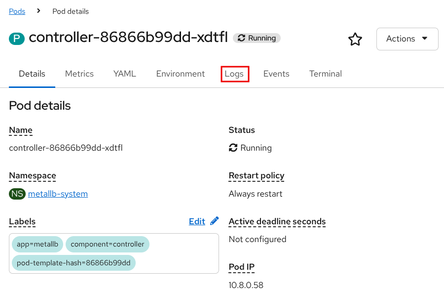
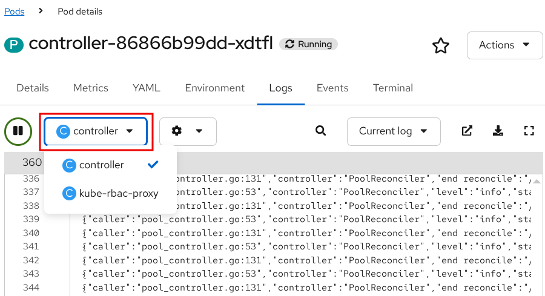
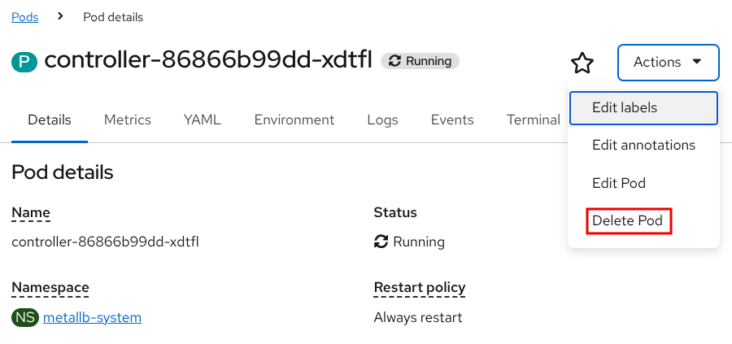
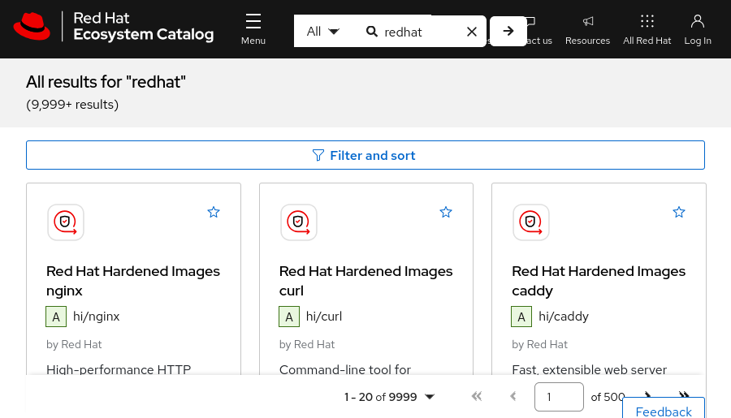
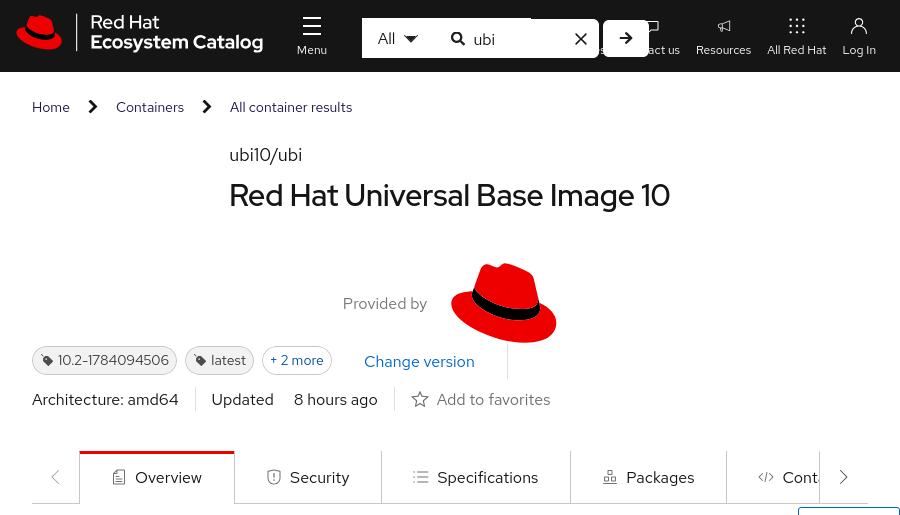
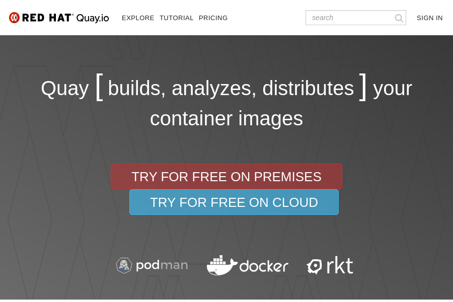
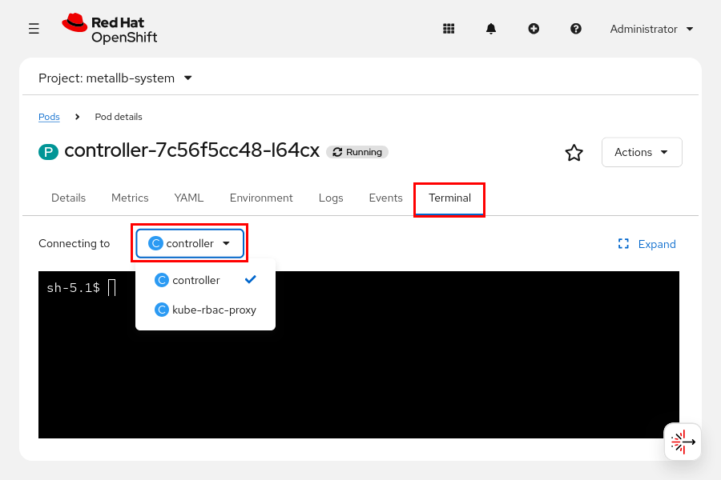

Quản trị Red Hat OpenShift I: Vận hành Cụm Môi trường Sản xuất
--------------------------------------------------------------

# Chương 3. Chạy ứng dụng dưới dạng Container và Pod
## Tạo Container Linux và Pod Kubernetes
### Chạy các Container trong Pod
Kubernetes và Red Hat OpenShift cung cấp nhiều cách để tạo các container trong pod. Bạn có thể sử dụng một trong những cách đó—lệnh `run` kết hợp với giao diện dòng lệnh (CLI) `kubectl` hoặc `oc`—để tạo và triển khai ứng dụng trong một pod từ một container image. Container image chứa dữ liệu bất biến xác định ứng dụng cùng các thư viện của nó.

> **Lưu ý:** Các container image được thảo luận chi tiết hơn ở phần khác của khóa học.

Hãy sử dụng lệnh `run` để tạo các pod đơn lẻ phục vụ mục đích gỡ lỗi tương tác hoặc các tác vụ tạm thời. Đối với các ứng dụng doanh nghiệp, việc sử dụng các tệp cấu hình YAML khai báo kết hợp với các tài nguyên workload (chẳng hạn như Deployment) là phương pháp được khuyến nghị nhằm đảm bảo tính nhất quán khi triển khai lại và khả năng quản lý. Lệnh `run` có cú pháp như sau:

```console
oc run RESOURCE/NAME --image IMAGE [options]
```

Ví dụ, lệnh sau đây triển khai một ứng dụng Apache HTTPD trong một pod có tên là web-server, sử dụng container image registry.access.redhat.com/ubi10/httpd-24.

```console
[user@host ~]$ oc run web-server \
--image registry.access.redhat.com/ubi10/httpd-24
```

Bạn có thể sử dụng một số tùy chọn và cờ (flag) với lệnh `run`. Tùy chọn `--command` cho phép thực thi một lệnh tùy chỉnh cùng các đối số của nó bên trong container, thay vì thực thi lệnh mặc định được định nghĩa trong image của container. Bạn cần đặt dấu gạch ngang kép (`--`) ngay sau tùy chọn `--command` để phân tách lệnh tùy chỉnh và các đối số của nó khỏi các tùy chọn của lệnh `run`. Cú pháp sau đây được áp dụng cho tùy chọn `--command`:

```console
oc run RESOURCE/NAME --image IMAGE --command -- cmd arg1 ... argN
```

Bạn cũng có thể sử dụng tùy chọn dấu gạch ngang kép để truyền các tham số tùy chỉnh cho lệnh mặc định trong image của container.

```console
oc run RESOURCE/NAME --image IMAGE -- arg1 arg2 ... argN
```

Để bắt đầu một phiên tương tác với container trong pod, hãy thêm các tùy chọn `-it` vào trước tên pod. Tùy chọn `-i` yêu cầu Kubernetes duy trì kết nối đầu vào tiêu chuẩn (stdin) của container trong pod. Tùy chọn `-t` yêu cầu Kubernetes mở một phiên TTY cho container trong pod. Bạn có thể sử dụng các tùy chọn `-it` để khởi chạy một shell tương tác từ xa bên trong container. Từ shell này, bạn có thể thực thi thêm các lệnh khác bên trong container. Ví dụ sau đây khởi chạy một shell tương tác từ xa (`/bin/bash`) trong container mặc định của pod có tên `my-app`.

```console
[user@host ~]$ oc run -it my-app --image registry.access.redhat.com/ubi10/ubi \
--command -- /bin/bash
If you don't see a command prompt, try pressing enter.
bash-5.1$
```

> **Lưu ý:** Trừ khi bạn sử dụng tùy chọn `--namespace` hoặc `-n`, lệnh `run` sẽ tạo các container trong các pod thuộc dự án hiện đang được chọn.

Bạn có thể xác định chính sách khởi động lại cho một pod bằng cách sử dụng tùy chọn `--restart`. Chính sách khởi động lại pod quy định cách cụm (cluster) phản ứng khi các container trong pod đó kết thúc. Các giá trị được chấp nhận là `Always`, `OnFailure` hoặc `Never`.

| Chính sách | Mô tả                                                                                                                         |
|------------|-------------------------------------------------------------------------------------------------------------------------------|
| Always     | Cụm liên tục cố gắng khởi động lại một container đã thoát, bất kể nó thoát thành công hay do lỗi. Đây là chính sách mặc định. |
| OnFailure  | Cụm chỉ khởi động lại container nếu nó thoát ra kèm theo lỗi.                                                                 |
| Never      | Cụm không cố gắng khởi động lại các container đã thoát hoặc gặp lỗi. Thay vào đó, các pod sẽ ngay lập tức gặp lỗi và thoát.   |

Ví dụ lệnh sau đây thực thi lệnh `date` trong container của pod có tên `my-app`, chuyển hướng đầu ra của lệnh `date` ra terminal và thiết lập chính sách khởi động lại pod là `Never`.

```console
[user@host ~]$ oc run -it my-app --image registry.access.redhat.com/ubi10/ubi \
--restart Never --command -- date
Tue Jul 14 07:22:51 UTC 2026
```

Để tự động xóa pod sau khi nó kết thúc, hãy thêm tùy chọn `--rm` vào lệnh `run`.

```console
[user@host ~]$ oc run -it my-app --rm \
--image registry.access.redhat.com/ubi10/ubi --restart Never --command -- date
Tue Jul 14 07:23:44 UTC 2026
pod "my-app" deleted from default namespace
```

Đối với một số ứng dụng chạy trong container, bạn có thể cần chỉ định các biến môi trường để ứng dụng hoạt động. Để chỉ định một biến môi trường cùng giá trị của nó, hãy thêm tùy chọn `--env` vào lệnh `run`.

```console
[user@host ~]$ oc run mysql --image registry.redhat.io/rhel10/mysql-84 \
--env MYSQL_ROOT_PASSWORD=myP@$$123
pod/mysql created
```

### Gán ID Người dùng và Nhóm
Khi một dự án được tạo, Red Hat OpenShift sẽ thêm các chú thích (annotation) vào dự án đó để xác định phạm vi ID người dùng (UID) và ID nhóm bổ sung (GID) cho các pod cùng các container của chúng trong dự án. Bạn có thể xem các chú thích này bằng lệnh `oc describe project project-name`.

```console
[user@host ~]$ oc describe project my-app
Name:           my-app
...output omitted...
Annotations:    openshift.io/description=
                openshift.io/display-name=
                openshift.io/requester=developer
                openshift.io/sa.scc.mcs=s0:c27,c4
                openshift.io/sa.scc.supplemental-groups=1000710000/10000
                openshift.io/sa.scc.uid-range=1000710000/10000
...output omitted...
```

Các giá trị cho `supplemental-groups` và `uid-range` sử dụng định dạng `base/size` (giá trị cơ sở/kích thước). Trong ví dụ `1000710000/10000`, số `1000710000` là ID bắt đầu của khối được cấp phát cho dự án này, còn số `10000` là kích thước của khối đó. Do đó, dự án có thể gán tối đa 10.000 UID và GID duy nhất cho các container đang chạy bên trong nó, bắt đầu từ ID cơ sở là `1000710000`.

Với các chính sách bảo mật mặc định của Red Hat OpenShift, người dùng cụm thông thường không thể tự chọn USER hoặc UID cho container của họ. Khi một người dùng cụm thông thường tạo pod, Red Hat OpenShift sẽ bỏ qua chỉ thị USER trong image của container. Thay vào đó, Red Hat OpenShift gán một UID ngẫu nhiên cho tiến trình chính của container từ dải `uid-range` được định nghĩa trong phần chú thích (annotations) của dự án.

ID nhóm chính (GID) của tiến trình luôn là 0, tức là nhóm root. Do tiến trình chạy với UID không phải root nhưng lại thuộc nhóm root, nên bất kỳ tệp hoặc thư mục nào mà container ghi vào đều phải thuộc sở hữu của nhóm root và có quyền ghi dành cho nhóm.

Tính năng này rất quan trọng đối với bảo mật. Mặc dù tiến trình trong container thuộc nhóm root, nhưng UID không phải root với giá trị số lớn khiến nó trở thành một tài khoản không có đặc quyền (unprivileged account).

Ngược lại, khi quản trị viên cụm tạo pod, chỉ thị USER trong image của container sẽ được xử lý. Ví dụ: nếu chỉ thị USER cho container image được đặt là 0, thì tiến trình trong container sẽ chạy dưới quyền tài khoản root (có đặc quyền) với UID là 0. Việc chạy container dưới quyền tài khoản có đặc quyền tiềm ẩn rủi ro bảo mật. Tài khoản có đặc quyền trong container có quyền truy cập không bị hạn chế vào hệ thống máy chủ (host system) chứa container đó. Quyền truy cập không bị hạn chế đồng nghĩa với việc container có thể sửa đổi hoặc xóa các tệp hệ thống, cài đặt phần mềm hoặc gây tổn hại đến máy chủ theo những cách khác. Do đó, Red Hat khuyến nghị bạn chạy các container ở chế độ không cần quyền root (rootless) hoặc dưới quyền của một người dùng không có đặc quyền cao, chỉ sở hữu những quyền hạn cần thiết để container hoạt động. Bằng cách gán một dải UID riêng biệt cho từng dự án, Red Hat OpenShift đảm bảo rằng các container thuộc các dự án khác nhau không chạy cùng một UID; đây là một biện pháp bảo mật quan trọng.

#### Bảo mật Pod
Bộ điều khiển Kubernetes Pod Security Admission (PSA) sẽ đưa ra cảnh báo khi một pod được tạo mà không có cấu hình ngữ cảnh bảo mật (security context) xác định. Red Hat OpenShift tích hợp bộ điều khiển PSA để thực thi các cấu hình bảo mật (privileged, baseline, restricted) ở cấp độ namespace. Các ngữ cảnh bảo mật quy định việc cấp hoặc từ chối các đặc quyền ở cấp hệ điều hành cho các pod.

Red Hat OpenShift sử dụng bộ điều khiển Security Context Constraints (SCC) để thiết lập các giá trị mặc định an toàn cho bảo mật pod. SCC cấp cho các pod những quyền cần thiết để đáp ứng yêu cầu của cấu hình PSA đang được áp dụng. Bạn có thể bỏ qua các cảnh báo về bảo mật pod trong các bài tập của khóa học này. Bộ điều khiển SCC sẽ được đề cập chi tiết hơn trong khóa học Quản trị Red Hat OpenShift II: Vận hành Cụm Kubernetes trong Môi trường Sản xuất (DO280).

### Thực thi lệnh trong các container đang chạy
Để thực thi một lệnh trong container đang chạy thuộc một pod, bạn có thể sử dụng lệnh `exec` với công cụ dòng lệnh `oc`. Lệnh `exec` sử dụng cú pháp sau:

```console
oc exec RESOURCE/NAME -- COMMAND [args...] [options]
```

Kết quả đầu ra của lệnh được thực thi sẽ được gửi đến terminal của bạn. Trong ví dụ dưới đây, lệnh `exec` thực thi lệnh `date` bên trong pod `my-app`.

```console
[user@host ~]$ oc exec my-app -- date
Tue Jul 14 07:32:28 UTC 2026
```

Lệnh được chỉ định sẽ thực thi trong container đầu tiên của pod. Đối với các pod có nhiều container, hãy sử dụng tùy chọn `-c` hoặc `--container=` để xác định container nào sẽ thực thi lệnh. Ví dụ sau đây thực thi lệnh `date` trong container có tên là `ruby-container` thuộc pod `my-app`.

```console
[user@host ~]$ oc exec my-app -c ruby-container -- date
Tue Jul 14 07:34:06 UTC 2026
```

Lệnh `exec` cũng hỗ trợ các tùy chọn `-i` và `-t` để tạo một phiên làm việc tương tác với container trong pod. Trong ví dụ dưới đây, Kubernetes chuyển dữ liệu từ `stdin` tới shell `bash` của container `ruby-container` (thuộc pod `my-app`), đồng thời chuyển dữ liệu từ `stdout` và `stderr` của shell `bash` đó ngược lại terminal.

```console
[user@host ~]$ oc exec my-app -c ruby-container -it -- bash -il
[1000780000@ruby-container /]$
```

Trong ví dụ trước, một terminal thô được mở bên trong container `ruby-container`. Từ phiên tương tác này, bạn có thể thực thi thêm các lệnh bên trong container. Để kết thúc phiên tương tác, bạn cần thực thi lệnh `exit` trong terminal thô đó.

```console
[user@host ~]$ oc exec my-app -c ruby-container -it -- bash -il
[1000780000@ruby-container /]$ date
Tue Jul 14 07:38:58 UTC 2026
[1000780000@ruby-container /]$ exit
```

### Nhật ký container
Nhật ký container là các đầu ra tiêu chuẩn (stdout) và lỗi tiêu chuẩn (stderr) của một container. Bạn có thể truy xuất nhật ký bằng lệnh `logs pod/pod-name` do công cụ dòng lệnh (CLI) `oc` cung cấp. Lệnh này bao gồm các tùy chọn sau:

| Tùy chọn                | Mô tả                                                                                                                                                                                                                                                                       |
|-------------------------|-----------------------------------------------------------------------------------------------------------------------------------------------------------------------------------------------------------------------------------------------------------------------------|
| -l hoặc --selector=''   | Lọc các đối tượng dựa trên ràng buộc nhãn dạng khóa:giá trị đã chỉ định.                                                                                                                                                                                                    |
| --tail=                 | Chỉ định số dòng của các tệp nhật ký gần đây cần hiển thị; giá trị mặc định là -1 (không kèm bộ chọn), giúp hiển thị tất cả các dòng nhật ký.                                                                                                                               |
| -c hoặc --container=    | In nhật ký của một container cụ thể trong pod chứa nhiều container. Nếu bỏ qua tùy chọn này, nhật ký sẽ được hiển thị từ container đầu tiên được định nghĩa trong pod hoặc từ container được chỉ định bởi annotation `kubectl.kubernetes.io/default-container` trên pod đó. |
| -f hoặc --follow        | Theo dõi hoặc phát trực tuyến nhật ký của container.                                                                                                                                                                                                                        |
| -p hoặc --previous=true | In nhật ký của một instance container trước đó trong pod (nếu có). Tùy chọn này hữu ích cho việc khắc phục sự cố đối với pod không khởi động được, vì nó hiển thị nhật ký của lần thử gần nhất.                                                                             |

Ví dụ sau đây giới hạn đầu ra của lệnh `oc logs` ở 10 dòng nhật ký gần đây nhất:

```console
[user@host ~]$ oc logs postgresql-1-jw89j --tail=10
 done
server stopped
Starting server...
2026-07-14 07:44:03.945 UTC [1] LOG:  starting PostgreSQL 12.11 on x86_64-redhat-linux-gnu, compiled by gcc (GCC) 8.5.0 20210514 (Red Hat 8.5.0-10), 64-bit
2026-07-14 07:44:03.946 UTC [1] LOG:  listening on IPv4 address "0.0.0.0", port 5432
2026-07-14 07:44:03.946 UTC [1] LOG:  listening on IPv6 address "::", port 5432
2026-07-14 07:44:03.953 UTC [1] LOG:  listening on Unix socket "/var/run/postgresql/.s.PGSQL.5432"
2026-07-14 07:44:03.960 UTC [1] LOG:  listening on Unix socket "/tmp/.s.PGSQL.5432"
2026-07-14 07:44:03.968 UTC [1] LOG:  redirecting log output to logging collector process
2026-07-14 07:44:03.968 UTC [1] HINT:  Future log output will appear in directory "log".
```

Bạn cũng có thể sử dụng lệnh `attach pod-name -c container-name -it` để kết nối và bắt đầu một phiên tương tác với một container đang chạy trong pod. Tùy chọn `-c container-name` là bắt buộc đối với các pod chứa nhiều container. Nếu không chỉ định tên container, Kubernetes sẽ sử dụng annotation `kubectl.kubernetes.io/default-container` trên pod để chọn container; nếu không có annotation này, container đầu tiên trong pod sẽ được chọn. Bạn có thể sử dụng phiên tương tác này để lấy các tệp nhật ký (log) của ứng dụng và khắc phục các sự cố của ứng dụng.

```console
[user@host ~]$ oc attach my-app -it
If you don't see a command prompt, try pressing enter.
bash-5.1$
```

Bạn cũng có thể truy xuất nhật ký từ bảng điều khiển web bằng cách nhấp vào tab Logs trên trang chi tiết của bất kỳ Pod nào.



Nếu bạn có nhiều hơn một container, bạn có thể chuyển đổi giữa các container trong menu thả xuống để xem danh sách nhật ký của từng container.



### Xóa tài nguyên
Bạn có thể xóa các tài nguyên Kubernetes (chẳng hạn như tài nguyên pod) bằng lệnh `delete`. Lệnh này cho phép xóa tài nguyên dựa trên loại và tên tài nguyên, loại và nhãn tài nguyên, dữ liệu từ đầu vào chuẩn (stdin), hoặc thông qua các tệp tin định dạng JSON hay YAML. Lệnh chỉ chấp nhận một loại tham số tại mỗi thời điểm thực thi; ví dụ: bạn có thể cung cấp loại và tên tài nguyên làm tham số cho lệnh.

```console
[user@host ~]$ oc delete pod php-app
```

Bạn cũng có thể xóa pod từ bảng điều khiển web bằng cách nhấp vào **Delete Pod** trong menu thả xuống **Actions**.



Để chọn các tài nguyên dựa trên nhãn, bạn có thể thêm tùy chọn `-l` cùng với nhãn dạng `key:value` làm đối số của lệnh.

```console
[user@host ~]$ oc delete pod -l app=my-app
pod "php-app" deleted
pod "mysql-db" deleted
```

Bạn cũng có thể cung cấp loại tài nguyên và một tệp định dạng JSON hoặc YAML có chứa tên của tài nguyên đó. Để sử dụng tệp, bạn cần thêm tùy chọn `-f` và cung cấp đường dẫn đầy đủ đến tệp định dạng JSON hoặc YAML này.

```console
[user@host ~]$ oc delete pod -f ~/php-app.json
pod "php-app" deleted
```

Bạn cũng có thể sử dụng `stdin` và một tệp định dạng JSON hoặc YAML (chứa loại tài nguyên và tên tài nguyên) cùng với lệnh xóa.

```console
[user@host ~]$ cat ~/php-app.json | oc delete -f -
pod "php-app" deleted
```

Các Pod hỗ trợ cơ chế kết thúc có kiểm soát (graceful termination); nghĩa là chúng sẽ cố gắng kết thúc các tiến trình của mình trước khi Kubernetes buộc phải chấm dứt chúng. Để thay đổi khoảng thời gian chờ trước khi Pod bị buộc chấm dứt, bạn có thể thêm tham số `--grace-period` cùng với giá trị thời gian (tính bằng giây) vào lệnh xóa. Ví dụ, để đặt thời gian chờ này là 10 giây, hãy sử dụng lệnh sau:

```console
[user@host ~]$ oc delete pod php-app --grace-period=10
```

Để tắt pod ngay lập tức, hãy đặt thời gian chờ (grace period) là 1 giây. Bạn cũng có thể sử dụng cờ `--now` để đặt thời gian chờ là 1 giây.

```console
[user@host ~]$ oc delete pod php-app --now
```

Bạn cũng có thể xóa cưỡng bức một pod bằng tùy chọn `--force`. Khi xóa cưỡng bức, Kubernetes sẽ không chờ xác nhận rằng các tiến trình của pod đã kết thúc; điều này có thể khiến các tiến trình đó tiếp tục chạy cho đến khi node phát hiện ra việc xóa pod. Do đó, việc xóa cưỡng bức có thể dẫn đến tình trạng thiếu nhất quán hoặc mất dữ liệu. Chỉ nên xóa cưỡng bức pod khi bạn chắc chắn rằng các tiến trình của pod đó đã chấm dứt.

```console
[user@host ~]$ oc delete pod php-app --force
```

Để xóa tất cả các pod trong một dự án, bạn có thể sử dụng tùy chọn `--all`.

```console
[user@host ~]$ oc delete pods --all
pod "php-app" deleted
pod "mysql-db" deleted
```

Tương tự, bạn có thể xóa một dự án cùng các tài nguyên của nó bằng lệnh `oc delete project project-name`.

```console
[user@host ~]$ oc delete project my-app
project.project.openshift.io "my-app" deleted
```

### Động cơ (engine) container CRI-O
Cần có một container engine để chạy các container. Các node worker và node control plane trong cụm Red Hat OpenShift Container Platform sử dụng container engine CRI-O để thực thi container. Khác với các công cụ như Podman hay Docker, CRI-O là một môi trường thực thi (runtime) được thiết kế và tối ưu hóa chuyên biệt để chạy container trong cụm Kubernetes. Nhờ việc tuân thủ các tiêu chuẩn Container Runtime Interface (CRI) của Kubernetes, CRI-O có khả năng tích hợp với các công cụ khác của Kubernetes và Red Hat OpenShift, chẳng hạn như các plugin về mạng và lưu trữ.

> **Lưu ý:** Để biết thêm thông tin về các tiêu chuẩn Kubernetes Container Runtime Interface (CRI), hãy tham khảo kho lưu trữ CRI-API tại https://github.com/kubernetes/cri-api.

CRI-O cung cấp giao diện dòng lệnh để quản lý các container thông qua lệnh `crictl`. Lệnh `crictl` bao gồm một số lệnh con giúp bạn quản lý các container. Dưới đây là các lệnh con thường được sử dụng với lệnh `crictl`:

| Lệnh           | Mô tả                                          |
|----------------|------------------------------------------------|
| crictl pods    | Liệt kê tất cả các pod trên một node.          |
| crictl image   | Liệt kê tất cả các image trên một node.        |
| crictl inspect | Lấy trạng thái của một hoặc nhiều container.   |
| crictl exec    | Chạy một lệnh trong container đang hoạt động.  |
| crictl logs    | Lấy nhật ký của một container.                 |
| crictl ps      | Liệt kê các container đang chạy trên một node. |

Để quản lý các container bằng lệnh `crictl`, trước tiên bạn cần xác định node đang lưu trữ các container của mình.

```console
[user@host ~]$ oc get pods -o wide
NAME                READY STATUS    RESTARTS AGE IP        NODE
postgresql-1-8lzf2  1/1   Running   0        20m 10.8.0.64 master01
postgresql-1-deploy 0/1   Completed 0        21m 10.8.0.63 master01
```

```console
[user@host ~]$ oc get pod postgresql-1-8lzf2 \
-o jsonpath='{.spec.nodeName}{"\n"}'
master01
```

Tiếp theo, bạn cần kết nối với node đã xác định với tư cách là quản trị viên cụm (cluster administrator). Quản trị viên cụm có thể sử dụng SSH để kết nối với node hoặc tạo một pod gỡ lỗi (debug pod) cho node đó. Người dùng thông thường không thể kết nối hoặc tạo pod gỡ lỗi cho các node của cụm. Với tư cách là quản trị viên cụm, bạn có thể tạo pod gỡ lỗi cho một node bằng lệnh `oc debug node/node-name`.

Nếu dự án được chọn có chứa các nhãn bảo mật cho phép sử dụng SCC đặc quyền (privileged SCC), Red Hat OpenShift sẽ tạo pod có tên `pod/node-name-debug` trong dự án đó và tự động kết nối bạn với pod này. Ngược lại, Red Hat OpenShift sẽ tạo một namespace tạm thời có tên `openshift-debug-random-string`, sau đó tạo pod `pod/node-name-debug-random-string` trong namespace tạm thời này và tự động kết nối bạn với pod đó.

Sau đó, bạn cần kích hoạt quyền truy cập vào các tệp nhị phân (binary) của host, chẳng hạn như lệnh `crictl`, bằng cách sử dụng lệnh `chroot /host`. Lệnh này thực hiện mount hệ thống tệp gốc (root file system) của host vào thư mục `/host` bên trong shell của pod gỡ lỗi. Bằng cách chuyển thư mục gốc sang thư mục `/host`, bạn có thể chạy các tệp nhị phân nằm trong đường dẫn thực thi (executable path) của host.

```console
[user@host ~]$ oc debug node/master01
Temporary namespace openshift-debug-wg2nf is created for debugging node...
Starting pod/master01-debug-dpmh5 ...
To use host binaries, run `chroot /host`. Instead, if you need to access host namespaces, run `nsenter -a -t 1`.
Pod IP: 172.25.250.140
All commands and output from this session will be recorded in container logs, including credentials and sensitive information passed through the command prompt.
If you don't see a command prompt, try pressing enter.
sh-5.1# chroot /host
```

Sau khi kích hoạt các tệp nhị phân trên host, bạn có thể sử dụng lệnh `crictl` để quản lý các container trên node. Ví dụ, bạn có thể dùng các lệnh `crictl ps` và `crictl inspect` để lấy ID tiến trình (PID) của một container đang chạy. Sau đó, bạn có thể sử dụng PID này để truy cập hoặc đi vào các namespace bên trong container, điều này rất hữu ích khi khắc phục sự cố ứng dụng. Để tìm PID của một container đang chạy, trước tiên bạn cần xác định ID của container đó. Bạn có thể sử dụng lệnh `crictl ps` kết hợp với tùy chọn `--name` để lọc kết quả hiển thị cho một container cụ thể.

```console
sh-5.1# crictl ps --name postgresql
CONTAINER     IMAGE        CREATED STATE   NAME       ATTEMPT POD ID      POD
27943ae4f3024 image...7104 5...ago Running postgresql 0       5768...f015 po...
```

Kết quả mặc định của lệnh `crictl ps` là dạng bảng. Bạn có thể tìm thấy ID container dạng rút gọn trong cột CONTAINER. Bạn cũng có thể sử dụng tùy chọn `-o` hoặc `--output` để chỉ định định dạng đầu ra của lệnh `crictl ps` là JSON hoặc YAML, sau đó phân tích kết quả này. Kết quả sau khi phân tích sẽ hiển thị ID container đầy đủ.

```console
sh-5.1# crictl ps --name postgresql -o json | jq .containers[0].id
"2794...29a4"
```

Sau khi xác định được ID của container, bạn có thể sử dụng lệnh `crictl inspect` cùng với ID đó để lấy PID của container đang chạy. Theo mặc định, lệnh `crictl inspect` sẽ hiển thị thông tin chi tiết. Bạn có thể sử dụng tùy chọn `-o` hoặc `--output` để định dạng kết quả đầu ra dưới dạng JSON, YAML, bảng hoặc Go template. Nếu chọn định dạng JSON, bạn có thể phân tích kết quả bằng lệnh `jq`. Tương tự, bạn cũng có thể sử dụng lệnh `grep` để lọc hoặc giới hạn kết quả đầu ra.

```console
sh-5.1# crictl inspect -o json 27943ae4f3024 | jq .info.pid
43453
sh-5.1# crictl inspect 27943ae4f3024 | grep pid
    "pid": 43453,
...output omitted...
```

Ngoài ra, bạn có thể sử dụng các phương thức tích hợp sẵn — chẳng hạn như tùy chọn go-template — để trích xuất ID mà không cần dùng đến các công cụ bên ngoài.

```console
sh-5.1# crictl inspect --output go-template \
--template '{{.info.pid}}' 27943ae4f3024
43453
```

Sau khi xác định được PID của một container đang chạy, bạn có thể sử dụng lệnh `lsns -p PID` để liệt kê các namespace hệ thống của container đó.

```console
sh-5.1# lsns -p 43453
        NS TYPE   NPROCS   PID USER       COMMAND
4026531834 time      520     1 root       /usr/lib/systemd/systemd --switche...
4026531835 cgroup    530     1 root       /usr/lib/systemd/systemd --switche...
4026531837 user      530     1 root       /usr/lib/systemd/systemd --switche...
4026537853 uts         8 43453 1000690000 postgres
4026537854 ipc         8 43453 1000690000 postgres
4026537856 net         8 43453 1000690000 postgres
4026538013 mnt         8 43453 1000690000 postgres
4026538014 pid         8 43453 1000690000 postgres
```

Bạn cũng có thể sử dụng PID của một container đang chạy kết hợp với lệnh `nsenter` để truy cập vào một namespace cụ thể của container đó. Ví dụ, bạn có thể dùng lệnh `nsenter` để thực thi một lệnh bên trong một namespace xác định của container đang chạy. Ví dụ dưới đây thực thi lệnh `ps -ef` trong process namespace của một container đang chạy.

```console
sh-5.1# nsenter -t 43453 -p -r ps -ef
UID          PID    PPID  C STIME TTY          TIME CMD
1000690+       1       0  0 18:49 ?        00:00:00 postgres
1000690+      58       1  0 18:49 ?        00:00:00 postgres: logger
1000690+      60       1  0 18:49 ?        00:00:00 postgres: checkpointer
1000690+      61       1  0 18:49 ?        00:00:00 postgres: background writer
1000690+      62       1  0 18:49 ?        00:00:00 postgres: walwriter
1000690+      63       1  0 18:49 ?        00:00:00 postgres: autovacuum lau...
1000690+      64       1  0 18:49 ?        00:00:00 postgres: stats collector
1000690+      65       1  0 18:49 ?        00:00:00 postgres: logical replic...
root        7414       0  0 20:14 ?        00:00:00 ps -ef
```

Tùy chọn `-t` chỉ định PID của container đang chạy làm PID đích cho lệnh `nsenter`. Tùy chọn `-p` yêu cầu lệnh `nsenter` đi vào namespace của tiến trình (process namespace) hoặc PID (PID namespace). Tùy chọn `-r` thiết lập thư mục cấp cao nhất của namespace tiến trình làm thư mục gốc, qua đó cho phép các lệnh được thực thi trong ngữ cảnh của namespace đó. Bạn cũng có thể sử dụng tùy chọn `-a` để thực thi một lệnh trong tất cả các namespace của container.

```console
sh-5.1# nsenter -t 43453 -a ps -ef
UID          PID    PPID  C STIME TTY          TIME CMD
1000690+       1       0  0 18:49 ?        00:00:00 postgres
1000690+      58       1  0 18:49 ?        00:00:00 postgres: logger
1000690+      60       1  0 18:49 ?        00:00:00 postgres: checkpointer
1000690+      61       1  0 18:49 ?        00:00:00 postgres: background writer
1000690+      62       1  0 18:49 ?        00:00:00 postgres: walwriter
1000690+      63       1  0 18:49 ?        00:00:00 postgres: autovacuum lau...
1000690+      64       1  0 18:49 ?        00:00:00 postgres: stats collector
1000690+      65       1  0 18:49 ?        00:00:00 postgres: logical replic...
root       10058       0  0 20:45 ?        00:00:00 ps -ef
```

## Tìm kiếm và kiểm tra các Container Image
### Tổng quan về Container Image
Container là một môi trường thực thi biệt lập, nơi các ứng dụng chạy dưới dạng các tiến trình riêng biệt. Sự biệt lập của môi trường thực thi này đảm bảo rằng các ứng dụng không gây ảnh hưởng đến các container khác hoặc các tiến trình của hệ thống.

Container image (ảnh container) chứa phiên bản đã được đóng gói của ứng dụng, bao gồm tất cả các thành phần phụ thuộc cần thiết để ứng dụng có thể vận hành. Các image có thể tồn tại độc lập mà không cần container; tuy nhiên, container lại phụ thuộc vào image vì chúng sử dụng image để thiết lập môi trường thực thi cho ứng dụng.

Khái niệm container có thể được chia thành hai khái niệm tương đồng nhưng khác biệt: container image và container instance (thể hiện cụ thể của container). Container image chứa dữ liệu bất biến định nghĩa ứng dụng cùng các thư viện đi kèm. Bạn có thể sử dụng container image để tạo ra các container instance—vốn là những tiến trình đang chạy và được cách ly thông qua cơ chế kernel namespace.

Bạn có thể sử dụng một container image nhiều lần để tạo ra các container instance riêng biệt. Các bản sao này có thể được phân bổ trên nhiều máy chủ (host) khác nhau. Ứng dụng bên trong container hoạt động độc lập với môi trường của máy chủ.

### Kho chứa Container Image
Image registry là các dịch vụ cung cấp container image để tải về. Những người tạo và duy trì image có thể lưu trữ và phân phối container image một cách có kiểm soát tới đối tượng người dùng công khai hoặc riêng tư. Một số ví dụ về image registry bao gồm Quay.io, Red Hat Registry, Docker Hub và Amazon ECR.

#### Kho chứa Red Hat
Red Hat phân phối các container image thông qua Red Hat Ecosystem Catalog (https://catalog.redhat.com/), một nền tảng cung cấp công cụ tìm kiếm tập trung. Bạn có thể tìm kiếm các thông tin kỹ thuật về container image trên Red Hat Ecosystem Catalog. Danh mục này lưu trữ một lượng lớn container image, bao gồm cả các image từ những dự án mã nguồn mở lớn như Apache, MySQL và Jenkins. Mặc dù nhiều container image được cung cấp công khai, bạn vẫn cần xác thực tài khoản trên trang web để truy cập vào những image không thuộc phạm vi công khai.

Do Red Hat Ecosystem Catalog còn chứa các sản phẩm phần mềm khác ngoài container image, hãy truy cập https://catalog.redhat.com/software/containers/explore để tìm kiếm các container image cụ thể.

**Hình 3.4: Danh mục Hệ sinh thái Red Hat**  


Trang chi tiết của một container image bao gồm các thông tin liên quan, chẳng hạn như dữ liệu kỹ thuật, các gói phần mềm được cài đặt bên trong image hoặc kết quả quét bảo mật. Bạn có thể chuyển đổi giữa các mục này bằng cách sử dụng các thẻ (tab) trên trang web. Ngoài ra, bạn cũng có thể thay đổi phiên bản image bằng cách chọn một thẻ (tag) cụ thể.

**Hình 3.5: Trang chi tiết về Red Hat Universal Base Image 10**  


Đội ngũ bảo mật nội bộ của Red Hat kiểm định tất cả các image trong danh mục container. Red Hat xây dựng lại toàn bộ các thành phần để loại bỏ những lỗ hổng bảo mật đã biết.

Các container image của Red Hat mang lại những lợi ích sau:

* Nguồn tin cậy: Tất cả các container image đều sử dụng các nguồn mà Red Hat đã biết và tin cậy.
* Các thành phần phụ thuộc nguyên bản: Không có gói container nào bị thay đổi và chúng chỉ bao gồm các thư viện đã được xác định.
* Không chứa lỗ hổng bảo mật: Các container image không chứa các lỗ hổng nghiêm trọng đã biết trong các thành phần hoặc lớp của nền tảng.
* Bảo vệ trong quá trình vận hành: Tất cả các ứng dụng trong container image đều chạy dưới quyền người dùng không phải root (non-root) nhằm giảm thiểu phạm vi rủi ro trước các ứng dụng độc hại hoặc bị lỗi.
* Tương thích với Red Hat Enterprise Linux (RHEL): Các container image tương thích với mọi nền tảng RHEL, từ hệ thống máy chủ vật lý (bare metal) đến môi trường đám mây.
* Hỗ trợ từ Red Hat: Red Hat cung cấp dịch vụ hỗ trợ thương mại cho các container image có trong danh mục.

> **Lưu ý:** Bạn phải đăng nhập vào trang web danh mục bằng tài khoản cổng thông tin khách hàng hoặc tài khoản Red Hat Developer để sử dụng các container image được lưu trữ trong registry.

#### Quay.io
Mặc dù Red Hat Registry chỉ lưu trữ các image từ Red Hat và các nhà cung cấp được chứng nhận, bạn có thể lưu trữ image của riêng mình trên Quay.io – một registry image công khai khác do Red Hat bảo trợ. Việc lưu trữ image công khai trên Quay là miễn phí, nhưng một số tùy chọn chỉ dành cho khách hàng trả phí. Quay cũng cung cấp phiên bản triển khai tại chỗ (on-premise) để bạn có thể thiết lập registry image nội bộ trên máy chủ của chính mình.

Quay.io mang đến các tính năng như xây dựng image phía máy chủ, kiểm soát truy cập chi tiết và tự động quét image để phát hiện các lỗ hổng bảo mật đã biết.

Quay.io cung cấp các image "live" (luôn được cập nhật) thường xuyên bởi chính người tạo ra chúng. Người dùng Quay.io có thể tạo các namespace (không gian tên) với cơ chế kiểm soát truy cập chi tiết và xuất bản image của mình vào các namespace đó. Ngược lại, người dùng Container Catalog hiếm khi đẩy (push) image mới lên mà chủ yếu sử dụng các image đáng tin cậy từ đội ngũ Red Hat.

**Hình 3.6: Trang chào mừng của Quay.io**  


#### Kho lưu trữ riêng
Những người tạo hoặc duy trì hình ảnh có thể chọn công khai hình ảnh của mình. Tuy nhiên, những người tạo hình ảnh khác có thể muốn giữ hình ảnh ở chế độ riêng tư vì các lý do sau:

* Quyền riêng tư của công ty và bảo vệ bí mật
* Các quy định và hạn chế pháp lý
* Tránh công bố các image sản phẩm đang trong quá trình phát triển

Trong một số trường hợp, việc sử dụng các image (ảnh container) riêng tư được ưu tiên hơn. Các image riêng tư mang lại mức độ bảo mật cao hơn so với những image nằm trong các registry công khai. Các registry riêng tư cho phép người tạo image kiểm soát việc lưu trữ, phân phối và sử dụng image đó.

Việc sử dụng các registry container riêng tư là một yếu tố then chốt trong các chiến lược về chủ quyền kỹ thuật số. Các registry này cho phép vận hành trong môi trường hoàn toàn cách ly (air-gapped) và duy trì sự kiểm soát chặt chẽ đối với chuỗi cung ứng phần mềm. Các tổ chức chú trọng đến chủ quyền kỹ thuật số và tuân thủ quy định có thể sử dụng registry riêng tư để đảm bảo rằng các container image được lấy nguồn, lưu trữ và phân phối trong phạm vi được kiểm soát.

#### Kho lưu trữ công cộng
Các kho lưu trữ công khai khác, chẳng hạn như Docker Hub và Amazon ECR, cũng có sẵn để lưu trữ, chia sẻ và sử dụng các container image. Các kho này có thể chứa những image chính thức do chính chủ sở hữu kho hoặc cộng đồng người dùng tạo ra và duy trì. Ví dụ: Docker Hub lưu trữ một Docker Official Image (Image Chính thức của Docker) dành cho WordPress. Mặc dù container image `docker.io/library/wordpress` là một Docker Official Image, nhưng nó không được hỗ trợ bởi WordPress, Docker hay Red Hat. Thay vào đó, Cộng đồng Docker — một nhóm người dùng Docker Hub trên toàn cầu — mới là bên hỗ trợ và duy trì image này. Việc hỗ trợ cho container image này phụ thuộc vào sự sẵn lòng và năng lực của người dùng trong Cộng đồng Docker.

Việc sử dụng container image từ các kho công khai tiềm ẩn nhiều rủi ro. Ví dụ, một container image có thể chứa mã độc hoặc các lỗ hổng bảo mật, gây nguy hại cho hệ thống máy chủ thực thi image đó. Các container image công khai cũng có thể đe dọa hệ thống máy chủ vì chúng thường được thực thi dưới quyền người dùng root (quyền quản trị cao nhất). Ngoài ra, phần mềm bên trong container image có thể không có giấy phép hợp lệ hoặc vi phạm các điều khoản cấp phép.

Trước khi sử dụng container image từ một kho công khai, hãy xem xét và kiểm thử image đó để đảm bảo tính phù hợp với môi trường của bạn. Đồng thời, hãy đảm bảo rằng bạn có đầy đủ quyền hạn để sử dụng phần mềm có trong container image đó.

### Các định danh Container Image
Một số đối tượng cung cấp thông tin định danh về một container image.

**Registry (Kho chứa)**  
Registry là một máy chủ nội dung, chẳng hạn như registry.access.redhat.com, dùng để lưu trữ và chia sẻ các container image. Một registry bao gồm một hoặc nhiều repository (kho lưu trữ) chứa các container image đã được gắn thẻ (tag).

**Name (Tên)**  
Tên dùng để định danh repository chứa container image và bao gồm một chuỗi các chữ cái, chữ số cùng các ký tự đặc biệt. Tên này chỉ định thư mục hoặc repository container bên trong registry container nơi container image được lưu trữ. 

Ví dụ: hãy xem xét tên miền đầy đủ (FQDN) của container image `registry.access.redhat.com/ubi10/httpd-24:10.0-1752560295`. Image container này nằm trong repository `ubi10/httpd-24` thuộc registry container `registry.access.redhat.com`.

**ID hoặc Hash**  
ID hoặc hash là mã SHA (Secure Hash Algorithm) dùng để định vị, tải về (pull) hoặc xác minh một image duy nhất trong registry. ID image SHA không thể thay đổi và luôn trỏ đến cùng một nội dung container image. ID hoặc hash đóng vai trò là mã định danh duy nhất cho một container image. Ví dụ: ID image `sha256:2d2b3fcadddd2fd907b0f0f833bc4f3ccb98cb28c5096d5c36bea0ebe19f73a0` luôn trỏ đến container image `registry.access.redhat.com/ubi10/httpd-24:10.0`.

**Tag (Thẻ)**  
Tag là nhãn dành cho container image trong một repository nhằm phân biệt image cụ thể đó với các image khác, phục vụ mục đích quản lý phiên bản. Tag nằm sau tên repository của image và được phân tách bằng dấu hai chấm (:). 

Khi bạn không chỉ định tag cho image, môi trường thực thi container (container runtime) sẽ sử dụng tag động (floating tag) mới nhất làm tag mặc định. Tag động là một bí danh (alias) trỏ đến một tag khác. Ngược lại, tag cố định (fixed tag) trỏ đến một bản dựng (build) container cụ thể. Ví dụ, trong container image `registry.access.redhat.com/ubi10/httpd-24:10.0-1752560295`, thì `10.0-1752560295` là thẻ (tag) cố định của image đó. Cùng kho lưu trữ này cũng cung cấp thẻ động `10.0` (trỏ đến bản build mới nhất của phiên bản 10.0) và thẻ động `latest` (trỏ đến phiên bản phát hành gần đây nhất).

### Các thành phần của Container Image
Một container image bao gồm nhiều thành phần.

**Các lớp (Layers)**
Các chỉ dẫn tạo nên các container image. Mỗi chỉ dẫn bổ sung một lớp vào container image. Mỗi lớp bao gồm những điểm khác biệt so với lớp ngay trước đó. Các lớp này sau đó được xếp chồng lên nhau để tạo thành một container image chỉ đọc (read-only).

**Siêu dữ liệu (Metadata)**  
Siêu dữ liệu bao gồm các chỉ dẫn và tài liệu mô tả cho container image.

### Hướng dẫn và siêu dữ liệu về Container Image
Các lớp (layer) của container image bao gồm các chỉ dẫn (hoặc các bước) và siêu dữ liệu dùng để xây dựng image đó. Bạn có thể ghi đè các chỉ dẫn này trong quá trình tạo container để tùy chỉnh container image theo nhu cầu của mình. Một số chỉ dẫn có thể ảnh hưởng đến container đang chạy, trong khi các chỉ dẫn khác chỉ mang tính chất cung cấp thông tin.

Các chỉ dẫn sau đây ảnh hưởng đến trạng thái của container đang chạy:

**ENV**  
Xác định các biến môi trường khả dụng trong container. Một container image có thể bao gồm nhiều chỉ thị ENV. Bất kỳ container nào cũng có thể nhận diện thêm các biến môi trường không được liệt kê trong metadata của nó.
ARG

Xác định các biến dùng trong quá trình build (xây dựng), thường nhằm mục đích tùy biến việc build container. Các nhà phát triển thường cấu hình các chỉ thị ENV bằng cách sử dụng chỉ thị ARG. ARG rất hữu ích để duy trì các biến từ giai đoạn build sang giai đoạn runtime (thực thi).

**USER**  
Xác định người dùng (user) hoạt động trong container. Các chỉ thị sau đó sẽ chạy dưới quyền của người dùng này. Hãy xác định một người dùng khác với root vì lý do bảo mật. OpenShift không áp dụng thông tin người dùng trong container image đối với người dùng thông thường của cụm (cluster). Chỉ quản trị viên cụm mới có thể chạy các container (pod) với các ID người dùng (UID) và ID nhóm (GID) do họ chọn.

**ENTRYPOINT**  
Xác định tệp thực thi sẽ chạy khi container được khởi động.

**CMD**  
Xác định lệnh sẽ được thực thi khi container khởi động. Lệnh này được truyền vào tệp thực thi đã được xác định bởi chỉ thị ENTRYPOINT. Các image cơ sở (base image) thường xác định sẵn một tệp thực thi ENTRYPOINT mặc định, thường là một shell như Bash.

**WORKDIR**  
Xác định thư mục làm việc hiện tại bên trong container. Các chỉ thị tiếp theo sẽ được thực thi bên trong thư mục này.

Metadata đóng vai trò cung cấp thông tin và không ảnh hưởng đến trạng thái của container đang chạy. Bạn cũng có thể ghi đè các giá trị metadata trong quá trình tạo container.

Các metadata sau đây chỉ mang tính chất thông tin và không ảnh hưởng đến trạng thái của container đang chạy:

**EXPOSE**  
Chỉ định cổng mạng mà ứng dụng sẽ liên kết (bind) tới bên trong container. Metadata này không tự động liên kết cổng trên máy chủ (host) và chỉ có tác dụng cung cấp thông tin.

**VOLUME**  
Xác định vị trí lưu trữ dữ liệu bên ngoài container. Giá trị này hiển thị đường dẫn nơi môi trường thực thi container (container runtime) sẽ mount (gắn) thư mục vào bên trong container. Bạn có thể xác định nhiều đường dẫn để tạo nhiều volume.

**LABEL**  
Xác định một cặp khóa-giá trị (key-value pair) trong metadata của image để phục vụ việc tổ chức và lựa chọn image.

Các công cụ quản lý container (container engine) không bắt buộc phải tuân theo metadata trong container image, chẳng hạn như USER hay EXPOSE. Một container engine cũng có thể nhận diện thêm các biến môi trường không được liệt kê trong metadata của container image.

### Image cơ sở
Base image là ảnh được dùng làm cơ sở để xây dựng nên ảnh container cuối cùng của bạn. Ảnh nền tảng mà bạn chọn sẽ quyết định bản phân phối Linux cũng như bất kỳ thành phần nào sau đây:

* Trình quản lý gói
* Hệ thống khởi động (init system)
* Cấu trúc hệ thống tệp
* Các thành phần phụ thuộc và môi trường thực thi được cài đặt sẵn

Base image cũng có thể ảnh hưởng đến các yếu tố như kích thước hình ảnh, sự hỗ trợ từ nhà cung cấp và khả năng tương thích với bộ xử lý.

Red Hat cung cấp các container image cấp doanh nghiệp được thiết kế để đóng vai trò là lớp hệ điều hành cơ sở cho các ứng dụng được đóng gói dưới dạng container của bạn. Các container image này đóng vai trò là điểm khởi đầu chung cho các container và được gọi là Universal Base Image (UBI). Container image Red Hat UBI tuân thủ tiêu chuẩn Open Container Initiative (OCI) và chứa các thành phần của Red Hat Enterprise Linux.

Container image UBI bao gồm một tập hợp con các thành phần của RHEL. Chúng cung cấp sẵn các môi trường thực thi ngôn ngữ (runtime) như Python và Node.js, cùng các kho lưu trữ DNF tương ứng để bổ sung các phụ thuộc (dependencies) cho ứng dụng. Các hình ảnh dựa trên UBI có thể được phân phối miễn phí và không bị hạn chế. Những hình ảnh này có thể được triển khai trên cả nền tảng của Red Hat lẫn các nền tảng khác, cũng như được đẩy lên kho lưu trữ container (container registry) mà bạn chọn.

Bạn không cần phải có gói đăng ký (subscription) của Red Hat để sử dụng hoặc phân phối các hình ảnh dựa trên UBI. Tuy nhiên, Red Hat chỉ cung cấp hỗ trợ toàn diện cho các container được xây dựng trên UBI nếu chúng được triển khai trên nền tảng của Red Hat, chẳng hạn như cụm RHOCP hoặc RHEL.

Red Hat cung cấp bốn biến thể UBI: standard (tiêu chuẩn), init, minimal (tối giản) và micro (siêu nhỏ). Tất cả các biến thể UBI và hình ảnh dựa trên UBI đều sử dụng RHEL làm nền tảng cốt lõi và có sẵn trên Red Hat Container Catalog. Các điểm khác biệt chính như sau:

**Standard**  
Đây là image UBI cơ bản, bao gồm DNF, systemd và các tiện ích như gzip và tar.

**Init**  
Image này đơn giản hóa quy trình chạy nhiều ứng dụng trong cùng một container bằng cách quản lý chúng thông qua systemd.

**Minimal**  
Image này có kích thước nhỏ hơn image init và cung cấp thêm một số tính năng hữu ích. Nó sử dụng trình quản lý gói tối giản microdnf thay vì phiên bản đầy đủ của DNF.

**Micro**  
Đây là image UBI nhỏ nhất hiện có và chỉ bao gồm các gói tối thiểu. Ví dụ: image này không bao gồm trình quản lý gói.

Ngoài ra, Red Hat còn cung cấp các image runtime dành riêng cho từng ngôn ngữ, chẳng hạn như Python và Node.js.

### Kiểm tra và quản lý các Image Container
Có nhiều công cụ khác nhau có thể kiểm tra và quản lý các image container, bao gồm lệnh `oc image` và Skopeo.

#### Skopeo
Skopeo là công cụ dùng để kiểm tra và quản lý các image container từ xa. Với Skopeo, bạn có thể sao chép và đồng bộ hóa các image container giữa những registry và kho lưu trữ (repository) khác nhau. Bạn có thể sao chép một image từ kho lưu trữ từ xa và lưu nó vào ổ đĩa cục bộ. Nếu có quyền truy cập phù hợp, bạn cũng có thể xóa image khỏi registry container. Skopeo cho phép bạn kiểm tra cấu hình và nội dung của image container, cũng như liệt kê các thẻ (tag) hiện có của image đó. Khác với các công cụ quản lý image container khác, Skopeo có thể hoạt động mà không cần tài khoản đặc quyền (như root) và không yêu cầu tiến trình nền (daemon) phải chạy để thực hiện các tác vụ.

Bạn sử dụng Skopeo thông qua tiện ích dòng lệnh cùng tên; tiện ích này có thể được cài đặt bằng các trình quản lý gói phổ biến như DNF, Brew hoặc APT. Tiện ích Skopeo có thể đã được cài đặt sẵn trên một số bản phân phối Linux. Bạn có thể cài đặt Skopeo trên các hệ thống Fedora, CentOS Stream 8 (trở lên) và Red Hat Enterprise Linux 8 (trở lên) bằng cách sử dụng trình quản lý gói DNF.

```console
[user@host ~]$ sudo dnf -y install skopeo
```

Hiện tại, tiện ích skopeo chưa có sẵn dưới dạng tệp nhị phân đã đóng gói cho các hệ thống Windows. Tuy nhiên, tiện ích này có sẵn dưới dạng image container từ kho lưu trữ container quay.io/skopeo/stable. Để biết thêm thông tin về image container Skopeo, hãy tham khảo hướng dẫn tổng quan về image skopeo trong kho lưu trữ Skopeo tại https://github.com/containers/image_build/tree/main/skopeo.

Ngoài ra, bạn có thể build skopeo từ mã nguồn bên trong một container hoặc build cục bộ mà không cần dùng container. Hãy tham khảo hướng dẫn cài đặt trong kho lưu trữ Skopeo để biết thêm thông tin về việc cài đặt hoặc build Skopeo từ mã nguồn tại https://github.com/podman-container-tools/skopeo/blob/main/install.md#container-images.

Tiện ích skopeo cung cấp các lệnh để quản lý và kiểm tra image container cũng như các registry chứa image container. Đối với các registry yêu cầu xác thực, bạn cần đăng nhập vào registry trước khi có thể thực thi các lệnh skopeo khác.

```console
[user@host ~]$ skopeo login quay.io
```

> **Lưu ý:** Các cụm OpenShift thường được cấu hình với thông tin xác thực registry và tự động xác thực khi tải (pull) các image cho pod. Ngược lại, lệnh `oc image` và tiện ích `skopeo` yêu cầu bạn phải đăng nhập vào container registry trước.

Sau khi đăng nhập vào một container registry (nếu được yêu cầu), bạn có thể thực thi thêm các lệnh skopeo đối với các image container trong một repository. Khi thực thi lệnh skopeo, bạn phải chỉ định phương thức truyền tải (transport) và tên repository. Transport là cơ chế dùng để chuyển các image container giữa các vị trí. Hai loại transport phổ biến là `docker` và `dir`. Transport `docker` thực hiện chuyển image đến và đi từ các container registry, trong khi transport `dir` thực hiện chuyển image đến và đi từ các thư mục cục bộ.

Lệnh `oc image` và các công cụ khác sử dụng transport `docker` làm mặc định, do đó bạn không cần phải chỉ định transport khi thực thi lệnh. Tuy nhiên, tiện ích skopeo không quy định transport mặc định; bạn bắt buộc phải chỉ định transport cùng với tên image container. Hầu hết các lệnh skopeo đều tuân theo định dạng: `skopeo [các tùy chọn lệnh] transport://TÊN-IMAGE`. Ví dụ, lệnh `skopeo list-tags` dưới đây liệt kê tất cả các tag hiện có trong repository container `registry.access.redhat.com/ubi10/httpd-24` bằng cách sử dụng transport `docker`:

```console
[user@host ~]$ skopeo list-tags docker://registry.access.redhat.com/ubi10/httpd-24
{
    "Repository": "registry.access.redhat.com/ubi10/httpd-24",
    "Tags": [
        "10.0",
...output omitted...
        "latest"
...output omitted...
```

Tiện ích `skopeo` bao gồm các lệnh khác để quản lý image container.

**skopeo inspect**  
Xem thông tin chi tiết về một tên image, chẳng hạn như các biến môi trường và các thẻ (tag) hiện có. Hãy sử dụng định dạng lệnh `skopeo inspect [các tùy chọn lệnh] transport://TÊN-IMAGE`. Bạn có thể thêm tùy chọn `--config` để xem cấu hình, siêu dữ liệu (metadata) và lịch sử của một kho chứa container. Ví dụ sau đây truy xuất thông tin cấu hình cho kho chứa container `registry.access.redhat.com/ubi10/httpd-24`:

```console
[user@host ~]$ skopeo inspect --config docker://registry.access.redhat.com/ubi10/httpd-24
...output omitted...
    "config": {
        "User": "1001",
        "ExposedPorts": {
            "8080/tcp": {},
            "8443/tcp": {}
        },
        "Env": [
...output omitted...
            "HTTPD_MAIN_CONF_PATH=/etc/httpd/conf",
            "HTTPD_MAIN_CONF_MODULES_D_PATH=/etc/httpd/conf.modules.d",
            "HTTPD_MAIN_CONF_D_PATH=/etc/httpd/conf.d",
            "HTTPD_TLS_CERT_PATH=/etc/httpd/tls",
            "HTTPD_VAR_RUN=/var/run/httpd",
            "HTTPD_DATA_PATH=/var/www",
            "HTTPD_DATA_ORIG_PATH=/var/www",
            "HTTPD_LOG_PATH=/var/log/httpd"
        ],
        "Entrypoint": [
            "container-entrypoint"
        ],
        "Cmd": [
            "/usr/bin/run-httpd"
        ],
        "WorkingDir": "/opt/app-root/src",
...output omitted...
    }
...output omitted...
```

**skopeo copy**  
Sao chép một image từ vị trí hoặc kho lưu trữ này sang vị trí hoặc kho lưu trữ khác. Sử dụng định dạng `skopeo copy transport://SOURCE-IMAGE transport://DESTINATION-IMAGE`. Ví dụ, lệnh sau đây sao chép container image `quay.io/skopeo/stable:latest` vào kho lưu trữ skopeo trong registry container `registry.example.com`:

```console
[user@host ~]$ skopeo copy docker://quay.io/skopeo/stable:latest \
docker://registry.example.com/skopeo:latest
```

**skopeo delete**  
Xóa một image container khỏi kho lưu trữ (repository). Sử dụng định dạng `skopeo delete [các tùy chọn lệnh] transport://TÊN-IMAGE`. Lệnh sau đây xóa image `skopeo:latest` khỏi registry container `registry.example.com`:

```console
[user@host ~]$ skopeo delete docker://registry.example.com/skopeo:latest
```

**skopeo sync**  
Đồng bộ hóa một hoặc nhiều image từ vị trí này sang vị trí khác. Sử dụng lệnh này để sao chép tất cả các container image từ nguồn đến đích. Sử dụng định dạng lệnh: `skopeo sync [các tùy chọn lệnh] --src transport --dest transport NGUỒN ĐÍCH`. Lệnh sau đây đồng bộ hóa kho chứa container `registry.access.redhat.com/ubi10/httpd-24` sang kho chứa container `registry.example.com/httpd-24`:

```console
[user@host ~]$ skopeo sync --src docker --dest docker \
registry.access.redhat.com/ubi10/httpd-24 registry.example.com/httpd-24
```

#### Thông tin xác thực Registry
Một số registry yêu cầu người dùng xác thực trước khi truy cập vào các image container và siêu dữ liệu (metadata). Ví dụ, các container của Red Hat dựa trên RHEL thường yêu cầu quyền truy cập đã được xác thực:

```console
[user@host ~]$ skopeo inspect docker://registry.redhat.io/rhel10/httpd-24
time="..." level=fatal msg="Error parsing image name \"docker://registry.redhat.io/rhel10/httpd-24\": unable to retrieve auth token: invalid username/password: unauthorized: Please login to the Red Hat Registry using your Customer Portal credentials. Further instructions can be found here: https://access.redhat.com/RegistryAuthentication"
```

Bạn có thể chọn một image khác không yêu cầu xác thực, chẳng hạn như image UBI 10:

```console
[user@host ~]$ skopeo inspect docker://registry.access.redhat.com/ubi10:latest
{
    "Name": "registry.access.redhat.com/ubi10",
    "Digest": "sha256:b515...",
    "RepoTags": [
        "10.0",
        "10.0-1745487123",
...output omitted....
```

Ngoài ra, bạn phải thực hiện lệnh `skopeo login` cho registry trước khi có thể truy cập các image được bảo vệ.

```console
[user@host ~]$ skopeo login registry.redhat.io
Username: YOUR_USER
Password: YOUR_PASSWORD
Login Succeeded!
```

Skopeo lưu trữ thông tin xác thực trong tệp ${XDG_RUNTIME_DIR}/containers/auth.json, trong đó ${XDG_RUNTIME_DIR} là thư mục dành riêng cho người dùng hiện tại. Skopeo mã hóa thông tin xác thực dưới định dạng Base64:

```console
[user@host ~]$ cat ${XDG_RUNTIME_DIR}/containers/auth.json
{
  "auths": {
    "registry.redhat.io": {
      "auth": "dXNlcjpodW50ZXIy"
    }
  }
}
[user@host ~]$ echo -n dXNlcjpodW50ZXIy | base64 -d
user:hunter2
```

> **Lưu ý:** Vì lý do bảo mật, lệnh `skopeo login` không hiển thị mật khẩu của bạn trong phiên làm việc tương tác. Mặc dù bạn không nhìn thấy những gì mình đang gõ, Skopeo vẫn ghi nhận từng lần nhấn phím. Sau khi nhập đầy đủ mật khẩu trong phiên làm việc tương tác, hãy nhấn Enter để bắt đầu đăng nhập.

#### Lệnh oc image
Giao diện dòng lệnh OpenShift cung cấp lệnh `oc image`. Bạn có thể sử dụng lệnh này để kiểm tra, cấu hình hoặc truy xuất thông tin về các image container.

Lệnh `oc image info` thực hiện kiểm tra và truy xuất thông tin về một image container. Bạn có thể dùng lệnh này để xác định ID hoặc mã băm (hash) SHA và liệt kê các lớp (layer) của image container. Ngoài ra, bạn cũng có thể xem xét các siêu dữ liệu (metadata) của image container, chẳng hạn như biến môi trường, cổng mạng và các lệnh. Nếu kho lưu trữ cung cấp image container hỗ trợ nhiều kiến trúc (ví dụ: AMD64 hoặc ARM64), bạn cần thêm tùy chọn `--filter-by-os`. Ví dụ: bạn có thể chạy lệnh sau để truy xuất thông tin về image container `registry.access.redhat.com/ubi10/httpd-24:10.0` được xây dựng trên kiến trúc AMD64:

```console
[user@host ~]$ oc image info registry.access.redhat.com/ubi10/httpd-24 \
--filter-by-os amd64
Name:          registry.access.redhat.com/ubi10/httpd-24:10.0
Digest:        sha256:b765...
...output omitted...
```

Lệnh `oc image` cung cấp thêm các tùy chọn để quản lý hình ảnh container.

**oc image append**  
Sử dụng lệnh này để thêm các lớp (layer) vào image container, sau đó đẩy image container đó lên registry.

**oc image extract**  
Bạn có thể sử dụng lệnh này để trích xuất hoặc sao chép các tệp từ image container sang ổ đĩa cục bộ. Lệnh này cho phép truy cập nội dung của image container mà không cần phải chạy image đó dưới dạng container trước. Không yêu cầu phải có engine container đang chạy.

**oc image mirror**
Sao chép hoặc nhân bản (mirror) các image container từ registry hoặc kho lưu trữ (repository) này sang registry hoặc kho lưu trữ khác. Ví dụ: bạn có thể dùng lệnh này để nhân bản image container giữa các registry công khai và riêng tư. Bạn cũng có thể dùng lệnh này để sao chép image container từ registry vào ổ đĩa. Lệnh này sẽ sao chép cấu trúc HTTP của registry container sang một thư mục trên ổ đĩa; sau đó, bạn có thể sử dụng thư mục này như một registry container.

### Chạy Container với quyền Root
Việc chạy các container với quyền root tiềm ẩn rủi ro bảo mật. Kẻ tấn công có thể khai thác ứng dụng, truy cập vào container và tận dụng các lỗ hổng để thoát khỏi môi trường container nhằm xâm nhập vào hệ thống máy chủ (host). Kẻ tấn công có thể thoát khỏi môi trường container bằng cách khai thác các lỗi và lỗ hổng thường nằm trong nhân hệ điều hành (kernel) hoặc môi trường thực thi container (container runtime).

Theo cơ chế truyền thống, khi kẻ tấn công truy cập được vào hệ thống tệp của container thông qua việc khai thác lỗ hổng, người dùng root bên trong container sẽ tương ứng với người dùng root trên hệ thống máy chủ. Nếu kẻ tấn công thoát được khỏi cơ chế cách ly của container, chúng sẽ có được các đặc quyền cao trên hệ thống máy chủ; đây là một phương thức tấn công có thể gây ra thiệt hại nghiêm trọng.

Các container không chạy với quyền root có thể không phù hợp để sử dụng cho ứng dụng của bạn do những hạn chế sau:

**Đóng gói Container phức tạp**  
Một số ứng dụng có thể yêu cầu quyền root. Tùy thuộc vào kiến trúc, một số ứng dụng có thể không phù hợp để chạy trong các container không có đặc quyền (non-privileged containers) hoặc đòi hỏi kinh nghiệm chuyên môn cao hơn để thực hiện việc đóng gói. 

Ví dụ, các ứng dụng như HTTPd và Nginx thường khởi động một tiến trình ban đầu (bootstrap process) rồi sau đó tạo ra một tiến trình chạy dưới quyền người dùng không có đặc quyền để tương tác với người dùng bên ngoài. Việc đóng gói các ứng dụng dạng này để chạy ở chế độ không có đặc quyền là một quy trình phức tạp. 

Red Hat cung cấp các phiên bản container của HTTPd và Nginx không yêu cầu quyền root khi triển khai trong môi trường thực tế (production). Bạn có thể tìm thấy các container đã được kiểm chứng này tại kho lưu trữ container của Red Hat (https://catalog.redhat.com/software/containers/explore).

**Yêu cầu sử dụng các tiện ích đặc quyền**  
Các container không có đặc quyền không thể liên kết (bind) với các cổng đặc quyền, chẳng hạn như cổng 80 hoặc 443. Red Hat khuyến nghị không nên sử dụng các cổng đặc quyền. Thay vào đó, hãy sử dụng tính năng chuyển tiếp cổng (port forwarding) để tránh việc sử dụng cổng đặc quyền trong các định nghĩa container. 

Tương tự, theo mặc định, các container không có đặc quyền không thể sử dụng tiện ích ping, do tiện ích này yêu cầu quyền hạn cao hơn để thiết lập các raw socket.

### Xác thực chữ ký Container Image
OpenShift sử dụng Sigstore để xác minh tính toàn vẹn và tính xác thực của các image container trước khi chúng được triển khai trên các node của cụm (cluster). Sigstore là một dự án mã nguồn mở cho phép các nhà phát triển ký tên vào image container của họ, đồng thời cho phép quản trị viên xác minh các chữ ký đó trên quy mô lớn.

RHOCP cung cấp tài nguyên tùy chỉnh (custom resource) có tên là ClusterImagePolicy để cấu hình các chính sách xác minh chữ ký image cho toàn bộ cụm. Khi quản trị viên cụm tạo hoặc cập nhật tài nguyên ClusterImagePolicy, Machine Config Operator (MCO) sẽ cập nhật tệp `/etc/containers/policy.json` trên tất cả các node trong cụm. Sau đó, môi trường thực thi container (container runtime) sẽ tiến hành xác minh chữ ký image trong quá trình tải image về (pull), trước khi các image này được khởi chạy dưới dạng container.

RHOCP bao gồm một tài nguyên ClusterImagePolicy mặc định có tên là `openshift`; tài nguyên này có chức năng bắt buộc thực hiện xác minh chữ ký Sigstore đối với các image thuộc các thành phần cốt lõi của OpenShift.

> **Cảnh báo:** Bạn không được phép xóa hoặc sửa đổi chính sách hình ảnh cụm mặc định này.

Trong RHOCP 4.22, ClusterImagePolicy thực hiện xác minh từng lớp (layer) của image container thay vì chỉ kiểm tra manifest của image ở cấp độ cao nhất. Việc xác minh ở cấp độ lớp giúp khắc phục lỗ hổng bảo mật trong chuỗi cung ứng, vì bất kỳ lớp trung gian nào bị xâm nhập đều sẽ bị phát hiện trước khi image được triển khai chạy trên node của cụm (cluster node).

Quản trị viên cụm có thể tạo thêm các tài nguyên ClusterImagePolicy để bắt buộc thực hiện xác minh chữ ký đối với các image ứng dụng. Một tài nguyên ClusterImagePolicy sẽ xác định các registry và repository chứa image container cần được xác minh, cũng như thiết lập "gốc tin cậy" (root of trust). Gốc tin cậy này có thể là một khóa công khai (public key) hoặc cơ quan cấp chứng chỉ Fulcio kết hợp với hệ thống nhật ký minh bạch Rekor.

## Khắc phục sự cố Container và Pod
### Tổng quan về khắc phục sự cố container
Các container được thiết kế theo nguyên tắc bất biến và có vòng đời ngắn (tạm thời). Khi cần thực hiện thay đổi hoặc khi có image container mới, bạn có thể áp dụng chúng cho các container đang chạy mà không cần triển khai lại.

Việc cập nhật container đang chạy chỉ nên được thực hiện khi cần khắc phục sự cố cho các container gặp vấn đề. Nhìn chung, Red Hat không khuyến nghị chỉnh sửa container đang chạy để sửa lỗi trong quá trình triển khai. Mặc dù hệ thống quản lý mã nguồn không ghi lại các thay đổi thực hiện trực tiếp trên container đang chạy, nhưng những thay đổi này lại giúp xác định các điều chỉnh cần thiết cho mã nguồn của container. Hãy ghi lại các cập nhật này vào hệ thống quản lý phiên bản sau khi đã xác định được những thay đổi cần thiết; sau đó, hãy xây dựng image container mới và triển khai lại ứng dụng.

Việc tùy chỉnh thay đổi trực tiếp trên container đang chạy đi ngược lại các tiêu chuẩn về kiến trúc tối ưu, độ tin cậy và khả năng phục hồi của môi trường hệ thống.

### Công cụ khắc phục sự cố CLI
Người quản trị sử dụng nhiều công cụ khác nhau để tương tác, kiểm tra và thay đổi các container đang chạy. Họ có thể sử dụng các lệnh như `oc get` để thu thập thông tin ban đầu về một loại tài nguyên cụ thể. Ngoài ra, còn có các lệnh khác cho phép kiểm tra chi tiết tài nguyên hoặc cập nhật tài nguyên theo thời gian thực.

> **Lưu ý:** Khi tương tác với các container trong cụm (cluster), hãy thực hiện các biện pháp phòng ngừa thích hợp đối với các thành phần, dịch vụ và ứng dụng đang hoạt động.

Sử dụng các công cụ sau để kiểm tra chức năng và môi trường của một container đang chạy:

* `oc describe`: Hiển thị chi tiết về một tài nguyên. 
* `oc edit`: Chỉnh sửa cấu hình tài nguyên bằng trình soạn thảo của hệ thống. 
* `oc patch`: Cập nhật một thuộc tính hoặc trường cụ thể của tài nguyên. 
* `oc cp`: Sao chép tệp và thư mục vào/từ các container. 
* `oc exec`: Thực thi một lệnh bên trong một container cụ thể. 
* `oc port-forward`: Cấu hình chuyển tiếp cổng (port forwarding) cho một container cụ thể. 
* `oc logs`: Lấy nhật ký (logs) của một container cụ thể. 
* `oc rsync`: Đồng bộ hóa tệp và thư mục vào/từ các container. 
* `oc rsh`: Khởi động một shell từ xa bên trong một container cụ thể.

### Tài nguyên chỉnh sửa
Quá trình khắc phục sự cố thường bắt đầu bằng giai đoạn kiểm tra và thu thập dữ liệu. Khi giải quyết vấn đề, lệnh `oc describe` có thể cung cấp các thông tin hữu ích về tài nguyên đang chạy, chẳng hạn như định nghĩa và mục đích của container.

Ví dụ sau đây minh họa cách sử dụng lệnh `oc describe RESOURCE NAME` để lấy thông tin về một pod trong namespace `openshift-dns`:

```console
[user@host ~]$ oc describe pod dns-default-lt13h
Name:                 dns-default-lt13h
Namespace:            openshift-dns
Priority:             2000001000
Priority Class Name:  system-node-critical
...output omitted...
```

Có nhiều công cụ CLI khác nhau cho phép áp dụng các thay đổi cần thiết vào một container đang chạy. Lệnh `oc edit` sẽ mở tài nguyên được chỉ định trong trình soạn thảo mặc định của môi trường làm việc. Bạn có thể thiết lập biến môi trường `KUBE_EDITOR` hoặc `EDITOR` để chỉ định trình soạn thảo mong muốn; nếu không, hệ thống sẽ sử dụng trình soạn thảo mặc định của hệ điều hành.

Ví dụ dưới đây minh họa cách sử dụng lệnh `oc edit RESOURCE NAME` để chỉnh sửa một container đang chạy:

```console
[user@host ~]$ oc edit pod mongo-app-sw88b

# Please edit the object below. Lines beginning with a '#' will be ignored,
# and an empty file will abort the edit. If an error occurs while saving this file will be
# reopened with the relevant failures.
#
apiVersion: v1
kind: Pod
metadata:
  annotations:
...output omitted...
```

Bạn cũng có thể sử dụng lệnh `oc patch` để cập nhật các trường của một tài nguyên.

Ví dụ sau đây sử dụng lệnh `oc patch` để cập nhật image của container mà pod đang sử dụng:

```console
[user@host ~]$ oc patch pod valid-pod --type='json' \
-p='[{"op": "replace", "path": "/spec/containers/0/image", '\
'"value":"registry.access.redhat.com/ubi10/httpd-24"}]'
pod/valid-pod patched
```

### Sao chép tệp vào và ra khỏi các container
Quản trị viên có thể sao chép các tệp và thư mục vào hoặc ra khỏi container để kiểm tra, cập nhật hoặc sửa lỗi chức năng. Các trường hợp sử dụng phổ biến bao gồm thêm tệp cấu hình hoặc lấy nhật ký ứng dụng.

> **Lưu ý:** Để sử dụng lệnh `cp` với `oc` CLI, tệp thực thi `tar` phải có sẵn trong container. Nếu không có tệp thực thi này, thông báo lỗi sẽ xuất hiện và thao tác sẽ thất bại.

Ví dụ sau đây minh họa việc sao chép một tệp từ một container đang chạy sang thư mục cục bộ bằng cách sử dụng lệnh `oc cp SOURCE DEST`:

```console
[user@host ~]$ oc cp apache-app-kc82c:/var/www/html/index.html /tmp/index.bak

[user@host ~]$ ls /tmp
index.bak
```

Ví dụ sau đây minh họa cách sử dụng lệnh `oc cp SOURCE DEST` để sao chép một tệp từ thư mục cục bộ sang thư mục trong một container đang chạy:

```console
[user@host ~]$ oc cp /tmp/index.html apache-app-kc82c:/var/www/html/

[user@host ~]$ oc exec -it apache-app-kc82c -- ls /var/www/html
index.html
```

> **Lưu ý:** Khi chỉ định đường dẫn tệp bên trong một pod cho tham số SOURCE hoặc DEST, hãy sử dụng định dạng `pod_name:path`; bạn có thể thêm tùy chọn `-c container_name` để xác định một container cụ thể trong pod đó. Nếu bỏ qua tùy chọn `-c container_name`, lệnh sẽ tác động lên container đầu tiên trong pod.

Ngoài ra, khi sử dụng oc CLI, bạn có thể đồng bộ hóa tệp và thư mục bằng lệnh `oc rsync`.

Ví dụ sau đây minh họa cách sử dụng lệnh `oc rsync SOURCE_NAME DEST` để đồng bộ hóa các tệp từ một container đang chạy sang thư mục cục bộ.

```console
[user@host ~]$ oc rsync apache-app-kc82c:/var/www/ /tmp/web_files

[user@host ~]$ ls /tmp/web_files
cgi-bin
html
```

Lệnh `oc rsync` sử dụng ứng dụng khách `rsync` trên hệ thống cục bộ của bạn để sao chép các tệp tin đã thay đổi giữa hệ thống đó và một container pod. Để thực hiện theo cách này, tệp thực thi `rsync` phải có sẵn ở cả máy cục bộ và bên trong container. Nếu hệ thống không tìm thấy tệp thực thi `rsync`, nó sẽ tạo một tệp lưu trữ `tar` ở máy cục bộ và gửi tệp đó đến container; sau đó, container sẽ sử dụng tiện ích `tar` để giải nén các tệp tin từ tệp lưu trữ này. Nếu thiếu cả tệp thực thi `rsync` và `tar`, hệ thống sẽ báo lỗi và lệnh `oc rsync` sẽ không thực hiện được.

> **Lưu ý:** Đối với các hệ thống chạy Linux, bạn có thể cài đặt ứng dụng khách rsync và tiện ích tar trên hệ thống cục bộ bằng cách sử dụng trình quản lý gói, chẳng hạn như DNF. Đối với các hệ thống chạy Windows, bạn có thể cài đặt ứng dụng khách cwRsync. Để biết thêm thông tin về cwRsync, hãy tham khảo https://www.itefix.net/cwrsync.

### Truy cập Container từ xa
Việc mở cổng mạng cho container là một thao tác thường gặp, đặc biệt là đối với các container cung cấp dịch vụ. Trong một cụm (cluster), các kết nối chuyển tiếp cổng (port forwarding) được thực hiện thông qua kubelet; thành phần này ánh xạ một cổng cục bộ trên hệ thống của bạn tới một cổng trên pod. Việc cấu hình chuyển tiếp cổng sẽ tạo ra một yêu cầu thông qua Kubernetes API và thiết lập một luồng dữ liệu đa kênh (multiplexed stream) — chẳng hạn như HTTP/2 — kèm theo tiêu đề cổng (port header) xác định cổng đích bên trong pod. Kubelet sẽ chuyển dữ liệu luồng đến pod và cổng đích, và thực hiện quy trình ngược lại đối với dữ liệu đi ra (egress) từ pod.

Khi cần khắc phục sự cố cho một ứng dụng vốn không yêu cầu kết nối cục bộ, bạn có thể sử dụng tính năng chuyển tiếp cổng để mở kết nối tới pod nhằm mục đích kiểm tra. Với tính năng này, quản trị viên có thể kết nối thông qua cổng mới để kiểm tra ứng dụng đang gặp vấn đề. Sau khi đã khắc phục xong sự cố, bạn có thể triển khai lại ứng dụng mà không cần duy trì kết nối chuyển tiếp cổng đó nữa.

Để chuyển tiếp một cổng cục bộ tới cổng của pod, hãy sử dụng cú pháp lệnh sau:

```console
[user@host ~]$ oc port-forward RESOURCE EXTERNAL_PORT:CONTAINER_PORT
```

Ví dụ sau đây minh họa cách sử dụng lệnh `oc port-forward` để lắng nghe cục bộ trên cổng 8080 và chuyển tiếp các kết nối tới cổng 80 trên pod:

```console
[user@host ~]$ oc port-forward nginx-app-cc78k 8080:80
Forwarding from 127.0.0.1:8080 -> 80
Forwarding from [::1]:8080 -> 80
```

### Kết nối với các container đang chạy
Các quản trị viên sử dụng các công cụ CLI để kết nối với container thông qua shell nhằm thực hiện kiểm tra pháp y. Với phương pháp này, bạn có thể kết nối, kiểm tra và thực thi bất kỳ lệnh nào có sẵn bên trong container được chỉ định.

Ví dụ sau đây minh họa việc sử dụng lệnh `oc rsh POD_NAME` để kết nối với container thông qua shell:

```console
[user@host ~]$ oc rsh tomcat-app-jw53r
sh-4.4#
```

Nếu cần kết nối với một container cụ thể trong pod, hãy sử dụng tùy chọn `-c container_name` để chỉ định tên container. Nếu bỏ qua tùy chọn này, lệnh sẽ kết nối với container đầu tiên trong pod.

Bạn cũng có thể kết nối với các container đang chạy từ giao diện web console của RHOCP. Tại trang chi tiết Pod, hãy chuyển sang thẻ **Terminal** và chọn container đang chạy từ menu **Connecting to**. Nếu có nhiều container, bạn có thể chuyển đổi giữa chúng để kết nối với CLI.



### Thực thi các lệnh trong container
Bạn có thể truyền lệnh vào container từ giao diện dòng lệnh (CLI) như một phương thức khác để khắc phục sự cố trên container đang chạy. Hãy sử dụng phương thức này để gửi lệnh thực thi bên trong container hoặc kết nối với container khi cần kiểm tra kỹ hơn.

Sử dụng lệnh sau đây để truyền và thực thi các lệnh trong container:

```console
[user@host ~]$ oc exec POD | TYPE/NAME [-c container_name] -- COMMAND [arg1 ... argN]
```

Nếu bạn bỏ qua tùy chọn `-c container_name`, lệnh sẽ nhắm vào container đầu tiên trong pod.

Các ví dụ sau đây minh họa cách sử dụng lệnh `oc exec` để thực thi lệnh `ls` bên trong một container nhằm liệt kê nội dung thư mục gốc của container đó:

```console
[user@host ~]$ oc exec mariadb-lc78h -- ls /
bin
boot
dev
etc
...output omitted...
```

> **Lưu ý:** Việc thêm các cờ `-it` vào lệnh `oc exec` là một thao tác phổ biến. Các cờ này chỉ định lệnh gửi STDIN tới container và chuyển STDOUT/STDERR trở lại terminal. Định dạng đầu ra của lệnh sẽ bị ảnh hưởng bởi việc sử dụng các cờ `-it` này.
> 
> ```console
> [user@host ~]$ oc exec -it mariadb-lc78h -- ls /
> bin  boot  dev  etc  help.1  home  lib  lib64 ...
> ...output omitted...
> ```

### Các sự kiện và nhật ký của container
Việc xem xét lịch sử hoạt động của một container có thể cung cấp thông tin chi tiết về cả vòng đời lẫn trạng thái hoạt động của quá trình triển khai. Việc truy xuất nhật ký (log) của cụm (cluster) sẽ cung cấp các thông tin chi tiết theo trình tự thời gian về các hoạt động của container. Các quản trị viên sẽ kiểm tra nội dung nhật ký này để nắm bắt thông tin và phát hiện các vấn đề xảy ra trong container đang chạy.

Đối với các lệnh dưới đây, hãy sử dụng tùy chọn `-c container_name` để chỉ định một container cụ thể trong pod. Nếu bạn bỏ qua tùy chọn này, lệnh sẽ được áp dụng cho container đầu tiên trong pod.

Các ví dụ sau đây minh họa cách sử dụng lệnh `oc logs POD_NAME` để truy xuất nhật ký của một pod:

```console
[user@host ~]$ oc logs dns-default-h9vfw
Defaulted container "dns" out of: dns, kube-rbac-proxy
maxprocs: Leaving GOMAXPROCS=6: CPU quota undefined
.:5353
hostname.bind.:5353
[INFO] plugin/reload: Running configuration SHA512 = c40f1fac74a6633c6b1943fe...
CoreDNS-1.13.1
linux/amd64, go1.25.9 (Red Hat 1.25.9-1.el9_7) X:strictfipsruntime,
```

Trong Kubernetes, tài nguyên sự kiện (event resource) là bản ghi về một sự kiện xảy ra tại một vị trí nào đó trong cụm. Bạn có thể sử dụng lệnh `oc get events` để xem các sự kiện của pod trong một namespace:

```console
[user@host ~]$ oc get events
LAST SEEN   TYPE      REASON            OBJECT                    MESSAGE
...output omitted...
19m         Normal    Pulled            pod/node-resolver-hzbdp   Container image "quay.io/openshift-release-dev/ocp-v4.0-art-dev@sha256:0fcc...25c4" already present on machine and can be accessed by the pod
19m         Normal    Created           pod/node-resolver-hzbdp   Container created
19m         Normal    Started           pod/node-resolver-hzbdp   Container started
```

### Các lệnh Linux khả dụng trong container
Các lệnh Linux dùng để khắc phục sự cố ứng dụng cũng có thể hỗ trợ khắc phục sự cố cho container. Tuy nhiên, khi kết nối vào một container, bạn chỉ có thể sử dụng các công cụ và ứng dụng đã được cài đặt sẵn bên trong container đó. Bạn có thể bổ sung các công cụ từ phần này hoặc các công cụ hỗ trợ khắc phục sự cố khác vào image của container để mở rộng môi trường bên trong nó.

Trước khi thêm công cụ vào image của container, hãy cân nhắc tác động của chúng đối với image đó:

* Các công cụ bổ sung làm tăng kích thước hình ảnh, điều này có thể ảnh hưởng đến hiệu năng của container.
* Các công cụ này có thể đòi hỏi thêm các gói cập nhật và tuân thủ điều khoản cấp phép, gây ảnh hưởng đến việc cập nhật và phân phối hình ảnh container.
* Tin tặc có thể khai thác các công cụ có trong hình ảnh.

### Khắc phục sự cố từ bên trong cụm
Ngoài ra, quản trị viên có thể tạo và triển khai một container trong cụm (cluster) để phục vụ công tác kiểm tra và khắc phục sự cố. Bằng cách tạo một image container tích hợp sẵn các công cụ chẩn đoán lỗi của cụm, bạn sẽ có được một môi trường đáng tin cậy để thực hiện các tác vụ này từ bất kỳ máy tính nào có quyền truy cập vào cụm. Phương pháp này đảm bảo rằng quản trị viên luôn có sẵn các công cụ cần thiết để chẩn đoán và xử lý sự cố một cách hiệu quả.

Bên cạnh đó, hãy cân nhắc việc tạo một image container chứa các công cụ chẩn đoán hữu ích nhất dành cho các ứng dụng chạy trên container. Khi đó, bạn có thể triển khai container "hộp công cụ" (toolbox container) này để hỗ trợ quy trình phân tích sự cố, đồng thời cung cấp môi trường có sẵn các lệnh và công cụ cần thiết để xử lý các container đang gặp vấn đề. Ví dụ, container này có thể được dùng để kiểm tra cách thức vận hành của tài nguyên bên trong cụm, chẳng hạn như xác nhận xem một pod có thể kết nối với các tài nguyên bên ngoài cụm hay không. Người dùng thông thường cũng có thể tạo container toolbox để hỗ trợ việc chẩn đoán lỗi ứng dụng; ví dụ, họ có thể chạy một pod tích hợp MySQL client để kết nối với một pod khác đang chạy MySQL server.

Mặc dù phương pháp này nằm ngoài phạm vi trọng tâm của khóa học—do thiên về khắc phục sự cố ở cấp độ ứng dụng hơn là chẩn đoán lỗi ở cấp độ container—nhưng điều quan trọng cần ghi nhận là các container hoàn toàn có khả năng thực hiện những tác vụ như vậy.
