Quản trị Red Hat OpenShift I: Vận hành Cụm Môi trường Sản xuất
--------------------------------------------------------------

# Chương 4. Triển khai các ứng dụng được quản lý và có kết nối mạng trên Kubernetes
## Triển khai ứng dụng từ Image và từ Template
### Triển khai ứng dụng
Microservices và DevOps đang là những xu hướng phát triển mạnh mẽ trong lĩnh vực phần mềm doanh nghiệp. Song hành với các xu hướng này, container và Kubernetes đã trở nên phổ biến và hình thành nên những lĩnh vực riêng biệt. Các cơ sở hạ tầng dựa trên container hỗ trợ hầu hết các loại ứng dụng, từ truyền thống đến hiện đại.

Thuật ngữ "ứng dụng" có thể dùng để chỉ một hệ thống phần mềm hoặc một dịch vụ nằm trong hệ thống đó. Do sự thiếu rõ ràng này, việc đề cập trực tiếp đến các tài nguyên, dịch vụ và những thành phần khác sẽ chính xác hơn.

### Tài nguyên và Định nghĩa tài nguyên
Kubernetes quản lý các ứng dụng (hoặc dịch vụ) như một tập hợp lỏng lẻo các tài nguyên. Tài nguyên là các thành phần cấu hình dành cho các thành phần trong cụm (cluster). Khi bạn tạo một tài nguyên, thành phần tương ứng sẽ không được tạo ngay lập tức; thay vào đó, cụm sẽ chịu trách nhiệm tạo thành phần đó vào một thời điểm sau đó.

Một loại tài nguyên đại diện cho một loại thành phần cụ thể, chẳng hạn như pod. Kubernetes đi kèm với nhiều loại tài nguyên mặc định, trong đó một số loại có chức năng chồng chéo nhau. Red Hat OpenShift Container Platform (RHOCP) bao gồm các loại tài nguyên mặc định của Kubernetes, đồng thời cung cấp thêm các loại tài nguyên riêng của mình. Để bổ sung các loại tài nguyên, bạn có thể tạo hoặc nhập các CRD (Custom Resource Definitions).

### Quản lý tài nguyên
Bạn có thể thêm, xem và chỉnh sửa các tài nguyên ở nhiều định dạng khác nhau, bao gồm cả YAML và JSON. Theo truyền thống, YAML là định dạng phổ biến nhất.

Bạn có thể xóa hàng loạt tài nguyên bằng cách sử dụng bộ chọn nhãn (label selector) hoặc bằng cách xóa toàn bộ dự án hoặc namespace. Ví dụ, lệnh sau đây chỉ xóa các deployment có nhãn `app=my-app`:

```console
[user@host ~]$ oc delete deployment -l app=my-app
deployment.apps "my-app" deleted
```

Tương tự như việc tạo mới, thao tác xóa tài nguyên không diễn ra tức thì mà thực chất là một yêu cầu xóa sẽ được thực hiện sau đó.

> **Lưu ý:** Các lệnh được thực thi mà không chỉ định namespace sẽ được thực thi trong namespace hiện tại của người dùng.

### Các loại tài nguyên phổ biến và công dụng của chúng
Các tài nguyên sau đây là các tài nguyên OpenShift tiêu chuẩn:

#### Templates - Mẫu
Tương tự như các project, template là một thành phần bổ sung của RHOCP dành cho Kubernetes. Template là một tệp định nghĩa (manifest) dạng YAML chứa các định nghĩa có tham số hóa cho một hoặc nhiều tài nguyên. RHOCP cung cấp sẵn các template trong namespace `openshift`. Để xem các template có sẵn trong namespace `openshift`, hãy sử dụng lệnh `oc get templates -n openshift`:

```console
[user@host ~]$ oc get templates -n openshift
NAME                    DESCRIPTION            PARAMETERS       OBJECTS
cakephp-mysql-example   An example CakePHP...  21 (4 blank)     8
mysql-persistent        MySQL database ser...  9 (3 generated)  4
...output omitted...
```

Bạn có thể xử lý một mẫu (template) thành danh sách các tài nguyên bằng cách sử dụng lệnh `oc process`; lệnh này thực hiện thay thế các giá trị và tạo ra các định nghĩa tài nguyên. Các định nghĩa tài nguyên thu được sẽ được dùng để tạo hoặc cập nhật tài nguyên trong cụm (cluster) khi chuyển chúng vào lệnh `oc apply`.

Ví dụ, lệnh sau đây xử lý tệp mẫu `mysql-template.yaml` và tạo ra bốn định nghĩa tài nguyên:

```console
[user@host ~]$ oc process -f mysql-template.yaml -o yaml
apiVersion: v1
items:
- apiVersion: v1
  kind: Secret
  ...output omitted...
- apiVersion: v1
  kind: Service
  ...output omitted...
- apiVersion: v1
  kind: PersistentVolumeClaim
  ...output omitted...
- apiVersion: apps/v1
  kind: Deployment
  ...output omitted...
```

Thay vào đó, tùy chọn `--parameters` hiển thị các tham số của một mẫu (template). Ví dụ, lệnh sau đây liệt kê các tham số của tệp `mysql-template.yaml`.

```console
[user@host ~]$ oc process -f mysql-template.yaml --parameters
NAME                    DESCRIPTION                          ...output omitted...
...output omitted...
MYSQL_USER              Username for MySQL user              ...output omitted...
MYSQL_PASSWORD          Password for the MySQL connection    ...output omitted...
MYSQL_ROOT_PASSWORD     Password for the MySQL root user.    ...output omitted...
MYSQL_DATABASE          Name of the MySQL database accessed. ...output omitted...
VOLUME_CAPACITY         Volume space available for data,     ...output omitted...
```

Bạn có thể sử dụng các template với lệnh `new-app` của RHOCP. Trong ví dụ dưới đây, lệnh `new-app` sử dụng template `mysql-persistent` để tạo một ứng dụng MySQL cùng các tài nguyên hỗ trợ đi kèm:

```console
[user@host ~]$ oc new-app --template mysql-persistent
--> Deploying template "db-app/mysql-persistent" to project db-app
...output omitted...
     The following service(s) have been created in your project: mysql.

            Username: userQSL
            Password: pyf0yElPvFWYQQou
       Database Name: sampledb
      Connection URL: mysql://mysql:3306/
...output omitted...
     * With parameters:
        * Memory Limit=512Mi
        * Namespace=openshift
        * Database Service Name=mysql
        * MySQL Connection Username=userQSL # generated
        * MySQL Connection Password=pyf0yElPvFWYQQou # generated
        * MySQL root user Password=HHbdurqWO5gAog2m # generated
        * MySQL Database Name=sampledb
        * Volume Capacity=1Gi
        * Version of MySQL Image=8.0-el8

--> Creating resources ... (1)
    secret "mysql" created
    service "mysql" created
    persistentvolumeclaim "mysql" created
    deployment.apps "mysql" created
--> Success
...output omitted...
```

1. Một số tài nguyên được tạo ra để đáp ứng các yêu cầu triển khai từ mẫu (template), bao gồm một secret, một service và một persistent volume claim.

> **Lưu ý:** Bạn có thể chỉ định các biến môi trường cần được cấu hình khi tạo ứng dụng của mình.

Ngoài ra, bạn có thể sử dụng các mẫu (template), Helm chart, builder image hoặc devfile để tạo ứng dụng từ giao diện web (web console). Tại thanh bên của giao diện, hãy truy cập trang **Home** → **Projects**, chọn một dự án hiện có, nhấp vào thẻ **Workloads**, rồi nhấp vào liên kết trang **Add**. Từ trang này, bạn có thể triển khai các workload từ tệp định nghĩa YAML, kho lưu trữ Git, Helm chart hoặc container image, hoặc khám phá danh mục phần mềm để thực hiện triển khai.

**Hình 4.1: Trang chi tiết dự án**  
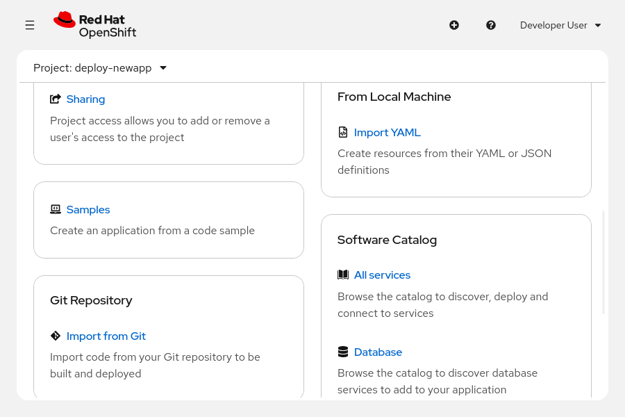

#### Pod
Pod là đơn vị tính toán nhỏ nhất mà bạn có thể định nghĩa, triển khai và quản lý trong RHOCP. Một pod chạy một hoặc nhiều container đại diện cho một ứng dụng duy nhất. Các container trong pod chia sẻ các tài nguyên, chẳng hạn như mạng và lưu trữ.

Ví dụ sau đây minh họa định nghĩa của một pod:

```yaml
apiVersion: v1
kind: Pod 1
metadata: (2)
  annotations: {}
  labels:
    deployment: docker-registry-1
  name: registry
  namespace: pod-registries
spec: (3)
  containers:
  - env:
    - name: OPENSHIFT_CA_DATA
      value:
    image: openshift/origin-docker-registry:v0.6.2
    imagePullPolicy: IfNotPresent
    name: registry
    ports:
    - containerPort: 5000
      protocol: TCP
    resources: {}
    securityContext: {}
    volumeMounts:
    - mountPath: /registry
      name: registry-storage
  dnsPolicy: ClusterFirst
  imagePullSecrets:
  - name: default-dockercfg-at06w
  restartPolicy: Always
  serviceAccount: default
  volumes:
  - emptyDir: {}
    name: registry-storage
status: (4)
  conditions: {}
```

1. Loại tài nguyên được thiết lập là Pod.
2. Thông tin mô tả ứng dụng của bạn, chẳng hạn như tên, dự án, các nhãn (label) và chú thích (annotation) đi kèm.
3. Phần quy định các yêu cầu của ứng dụng, chẳng hạn như tên container, image của container, biến môi trường, mount volume, cấu hình mạng và các volume.
4. Cho biết trạng thái gần nhất của pod, chẳng hạn như thời điểm kiểm tra (probe) gần nhất, thời điểm chuyển đổi trạng thái gần nhất, thiết lập trạng thái (true hoặc false), v.v.

#### Deployments - Triển khai
Deployment mô tả trạng thái mong muốn của một thành phần ứng dụng dưới dạng mẫu pod (pod template). Một Deployment quản lý một hoặc nhiều ReplicaSet.

Ví dụ sau đây cho thấy định nghĩa của một Deployment:

```yaml
apiVersion: apps/v1
kind: Deployment *
metadata:
  name: hello-openshift (2)
spec:
  replicas: 1 (3)
  selector:
    matchLabels:
      app: hello-openshift
  template: (4)
    metadata:
      labels:
        app: hello-openshift
    spec:
      containers:
      - name: hello-openshift (5)
        image: openshift/hello-openshift:latest (6)
        ports: (7)
        - containerPort: 80
```

1. Loại tài nguyên được thiết lập là Deployment.
2. Tên của tài nguyên deployment.
3. Số lượng instance đang chạy.
4. Phần định nghĩa metadata, nhãn (labels) và thông tin container của tài nguyên deployment.
5. Tên của container.
6. Tài nguyên image dùng để tạo tài nguyên deployment.
7. Cấu hình cổng, chẳng hạn như số hiệu cổng, tên cổng và giao thức.

#### Projects - Dự án
RHOCP bổ sung các "project" (dự án) nhằm tăng cường chức năng cho các namespace của Kubernetes. Một project thực chất là một namespace Kubernetes có thêm các chú thích (annotation) và đóng vai trò là phương thức chính để quản lý quyền truy cập tài nguyên cho người dùng thông thường. Các project có thể được tạo từ các mẫu (template) và bắt buộc phải sử dụng cơ chế RBAC để tổ chức cũng như quản lý quyền hạn. Quản trị viên cần cấp quyền truy cập vào một project cho người dùng trong cụm (cluster). Nếu một người dùng được phép tạo project, họ sẽ tự động có quyền truy cập vào các project do chính mình tạo ra.

Các project cung cấp sự cô lập về mặt logic và tổ chức để tách biệt các tài nguyên thành phần ứng dụng của bạn. Tài nguyên trong một project có thể truy cập tài nguyên ở các project khác, nhưng điều này không được thực hiện theo mặc định.

Ví dụ dưới đây minh họa định nghĩa của một project:

```yaml
apiVersion: project.openshift.io/v1
kind: Project (1)
metadata:
  name: test (2)
spec:
  finalizers: (3)
  - kubernetes
```

1. Loại tài nguyên được đặt là Project.
2. Tên của dự án.
3. Finalizer là một khóa siêu dữ liệu (metadata key) đặc biệt, có chức năng yêu cầu Kubernetes chờ cho đến khi một điều kiện cụ thể được đáp ứng mới thực hiện xóa hoàn toàn tài nguyên.

#### Services - Dịch vụ
Bạn có thể cấu hình giao tiếp mạng nội bộ giữa các pod trong RHOCP bằng cách sử dụng service. Các ứng dụng gửi yêu cầu đến tên service và cổng (port) tương ứng. RHOCP cung cấp một mạng ảo hóa giúp định tuyến lại các yêu cầu này đến những pod mà service nhắm đến thông qua việc sử dụng nhãn (label).

Ví dụ sau đây minh họa định nghĩa của một service:

```yaml
apiVersion: v1
kind: Service (1)
metadata:
  name: docker-registry (2)
  namespace: test (3)
spec:
  selector:
    app: MyApp (4)
  ports:
  - protocol: TCP (5)
    port: 80 (6)
    targetPort: 9376 (7)
```

1. Loại tài nguyên được đặt là Service.
2. Tên của service.
3. Tên dự án (project) nơi tài nguyên service tồn tại.
4. Bộ chọn nhãn (label selector) xác định tất cả các pod có gắn nhãn `app=MyApp` và thêm chúng vào danh sách endpoint của service.
5. Giao thức mạng được đặt là TCP.
6. Cổng mà service lắng nghe.
7. Cổng trên các pod phía sau (backing pods) mà service chuyển tiếp kết nối tới.

#### Persistent Volume Claims (PVC) - Yêu cầu Volume Bền vững
RHOCP sử dụng khung Persistent Volume (PV) của Kubernetes để cho phép quản trị viên cụm cấp phát bộ nhớ bền vững cho cụm. Các nhà phát triển có thể sử dụng Persistent Volume Claim (PVC) để yêu cầu tài nguyên PV mà không cần am hiểu chi tiết về cơ sở hạ tầng lưu trữ bên dưới. Sau khi một PV đã được liên kết với một PVC, PV đó không thể liên kết với các PVC khác nữa. Do PVC là các đối tượng thuộc phạm vi namespace (không gian tên) còn PV là các đối tượng có phạm vi toàn cục, nên việc liên kết này thực tế sẽ giới hạn PV đó trong một namespace duy nhất cho đến khi PVC liên kết bị xóa.

Ví dụ sau đây minh họa định nghĩa của một Persistent Volume Claim:

```yaml
apiVersion: v1
kind: PersistentVolumeClaim (1)
metadata:
  name: mysql-pvc (2)
spec:
  accessModes:
    - ReadWriteOnce (3)
  resources:
    requests:
      storage: 1Gi (4)
  storageClassName: nfs-storage (5)
status: {}
```

1. Loại tài nguyên được đặt là PersistentVolumeClaim.
2. Tên của dịch vụ.
3. Chế độ truy cập, dùng để xác định các quyền đọc/ghi và mount.
4. Dung lượng lưu trữ của PVC.
5. Tên của StorageClass mà yêu cầu (claim) này đòi hỏi.

#### Secrets
Secret cung cấp cơ chế lưu trữ các thông tin nhạy cảm, chẳng hạn như mật khẩu, thông tin xác thực kho mã nguồn riêng, tệp cấu hình nhạy cảm và thông tin xác thực để truy cập tài nguyên bên ngoài (ví dụ: khóa SSH hoặc mã thông báo OAuth). Bạn có thể gắn (mount) các secret vào container bằng cách sử dụng plugin volume. Kubernetes cũng có thể sử dụng secret để thực hiện các tác vụ, chẳng hạn như khai báo biến môi trường cho pod. Secret có thể lưu trữ bất kỳ loại dữ liệu nào. Kubernetes và OpenShift hỗ trợ nhiều loại secret khác nhau, như mã thông báo tài khoản dịch vụ (service account token), khóa SSH và chứng chỉ TLS.

Ví dụ sau đây minh họa định nghĩa của một secret:

```yaml
apiVersion: v1
kind: Secret *
metadata:
  name: example-secret (2)
  namespace: my-app (3)
type: Opaque (4)
data: (5)
  username: bXl1c2VyCg==
  password: bXlQQDU1Cg==
stringData: (6)
  hostname: myapp.mydomain.com
  secret.properties: |
    property1=valueA
    property2=valueB
```

1. Loại tài nguyên được đặt là Secret.
2. Tên của dịch vụ.
3. Tên dự án nơi tài nguyên dịch vụ tồn tại.
4. Chỉ định loại secret.
5. Chỉ định chuỗi và dữ liệu đã được mã hóa.
6. Chỉ định chuỗi và dữ liệu đã được giải mã.

### Quản lý tài nguyên từ dòng lệnh
Nhiều lệnh Kubernetes và RHOCP có thể tạo và sửa đổi các tài nguyên cụm. Một số lệnh thuộc về phần cốt lõi của Kubernetes, trong khi những lệnh khác là các phần bổ sung dành riêng cho RHOCP.

Các lệnh quản lý tài nguyên thường được chia thành một trong hai nhóm:

* Lệnh mệnh lệnh (imperative command) chỉ dẫn những gì cụm (cluster) sẽ thực hiện.
* Lệnh khai báo (declarative command) xác định trạng thái mà cụm cố gắng đạt tới.

#### Quản lý tài nguyên theo phương thức mệnh lệnh
Lệnh `create` là phương thức mệnh lệnh để tạo tài nguyên và có sẵn trong cả hai lệnh `oc` và `kubectl`. Ví dụ, lệnh sau đây tạo một deployment có tên là `my-app`, từ đó tạo ra các pod dựa trên image được chỉ định.

```console
[user@host ~]$ oc create deployment my-app --image example.com/my-image:dev
deployment.apps/my-app created
```

Sử dụng lệnh `set` để xác định các thuộc tính cho một tài nguyên, chẳng hạn như các biến môi trường. Ví dụ, lệnh sau đây thêm biến môi trường `TEAM=red` vào deployment đã nêu trước đó.

```console
[user@host ~]$ oc set env deployment/my-app TEAM=red
deployment.apps/my-app updated
```

Một phương pháp thiết yếu khác để tạo tài nguyên là sử dụng lệnh `run`. Trong ví dụ dưới đây, lệnh `run` tạo ra pod có tên là `example-pod`.

```console
[user@host ~]$ oc run example-pod \ (1)
--image=registry.redhat.io/ubi10/httpd-24 \ (2)
--env GREETING='Hello from the awesome container' \ (3)
--port 8080 (4)
pod/example-pod created
```

1. Định nghĩa .metadata.name của pod
2. Image cho container duy nhất trong pod này
3. Biến môi trường cho container duy nhất trong pod này
4. Định nghĩa metadata cho port

Các lệnh mệnh lệnh (imperative commands) là phương thức tạo pod nhanh hơn, vì chúng không yêu cầu phải có định nghĩa đối tượng pod. Việc quản lý phiên bản và thực hiện các thay đổi gia tăng đòi hỏi phải sử dụng các tệp khai báo (declarative manifests).

Thông thường, các nhà phát triển sẽ kiểm thử một deployment bằng cách sử dụng các lệnh mệnh lệnh, sau đó dùng chính các lệnh này để tạo ra định nghĩa đối tượng pod. Hãy sử dụng tùy chọn `--dry-run=client` để tránh việc tạo đối tượng thực tế trong RHOCP. Ngoài ra, hãy sử dụng tùy chọn `-o yaml` hoặc `-o json` để thiết lập định dạng cho tệp định nghĩa.

Lệnh dưới đây là một ví dụ về việc tạo định nghĩa YAML cho pod có tên là `example-pod`:

```console
[user@host ~]$ oc run example-pod \
--image=registry.redhat.io/ubi10/httpd-24 \
--env GREETING='Hello from the awesome container' \
--port 8080 \
--dry-run=client -o yaml
apiVersion: v1
kind: Pod
metadata:
  labels:
    run: example-pod
  name: example-pod
spec:
  containers:
...output omitted...
```

Việc quản lý tài nguyên theo cách này là điều bắt buộc, bởi vì bạn đang chỉ thị cho cụm hệ thống phải thực hiện những hành động cụ thể thay vì chỉ khai báo các kết quả mong muốn.

#### Quản lý tài nguyên theo cơ chế khai báo
Việc sử dụng lệnh `create` không đảm bảo rằng bạn đang tạo tài nguyên theo phương thức mệnh lệnh (imperative). Ví dụ, việc cung cấp một tệp manifest theo phương thức khai báo (declarative) sẽ tạo ra các tài nguyên được định nghĩa trong tệp YAML đó, chẳng hạn như trong lệnh dưới đây.

```console
[user@host ~]$ oc create -f my-app-deployment.yaml
deployment.apps/my-app created
```

RHOCP bổ sung lệnh `new-app`, cung cấp thêm một phương thức khai báo để tạo tài nguyên. Lệnh này sử dụng các quy tắc phỏng đoán để tự động xác định loại tài nguyên cần tạo dựa trên các tham số được chỉ định. Ví dụ, lệnh sau đây triển khai ứng dụng `my-app` bằng cách tạo một số tài nguyên—bao gồm cả tài nguyên deployment—từ tệp định nghĩa YAML:

```console
[user@host ~]$ oc new-app --file=./example/my-app.yaml
...output omitted...
--> Creating resources ...
    imagestream.image.openshift.io "my-app" created
    deployment.apps "my-app" created
    services "my-app" created
...output omitted...
```

Trong cả hai ví dụ về `create` và `new-app` nêu trên, bạn đều đang khai báo trạng thái mong muốn của các tài nguyên; do đó, chúng mang tính khai báo (declarative).

Bạn cũng có thể sử dụng lệnh `new-app` kết hợp với các mẫu (template) để quản lý tài nguyên. Một mẫu sẽ mô tả trạng thái mong muốn của các tài nguyên cần thiết để ứng dụng vận hành, chẳng hạn như các deployment và service. Việc cung cấp mẫu cho lệnh `new-app` chính là một hình thức quản lý tài nguyên theo phương thức khai báo.

Lệnh `new-app` cũng bao gồm các tùy chọn—ví dụ như tùy chọn `--param`—giúp tùy chỉnh việc triển khai ứng dụng theo phương thức khai báo. Chẳng hạn, khi sử dụng `new-app` với một mẫu, bạn có thể dùng tùy chọn `--param` để ghi đè lên giá trị tham số có trong mẫu đó.

```console
[user@host ~]$ oc new-app --template mysql-persistent \
--param MYSQL_USER=operator --param MYSQL_PASSWORD=myP@55 \
--param MYSQL_DATABASE=mydata \
--param DATABASE_SERVICE_NAME=db
--> Deploying template "db-app/mysql-persistent" to project db-app
...output omitted...
     The following service(s) have been created in your project: db.

            Username: operator
            Password: myP@55
       Database Name: mydata
      Connection URL: mysql://db:3306/
...output omitted...
     * With parameters:
        * Memory Limit=512Mi
        * Namespace=openshift
        * Database Service Name=db
        * MySQL Connection Username=operator
        * MySQL Connection Password=myP@55
        * MySQL root user Password=tlH8BThuVgnIrCon # generated
        * MySQL Database Name=mydata
        * Volume Capacity=1Gi
        * Version of MySQL Image=8.0-el8

--> Creating resources ...
    secret "db" created
    service "db" created
    persistentvolumeclaim "db" created
--> Success
...output omitted...
```

Tương tự như lệnh `create`, bạn có thể sử dụng lệnh `new-app` theo phương thức mệnh lệnh (imperative). Khi sử dụng image container với lệnh `new-app`, bạn đang chỉ thị cho cụm (cluster) thực hiện các hành động cụ thể, thay vì khai báo trạng thái mong muốn. Ví dụ, lệnh dưới đây triển khai image `example.com/my-app:dev` bằng cách tạo ra một số tài nguyên, bao gồm cả tài nguyên deployment:

```console
[user@host ~]$ oc new-app --image example.com/my-app:dev
...output omitted...
--> Creating resources ...
    imagestream.image.openshift.io "my-app" created
    deployment.apps "my-app" created
...output omitted...
```

Bạn cũng có thể cung cấp một kho lưu trữ Git cho lệnh `new-app`. Lệnh sau đây tạo một ứng dụng có tên là `httpd24` bằng cách sử dụng kho lưu trữ Git:

```console
[user@host ~]$ oc new-app https://github.com/apache/httpd.git#2.4.56 --name httpd24
...output omitted...
--> Creating resources ...
    imagestream.image.openshift.io "httpd24" created
    deployment.apps "httpd24" created
...output omitted...
```

### Truy xuất thông tin tài nguyên
Bạn có thể sử dụng tham số `all` cho các lệnh để chỉ định một danh sách các loại tài nguyên phổ biến. Tuy nhiên, tùy chọn `all` không bao gồm tất cả các loại tài nguyên; thay vào đó, `all` là dạng viết tắt cho một tập hợp con các loại tài nguyên đã được định nghĩa trước. Khi sử dụng tham số `all`, hãy đảm bảo rằng các loại đối tượng mà bạn muốn thao tác đều nằm trong kết quả hiển thị của tham số này. Để xem những tài nguyên nào được hiển thị khi dùng tham số `all`, hãy chạy lệnh sau: `oc api-resources --categories=all`.

Bạn có thể xem thông tin chi tiết về một tài nguyên, chẳng hạn như các tham số đã được định nghĩa, bằng cách sử dụng lệnh `describe`. Ví dụ: RHOCP cung cấp các mẫu (template) trong dự án `openshift` để sử dụng với lệnh `oc new-app`. Lệnh ví dụ dưới đây hiển thị thông tin chi tiết về mẫu `mysql-ephemeral`:

```console
[user@host ~]$ oc describe template mysql-ephemeral -n openshift
Name:       mysql-ephemeral
Namespace:  openshift
...output omitted...
Parameters:
    Name:       MEMORY_LIMIT
    Display Name:   Memory Limit
    Description:    Maximum amount of memory the container can use.
    Required:       true
    Value:      512Mi

    Name:       NAMESPACE
    Display Name:   Namespace
    Description:    The OpenShift Namespace where the ImageStream resides.
    Required:       false
    Value:      openshift
...output omitted...
Objects:
    Secret                                      ${DATABASE_SERVICE_NAME}
    Service                                     ${DATABASE_SERVICE_NAME}
```

> **Lưu ý:** Mẫu trước đó được sử dụng cho mục đích hướng dẫn và có thể không tồn tại trong môi trường lớp học của bạn. Để hiển thị các mẫu có sẵn trong môi trường của bạn, hãy sử dụng lệnh `oc get templates -n openshift`.

Lệnh `oc describe` không thể tạo ra đầu ra có cấu trúc, chẳng hạn như định dạng YAML hoặc JSON. Định dạng có cấu trúc là yêu cầu bắt buộc để có thể phân tích hoặc lọc đầu ra của lệnh `oc describe` bằng các công cụ như JSONPath hoặc Go templates. Thay vào đó, hãy sử dụng lệnh `oc get` để tạo và phân tích đầu ra có cấu trúc của tài nguyên.

## Quản lý các ứng dụng có vòng đời dài và ngắn bằng cách sử dụng Kubernetes Workload API.
### Các tài nguyên workload trong Kubernetes
Kubernetes Workloads API bao gồm các tài nguyên đại diện cho nhiều loại tác vụ, công việc (job) và khối lượng công việc (workload) trong cụm. Workloads API được tạo thành từ các API và phần mở rộng Kubernetes khác nhau nhằm đơn giản hóa việc triển khai và quản lý ứng dụng. Dưới đây là các loại tài nguyên Workload API thường được sử dụng nhất:

* Jobs
* CronJobs
* Deployments
* DaemonSets
* StatefulSets

#### Jobs
Tài nguyên Job đại diện cho một tác vụ chạy một lần trên cụm (cluster). Giống như hầu hết các tác vụ trên cụm, các Job được thực thi thông qua các pod. Nếu pod của Job gặp lỗi, cụm sẽ thực hiện thử lại theo số lần được chỉ định trong cấu hình Job. Job sẽ không chạy lại sau khi đã hoàn tất thành công số lần quy định.

Job khác biệt so với việc sử dụng lệnh `oc run` (lệnh chỉ tạo ra một pod đơn lẻ). Pod được tạo bởi lệnh `oc run` không được quản lý bởi một bộ điều khiển (controller) cấp cao hơn. Nếu node đang chạy pod đó gặp sự cố, pod sẽ không được lên lịch chạy lại. Pod cũng không tự động khởi động lại nếu tiến trình bên trong nó kết thúc với mã lỗi.

Các trường hợp sử dụng phổ biến cho Job bao gồm những tác vụ sau:

* Khởi tạo hoặc di chuyển cơ sở dữ liệu
* Tính toán các chỉ số dùng một lần từ thông tin trong cụm (cluster)
* Tạo bản sao lưu dữ liệu hoặc khôi phục từ bản sao lưu

Ví dụ lệnh sau đây tạo một tác vụ ghi lại ngày và giờ:

```console
[user@host ~]$ oc create job \ (1)
date-job \ (2)
--image registry.access.redhat.com/ubi9/ubi \ (3)
-- /bin/bash -c "date" (4)
```

1. Tạo một tài nguyên job.
2. Chỉ định tên job là date-job.
3. Thiết lập registry.access.redhat.com/ubi9/ubi làm image container cho các pod của job.
4. Chỉ định lệnh sẽ chạy bên trong các pod.

Bạn cũng có thể tạo một Job từ bảng điều khiển web bằng cách truy cập vào **Workloads → Jobs**. Hãy nhấp vào **Create Job** và tùy chỉnh tệp YAML manifest.

#### Cron Jobs
Tài nguyên CronJob được phát triển dựa trên tài nguyên Job thông thường, cho phép bạn chỉ định tần suất thực thi tác vụ. CronJob rất hữu ích để thiết lập các tác vụ định kỳ, chẳng hạn như sao lưu dữ liệu hoặc tạo báo cáo. CronJob cũng có thể lên lịch cho các tác vụ riêng lẻ vào một thời điểm cụ thể, ví dụ như lên lịch chạy tác vụ vào khoảng thời gian có lưu lượng hoạt động thấp. Tương tự như tệp crontab trên hệ thống Linux, tài nguyên CronJob sử dụng định dạng Cron để lên lịch thực thi. Tài nguyên CronJob sẽ tạo ra một tài nguyên Job dựa trên múi giờ được cấu hình tại node control plane – nơi vận hành bộ điều khiển CronJob (cron job controller).

Kể từ phiên bản OpenShift Container Platform 4.22, bạn có thể chỉ định múi giờ cho lịch trình CronJob để đảm bảo tính nhất quán về thời gian, bất kể vị trí địa lý của node.

Ví dụ lệnh dưới đây tạo một CronJob có tên là `date`, thực hiện in ngày và giờ hệ thống mỗi phút một lần:

```console
[user@host ~]$ oc create cronjob date-cronjob \ (1)
--image registry.access.redhat.com/ubi9/ubi \ (2)
--schedule "*/1 * * * *" \ (3)
-- date (4)
```

1. Tạo một tài nguyên cron job có tên là `date-cronjob`.
2. Thiết lập `registry.access.redhat.com/ubi9/ubi` làm image container cho các pod của job.
3. Chỉ định lịch trình thực thi job theo định dạng Cron.
4. Lệnh cần thực thi bên trong các pod.

Bạn cũng có thể tạo cronjob từ giao diện web bằng cách truy cập vào mục **Workloads → CronJobs**. Hãy nhấp vào **Create CronJob** và tùy chỉnh tệp cấu hình YAML.

#### Deployments
Deployment tạo ra một ReplicaSet để duy trì các pod. ReplicaSet có nhiệm vụ duy trì một số lượng bản sao (replica) nhất định của một pod. ReplicaSet sử dụng các bộ chọn (selector)—chẳng hạn như nhãn (label)—để xác định những pod thuộc về tập hợp đó. Các pod sẽ được tạo mới hoặc loại bỏ cho đến khi số lượng bản sao đạt mức mà Deployment đã quy định. ReplicaSet không được quản lý trực tiếp; thay vào đó, Deployment quản lý ReplicaSet một cách gián tiếp.

Khác với Job, các pod của Deployment sẽ được tạo lại sau khi bị lỗi (crash) hoặc bị xóa, bởi vì Deployment sử dụng ReplicaSet.

> **Cảnh báo:** Trước đây, OpenShift cung cấp các đối tượng DeploymentConfig như một phần mở rộng cho các deployment, mang lại những tính năng bổ sung như kích hoạt tự động cho quá trình build và thay đổi image. Kể từ phiên bản OpenShift Container Platform 4.14, các đối tượng DeploymentConfig đã bị coi là lỗi thời (deprecated); do đó, các workload mới nên sử dụng đối tượng Deployment tiêu chuẩn của Kubernetes để đảm bảo tính tương thích tốt hơn với Kubernetes gốc (upstream) cũng như khả năng tương thích trong tương lai.

Ví dụ lệnh sau đây tạo một deployment:

```console
[user@host ~]$ oc create deployment \ (1)
my-deployment \ (2)
--image registry.access.redhat.com/ubi9/ubi \ (3)
--replicas 3 (4)
```

1. Tạo một tài nguyên deployment.
2. Chỉ định `my-deployment` làm tên của deployment.
3. Thiết lập `registry.access.redhat.com/ubi9/ubi` làm image container cho các pod.
4. Cấu hình deployment để duy trì ba bản sao (instance) của pod.

Bạn cũng có thể tạo một deployment từ bảng điều khiển web bằng cách truy cập vào **Workloads → Deployments**.

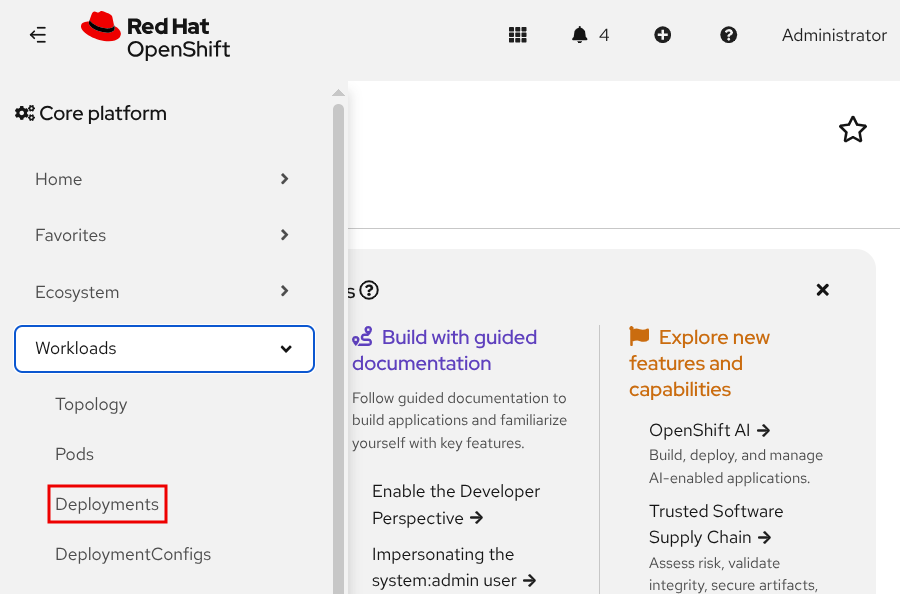

Nhấp vào **Create Deployment** và tùy chỉnh biểu mẫu hoặc tệp manifest YAML.

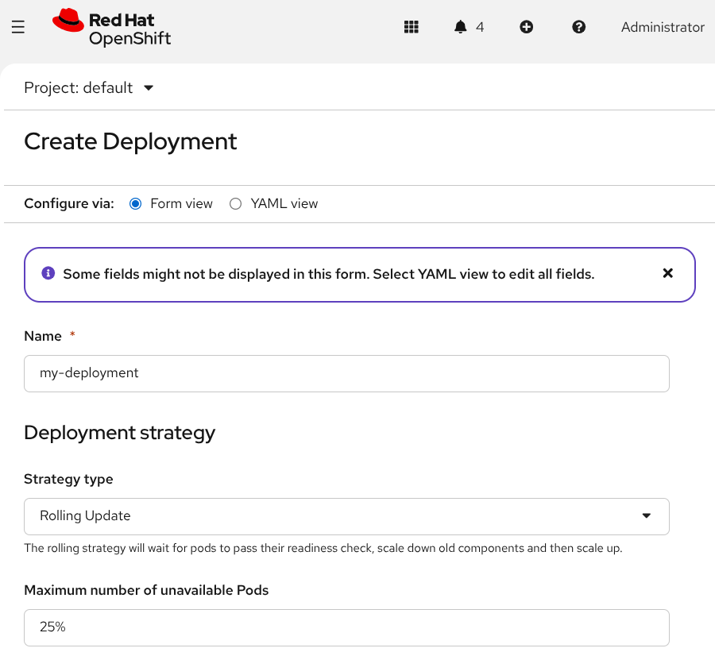

Các pod trong một replica set là giống hệt nhau và tuân theo mẫu pod (pod template) được định nghĩa trong replica set đó. Nếu số lượng bản sao (replica) không đạt mức yêu cầu, một pod mới sẽ được tạo ra dựa trên mẫu này. Ví dụ, nếu một pod bị lỗi hoặc bị xóa, một pod mới sẽ được tạo ra để thay thế nó.

Label (nhãn) là một loại siêu dữ liệu (metadata) của tài nguyên, được thể hiện dưới dạng các cặp khóa-giá trị (key-value) kiểu chuỗi. Một label biểu thị đặc điểm chung của các tài nguyên mang nhãn đó. Ví dụ, bạn có thể gắn nhãn `layer=frontend` cho các tài nguyên liên quan đến các thành phần giao diện người dùng (UI) của ứng dụng.

Nhiều lệnh `oc` cho phép sử dụng label để lọc các tài nguyên chịu tác động. Ví dụ, lệnh sau đây sẽ xóa tất cả các pod có nhãn `environment=testing`:

```console
[user@host ~]$ oc delete pod -l environment=testing
```

Bằng cách gắn nhãn một cách linh hoạt cho các tài nguyên, bạn có thể đối chiếu chéo giữa chúng và tạo ra các bộ chọn (selector) chính xác. Bộ chọn là một đối tượng truy vấn mô tả các thuộc tính của những tài nguyên phù hợp.

Một số loại tài nguyên sử dụng bộ chọn để tìm kiếm các tài nguyên khác. Trong đoạn mã YAML dưới đây, một ReplicaSet mẫu sử dụng bộ chọn để xác định các pod tương ứng của nó.

```yaml
apiVersion: apps/v1
kind: ReplicaSet
...output omitted...
spec:
  replicas: 1
  selector:
    matchLabels:
      app: httpd
      pod-template-hash: 7c84fbdb57
...output omitted...
```

#### Daemonsets
DaemonSet đảm bảo rằng tất cả hoặc một số node đều chạy một bản sao của pod. Khi các node được thêm vào cụm (cluster), các pod cũng sẽ được triển khai trên những node đó. Khi node bị loại bỏ khỏi cụm, các pod tương ứng sẽ bị xóa bỏ (thu gom). Hãy xóa DaemonSet để dọn dẹp các pod mà nó đã tạo ra.

Các trường hợp sử dụng phổ biến của DaemonSet bao gồm chạy các daemon lưu trữ, trình thu thập nhật liệu (log collector) hoặc tác nhân giám sát (monitoring agent) trên mọi node.

Bạn có thể tạo DaemonSet từ giao diện web bằng cách truy cập mục **Workloads** → **DaemonSets**. Hãy nhấp vào **Create DaemonSet** và tùy chỉnh tệp cấu hình YAML.

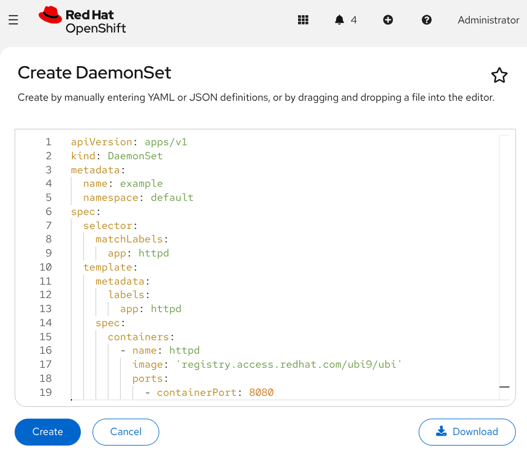

Ngoài ra, bạn có thể tạo DaemonSet từ CLI bằng cách sử dụng lệnh `oc create` và chỉ định tệp manifest YAML chứa định nghĩa DaemonSet.

```console
[user@host ~]$ oc create -f daemonset.yaml
daemonset.apps/example created
```

#### Stateful Sets
Tương tự như Deployment, StatefulSet quản lý một tập hợp các pod dựa trên một cấu hình container. Tuy nhiên, mỗi pod do StatefulSet tạo ra đều là duy nhất. Tính duy nhất của pod rất hữu ích trong các trường hợp như khi pod cần một định danh mạng riêng biệt hoặc bộ nhớ bền vững (persistent storage).

Đúng như tên gọi, StatefulSet dành cho các pod cần duy trì trạng thái (state) trong cụm (cluster), trong khi Deployment được sử dụng cho các pod không lưu giữ trạng thái (stateless).

Ngoài ra, bạn có thể tạo StatefulSet thông qua giao diện web bằng cách truy cập mục **Workloads** → **StatefulSets** và nhấp vào **Create StatefulSet**. StatefulSet sẽ được đề cập chi tiết hơn trong một chương sau.

## Mạng Pod và Service trong Kubernetes
### Mạng định nghĩa bằng phần mềm
OpenShift Container Platform triển khai mạng định nghĩa bằng phần mềm (SDN) thông qua plugin mạng OVN-Kubernetes – nhà cung cấp mạng mặc định của nền tảng này. OVN-Kubernetes là một plugin CNI (Container Network Interface) mã nguồn mở, đầy đủ tính năng dành cho Kubernetes; nó sử dụng Open Virtual Network (OVN) – một giải pháp ảo hóa mạng độc lập với nhà cung cấp và được phát triển bởi cộng đồng – để quản lý cơ sở hạ tầng mạng của cụm (cluster).

OVN-Kubernetes tạo ra một mạng ảo bao trùm tất cả các nút (node) trong cụm. Mạng ảo này cho phép giao tiếp giữa bất kỳ container hoặc pod nào bên trong cụm. Các tiến trình trên nút cụm do pod Kubernetes quản lý có thể truy cập vào mạng OVN-Kubernetes. Tuy nhiên, mạng OVN-Kubernetes không thể bị truy cập từ bên ngoài cụm hoặc bởi các tiến trình thông thường trên các nút của cụm.

Với mô hình OVN-Kubernetes, bạn có thể quản lý các dịch vụ mạng thông qua sự trừu tượng hóa của nhiều lớp mạng. OVN-Kubernetes cho phép quản lý lưu lượng và tài nguyên mạng theo hướng lập trình, giúp các nhóm trong tổ chức chủ động quyết định cách thức công khai (expose) ứng dụng của họ.

Việc triển khai OVN-Kubernetes tạo ra một mô hình tương thích với các phương thức mạng truyền thống. Mô hình này giúp các pod hoạt động tương tự như máy ảo (VM) xét về các khía cạnh như cấp phát cổng (port), cũng như cấp và đặt trước địa chỉ IP.

Thiết kế của OVN-Kubernetes giúp bạn không cần phải thay đổi cách thức giao tiếp giữa các thành phần ứng dụng. Thiết kế này hỗ trợ quá trình chuyển đổi các ứng dụng cũ (legacy applications) sang dạng container. Nếu ứng dụng của bạn bao gồm nhiều dịch vụ giao tiếp qua giao thức TCP/UDP, phương pháp này vẫn rất hiệu quả vì các container trong cùng một pod sẽ sử dụng chung một ngăn xếp mạng (network stack).

Sơ đồ dưới đây minh họa cách tất cả các pod kết nối với một mạng dùng chung:

**Hình 4.5: Cách OVN-Kubernetes quản lý mạng**  
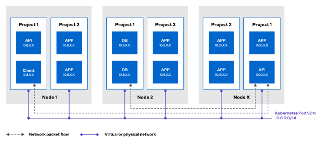

Trong số các tính năng của OVN-Kubernetes, các tiêu chuẩn mở cho phép các nhà cung cấp đề xuất giải pháp cho việc quản lý tập trung, định tuyến động và cô lập người thuê.

### Mạng Kubernetes
Hệ thống mạng trong Kubernetes cung cấp phương thức có khả năng mở rộng để các container giao tiếp với nhau, đồng thời mang lại các khả năng sau:

* Giao tiếp chặt chẽ giữa các container
* Giao tiếp giữa các Pod
* Giao tiếp giữa Pod và Service
* Giao tiếp từ bên ngoài đến Service: Được đề cập trong phần "Mở rộng quy mô và công khai ứng dụng để truy cập từ bên ngoài", bao gồm OpenShift routes, Kubernetes Ingress và Kubernetes Gateway API.

Kubernetes tự động gán một địa chỉ IP cho mỗi pod. Tuy nhiên, địa chỉ IP của pod không cố định do bản chất tạm thời của chúng; các pod liên tục được tạo mới và xóa bỏ trên các node trong cụm (cluster). Ví dụ, khi triển khai phiên bản ứng dụng mới, Kubernetes sẽ xóa các pod hiện tại và triển khai các pod mới thay thế.

Tất cả các container trong cùng một pod đều chia sẻ tài nguyên mạng. Địa chỉ IP và địa chỉ MAC được gán cho pod sẽ được dùng chung bởi mọi container bên trong pod đó. Do đó, các container trong pod có thể truy cập cổng (port) của nhau thông qua địa chỉ loopback (localhost). Các cổng được gắn với localhost sẽ khả dụng cho tất cả các container đang chạy trong pod nhưng không thể truy cập được từ các container bên ngoài pod.

Theo mặc định, các pod có thể giao tiếp với nhau ngay cả khi chúng chạy trên các node khác nhau trong cụm hoặc thuộc các namespace Kubernetes khác nhau. Mỗi pod được gán một địa chỉ IP trong một không gian mạng chia sẻ phẳng (flat shared networking namespace), cho phép giao tiếp toàn diện với các máy tính vật lý và container khác trên mạng. Tất cả các pod đều nhận được một địa chỉ IP duy nhất từ dải địa chỉ host theo chuẩn CIDR (Classless Inter-Domain Routing). Dải địa chỉ dùng chung này đặt tất cả các pod vào cùng một subnet.

Vì tất cả các pod đều nằm trong cùng một subnet, pod trên node này có thể giao tiếp với pod trên bất kỳ node nào khác mà không cần đến cơ chế NAT (Network Address Translation). Kubernetes cũng cung cấp một subnet dành cho service, giúp liên kết địa chỉ IP cố định của tài nguyên service với một tập hợp các pod cụ thể. Lưu lượng truy cập được chuyển tiếp đến các pod một cách trong suốt; một tác nhân (agent) do OVN-Kubernetes quản lý sẽ xử lý các quy tắc định tuyến để điều hướng lưu lượng đến những pod khớp với các bộ chọn (selector) của tài nguyên service. Nhờ đó, các pod hoạt động tương tự như máy ảo hoặc máy chủ vật lý xét về các khía cạnh: cấp phát cổng, kết nối mạng, đặt tên, khám phá dịch vụ (service discovery), cân bằng tải, cấu hình ứng dụng và di chuyển.

Hình minh họa dưới đây cung cấp cái nhìn chi tiết hơn về cách các thành phần cơ sở hạ tầng phối hợp với subnet của pod và service để cho phép kết nối mạng giữa các pod trong một instance OpenShift.

**Hình 4.6: Truy cập mạng giữa các pod trong một cụm**  
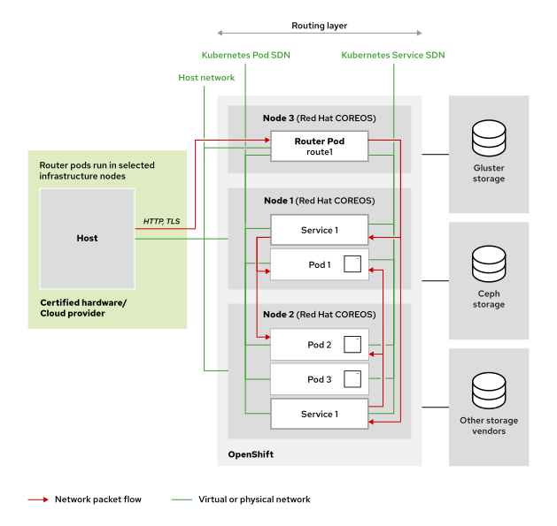

Việc chia sẻ không gian tên mạng (network namespace) giữa các pod tạo điều kiện cho một mô hình giao tiếp đơn giản. Tuy nhiên, tính chất linh hoạt của các pod lại đặt ra một vấn đề. Các pod có thể được thêm vào ngay lập tức để xử lý lưu lượng truy cập gia tăng; tương tự, quy mô số lượng pod cũng có thể được điều chỉnh giảm một cách linh hoạt. Nếu một pod gặp sự cố, Kubernetes sẽ tự động thay thế nó bằng một pod mới. Những sự kiện này làm thay đổi địa chỉ IP của pod.

**Hình 4.7: Vấn đề khi truy cập trực tiếp vào các pod**  
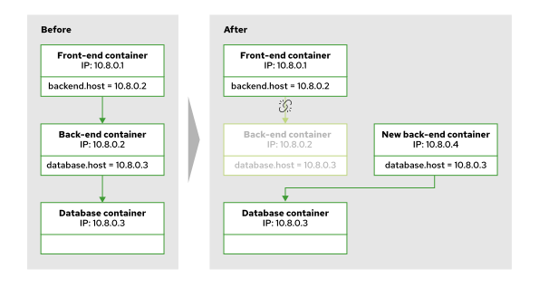

Trong sơ đồ, phần "Trước" (Before) hiển thị một container Front-end đang chạy trong một pod có địa chỉ IP là 10.8.0.1, cùng với một container Back-end đang chạy trong một pod có địa chỉ IP là 10.8.0.2. Trong ví dụ này, một sự cố xảy ra khiến container Back-end bị lỗi (một pod có thể gặp lỗi vì nhiều lý do). Để xử lý lỗi này, Kubernetes tạo ra một pod mới cho container Back-end với địa chỉ IP mới là 10.8.0.4.

Ở phần "Sau" (After) của sơ đồ, container Front-end hiện có một tham chiếu không còn hợp lệ tới container Back-end do sự thay đổi địa chỉ IP. Kubernetes giải quyết vấn đề này bằng cách sử dụng các tài nguyên Service.

#### Sử dụng dịch vụ
Các container bên trong các pod Kubernetes không được phép kết nối trực tiếp với địa chỉ IP động của nhau. Thay vào đó, Kubernetes gán một địa chỉ IP cố định cho tài nguyên Service được liên kết với một nhóm các pod cụ thể. Service đóng vai trò như một bộ cân bằng tải mạng ảo cho các pod được liên kết với nó.

Khi các pod bị khởi động lại, sao chép hoặc chuyển sang các node khác, các điểm cuối (endpoint) của Service sẽ được cập nhật. Các điểm cuối đã cập nhật này mang lại khả năng mở rộng và khả năng chịu lỗi cho ứng dụng của bạn. Khác với địa chỉ IP của pod, địa chỉ IP của Service không thay đổi. Sự ổn định về địa chỉ IP của Service giúp đảm bảo khả năng mở rộng và khả năng chịu lỗi cho ứng dụng.

**Hình 4.8: Các Service giải quyết vấn đề lỗi pod**  
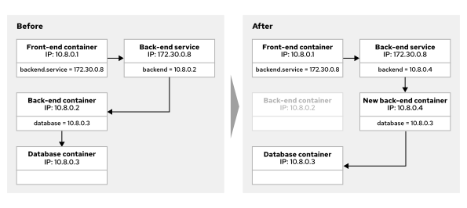

Trong sơ đồ, phần "Trước" (Before) cho thấy container Front-end tham chiếu đến địa chỉ IP cố định của dịch vụ Back-end, thay vì tham chiếu trực tiếp đến địa chỉ IP của pod đang chạy container Back-end đó. Khi container Back-end gặp sự cố, Kubernetes sẽ tạo một pod mới chứa container Back-end thay thế cho pod bị lỗi. Để phản hồi lại sự thay đổi này, Kubernetes loại bỏ pod bị lỗi khỏi danh sách các điểm cuối (endpoints) của dịch vụ, sau đó thêm địa chỉ IP của pod chứa container Back-end mới vào danh sách này.

Nhờ có dịch vụ (service), các yêu cầu từ container Front-end gửi đến container Back-end vẫn tiếp tục hoạt động bình thường. Dịch vụ sẽ tự động cập nhật khi địa chỉ IP thay đổi. Một dịch vụ cung cấp địa chỉ IP tĩnh, cố định cho một nhóm các pod thuộc cùng một deployment hoặc replica set của ứng dụng. Địa chỉ IP được gán sẽ không thay đổi và không bị cụm (cluster) tái sử dụng cho đến khi bạn xóa dịch vụ đó.

Trong thực tế, hầu hết các ứng dụng không chỉ chạy dưới dạng một pod duy nhất mà cần khả năng mở rộng theo chiều ngang (scale horizontally). Nhiều pod sẽ cùng chạy các container giống nhau để đáp ứng nhu cầu ngày càng tăng của người dùng. Tài nguyên Deployment sẽ quản lý nhiều pod cùng thực thi một loại container, trong khi dịch vụ cung cấp một địa chỉ IP duy nhất cho toàn bộ nhóm pod này. Dịch vụ cũng thực hiện cân bằng tải cho các yêu cầu từ máy khách (client) giữa các pod thành viên.

Thông qua dịch vụ, các container trong một pod có thể thiết lập kết nối mạng với các container trong pod khác. Các pod được dịch vụ quản lý không nhất thiết phải nằm trên cùng một nút tính toán (compute node), cùng namespace hay cùng dự án. Vì dịch vụ cung cấp địa chỉ IP cố định để các pod khác sử dụng, nên một pod không cần phải tìm kiếm lại địa chỉ IP mới của pod khác sau khi khởi động lại. Dịch vụ luôn cung cấp một địa chỉ IP ổn định, bất kể pod được chạy trên nút tính toán nào sau mỗi lần khởi động lại.

Đối tượng Service cung cấp địa chỉ IP cố định cho container Client trên Node X. Địa chỉ IP cố định này cho phép container Client gửi yêu cầu đến bất kỳ container API nào.

Kubernetes sử dụng các nhãn (label) trên pod để chọn ra những pod có liên kết với một dịch vụ cụ thể. Để một pod được đưa vào dịch vụ, các nhãn của pod đó phải bao gồm đầy đủ các trường bộ chọn (selector fields) mà dịch vụ yêu cầu.

**Hình 4.9: Bộ chọn dịch vụ khớp với các nhãn pod**  
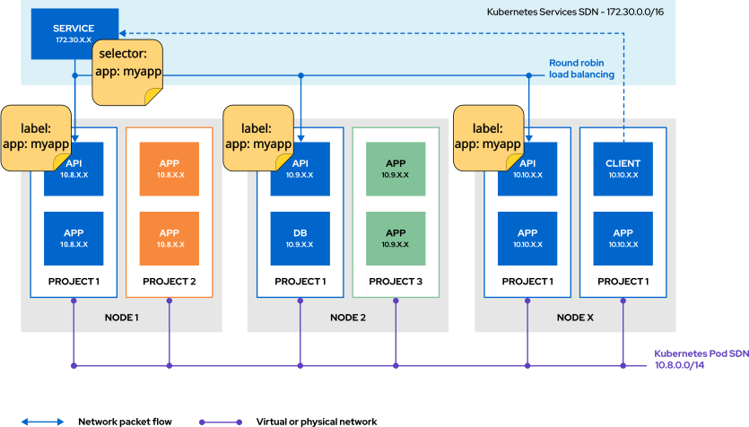

Trong ví dụ này, bộ chọn (selector) có cặp khóa-giá trị là `app: myapp`. Do đó, các pod có nhãn khớp với `app: myapp` sẽ được đưa vào tập hợp liên kết với service. Các pod không có nhãn khớp—chẳng hạn như pod DB trong sơ đồ—sẽ không được chọn và không nhận lưu lượng truy cập từ service. Thuộc tính selector của một service xác định tập hợp các pod đóng vai trò là điểm cuối (endpoint) cho service đó. Mỗi pod trong tập hợp này đều là một điểm cuối của service.

Để tạo service cho một deployment, hãy sử dụng lệnh `oc expose`:

```console
[user@host ~]$ oc expose deployment/<deployment-name> [--selector <selector>]
[--port <port>][--target-port <target port>][--protocol <protocol>][--name <name>]
```

Lệnh `oc expose` sử dụng tùy chọn `--selector` để chỉ định các bộ chọn nhãn (label selector). Nếu bạn bỏ qua tùy chọn `--selector`, lệnh này sẽ áp dụng một bộ chọn khớp với replication controller hoặc replica set.

Tùy chọn `--port` xác định cổng mà service sẽ lắng nghe. Cổng này chỉ khả dụng đối với các pod nằm trong cụm (cluster). Nếu không cung cấp giá trị cổng, cổng này sẽ được lấy từ cấu hình của deployment.

Tùy chọn `--target-port` xác định tên hoặc số hiệu cổng của container mà service sử dụng để giao tiếp với các pod. Nếu bạn không cung cấp giá trị cổng, cổng này sẽ được lấy từ cấu hình của deployment.

Tùy chọn `--protocol` xác định giao thức mạng cho service. Mặc định sẽ sử dụng giao thức TCP.

Tùy chọn `--name` dùng để đặt tên cụ thể cho service. Nếu bạn không chỉ định tên, service sẽ sử dụng cùng tên với deployment.

Để xem bộ chọn mà service đang sử dụng, hãy dùng tùy chọn `-o wide` cùng với lệnh `oc get`.

```console
[user@host ~]$ oc get service db-pod -o wide
NAME    TYPE        CLUSTER-IP      EXTERNAL-IP PORT(S)     AGE     SELECTOR
db-pod  ClusterIP   172.30.108.92   <none>      3306/TCP    108s    app=db-pod
```

Trong ví dụ này, db-pod là tên của service. Các pod phải sử dụng nhãn `app=db-pod` để được đưa vào danh sách host của service db-pod. Để xem các endpoint mà một service sử dụng, hãy dùng lệnh `oc get endpointslices`.

```console
[user@host ~]$ oc get endpointslices
NAME          ADDRESSTYPE   PORTS   ENDPOINTS              AGE
db-pod-abc1   IPv4          3306    10.8.0.86,10.8.0.88    27s
```

Ví dụ này minh họa một service có hai pod trong danh sách endpoint. Lệnh `oc get endpointslices` trả về các endpoint của service trong dự án hiện đang được chọn. Hãy sử dụng bộ chọn nhãn `-l kubernetes.io/service-name=<service-name>` để chỉ hiển thị các endpoint của một service cụ thể. Sử dụng tùy chọn `--namespace` để xem các endpoint trong một namespace khác.

Sử dụng lệnh `oc describe deployment <deployment name>` để xem bộ chọn (selector) của deployment.

```console
[user@host ~]$ oc describe deployment db-pod
Name:                   db-pod
Namespace:              deploy-services
CreationTimestamp:      Tue, 15 Jul 2026 17:46:03 -0500
Labels:                 app=db-pod
Annotations:            deployment.kubernetes.io/revision: 2
Selector:               app=db-pod
...output omitted...
```

Bạn có thể xem hoặc phân tích selector từ đầu ra YAML hoặc JSON của tài nguyên deployment thông qua đối tượng `spec.selector.matchLabels`. Trong ví dụ này, tùy chọn `-o yaml` của lệnh `oc get` trả về nhãn selector mà deployment sử dụng.

```console
[user@host ~]$ oc get deployment/<deployment_name> -o yaml
...output omitted...
  selector:
    matchLabels:
      app: db-pod
...output omitted...
```

### Kubernetes DNS để khám phá dịch vụ
Kubernetes sử dụng một máy chủ Hệ thống Tên miền (DNS) nội bộ do DNS operator triển khai. DNS operator tạo ra một tên DNS mặc định cho cụm (cluster) và gán tên DNS cho các dịch vụ (service) mà bạn định nghĩa. DNS operator triển khai DNS API thuộc nhóm API `operator.openshift.io`. Operator này thực hiện triển khai CoreDNS, tạo tài nguyên service cho CoreDNS, đồng thời cấu hình thành phần kubelet để chỉ định các pod sử dụng địa chỉ IP của dịch vụ CoreDNS cho việc phân giải tên. Khi một dịch vụ không có địa chỉ IP cụm (cluster IP), DNS operator sẽ gán một bản ghi DNS phân giải thành tập hợp các địa chỉ IP của các pod nằm phía sau dịch vụ đó.

Máy chủ DNS thực hiện việc phát hiện dịch vụ từ một pod thông qua máy chủ DNS nội bộ—thành phần chỉ hiển thị đối với các pod. Mỗi dịch vụ được gán động một Tên miền Đầy đủ (FQDN) theo định dạng sau:

```
SVC-NAME.PROJECT-NAME.svc.CLUSTER-DOMAIN
```

Khi một pod được tạo, Kubernetes cung cấp cho container một tệp /etc/resolv.conf có nội dung tương tự như các mục sau:

```console
[user@host ~]$ cat /etc/resolv.conf
nameserver 172.30.0.10
search deploy-services.svc.cluster.local svc.cluster.local cluster.local
options ndots:5
```

Trong ví dụ này, `deploy-services` là tên dự án của pod, còn `cluster.local` là tên miền của cụm (cluster domain).

Chỉ thị `nameserver` cung cấp địa chỉ IP của máy chủ DNS nội bộ trong Kubernetes. Chỉ thị `options ndots` quy định số lượng dấu chấm cần thiết trong một tên để nó được coi là một truy vấn tuyệt đối ngay từ đầu. Các giá trị tên máy chủ (hostname) thay thế được tạo ra bằng cách nối thêm các giá trị từ chỉ thị `search` vào tên mà bạn gửi tới máy chủ DNS.

Đối với chỉ thị `search` trong ví dụ này, mục `svc.cluster.local` cho phép bất kỳ pod nào cũng có thể giao tiếp với một pod khác trong cùng cụm bằng cách sử dụng tên dịch vụ (service name) và tên dự án:

```
SVC-NAME.PROJECT-NAME
```

Mục đầu tiên trong chỉ thị tìm kiếm cho phép một pod sử dụng tên dịch vụ để xác định một pod khác trong cùng dự án. Trong Red Hat OpenShift Container Platform (RHOCP), một dự án cũng đóng vai trò là namespace (không gian tên) cho pod. Chỉ cần sử dụng tên dịch vụ là đủ đối với các pod nằm trong cùng một dự án RHOCP:

```
SVC-NAME
```

### OpenShift Cluster Network Operator
RHOCP cung cấp Cluster Network Operator (CNO) để cấu hình mạng cho cụm OpenShift. CNO đóng vai trò là một operator của cụm OpenShift, chịu trách nhiệm tải và cấu hình các plugin CNI.

> **Lưu ý:** Trong các phiên bản dịch vụ đám mây như Red Hat OpenShift Service on AWS (ROSA), CNO được quản lý bởi nhà cung cấp dịch vụ đám mây và quản trị viên cụm không thể truy cập trực tiếp vào thành phần này.

Với tư cách là quản trị viên cụm, hãy thực thi lệnh sau để theo dõi trạng thái của CNO:

```console
[user@host ~]$ oc get -n openshift-network-operator deployment/network-operator
NAME              READY   UP-TO-DATE  AVAILABLE   AGE
network-operator  1/1     1           1           41d
```

Quản trị viên cấu hình CNO trong quá trình cài đặt. Để xem cấu hình, hãy sử dụng lệnh sau:

```console
[user@host ~]$ oc describe network.config/cluster
Name: cluster
...output omitted...
Spec:
  Cluster Network:
    Cidr:         10.8.0.0/14 (1)
    Host Prefix:  23
  External Ip:
    Policy:
  Network Diagnostics:
    Mode:
    Source Placement:
    Target Placement:
  Network Type:  OVNKubernetes
  Service Network:
    172.30.0.0/16 (2)
...output omitted...
```

1. CIDR của Mạng Cluster xác định dải địa chỉ IP cho tất cả các pod trong cluster.
2. CIDR của Mạng Service xác định dải địa chỉ IP cho tất cả các service trong cluster.

## Mở rộng quy mô và cho phép truy cập từ bên ngoài vào các ứng dụng
### Kết quả đạt được
* Cấp phát địa chỉ IP cho các pod và service trong cụm Red Hat OpenShift Container Platform (RHOCP). 
* Cấu hình các service để cho phép giao tiếp giữa các pod. 
* Công khai ứng dụng ra mạng bên ngoài bằng cách sử dụng các đối tượng route và ingress.

### Địa chỉ IP cho Pod và Service
Các ứng dụng thực tế thường cần nhiều pod để mở rộng theo chiều ngang. Để đáp ứng nhu cầu ngày càng tăng của người dùng, RHOCP triển khai nhiều pod chạy cùng các container dựa trên một định nghĩa tài nguyên pod duy nhất. Tài nguyên Service xác định một cặp địa chỉ IP và cổng (port) cố định. Tài nguyên này gán một địa chỉ IP ổn định cho một nhóm các pod và thực hiện cân bằng tải các yêu cầu từ máy khách (client) đến các pod đó.

RHOCP gán cho mỗi service một địa chỉ IP duy nhất để máy khách kết nối. Theo mặc định, việc gán này sử dụng chiến lược cân bằng tải kiểu xoay vòng (round-robin). Địa chỉ IP của service được lấy từ mạng nội bộ OVN-Kubernetes. Mạng này tách biệt với mạng của pod và chỉ các pod trong cụm (cluster) mới có thể truy cập được. RHOCP thêm từng pod khớp với bộ chọn (selector) của service vào làm một điểm cuối (endpoint).

> **Lưu ý:** OVN-Kubernetes là nhà cung cấp mạng mặc định cho RHOCP và quản lý việc giao tiếp giữa các pod cũng như giữa service và pod. Nhà cung cấp này đảm bảo định tuyến lưu lượng hiệu quả trong cụm.

Các container bên trong pod Kubernetes cần tránh kết nối trực tiếp với địa chỉ IP động của các pod khác. Thay vào đó, các service liên kết những địa chỉ IP OVN-Kubernetes cố định với các pod để đảm bảo khả năng mở rộng và khả năng chịu lỗi. Khi các pod khởi động lại, được nhân bản hoặc được lập lịch lại sang các node khác, RHOCP sẽ cập nhật các điểm cuối (endpoint) của service cho phù hợp.

### Các loại hình dịch vụ

RHOCP cung cấp nhiều loại dịch vụ để đáp ứng các nhu cầu đa dạng về ứng dụng, cơ sở hạ tầng cụm (cluster) và các yêu cầu bảo mật.

**ClusterIP**  
Loại ClusterIP (mặc định nếu không có chỉ định khác) gán một địa chỉ IP nội bộ cụm cho dịch vụ. Việc gán địa chỉ này khiến dịch vụ chỉ có thể truy cập được từ bên trong cụm RHOCP. 

Các dịch vụ ClusterIP cho phép giao tiếp giữa các pod với nhau. RHOCP cấp phát địa chỉ IP từ một mạng dịch vụ chuyên dụng. Mạng này hỗ trợ giao tiếp nội bộ và chỉ có thể truy cập được từ bên trong cụm. Hầu hết các ứng dụng đều hưởng lợi từ loại dịch vụ này vì Kubernetes tự động hóa việc quản lý dịch vụ.

**LoadBalancer**  
Loại LoadBalancer yêu cầu RHOCP cấp phát một bộ cân bằng tải (load balancer) từ nhà cung cấp dịch vụ đám mây. Bộ cân bằng tải này gán một địa chỉ IP có thể truy cập từ bên ngoài cho ứng dụng. 

Cần thận trọng khi triển khai các dịch vụ LoadBalancer vì chi phí có thể rất cao nếu gán bộ cân bằng tải cho từng ứng dụng. Các dịch vụ này mở quyền truy cập ứng dụng ra mạng bên ngoài, do đó đòi hỏi phải có các cấu hình bảo mật bổ sung để ngăn chặn truy cập trái phép.

**ExternalIP**  
Dịch vụ ExternalIP chuyển hướng lưu lượng truy cập từ một địa chỉ IP ảo trên nút (node) của cụm đến một pod. Quản trị viên cụm sẽ gán địa chỉ IP ảo này cho một nút và cấu hình cơ chế chuyển đổi dự phòng (failover) sang nút khác nếu cần thiết.

> **Cảnh báo:** Loại ExternalIP là một tính năng cũ (legacy) do các vấn đề về bảo mật. Việc kết nối mạng trực tiếp tới các node của cụm (cluster) – điều mà dịch vụ này yêu cầu – thường xung đột với hầu hết các chính sách bảo mật. Hãy sử dụng loại LoadBalancer hoặc NodePort, trừ khi loại ExternalIP đáp ứng được các yêu cầu cụ thể.

RHOCP cấu hình các quy tắc Chuyển đổi Địa chỉ Mạng (NAT) để định tuyến lưu lượng truy cập từ địa chỉ IP ảo đến pod. Quản trị viên cần đảm bảo rằng các địa chỉ IP bên ngoài định tuyến chính xác đến các node. Các biện pháp bảo mật bổ sung giúp bảo vệ cụm (cluster) khỏi sự truy cập từ bên ngoài.

**NodePort**  
Dịch vụ NodePort công khai một dịch vụ trên một cổng cụ thể (với dải cổng mặc định là 30000-32767) tại địa chỉ IP của mỗi node trong cụm. Mỗi node sẽ chuyển hướng lưu lượng truy cập từ cổng này đến các điểm cuối (endpoint) của dịch vụ.

> **Cảnh báo:** Các dịch vụ NodePort yêu cầu kết nối mạng trực tiếp tới các node của cụm (cluster), điều này tiềm ẩn rủi ro bảo mật. Hãy thiết lập các quy tắc tường lửa và biện pháp kiểm soát truy cập nghiêm ngặt để giảm thiểu rủi ro.

**ExternalName**  
Dịch vụ ExternalName ánh xạ một dịch vụ Kubernetes tới một tên DNS bên ngoài được chỉ định trong trường `externalName`. Máy chủ DNS của Kubernetes trả về giá trị `externalName` dưới dạng bản ghi Canonical Name (CNAME). Bản ghi này hướng dẫn các client phân giải tên bên ngoài đó thành một địa chỉ IP.

### Sử dụng Routes để kết nối bên ngoài
RHOCP cung cấp các tài nguyên Route để hiển thị ứng dụng ra mạng bên ngoài. Các tài nguyên Route hỗ trợ HTTP, HTTPS, TCP cùng các giao thức khác, đồng thời ưu tiên các ứng dụng dựa trên HTTP và TLS khi hiển thị ra bên ngoài. Các ứng dụng không dùng HTTP, chẳng hạn như cơ sở dữ liệu, thường được giữ ở phạm vi nội bộ. Các tài nguyên Route và Ingress đảm nhiệm việc xử lý lưu lượng truy cập vào (ingress traffic) trong RHOCP.

> **Lưu ý:** Các cụm được triển khai trên đám mây thường bổ sung một bộ điều khiển ingress công khai (public ingress controller) được hỗ trợ bởi bộ cân bằng tải của nhà cung cấp đám mây, thay vì dựa vào bộ định tuyến mặc định.

Tài nguyên Route gán một tên máy chủ (hostname) có thể truy cập công khai cho một ứng dụng. Bộ điều khiển Ingress của OpenShift (dựa trên HAProxy) sẽ chuyển hướng lưu lượng truy cập từ địa chỉ IP công khai đến các pod. Bộ điều khiển Ingress của OpenShift là tùy chọn mặc định, đồng thời hệ thống cũng hỗ trợ các bộ điều khiển Ingress của bên thứ ba được triển khai song song. Các tài nguyên Route cung cấp những tính năng nâng cao vượt trội so với khả năng của Ingress tiêu chuẩn trong Kubernetes. Các tính năng này bao gồm mã hóa lại TLS (re-encryption), chuyển tiếp trực tiếp (passthrough) và phân chia lưu lượng truy cập phục vụ triển khai theo mô hình blue-green.

Để tạo một route bằng công cụ dòng lệnh oc, hãy sử dụng lệnh sau:

```console
[user@host ~]$ oc expose service api-frontend --hostname api.apps.acme.com
```

Tùy chọn `--target-port` của lệnh `oc expose` xác định tên hoặc số hiệu cổng của container mà service sử dụng để giao tiếp với các pod. Nếu bạn không chỉ định giá trị cổng, cổng này sẽ được lấy từ cấu hình của deployment.

Việc bỏ qua tùy chọn `--hostname` sẽ khiến RHOCP tự động tạo một hostname theo định dạng `<route-name>-<project-name>.<default-domain>`. Ví dụ, một route có tên `frontend` trong project `api` với tên miền wildcard là `apps.example.com` sẽ trở thành `frontend-api.apps.example.com`.

> **Quan trọng:** Máy chủ DNS cho tên miền wildcard phân giải tất cả các tên thành các địa chỉ IP đã được cấu hình. Máy chủ này không nhận diện các tên máy chủ (hostname) của route cụ thể. Bộ điều khiển Ingress của OpenShift coi các tên máy chủ của route là các máy chủ ảo (virtual host) HTTP. Các tên máy chủ của route không hợp lệ hoặc không tồn tại sẽ gây ra lỗi HTTP 503.

Khi tạo một route, hãy cấu hình các thiết lập sau:

1. Service Name: Chỉ định service dùng để xác định các pod đích. 
2. Hostname: Thiết lập hostname cho route dưới dạng một subdomain của tên miền wildcard thuộc cluster (RHOCP có thể tự động tạo tên miền này). 
3. Path: Xác định một đường dẫn (tùy chọn) để thực hiện định tuyến dựa trên đường dẫn. 
4. Target Port: Khớp với targetPort trong service và chỉ định cổng lắng nghe của ứng dụng. 
5. Encryption Strategy: Chọn phương thức định tuyến bảo mật (TLS) hoặc không bảo mật.

Ví dụ sau đây cho thấy một định nghĩa route tối giản:

```yaml
kind: Route
apiVersion: route.openshift.io/v1
metadata:
  name: a-simple-route (1)
  labels: (2)
    app: API
    name: api-frontend
spec:
  host: api.apps.acme.com (3)
  to:
    kind: Service
    name: api-frontend (4)
  port:
    targetPort: 8443 (5)
```

1. Chỉ định tên định tuyến (route) duy nhất.
2. Xác định các bộ chọn (selector) cho định tuyến.
3. Thiết lập tên máy chủ (hostname), vốn là một tên miền phụ của tên miền đại diện (wildcard domain) của cụm.
4. Xác định dịch vụ (service) để chuyển hướng lưu lượng truy cập đến bằng cách xác định các pod đích.
5. Ánh xạ cổng của bộ định tuyến (router port) tới cổng điểm cuối (endpoint port) của dịch vụ.

> **Lưu ý:** Một số thành phần hệ sinh thái tích hợp với các tài nguyên Ingress nhưng không tích hợp với các tài nguyên Route. Việc tạo một đối tượng Ingress sẽ tự động tạo ra một đối tượng Route được quản lý; đối tượng này sẽ bị xóa khi đối tượng Ingress bị loại bỏ.

Để xóa một route, hãy sử dụng lệnh sau:

```console
[user@host ~]$ oc delete route a-simple-route
```

Để tạo một route từ bảng điều khiển web RHOCP, hãy truy cập **Networking → Routes**.

**Hình 4.10: Điều hướng qua menu thanh bên mục Tuyến đường**  
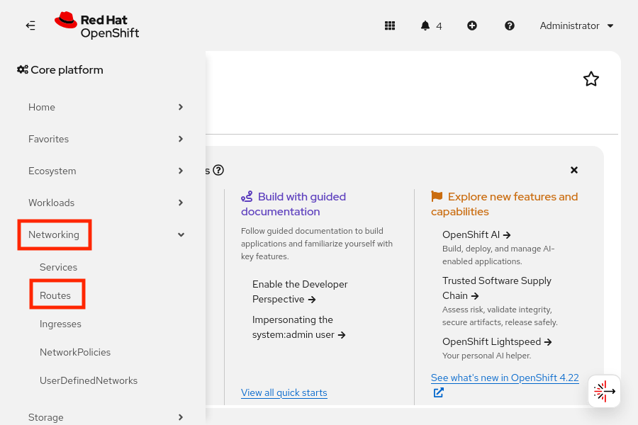

Nhấp vào **Create Route**. Tùy chỉnh tên, tên máy chủ (hostname), đường dẫn và dịch vụ đích bằng cách sử dụng biểu mẫu hoặc trình soạn thảo YAML.

**Hình 4.11: Biểu mẫu tạo route trên bảng điều khiển web**  
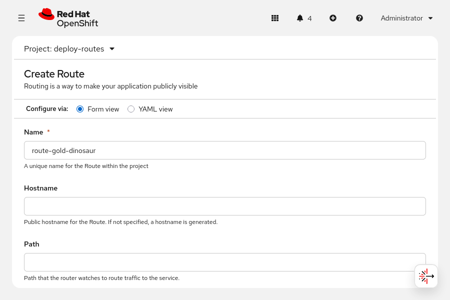

### API Cổng RHOCP
Mặc dù "Route" là phương thức được ưu tiên để hiển thị ứng dụng ra bên ngoài, RHOCP Gateway API vẫn là một khung quản lý lưu lượng truy cập vào (ingress) thay thế, được quản lý bởi Cluster Ingress Operator. Khung này sử dụng các thành phần từ Red Hat OpenShift Service Mesh để thực thi các cấu hình định tuyến.

Gateway API phân tách hệ thống mạng dịch vụ của cụm thành các tài nguyên tùy chỉnh (custom resource) riêng biệt sau đây:

* Các định nghĩa `GatewayClass` quản lý cấu hình bộ điều khiển định tuyến ở phạm vi cụm (cluster-scoped).
* Các tài nguyên `Gateway` xác định các điểm nhập mạng logic, cổng lắng nghe và thiết lập TLS ở phạm vi namespace.
* Các quy tắc `HTTPRoute` xác định cách ánh xạ các kết nối HTTP hoặc HTTPS (đã kết thúc TLS) tới các dịch vụ đích.

> **Lưu ý:** Gateway API không hỗ trợ việc sử dụng các mạng do người dùng định nghĩa (UDN).

### Các tài nguyên cốt lõi của Gateway API
Gateway API dựa vào các loại tài nguyên cốt lõi sau đây để phân tách các khía cạnh cấu hình mạng:

**GatewayClass**  
Một tài nguyên có phạm vi cụm (cluster-scoped), dùng để định nghĩa một tập hợp các gateway có chung cấu hình và hành vi. Các nhà cung cấp cơ sở hạ tầng tạo ra các đối tượng này để đại diện cho các bộ điều khiển định tuyến (routing controller) cụ thể. Đối với các cấu hình ingress mặc định của cụm, tài nguyên GatewayClass sử dụng giá trị `openshift.io/gateway-controller/v1` cho trường `controllerName`.

```yaml
apiVersion: gateway.networking.k8s.io/v1
kind: GatewayClass
metadata:
  name: openshift-default
spec:
  controllerName: openshift.io/gateway-controller/v1
```

**Gateway**  
Một tài nguyên thuộc phạm vi namespace, xác định điểm nhập mạng logic. Các nhà vận hành cụm triển khai tài nguyên này để cấu hình bộ cân bằng tải cũng như thiết lập việc lắng nghe trên các cổng và giao thức cụ thể. Ví dụ sau đây định nghĩa một tài nguyên Gateway lắng nghe trên cổng 80 cho tên miền example.com:

```yaml
apiVersion: gateway.networking.k8s.io/v1
kind: Gateway
metadata:
  name: dev-gateway
  namespace: openshift-ingress
spec:
  gatewayClassName: openshift-ingress
  listeners:
  - name: http
    protocol: HTTP
    port: 80
    hostname: "example.com"
```

**HTTPRoute**  
Một tài nguyên thuộc phạm vi namespace, dùng để xác định các quy tắc định tuyến cho các kết nối HTTP và HTTPS đã được kết thúc (terminated HTTPS). Các nhà phát triển ứng dụng tạo ra tài nguyên này để ánh xạ các yêu cầu gửi đến từ gateway tới các dịch vụ Kubernetes đích. Tài nguyên HTTPRoute phải tham chiếu đến tên của đối tượng Gateway thông qua giá trị trong trường `parentRefs`.

```yaml
apiVersion: gateway.networking.k8s.io/v1
kind: HTTPRoute
metadata:
  name: dev-db
  namespace: openshift-ingress
spec:
  parentRefs:
  - name: dev-gateway
  hostnames:
  - sales-db.example.com
  rules:
    - backendRefs:
        - name: sales-db
          port: 8080
```

### Sử dụng các đối tượng Ingress để kết nối bên ngoài
Tài nguyên Ingress của Kubernetes cung cấp các chức năng tương tự như tài nguyên Route của RHOCP, đồng thời hỗ trợ HTTP, HTTPS, Server Name Indication (SNI) và TLS kết hợp với SNI. Bộ điều khiển Ingress của OpenShift xử lý các đối tượng Ingress và kích hoạt các tính năng như kết thúc TLS (TLS termination), chuyển hướng đường dẫn (path redirection) và phiên duy trì (sticky sessions).

> **Lưu ý:** Mặc dù tài nguyên Ingress là tiêu chuẩn trong Kubernetes, nhưng tài nguyên Route được ưu tiên sử dụng hơn nhờ các tính năng nâng cao và khả năng tích hợp nguyên bản với bộ điều khiển Ingress của OpenShift.

Để tạo đối tượng Ingress, hãy sử dụng lệnh sau:

```console
[user@host ~]$ oc create ingress ingr-sakila --rule="ingr-sakila.apps.lab.example.com/*=sakila-service:8080"
```

Ví dụ sau đây cho thấy một định nghĩa Ingress tối giản:

```yaml
apiVersion: networking.k8s.io/v1
kind: Ingress
metadata:
  name: frontend (1)
spec:
  rules:
  - host: www.example.com (2)
    http:
      paths:
      - path: /
        pathType: Prefix
        backend:
          service:
            name: frontend (3)
            port:
              number: 80 (4)
  tls:
  - hosts:
    - www.example.com
    secretName: example-com-tls-certificate (5)
```

1. Chỉ định tên duy nhất cho đối tượng Ingress.
2. Thiết lập tên máy chủ (hostname) cho lưu lượng truy cập đến.
3. Xác định dịch vụ (service) để chuyển hướng lưu lượng truy cập tới.
4. Định nghĩa cổng cho backend của dịch vụ.
5. Cấu hình TLS cho các đường dẫn bảo mật; việc này yêu cầu tên máy chủ khớp với cấu hình và một secret chứa chứng chỉ.

Để xóa một đối tượng Ingress, hãy sử dụng lệnh sau:

```console
[user@host ~]$ oc delete ingress frontend
```

### Phiên cố định (Sticky Sessions)
Sticky sessions (phiên kết nối cố định) đảm bảo rằng lưu lượng truy cập ứng dụng có duy trì trạng thái (stateful) sẽ được chuyển đến cùng một pod trong suốt phiên làm việc của người dùng. Ingress controller của OpenShift có thể sử dụng cookie để quản lý tính duy trì phiên (session persistence) cho các tài nguyên Route và Ingress. Controller sẽ chọn một pod để xử lý yêu cầu của người dùng, tạo ra một cookie và đưa cookie đó vào phản hồi. Client sẽ gửi kèm cookie này trong các yêu cầu tiếp theo, cho phép controller định tuyến lưu lượng truy cập đến đúng pod đó.

Để cấu hình tính duy trì phiên cho một đối tượng Ingress bằng cách sử dụng cookie, hãy dùng lệnh sau:

```console
[user@host ~]$ oc annotate ingress ingr-example ingress.kubernetes.io/affinity=cookie
```

Để cấu hình tính năng duy trì phiên (session persistence) cho một đối tượng Route với cookie tùy chỉnh có tên là myapp, hãy sử dụng lệnh sau:

```console
[user@host ~]$ oc annotate route route-example router.openshift.io/cookie_name=myapp
```

Để ghi lại tên máy chủ của route, hãy sử dụng lệnh sau:

```console
[user@host ~]$ ROUTE_NAME=$(oc get route route-example -o jsonpath='{.spec.host}')
```

Để truy cập route và lưu cookie, hãy sử dụng lệnh sau:

```console
[user@host ~]$ curl $ROUTE_NAME -k -c /tmp/cookie_jar
```

Để sử dụng cookie đã lưu cho các yêu cầu tiếp theo, hãy sử dụng lệnh sau:

```console
[user@host ~]$ curl $ROUTE_NAME -k -b /tmp/cookie_jar
```

Việc sử dụng cookie đã lưu đảm bảo rằng các yêu cầu được gửi đến cùng một pod.

> **Lưu ý:** Không thể thiết lập cookie trên các tuyến chuyển tiếp (passthrough routes) vì lưu lượng truy cập HTTP được mã hóa, và bộ định tuyến không thực hiện kết thúc TLS hay đọc nội dung của yêu cầu.

### Cân bằng tải và mở rộng quy mô ứng dụng
Quản trị viên và nhà phát triển có thể thay đổi số lượng pod bản sao trong một deployment để xử lý sự gia tăng đột biến về lưu lượng truy cập hoặc để tiết kiệm tài nguyên.

Để thay đổi quy mô của một deployment, hãy sử dụng lệnh sau:

```console
[user@host ~]$ oc scale --replicas=5 deployment/scale
```

Deployment thực hiện cập nhật ReplicaSet. ReplicaSet sẽ tạo hoặc xóa các pod để khớp với số lượng bản sao (replica) mong muốn.

Hãy tránh sửa đổi trực tiếp ReplicaSet, vì bộ điều khiển Deployment (deployment controller) chịu trách nhiệm quản lý các thay đổi này.

#### Cân bằng tải cho các Pod
Tài nguyên Kubernetes Service hoạt động như một bộ cân bằng tải nội bộ, cho phép truy cập vào một khối lượng công việc (workload) thông qua tên dịch vụ. Dịch vụ này phân phối các kết nối đến cho các pod đang chạy song song (replicated pods). OpenShift Ingress Controller sử dụng bộ chọn (selector) của dịch vụ để xác định dịch vụ và các điểm cuối (endpoint). Khi cả bộ điều khiển (controller) và dịch vụ đều thực hiện cân bằng tải, RHOCP sẽ dựa vào bộ điều khiển để điều hướng lưu lượng truy cập đến các pod. Bộ điều khiển sẽ phát hiện những thay đổi về địa chỉ IP của dịch vụ và cập nhật cấu hình tương ứng. Các bộ điều khiển tùy chỉnh có thể truyền tải các thay đổi về đối tượng API đến các giải pháp định tuyến bên ngoài.

OpenShift Ingress Controller thực hiện ánh xạ các tên máy chủ (hostname) bên ngoài. Bộ điều khiển cân bằng tải cho các điểm cuối của dịch vụ dựa trên các giao thức có chứa thông tin phân biệt, chẳng hạn như tiêu đề HTTP host (HTTP host headers).
