Quản trị Red Hat OpenShift I: Vận hành Cụm Môi trường Sản xuất
--------------------------------------------------------------

# Chương 5. Quản lý lưu trữ cho cấu hình và dữ liệu ứng dụng
## Biểu lộ cấu hình ứng dụng ra bên ngoài
### Cấu hình các ứng dụng Kubernetes
Khi một ứng dụng chạy trên Kubernetes với một image có sẵn, nó sẽ sử dụng cấu hình mặc định. Cách tiếp cận này phù hợp cho mục đích thử nghiệm. Tuy nhiên, đối với môi trường sản xuất (production), bạn có thể cần tùy chỉnh ứng dụng trước khi triển khai.

Với Kubernetes, bạn có thể sử dụng các tệp manifest ở định dạng JSON và YAML để xác định cấu hình mong muốn cho từng ứng dụng. Bạn có thể định nghĩa tên ứng dụng, các nhãn (label), nguồn image, bộ nhớ, biến môi trường, v.v.

Đoạn mã dưới đây minh họa một ví dụ về tệp manifest YAML cho một deployment:

```yaml
apiVersion: apps/v1 (1)
kind: Deployment (2)
metadata: (3)
  name: hello-deployment
spec: (4)
  replicas: 1
  selector:
    matchLabels:
      app: hello-deployment
  template:
    metadata:
      labels:
        app: hello-deployment
    spec: (5)
      containers:
      - env: (6)
        - name: ENV_VARIABLE_1
          valueFrom:
            secretKeyRef:
              key: hello
              name: world
        image: quay.io/hello-image:latest
```

1. Phiên bản API của tài nguyên.
2. Loại tài nguyên triển khai (deployment).
3. Trong phần này, bạn chỉ định các thông tin mô tả (metadata) cho ứng dụng của mình, chẳng hạn như tên ứng dụng.
4. Bạn có thể định nghĩa cấu hình chung cho tài nguyên được áp dụng cho quá trình triển khai, ví dụ như số lượng bản sao (pod), nhãn bộ chọn (selector label) và dữ liệu mẫu (template data).
5. Trong phần này, bạn chỉ định cấu hình cho ứng dụng, chẳng hạn như tên image, tên container, các cổng (port), biến môi trường, v.v.
6. Bạn có thể định nghĩa các biến môi trường để thiết lập cấu hình theo nhu cầu của ứng dụng.

Đôi khi, ứng dụng của bạn cần sử dụng kết hợp nhiều tệp tin. Ví dụ, khi triển khai cơ sở dữ liệu, hệ thống cần có sẵn các cơ sở dữ liệu và dữ liệu đã được nạp trước. Thông thường, bạn cấu hình ứng dụng bằng cách sử dụng các biến môi trường, tệp tin bên ngoài hoặc tham số dòng lệnh. Quy trình tách biệt cấu hình ra khỏi ứng dụng này đảm bảo tính di động của ứng dụng giữa các môi trường khác nhau, miễn là image container, các tệp tin bên ngoài và biến môi trường đều có sẵn tại môi trường nơi ứng dụng hoạt động.

Kubernetes cung cấp cơ chế tách biệt cấu hình ứng dụng thông qua việc sử dụng ConfigMap và Secret.

Bạn có thể sử dụng ConfigMap để đưa dữ liệu cấu hình vào các container. Các đối tượng ConfigMap (thuộc phạm vi namespace) cung cấp phương thức nạp dữ liệu cấu hình vào container, giúp duy trì tính độc lập với nền tảng của các container này. Các đối tượng này có thể lưu trữ thông tin ở mức chi tiết (như các thuộc tính riêng lẻ) hoặc ở mức tổng quát (như toàn bộ tệp tin cấu hình hoặc các khối dữ liệu JSON). Thông tin chứa trong ConfigMap không yêu cầu cơ chế bảo vệ đặc biệt.

Dưới đây là ví dụ về một ConfigMap:

```yaml
apiVersion: v1
kind: ConfigMap (1)
metadata:
  name: example-configmap
  namespace: my-app
data: (2)
  example.property.1: hello
  example.property.2: world
  example.property.file: |-
    property.1=value-1
    property.2=value-2
    property.3=value-3
binaryData: (3)
  bar: R0lGODlhAgACAIABAO4AAP///yH5BAEHAAEALAAAAAACAAIAAAIDRAIFADs=
```

1. Loại tài nguyên ConfigMap.
2. Chứa dữ liệu cấu hình.
3. Trỏ đến một tệp được mã hóa Base64 chứa dữ liệu không phải định dạng UTF-8, chẳng hạn như tệp Java keystore dạng nhị phân. Chỉ định một khóa (key) theo sau là tệp đã được mã hóa đó.

Các ứng dụng thường cần truy cập vào thông tin nhạy cảm. Ví dụ, một ứng dụng web back-end cần thông tin xác thực cơ sở dữ liệu để thực hiện truy vấn. Kubernetes và OpenShift sử dụng các đối tượng "secret" để lưu trữ thông tin nhạy cảm. Chẳng hạn, bạn có thể sử dụng secret để lưu trữ các loại thông tin nhạy cảm sau:

* Mật khẩu
* Các tệp cấu hình nhạy cảm
* Thông tin xác thực cho tài nguyên bên ngoài, chẳng hạn như khóa SSH hoặc mã thông báo OAuth

Dưới đây là ví dụ về một secret:

```yaml
apiVersion: v1
kind: Secret
metadata:
  name: example-secret
  namespace: my-app
type: Opaque (1)
data: (2)
  username: bXl1c2VyCg==
  password: bXlQQDU1Cg==
stringData: (3)
  hostname: myapp.mydomain.com
  secret.properties: |
    property1=valueA
    property2=valueB
```

1. Xác định loại bí mật.
2. Xác định chuỗi và dữ liệu đã mã hóa.
3. Xác định chuỗi và dữ liệu đã giải mã.

Secret là một đối tượng thuộc namespace và có thể lưu trữ bất kỳ loại dữ liệu nào. Dữ liệu trong Secret được mã hóa Base64 chứ không được lưu trữ dưới dạng văn bản thuần (plain text). Dữ liệu Secret không được mã hóa bảo mật (encrypted); bạn có thể giải mã Secret từ định dạng Base64 để truy cập dữ liệu gốc. Ví dụ sau đây hiển thị các giá trị đã giải mã của các đối tượng tên người dùng (username) và mật khẩu (password) từ Secret có tên là `example-secret`:

```console
[user@host ~]$ echo bXl1c2VyCg== | base64 --decode
myuser
[user@host ~]$ echo bXlQQDU1Cg== | base64 --decode
myP@55
```

Kubernetes và OpenShift hỗ trợ các loại secret sau:

**Secret dạng Opaque (không định dạng cụ thể)**  
Lưu trữ các cặp khóa-giá trị chứa dữ liệu tùy ý; các giá trị này không bị kiểm tra tính hợp lệ theo bất kỳ quy ước nào về tên khóa hay nội dung giá trị.

**Token tài khoản dịch vụ (Service account tokens)**  
Lưu trữ thông tin xác thực dạng token dành cho các ứng dụng cần xác thực với Kubernetes API.

**Secret xác thực cơ bản (Basic authentication secrets)**  
Lưu trữ thông tin cần thiết cho cơ chế xác thực cơ bản (basic authentication). Tham số `data` của đối tượng secret phải chứa các khóa `user` (người dùng) và `password` (mật khẩu) được mã hóa dưới định dạng Base64.
Khóa SSH

Lưu trữ dữ liệu được sử dụng cho quá trình xác thực SSH.

**Chứng chỉ TLS**  
Lưu trữ chứng chỉ và khóa được sử dụng cho TLS.

**Secret cấu hình Docker**  
Lưu trữ thông tin xác thực để truy cập vào registry chứa image container.

Khi bạn lưu trữ thông tin trong một loại tài nguyên secret cụ thể, Kubernetes sẽ kiểm tra để đảm bảo dữ liệu đó tuân thủ đúng định dạng của loại secret đó.

> **Lưu ý:** Theo mặc định, các configuration map và secret không được mã hóa. Để mã hóa dữ liệu secret khi lưu trữ (at rest), bạn phải mã hóa cơ sở dữ liệu Etcd. Khi được kích hoạt, Etcd sẽ mã hóa các tài nguyên sau: secret, configuration map, route, OAuth access token và OAuth authorization token. Việc mã hóa cơ sở dữ liệu Etcd nằm ngoài phạm vi của khóa học này.

### Tạo Secrets
Nếu một pod cần truy cập vào thông tin nhạy cảm, hãy tạo một secret cho thông tin đó trước khi triển khai pod. Cả hai công cụ dòng lệnh `oc` và `kubectl` đều cung cấp lệnh tạo secret. Hãy sử dụng một trong các lệnh sau để tạo secret:

* Tạo một secret chung chứa các cặp khóa-giá trị từ các giá trị cụ thể được nhập trên dòng lệnh:

```console
[user@host ~]$ oc create secret generic secret_name \
--from-literal key1=secret1 \
--from-literal key2=secret2
```

* Tạo một secret chung bằng cách sử dụng các tên khóa được chỉ định trên dòng lệnh và các giá trị từ tệp:

```console
[user@host ~]$ kubectl create secret generic ssh-keys \
--from-file id_rsa=/path-to/id_rsa \
--from-file id_rsa.pub=/path-to/id_rsa.pub
```

* Tạo một TLS secret chỉ định chứng chỉ và khóa đi kèm:

```console
[user@host ~]$ oc create secret tls secret-tls \
--cert /path-to-certificate --key /path-to-key
```

Để tạo một secret dạng opaque từ bảng điều khiển web, hãy truy cập Workloads → Secrets. Nhấp vào Create và chọn Key/value secret.

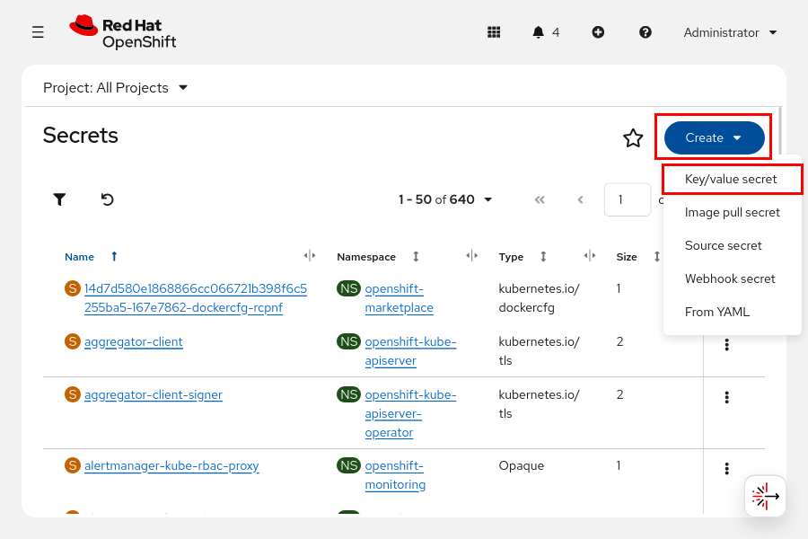

Hoàn tất biểu mẫu với tên khóa, sau đó xác định giá trị bằng cách nhập vào phần tiếp theo hoặc trích xuất từ ​​một tệp tin.

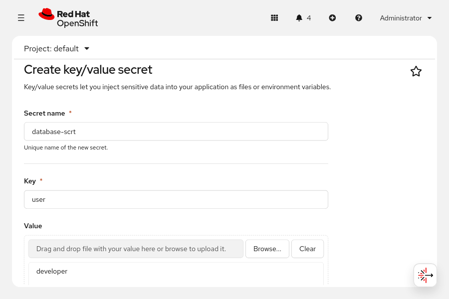

Để tạo một secret từ bảng điều khiển web nhằm lưu trữ thông tin xác thực truy cập registry chứa image container, hãy truy cập mục Workloads → Secrets. Nhấp vào Create và chọn Image pull secret. Hãy điền thông tin vào biểu mẫu hoặc tải lên tệp cấu hình bao gồm tên secret, chọn phương thức xác thực, đồng thời nhập địa chỉ máy chủ registry cùng các thông tin xác thực gồm tên người dùng, mật khẩu và email.

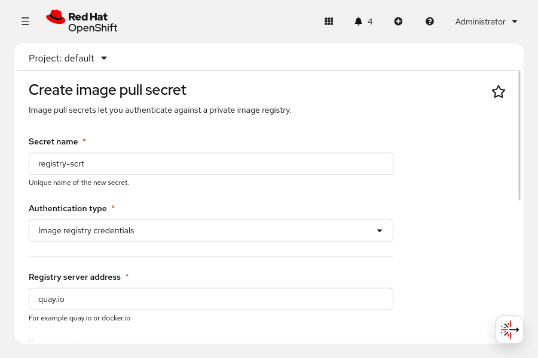

### Tạo các bản đồ cấu hình
Cú pháp tạo configuration map và secret rất tương đồng. Bạn có thể nhập các cặp khóa-giá trị (key-value) ngay trên dòng lệnh hoặc sử dụng nội dung của một tệp tin làm giá trị cho một khóa cụ thể. Bạn có thể sử dụng công cụ dòng lệnh `oc` hoặc `kubectl` để tạo configuration map. Lệnh dưới đây minh họa cách tạo một configuration map:

```console
[user@host ~]$ kubectl create configmap my-config \
--from-literal key1=config1 --from-literal key2=config2
```

Bạn cũng có thể sử dụng tên viết tắt `cm` để tạo một configuration map.

```console
[user@host ~]$ oc create cm my-config \
--from-literal key1=config1 --from-literal key2=config2
```
Để tạo ConfigMap từ bảng điều khiển web, hãy truy cập **Workloads → ConfigMaps**. Nhấp vào **Create ConfigMap** và hoàn tất việc tạo ConfigMap bằng cách sử dụng chế độ xem biểu mẫu (form view) hoặc chế độ xem YAML (YAML view).

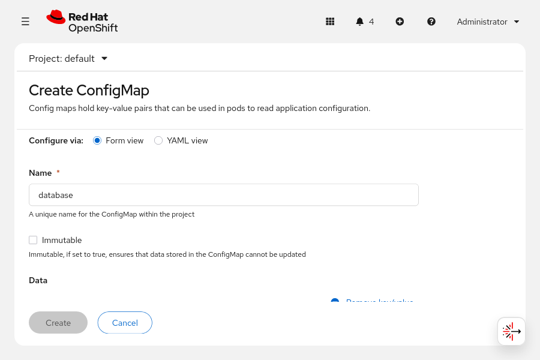

Bạn có thể sử dụng các tệp cho mỗi khóa mà mình thêm vào bằng cách nhấp vào nút **Browse** (Duyệt) bên cạnh trường **Value** (Giá trị). Trường **Key** (Khóa) phải trùng với tên của tệp đã được chọn trong trường **Value**.

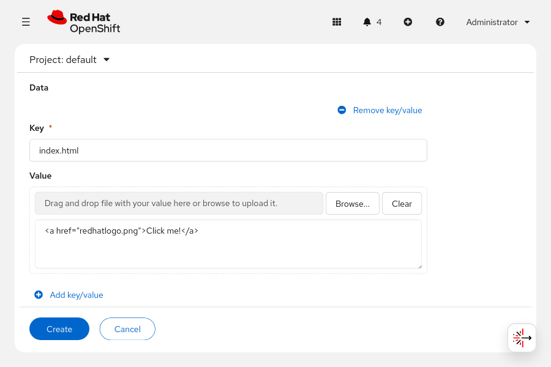

> **Lưu ý:** Sử dụng khóa dữ liệu nhị phân thay vì khóa dữ liệu nếu tệp sử dụng định dạng nhị phân, chẳng hạn như tệp PNG.

### Sử dụng Configuration Map và Secret để khởi tạo biến môi trường
Bạn có thể sử dụng các configuration map để thiết lập các biến môi trường riêng lẻ nhằm cấu hình ứng dụng của mình. Khác với các secret, thông tin trong configuration map không yêu cầu cơ chế bảo vệ. Đoạn mã dưới đây minh họa ví dụ về việc khởi tạo các biến môi trường:

```yaml
apiVersion: v1
kind: ConfigMap
metadata:
  name: config-map-example
  namespace: example-app (1)
data:
  database.name: sakila (2)
  database.user: redhat (3)
```

1. Dự án chứa bản đồ cấu hình (configuration map). Các đối tượng ConfigMap chỉ có thể được tham chiếu bởi các pod nằm trong cùng một dự án.
2. Khởi tạo biến database.name với giá trị là sakila.
3. Khởi tạo biến database.user với giá trị là redhat.

Sau đó, bạn có thể sử dụng configuration map để thiết lập các biến môi trường cho ứng dụng của mình. Ví dụ dưới đây minh họa một tài nguyên pod sử dụng configuration map để thiết lập các biến môi trường cụ thể.

```yaml
apiVersion: v1
kind: Pod
metadata:
  name: config-map-example-pod
  namespace: example-app
spec:
  containers:
    - name: example-container
      image: registry.example.com/mysql-80:1-237
      command: [ "/bin/sh", "-c", "env" ]
      env: (1)
        - name: MYSQL_DATABASE (2)
          valueFrom:
            configMapKeyRef:
              name: config-map-example (3)
              key: database.name (4)
        - name: MYSQL_USER
          valueFrom:
            configMapKeyRef:
              name: config-map-example (5)
              key: database.user (6)
              optional: true (7)
```

1. Thuộc tính dùng để chỉ định các biến môi trường cho pod.
2. Tên của biến môi trường trong pod nơi bạn sẽ gán giá trị của một khóa (key).
3. Tên của đối tượng ConfigMap dùng để lấy các biến môi trường.
4. Biến môi trường cần lấy từ đối tượng ConfigMap.
5. Tên của đối tượng ConfigMap dùng để lấy các biến môi trường.
6. Biến môi trường cần lấy từ đối tượng ConfigMap.
7. Thiết lập biến môi trường ở chế độ tùy chọn (không bắt buộc). Pod vẫn sẽ khởi động ngay cả khi đối tượng ConfigMap và các khóa được chỉ định không tồn tại.

Ví dụ sau đây cho thấy một tài nguyên pod thực hiện đưa tất cả các biến môi trường từ một configuration map vào:

```yaml
apiVersion: v1
kind: Pod
metadata:
  name: config-map-example-pod2
  namespace: example-app
spec:
  containers:
    - name: example-container
      image: registry.example.com/mysql-80:1-237
      command: [ "/bin/sh", "-c", "env" ]
      envFrom: (1)
        - configMapRef:
            name: config-map-example (2)
  restartPolicy: Never
```

1. Thuộc tính để lấy tất cả các biến môi trường từ một đối tượng ConfigMap.
2. Tên của đối tượng ConfigMap dùng để lấy các biến môi trường.

Bạn có thể sử dụng các secret cùng với các tài nguyên Kubernetes khác như pod, deployment, build, v.v. Bạn có thể chỉ định các khóa secret hoặc volume kèm theo đường dẫn gắn kết (mount path) để lưu trữ secret của mình. Đoạn mã sau đây minh họa một ví dụ về pod nạp dữ liệu từ secret Kubernetes có tên `test-secret` vào các biến môi trường:

```yaml
apiVersion: v1
kind: Pod
metadata:
  name: secret-example-pod
spec:
  containers:
    - name: secret-test-container
      image: busybox
      command: [ "/bin/sh", "-c", "export" ]
      env: (1)
        - name: TEST_SECRET_USERNAME_ENV_VAR
          valueFrom: (2)
            secretKeyRef: (3)
              name: test-secret (4)
              key: username (5)
```

1. Chỉ định các biến môi trường cho pod.
2. Xác định nguồn của các biến môi trường.
3. Đối tượng nguồn secretKeyRef cho các biến môi trường.
4. Tên của secret (phải tồn tại).
5. Khóa được trích xuất từ secret là tên người dùng dùng để xác thực.

Khác với các bản đồ cấu hình (configuration maps), các giá trị trong secrets luôn được mã hóa (dưới dạng encoding, không phải mã hóa bảo mật - encryption), và quyền truy cập vào chúng bị giới hạn ở một số lượng người dùng được ủy quyền ít hơn.

### Sử dụng Secrets và ConfigMaps làm Volumes
Để cung cấp một secret cho pod, trước tiên bạn cần tạo secret đó trong cùng namespace (hoặc project) với pod. Trong secret, hãy gán mỗi phần dữ liệu nhạy cảm cho một khóa (key). Sau khi được tạo, secret sẽ chứa các cặp khóa-giá trị (key-value pairs).

Lệnh sau đây tạo một secret thuộc loại generic chứa các cặp khóa-giá trị từ những giá trị cụ thể được nhập trực tiếp trên dòng lệnh: `user` với giá trị `demo-user`, và `root_password` với giá trị `zT1kTgk`.

```console
[user@host ~]$ oc create secret generic demo-secret \
--from-literal user=demo-user \
--from-literal root_password=zT1KTgk
```

Bạn cũng có thể tạo một secret chung bằng cách chỉ định tên khóa trên dòng lệnh và lấy giá trị từ các tệp:

```console
[user@host ~]$ oc create secret generic demo-secret \
--from-file user=/tmp/demo/user \
--from-file root_password=/tmp/demo/root_password
```

Bạn có thể gắn (mount) một secret vào một thư mục bên trong pod. Kubernetes sẽ tạo một tệp tin tương ứng với mỗi khóa (key) trong secret, sử dụng chính tên của khóa đó làm tên tệp. Nội dung của mỗi tệp tin là giá trị đã được giải mã của secret. Lệnh sau đây minh họa cách gắn secret vào một pod:

```console
[user@host ~]$ oc set volume deployment/demo \ (1)
--add --type secret \ (2)
--secret-name demo-secret \ (3)
--mount-path /app-secrets (4)
```

1. Sửa đổi cấu hình volume trong bản triển khai demo.
2. Thêm một volume mới từ secret.
3. Sử dụng secret có tên là `demo-secret`.
4. Đưa dữ liệu của secret vào thư mục `/app-secrets` trong pod. Nội dung của tệp `/app-secrets/user` là `demo-user`. Nội dung của tệp `/app-secrets/root_password` là `zT1KTgk`.

Để gán một secret dưới dạng volume cho một deployment từ giao diện web, hãy truy cập **Workloads → Secrets**.

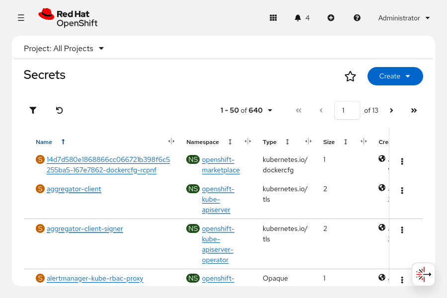

Chọn một secret và nhấp vào **Add Secret** vào khối lượng công việc.

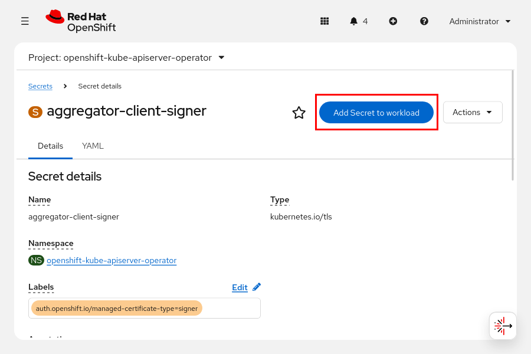

Chọn khối lượng công việc, chọn tùy chọn Volume và xác định đường dẫn gắn (mount path) cho secret.

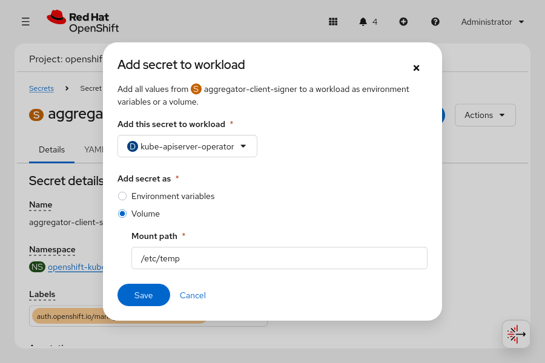

Tương tự như secret, trước tiên bạn cần tạo một configuration map thì pod mới có thể sử dụng nó. Configuration map này phải nằm trong cùng namespace (hoặc project) với pod. Lệnh sau đây minh họa cách tạo configuration map từ một tệp cấu hình bên ngoài:

```console
[user@host ~]$ oc create configmap demo-map \
--from-file=config-files/httpd.conf
```

Tương tự, bạn có thể thêm một configuration map dưới dạng volume bằng cách sử dụng lệnh sau:

```console
[user@host ~]$ oc set volume deployment/demo \
--add --type configmap \
--configmap-name demo-map \
--mount-path /app-config
```

Để xác nhận rằng volume đã được gắn vào deployment, hãy sử dụng lệnh sau:

```console
[user@host ~]$ oc set volume deployment/demo
 demo
  configMap/demo-map as volume-du9in
    mounted at /app-config
```

Bạn cũng có thể sử dụng lệnh `oc set env` để thiết lập các biến môi trường cho ứng dụng từ các đối tượng *secret* hoặc *config map*. Trong một số trường hợp, bạn có thể sửa đổi tên khóa (key) để khớp với tên biến môi trường bằng cách sử dụng tùy chọn `--prefix`. Trong ví dụ dưới đây, khóa `user` từ *secret* có tên `demo-secret` được dùng để thiết lập biến môi trường `MYSQL_USER`, và khóa `root_password` từ cùng *secret* đó được dùng để thiết lập biến môi trường `MYSQL_ROOT_PASSWORD`. Nếu tên khóa trong *secret* ở dạng chữ thường, biến môi trường tương ứng sẽ được chuyển đổi sang chữ hoa để phù hợp với quy tắc do tùy chọn `--prefix` quy định.

```console
[user@host ~]$ oc set env deployment/demo \
--from secret/demo-secret --prefix MYSQL_
```

> **Lưu ý:** Bạn không thể gán configuration map làm volume cho các workload thông qua giao diện web.

### Cập nhật Secrets và ConfigMap
Các secret và configuration map đôi khi cần được cập nhật. OpenShift cung cấp lệnh `oc extract` để đảm bảo bạn có dữ liệu mới nhất. Bạn có thể lưu dữ liệu vào một thư mục cụ thể bằng cách sử dụng tùy chọn `--to`. Mỗi khóa (key) trong secret hoặc configuration map sẽ tạo ra một tệp có tên trùng với tên khóa đó, và nội dung của tệp chính là giá trị tương ứng của khóa. Nếu chạy lệnh `oc extract` nhiều lần, bạn cần sử dụng tùy chọn `--confirm` để ghi đè lên các tệp hiện có. Bạn cũng có thể sử dụng tùy chọn `--confirm` để tạo thư mục đích chứa nội dung được trích xuất.

```console
[user@host ~]$ oc extract secret/demo-secret -n demo \
--to /tmp/demo --confirm
[user@host ~]$ ls /tmp/demo/
user  root_password
[user@host ~]$ cat /tmp/demo/root_password
zT1KTgk
[user@host ~]$ echo k8qhcw3m0 > /tmp/demo/root_password
```

Sau khi cập nhật các tệp được lưu cục bộ, hãy sử dụng lệnh `oc set data` để cập nhật secret hoặc config map. Với mỗi khóa cần cập nhật, hãy chỉ định tên khóa và giá trị tương ứng. Nếu giá trị nằm trong một tệp, hãy sử dụng tùy chọn `--from-file`.

```console
[user@host ~]$ oc set data secret/demo-secret -n demo \
--from-file /tmp/demo/root_password
```

Bạn cần khởi động lại các pod sử dụng biến môi trường để có thể đọc được các giá trị đã cập nhật từ secret hoặc config map. Ngược lại, các pod sử dụng cơ chế gắn volume (volume mount) để tham chiếu đến secret hoặc config map sẽ nhận được các cập nhật mà không cần khởi động lại, nhờ vào cơ chế nhất quán cuối cùng (eventually consistent). Theo mặc định, tác nhân kubelet sẽ theo dõi những thay đổi đối với các khóa (key) và giá trị (value) được sử dụng trong các volume của pod trên node đó. Kubelet sẽ phát hiện các thay đổi này và cập nhật chúng vào pod để đảm bảo dữ liệu trong volume luôn đồng bộ. Mặc dù Kubernetes hỗ trợ cập nhật tự động, việc khởi động lại pod vẫn là bắt buộc nếu phần mềm bên trong pod chỉ đọc dữ liệu cấu hình tại thời điểm khởi động.

### Xóa Secrets và Configuration Maps
Tương tự như các tài nguyên Kubernetes khác, bạn có thể sử dụng lệnh delete để xóa các secret và config map không còn cần thiết hoặc không còn được sử dụng.

```console
[user@host ~]$ kubectl delete secret/demo-secret -n demo
```

```console
[user@host ~]$ oc delete configmap/demo-map -n demo
```

## Cấp phát các ổ đĩa dữ liệu bền vững
### Bộ lưu trữ bền vững trong Kubernetes
Theo mặc định, các container sử dụng bộ nhớ tạm thời (ephemeral storage). Vòng đời của loại bộ nhớ này gắn liền với vòng đời của pod và không thể chia sẻ giữa các pod với nhau. Khi một container bị xóa, toàn bộ tệp tin và dữ liệu bên trong nó cũng bị xóa theo. Để lưu giữ dữ liệu, các container sử dụng các volume lưu trữ bền vững (persistent storage volumes).

Do OpenShift Container Platform sử dụng cơ chế persistent volume (PV) của Kubernetes, quản trị viên cụm (cluster administrator) có thể cấp phát bộ nhớ bền vững cho cụm. Các nhà phát triển có thể sử dụng yêu cầu cấp phát bộ nhớ bền vững (PVC - Persistent Volume Claim) để yêu cầu tài nguyên PV mà không cần am hiểu chi tiết về cơ sở hạ tầng lưu trữ bên dưới.

Có hai phương thức cấp phát bộ nhớ cho cụm: tĩnh (static) và động (dynamic). Cấp phát tĩnh đòi hỏi quản trị viên cụm phải tự tạo các PV theo cách thủ công. Cấp phát động sử dụng các lớp lưu trữ (storage class) để tạo PV khi có nhu cầu.

Quản trị viên có thể sử dụng các lớp lưu trữ để cung cấp bộ nhớ bền vững. Các lớp lưu trữ mô tả những loại hình lưu trữ dành cho cụm. Quản trị viên cụm tạo ra các lớp lưu trữ để quản lý các dịch vụ lưu trữ hoặc các cấp độ lưu trữ (storage tier) của một dịch vụ. Thay vì chỉ định đích danh tài nguyên lưu trữ đã được cấp phát, các PVC sẽ tham chiếu đến một lớp lưu trữ cụ thể.

Các nhà phát triển sử dụng PVC để gắn các PV vào ứng dụng của mình mà không cần nắm rõ chi tiết về cơ sở hạ tầng lưu trữ. Với phương thức cấp phát tĩnh, nhà phát triển sử dụng các PV đã được tạo sẵn hoặc yêu cầu quản trị viên cụm tạo PV thủ công cho ứng dụng. Với phương thức cấp phát động, nhà phát triển chỉ cần khai báo các yêu cầu về lưu trữ của ứng dụng, và cụm sẽ tự động tạo một PV để đáp ứng yêu cầu đó.

## Persistent Volumes
Không phải mọi giải pháp lưu trữ đều giống nhau. Các loại hình lưu trữ khác nhau về chi phí, hiệu năng và độ tin cậy. Thông thường, mỗi cụm Kubernetes đều có sẵn nhiều loại hình lưu trữ.

Danh sách các loại volume lưu trữ phổ biến và các trường hợp sử dụng tương ứng dưới đây chưa phải là danh sách đầy đủ.

**configMap**  
Volume configMap giúp tách biệt dữ liệu cấu hình ứng dụng ra khỏi mã nguồn. Việc sử dụng tài nguyên configMap đảm bảo rằng cấu hình ứng dụng có tính di động giữa các môi trường và có thể được quản lý phiên bản.

**emptyDir**  
Volume emptyDir cung cấp một thư mục dành riêng cho mỗi pod để lưu trữ dữ liệu tạm thời (scratch data). Thư mục này thường trống ngay sau khi được khởi tạo. Các volume emptyDir thường được sử dụng cho nhu cầu lưu trữ tạm thời (ephemeral storage).

**hostPath**  
Volume hostPath gắn (mount) một tệp hoặc thư mục từ node máy chủ (host node) vào pod của bạn. Để sử dụng volume hostPath, quản trị viên cụm (cluster administrator) phải cấu hình để pod chạy với quyền đặc quyền (privileged). Cấu hình này cho phép truy cập vào các pod khác trên cùng một node. 

Red Hat không khuyến nghị sử dụng volume hostPath trong môi trường sản xuất (production). Thay vào đó, Red Hat hỗ trợ việc gắn hostPath cho mục đích phát triển và thử nghiệm trên cụm đơn node. Mặc dù hầu hết các pod không cần đến volume hostPath, nhưng nó cung cấp một giải pháp nhanh chóng để thử nghiệm nếu ứng dụng có yêu cầu.

**iSCSI**  
Internet Small Computer System Interface (iSCSI) là một tiêu chuẩn dựa trên giao thức IP, cung cấp khả năng truy cập ở cấp độ khối (block-level) tới các thiết bị lưu trữ. Với các volume iSCSI, các workload trên Kubernetes có thể sử dụng bộ nhớ lưu trữ bền vững (persistent storage) từ các đích iSCSI (iSCSI targets).

**local**  
Bạn có thể sử dụng volume bền vững cục bộ (Local persistent volumes) để truy cập các thiết bị lưu trữ cục bộ, chẳng hạn như ổ đĩa hoặc phân vùng, thông qua giao diện PVC tiêu chuẩn. Các volume cục bộ phụ thuộc vào tính sẵn sàng của node chứa chúng và không phù hợp với mọi loại ứng dụng.

**NFS**  
Nhiều pod có thể truy cập cùng một volume Network File System (NFS) tại cùng một thời điểm, cho phép chia sẻ dữ liệu giữa các pod. Loại volume NFS thường được sử dụng nhờ khả năng chia sẻ dữ liệu an toàn. Red Hat khuyến nghị chỉ nên sử dụng NFS cho các hệ thống không thuộc môi trường sản xuất.

#### Chế độ truy cập Volume
Các nhà cung cấp Persistent Volume (PV) có khả năng khác nhau. Một volume sử dụng các chế độ truy cập để xác định những chế độ mà nó hỗ trợ. Ví dụ, NFS có thể hỗ trợ nhiều client cùng đọc/ghi, nhưng một PV NFS cụ thể có thể được cấu hình trên máy chủ ở chế độ chỉ đọc (read-only). OpenShift định nghĩa các chế độ truy cập sau đây, được tóm tắt trong bảng dưới đây:

**Bảng 5.1. Các chế độ truy cập Volume**

| Chế độ truy cập  | Từ viết tắt | Mô tả                                                                                                            |
|------------------|-------------|------------------------------------------------------------------------------------------------------------------|
| ReadWriteOnce    | RWO         | Một node duy nhất gắn volume ở chế độ đọc/ghi. Nhiều pod trên cùng node đó có thể truy cập volume này đồng thời. |
| ReadWriteOncePod | RWOP        | Một pod duy nhất trong cụm gắn volume ở chế độ đọc/ghi.                                                          |
| ReadOnlyMany     | ROX         | Nhiều nút gắn ổ đĩa ở chế độ chỉ đọc.                                                                            |
| ReadWriteMany    | RWX         | Nhiều nút gắn volume ở chế độ đọc/ghi.                                                                           |

Các nhà phát triển phải chọn loại volume hỗ trợ mức truy cập mà ứng dụng yêu cầu. Bảng dưới đây liệt kê một số ví dụ về các chế độ truy cập được hỗ trợ:

**Bảng 5.2. Hỗ trợ chế độ truy cập**

| Loại volume | RWO | RWOP | ROX | RWX |
|-------------|-----|------|-----|-----|
| configMap   | Yes | Yes  | No  | No  |
| emptyDir    | Yes | Yes  | No  | No  |
| hostPath    | Yes | Yes  | No  | No  |
| iSCSI       | Yes | Yes  | Yes | No  |
| local       | Yes | Yes  | No  | No  |
| NFS         | Yes | Yes  | Yes | Yes |

#### Chế độ Volume
Kubernetes hỗ trợ hai chế độ volume cho các persistent volume (volume bền vững): Filesystem (hệ thống tệp) và Block (khối). Nếu chế độ volume không được xác định cho một volume, Kubernetes sẽ gán chế độ mặc định là Filesystem cho volume đó.

OpenShift Container Platform có khả năng cấp phát các raw block volume (volume khối thô). Các volume này không có hệ thống tệp và có thể mang lại lợi ích về hiệu năng cho những ứng dụng ghi trực tiếp vào đĩa hoặc tự triển khai dịch vụ lưu trữ riêng. Raw block volume được cấp phát bằng cách chỉ định `volumeMode: Block` trong phần cấu hình của PV và PVC.

Bảng dưới đây cung cấp các ví dụ về các tùy chọn lưu trữ có hỗ trợ block volume:

**Bảng 5.3. Hỗ trợ Block Volume**

| Volume plug-in                    | Cấp phát thủ công | Cấp phát động |
|-----------------------------------|-------------------|---------------|
| AWS EBS                           | Yes               | Yes           |
| Azure disk                        | Yes               | Yes           |
| Cinder                            | Yes               | Yes           |
| Fibre channel                     | Yes               | No            |
| GCP                               | Yes               | Yes           |
| iSCSI                             | Yes               | No            |
| local                             | Yes               | No            |
| Red Hat OpenShift Data Foundation | Yes               | Yes           |
| VMware vSphere                    | Yes               | Yes           |

#### Tạo PV theo cách thủ công
Quản trị viên sử dụng các tệp manifest PersistentVolume để tạo thủ công các persistent volume. Ví dụ sau đây tạo một persistent volume từ thiết bị lưu trữ Fibre Channel sử dụng chế độ block:

```yaml
apiVersion: v1
kind: PersistentVolume (1)
metadata:
  name: block-pv (2)
spec:
  capacity:
    storage: 10Gi (3)
  accessModes:
    - ReadWriteOnce (4)
  volumeMode: Block (5)
  persistentVolumeReclaimPolicy: Retain (6)
  fc: (7)
    targetWWNs: ["50060e801049cfd1"]
    lun: 0
    readOnly: false
```

1. `PersistentVolume` là loại tài nguyên dành cho các PV.
2. Đặt tên cho PV; tên này sẽ được các yêu cầu (claim) sử dụng sau đó để truy cập vào PV.
3. Chỉ định dung lượng lưu trữ được cấp phát cho volume này.
4. Thiết bị lưu trữ phải hỗ trợ chế độ truy cập (access mode) mà PV đã chỉ định.
5. Thuộc tính `volumeMode` là tùy chọn đối với các volume dạng `Filesystem`, nhưng là bắt buộc đối với các volume dạng Block.
6. Trường `persistentVolumeReclaimPolicy` xác định cách cụm (cluster) xử lý PV khi PVC bị xóa. Các tùy chọn hợp lệ là Retain hoặc Delete.
7. Các thuộc tính còn lại phụ thuộc vào loại hình lưu trữ cụ thể. Trong ví dụ này, đối tượng `fc` xác định các thuộc tính cho loại lưu trữ `Fibre Channel`.

Nếu tệp manifest trước đó có tên là my-fc-volume.yaml, hãy đăng nhập với tư cách quản trị viên và chạy lệnh sau để tạo tài nguyên PV:

```console
[user@host ~]$ oc create -f my-fc-volume.yaml
```

Để tạo một Persistent Volume từ giao diện web, hãy đăng nhập với tư cách quản trị viên và truy cập vào mục **Storage → PersistentVolumes**.

### Persistent Volume Claims
Tài nguyên Persistent Volume Claim (PVC) đại diện cho yêu cầu về dung lượng lưu trữ từ một ứng dụng. PVC xác định các đặc tính lưu trữ tối thiểu, chẳng hạn như dung lượng và chế độ truy cập, chứ không chỉ định công nghệ lưu trữ cụ thể (như iSCSI hay NFS).

Vòng đời của PVC gắn liền với namespace thay vì gắn với một pod cụ thể. Nhiều pod trong cùng một namespace — ngay cả khi thuộc các bộ điều khiển khối lượng công việc (workload controller) khác nhau — đều có thể kết nối với cùng một PVC. Bạn cũng có thể lần lượt kết nối và ngắt kết nối bộ nhớ khỏi các pod ứng dụng khác nhau để thực hiện các tác vụ như khởi tạo, chuyển đổi, di chuyển hoặc sao lưu dữ liệu.

Kubernetes sẽ khớp mỗi PVC với một tài nguyên Persistent Volume (PV) có khả năng đáp ứng các yêu cầu của PVC đó. Sự khớp nối này không nhất thiết phải hoàn toàn tương đồng; ví dụ, một PVC có thể được gắn kết với PV có dung lượng đĩa lớn hơn mức yêu cầu, hoặc PVC yêu cầu chế độ truy cập đơn (single access) có thể được gắn kết với PV hỗ trợ chia sẻ cho nhiều truy cập đồng thời. Thay vì áp đặt các quy tắc cứng nhắc, PVC đóng vai trò khai báo nhu cầu của ứng dụng, và Kubernetes sẽ đáp ứng các nhu cầu đó dựa trên cơ chế "nỗ lực tối đa" (best-effort).

#### Tạo 1 PVC
Một PVC thuộc về một dự án cụ thể. Để tạo PVC, các nhà phát triển cần chỉ định chế độ truy cập và dung lượng, cùng các tùy chọn khác. PVC không thể được chia sẻ giữa các dự án. Các nhà phát triển sử dụng PVC để truy cập vào một Persistent Volume (PV). Các PV không bị giới hạn trong phạm vi một dự án mà có thể được truy cập trên toàn bộ cụm OpenShift. Khi một PV đã được liên kết (bind) với một PVC, nó không thể liên kết với một PVC khác.

Để thêm một volume vào quá trình triển khai ứng dụng, hãy tạo tài nguyên PersistentVolumeClaim và thêm nó vào ứng dụng dưới dạng một volume. Bạn có thể tạo PVC bằng cách sử dụng tệp manifest Kubernetes hoặc lệnh `oc set volumes`. Ngoài việc tạo mới hoặc sử dụng PVC đã có, lệnh `oc set volumes` còn có thể sửa đổi cấu hình triển khai để mount (gắn) PVC đó làm volume bên trong pod.

Để thêm volume vào quá trình triển khai ứng dụng, các nhà phát triển có thể sử dụng lệnh `oc set volumes`:

```console
[user@host ~]$ oc set volumes deployment/example-application \ (1)
--add \ (2)
--name example-pv-storage \ (3)
--type persistentVolumeClaim \ (4)
--claim-mode rwo \ (5)
--claim-size 15Gi \ (6)
--mount-path /var/lib/example-app \ (7)
--claim-name mypvc (8)
```

1. Chỉ định tên của deployment cần tài nguyên PVC.
2. Việc đặt tùy chọn `add` thành `true` sẽ thêm các volume và volume mount cho các container.
3. Tùy chọn `name` dùng để chỉ định tên volume. Nếu bạn không cung cấp tên, hệ thống sẽ tự động tạo tên đó.
4. Các loại được hỗ trợ cho thao tác `add` bao gồm `emptyDir`, `hostPath`, `secret`, `configMap` và `persistentVolumeClaim`.
5. Tùy chọn `claim-mode` có giá trị mặc định là `ReadWriteOnce`. Các giá trị hợp lệ bao gồm `ReadWriteOnce` (RWO), `ReadWriteOncePod` (RWOP), `ReadWriteMany` (RWX) và `ReadOnlyMany` (ROX).
6. Tạo một claim với kích thước (tính bằng byte) được chỉ định, nếu tham số này được cung cấp cùng với loại persistent volume. Kích thước phải sử dụng ký hiệu SI, ví dụ: 15, 15 G hoặc 15 Gi.
7. Tùy chọn `mount-path` chỉ định đường dẫn mount bên trong container.
8. Tùy chọn `claim-name` cung cấp tên cho PVC và là bắt buộc đối với loại `persistentVolumeClaim`.

Lệnh này tạo một tài nguyên PVC và thêm nó vào ứng dụng dưới dạng một volume bên trong pod.

Lệnh này cập nhật deployment của ứng dụng với các thông số kỹ thuật về volumeMounts và volumes.

```yaml
apiVersion: apps/v1
kind: Deployment
metadata:
  ...output omitted...
  namespace: storage-volumes (1)
  ...output omitted...
spec:
  ...output omitted...
  template:
  ...output omitted...
    spec:
  ...output omitted...
        volumeMounts:
        - mountPath: /var/lib/example-app (2)
          name: example-pv-storage (3)
  ...output omitted...
      volumes:
      - name: example-pv-storage (4)
        persistentVolumeClaim:
          claimName: mypvc (5)
  ...output omitted...
```

1. Deployment, vốn phải nằm trong cùng namespace với PVC.
2. Đường dẫn mount (mount path) bên trong container.
3. Tên volume, được dùng để xác định volume gắn với điểm mount.
4. Tên volume, được dùng để xác định volume gắn với điểm mount.
5. Tên claim được liên kết (bound) với volume.

Ví dụ sau đây xác định một PVC bằng cách sử dụng tệp YAML manifest để tạo đối tượng API PersistentVolumeClaim:

```yaml
---
apiVersion: v1
kind: PersistentVolumeClaim (1)
metadata:
  name: mypvc (2)
  labels:
    app: example-application
spec:
  accessModes:
    - ReadWriteOnce (3)
  resources:
    requests:
      storage: 15Gi (4)
```

1. PersistentVolumeClaim là loại tài nguyên dành cho PVC.
2. Sử dụng tên này trong trường `claimName` thuộc phần tử `persistentVolumeClaim` trong mục `volumes` của tệp cấu hình deployment.
3. Chỉ định chế độ truy cập mà PVC này yêu cầu. Bộ cung cấp (provisioner) của storage class phải đáp ứng chế độ truy cập này. Nếu các persistent volume được tạo theo phương thức tĩnh (statically), thì một persistent volume phù hợp phải hỗ trợ chế độ truy cập này.
4. Storage class sẽ tạo ra một persistent volume đáp ứng yêu cầu về dung lượng này. Nếu các persistent volume được tạo theo phương thức tĩnh, thì một persistent volume phù hợp phải có dung lượng tối thiểu bằng mức được yêu cầu.

Các nhà phát triển có thể sử dụng lệnh `oc create` để tạo PVC từ tệp manifest.

```console
[user@host ~]$ oc create -f pvc_file_name.yaml
```

Sử dụng lệnh `oc get pvc` để xem các PVC hiện có trong namespace hiện tại.

```console
[user@host ~]$ oc get pvc
NAME   STATUS  VOLUME    CAPACITY  ACCESS MODES  STORAGECLASS ...
mypvc  Bound   pvc-13... 15Gi      RWO           nfs-storage  ...
```

Là một nhà phát triển, để tạo Persistent Volume Claim từ giao diện web, hãy truy cập **Storage → PersistentVolumeClaims**.

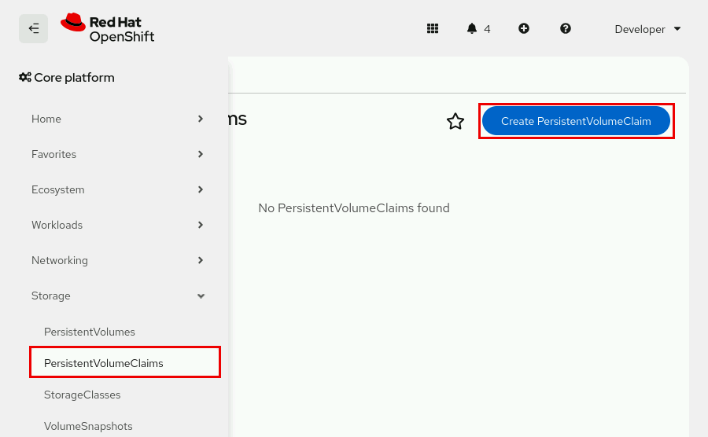

Nhấp vào **Create PersistentVolumeClaim** và hoàn tất biểu mẫu bằng cách nhập tên, lớp lưu trữ (storage class), dung lượng, chế độ truy cập và chế độ volume.

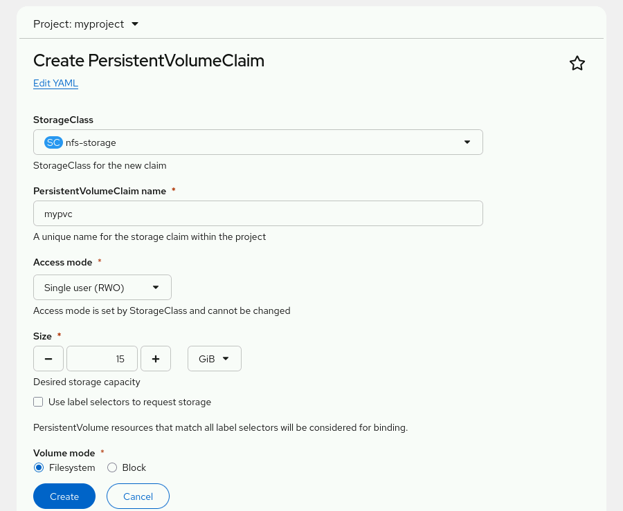

#### Cấp phát động trong Kubernetes
PV được định nghĩa bởi một đối tượng API PersistentVolume, đại diện cho tài nguyên lưu trữ hiện có trong cụm (cluster). Quản trị viên cụm phải cấp phát tĩnh một số loại hình lưu trữ nhất định. Ngoài ra, cơ chế persistent volume của Kubernetes cũng có thể sử dụng đối tượng StorageClass để cấp phát PV một cách linh hoạt (động).

Để tạo PVC, các nhà phát triển cần chỉ định dung lượng lưu trữ, chế độ truy cập yêu cầu và storage class để mô tả cũng như phân loại loại hình lưu trữ đó. Vòng lặp điều khiển (control loop) trên node điều khiển của RHOCP sẽ theo dõi các PVC mới và thực hiện liên kết (bind) PVC đó với một PV phù hợp. Nếu không có sẵn PV phù hợp, thành phần cấp phát (provisioner) của storage class đó sẽ tạo ra một PV mới.

Các yêu cầu (claim) sẽ không được liên kết vô thời hạn nếu không tìm thấy volume phù hợp hoặc không thể tạo volume bằng bất kỳ provisioner nào hỗ trợ storage class đó. Việc liên kết chỉ diễn ra khi có sẵn volume phù hợp. Ví dụ: một cụm có nhiều volume dung lượng 50 GiB được cấp phát thủ công sẽ không đáp ứng được yêu cầu của một PVC cần 100 GiB. PVC này sẽ được liên kết khi một PV dung lượng 100 GiB được thêm vào cụm.

Các nhà phát triển có thể chạy lệnh `oc get storageclass` để xem danh sách các storage class mà cụm cung cấp.

```console
[user@host ~]$ oc get storageclass
NAME                  PROVISIONER ...
lvms-vg1              topolvm.io  ...
nfs-storage (default) k8s-sigs.io/nfs-subdir-external-provisioner
```

Trong ví dụ này, `nfs-storage` được thiết lập làm storage class mặc định. Khi đã cấu hình storage class mặc định, PVC cần chỉ định rõ ràng tên của một storage class khác nếu muốn sử dụng, hoặc có thể đặt annotation `storageClassName` thành `""` để được gắn (bind) với một PV không có storage class.

Ví dụ về lệnh `oc set volume` dưới đây sử dụng tùy chọn `claim-class` để chỉ định một PV được cấp phát động (dynamically provisioned).

```console
[user@host ~]$ oc set volumes deployment/example-application \
--add --name example-pv-storage --type pvc \
--claim-class nfs-storage --claim-mode rwo --claim-size 15Gi \
--mount-path /var/lib/example-app --claim-name mypvc
```

> **Lưu ý:** Do quản trị viên cụm có thể thay đổi lớp lưu trữ (storage class) mặc định, Red Hat khuyến nghị bạn luôn chỉ định lớp lưu trữ khi tạo PVC.

#### Vòng đời của PV và PVC
Khi các nhà phát triển tạo PVC, họ yêu cầu một dung lượng lưu trữ, chế độ truy cập và lớp lưu trữ (storage class) cụ thể. Kubernetes sẽ gắn kết mỗi PVC với một PV phù hợp. Nếu không có PV nào phù hợp, một bộ cấp phát (provisioner) cho lớp lưu trữ đó sẽ tạo ra một PV mới.

**Hình 5.23: Vòng đời PV**  
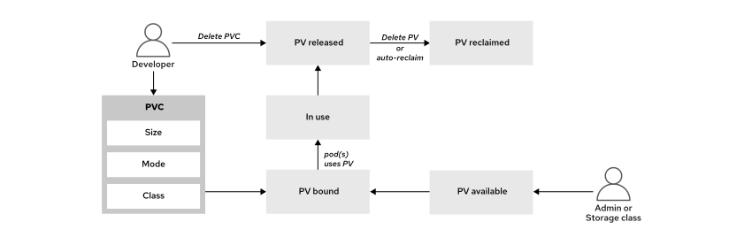

Các PV (Persistent Volume) tuân theo một vòng đời dựa trên mối quan hệ của chúng với PVC (Persistent Volume Claim).

**Available (Khả dụng)**  
Sau khi được tạo, PV trở nên khả dụng để bất kỳ PVC nào trong cụm (cluster) – thuộc bất kỳ namespace nào – có thể sử dụng.

**Bound (Đã liên kết)**  
Một PV đã liên kết với một PVC cũng sẽ gắn liền với cùng namespace của PVC đó, và không có PVC nào khác có thể sử dụng nó.

**In use (Đang được sử dụng)**  
Bạn có thể xóa một PVC nếu không có pod nào đang thực sự sử dụng nó. Tính năng "Storage Object in Use Protection" (Bảo vệ đối tượng lưu trữ đang được sử dụng) ngăn chặn việc xóa các PV và PVC đã liên kết mà các pod đang sử dụng. Việc xóa như vậy có thể dẫn đến mất dữ liệu. Tính năng này được bật theo mặc định. 

Nếu người dùng xóa một PVC đang được pod sử dụng, PVC đó sẽ không bị xóa ngay lập tức. Việc xóa PVC bị trì hoãn cho đến khi không còn pod nào sử dụng nó nữa. Tương tự, nếu quản trị viên cụm xóa một PV đã liên kết với PVC, PV đó cũng không bị xóa ngay lập tức. Việc xóa PV bị trì hoãn cho đến khi PV không còn liên kết với PVC nào.

**Released (Đã giải phóng)**  
Sau khi nhà phát triển xóa PVC đã liên kết với PV, PV đó được giải phóng và tài nguyên lưu trữ mà PV từng sử dụng có thể được thu hồi.

**Reclaimed (Đã thu hồi)**  
Chính sách thu hồi (reclaim policy) của một PV quy định cụm sẽ xử lý volume đó như thế nào sau khi nó được giải phóng. Chính sách thu hồi của một volume có thể là Retain (Giữ lại) hoặc Delete (Xóa).

**Bảng 5.4. Chính sách thu hồi volume**

| Chính sách | Mô tả                                                                                                                             |
|------------|-----------------------------------------------------------------------------------------------------------------------------------|
| Retain     | Cho phép thu hồi tài nguyên theo cách thủ công đối với các trình cắm (plugin) ổ đĩa hỗ trợ tính năng này.                         |
| Delete     | Xóa cả đối tượng PersistentVolume khỏi OpenShift Container Platform và tài nguyên lưu trữ liên quan trên cơ sở hạ tầng bên ngoài. |

#### Mở rộng Persistent Volume Claim
Sau khi tạo PVC, các nhà phát triển có thể mở rộng dung lượng lưu trữ khi dữ liệu của ứng dụng vượt quá kích thước được cấp phát ban đầu. Để mở rộng PVC, trường `allowVolumeExpansion` của StorageClass phải được đặt thành `true`.

Hãy sử dụng lệnh `oc patch` để tăng giá trị trường `spec.resources.requests.storage` của PVC.

```console
[user@host ~]$ oc patch pvc/mypvc \
--type merge \
-p '{"spec": {"resources": {"requests": {"storage": "30Gi"}}}}'
```

Bạn có thể tăng kích thước volume nhưng không thể giảm kích thước này.

Nếu quá trình mở rộng volume thất bại do nhà cung cấp dịch vụ lưu trữ không thể đáp ứng yêu cầu, bộ điều khiển mở rộng sẽ liên tục thử lại yêu cầu đó. Bạn có thể khắc phục lỗi mở rộng bằng cách giảm kích thước được yêu cầu trong trường `spec.resources.requests.storage` xuống mức mà hệ thống lưu trữ (storage back-end) có thể đáp ứng. Kích thước mới này vẫn phải lớn hơn giá trị hiện tại của trường `status.capacity` trong PVC.

```console
[user@host ~]$ oc patch pvc/mypvc \
--type merge \
-p '{"spec": {"resources": {"requests": {"storage": "20Gi"}}}}'
```

> **Lưu ý:** Trong các phiên bản RHOCP trước đây, việc khôi phục sau khi quá trình mở rộng PVC thất bại đòi hỏi sự can thiệp thủ công của quản trị viên, bao gồm các thao tác thay đổi chính sách thu hồi (reclaim policy), xóa PVC và tạo lại PVC với kích thước nhỏ hơn. Kể từ phiên bản RHOCP 4.19, các nhà phát triển có thể khôi phục sau lỗi mở rộng mà không cần sự can thiệp của quản trị viên bằng cách yêu cầu kích thước nhỏ hơn.

#### Xóa Persistent Volume Claim
Để xóa PVC, hãy sử dụng lệnh `oc delete`. Sau khi bạn xóa PVC, storage class sẽ thu hồi volume.

```console
[user@host ~]$ oc delete pvc/mypvc
```

## Lựa chọn Lớp lưu trữ cho ứng dụng
### Lựa chọn Lớp lưu trữ
Storage class (lớp lưu trữ) xác định các loại hình lưu trữ cho cụm (cluster) và thực hiện cấp phát lưu trữ động theo yêu cầu. Quản trị viên cụm là người quy định ý nghĩa của storage class; khái niệm này còn được gọi là "profile" trong các hệ thống lưu trữ khác. Ví dụ, quản trị viên có thể tạo một storage class dành cho môi trường phát triển và một storage class khác cho môi trường vận hành thực tế (production).

Kubernetes hỗ trợ nhiều hệ thống lưu trữ nền tảng (storage back-end). Các tùy chọn lưu trữ này khác nhau về chi phí, hiệu năng, độ tin cậy và tính năng. Quản trị viên có thể tạo các storage class khác nhau tương ứng với những tùy chọn này. Nhờ đó, các nhà phát triển có thể lựa chọn giải pháp lưu trữ phù hợp với nhu cầu của ứng dụng mà không cần phải nắm rõ các chi tiết kỹ thuật về cơ sở hạ tầng lưu trữ.

Quản trị viên sẽ chọn một storage class mặc định để phục vụ việc cấp phát động. Storage class mặc định cho phép Kubernetes tự động cấp phát tài nguyên cho các PVC (Persistent Volume Claim) không chỉ định cụ thể storage class nào. Do quản trị viên có thể thay đổi storage class mặc định, nhà phát triển nên chỉ định rõ storage class cho ứng dụng của mình.

#### Chính sách thu hồi
Ngoài các khía cạnh về chức năng ứng dụng, nhà phát triển cũng cần cân nhắc tác động của chính sách thu hồi (reclaim policy) đối với các yêu cầu về lưu trữ.

Chính sách thu hồi xác định điều gì sẽ xảy ra với dữ liệu trên PVC sau khi PVC đó bị xóa. Khi không còn nhu cầu sử dụng volume, bạn có thể xóa đối tượng PVC thông qua API, qua đó cho phép thu hồi tài nguyên. Kubernetes sẽ giải phóng volume khi PVC bị xóa, nhưng volume này chưa thể được cấp phát cho một yêu cầu (claim) khác ngay lập tức. Dữ liệu của người dùng trước đó vẫn còn trên volume và cần được xử lý theo đúng chính sách đã định. Để giữ lại dữ liệu, hãy chọn một storage class có chính sách thu hồi là `retain` (giữ lại).

Khi sử dụng chính sách thu hồi `retain`, việc xóa PVC chỉ loại bỏ đối tượng PVC khỏi cluster. PV hỗ trợ cho PVC đó, thiết bị lưu trữ vật lý mà PV sử dụng, cũng như dữ liệu của bạn vẫn được giữ nguyên. Để thu hồi và tái sử dụng tài nguyên lưu trữ này trong cluster, quản trị viên cluster cần thực hiện các thao tác thủ công.

Để thu hồi thủ công một PV với tư cách là quản trị viên cluster, hãy thực hiện các bước sau:

1. Hãy sao lưu thông tin PV để sử dụng sau này. Nếu cần khôi phục quyền truy cập vào dữ liệu, bạn có thể sử dụng tệp sao lưu để tạo một PV sử dụng cùng thiết bị lưu trữ đó.

```console
[user@host ~]$ oc get pv pv-name -o yaml > pv-name.yaml
```

2. Xóa PV.

```console
[user@host ~]$ oc delete pv pv-name
```

Tài sản liên kết trong cơ sở hạ tầng lưu trữ bên ngoài—chẳng hạn như Amazon Web Services (AWS) Elastic Block Store (EBS), Google Compute Engine (GCE) Persistent Disk, Azure Disk hoặc volume Cinder—vẫn tồn tại sau khi PV bị xóa.

3. Tại thời điểm này, quản trị viên cụm có thể tạo một PV khác bằng cách sử dụng cùng tài nguyên lưu trữ và dữ liệu từ PV trước đó. Sau đó, nhà phát triển có thể mount PV mới này và truy cập dữ liệu từ PV cũ.

4. Ngoài ra, quản trị viên cụm cũng có thể xóa dữ liệu trên tài nguyên lưu trữ và sau đó xóa chính tài nguyên lưu trữ đó.

Để tự động xóa PV, dữ liệu và bộ lưu trữ vật lý tương ứng với một PVC đã bị xóa, bạn cần chọn một storage class sử dụng chính sách thu hồi (reclaim policy) là `delete`. Chính sách này sẽ tự động thu hồi volume lưu trữ khi PVC bị xóa. Chính sách thu hồi `delete` là thiết lập mặc định cho tất cả các trình cung cấp bộ lưu trữ (storage provisioner) tuân thủ tiêu chuẩn Kubernetes Container Storage Interface (CSI). Nếu bạn sử dụng một storage class không chỉ định rõ chính sách thu hồi, thì chính sách `delete` sẽ được áp dụng.

Để biết thêm thông tin về các tiêu chuẩn Kubernetes Container Storage Interface, vui lòng tham khảo trang web Tài liệu dành cho nhà phát triển Kubernetes CSI tại https://kubernetes-csi.github.io/docs/

#### Kubernetes và Trách nhiệm đối với Ứng dụng
Kubernetes không thay đổi cách thức ứng dụng tương tác với bộ lưu trữ. Ứng dụng chịu trách nhiệm làm việc với các thiết bị lưu trữ của mình cũng như đảm bảo tính toàn vẹn và nhất quán của dữ liệu.

Cơ chế lưu trữ của Kubernetes không ngăn chặn ứng dụng thực hiện các hành động thiếu an toàn, chẳng hạn như chia sẻ một volume dữ liệu giữa hai cơ sở dữ liệu vốn yêu cầu quyền truy cập độc quyền vào dữ liệu đó.

Do PVC (Persistent Volume Claim) là một thiết bị lưu trữ được host Linux mount (gắn) vào, nên một ứng dụng được cấu hình không đúng cách có thể dẫn đến các hành vi ngoài ý muốn. Ví dụ: bạn có thể có một iSCSI LUN (Logical Unit Number) – được biểu diễn dưới dạng PVC có chế độ ReadWriteOnce (RWO) và không được thiết kế để chia sẻ – nhưng lại mount cùng PVC đó vào hai pod trên cùng một host. Việc tình huống này có gây ra vấn đề hay không còn tùy thuộc vào bản thân các ứng dụng đó.

Thông thường, việc hai tiến trình trên cùng một host chia sẻ một ổ đĩa là điều bình thường; xét cho cùng, nhiều ứng dụng trên máy tính cá nhân của bạn cũng chia sẻ một ổ đĩa cục bộ. Tuy nhiên, không có gì ngăn cản một trình soạn thảo văn bản ghi đè và làm mất toàn bộ nội dung chỉnh sửa từ một trình soạn thảo khác. Việc sử dụng bộ lưu trữ trong Kubernetes cũng đòi hỏi sự cẩn trọng tương tự.

Các chế độ truy cập đơn node (RWO) và truy cập chia sẻ (RWX) không đảm bảo rằng các tệp tin có thể được chia sẻ một cách an toàn và đáng tin cậy. RWO có nghĩa là chỉ một node trong cụm (cluster node) có thể đọc và ghi vào PVC. Ngược lại, với RWX, Kubernetes cung cấp một volume lưu trữ mà bất kỳ pod nào cũng có thể truy cập để đọc hoặc ghi dữ liệu.

### Các trường hợp sử dụng cho các lớp lưu trữ
Quản trị viên tạo ra các lớp lưu trữ (storage class) nhằm đáp ứng nhu cầu của các nhà phát triển. Mỗi lớp lưu trữ được định nghĩa bởi một đối tượng StorageClass; đối tượng này chứa thông tin về nhà cung cấp dịch vụ lưu trữ và các khả năng của phương tiện lưu trữ. Nhà cung cấp sẽ tạo ra các PV (Persistent Volume) phù hợp với các thông số kỹ thuật của lớp lưu trữ đó. Quản trị viên có thể tạo ra các lớp lưu trữ với nhiều cấp độ chức năng khác nhau, dựa trên nhiều yếu tố.

**Các chế độ volume lưu trữ**  
Lớp lưu trữ hỗ trợ chế độ volume dạng khối (block volume mode) có thể giúp tăng hiệu năng cho các ứng dụng có khả năng sử dụng thiết bị khối thô (raw block device). Hãy cân nhắc sử dụng lớp lưu trữ hỗ trợ chế độ volume dạng hệ thống tệp (Filesystem volume mode) cho các ứng dụng cần chia sẻ tệp hoặc cung cấp quyền truy cập tệp.

**Các cấp độ Chất lượng Dịch vụ (QoS)**  
Ổ cứng thể rắn (SSD) mang lại tốc độ cao và hỗ trợ tốt cho các tệp được truy cập thường xuyên. Hãy sử dụng ổ cứng truyền thống (HDD) – loại có chi phí thấp hơn và tốc độ chậm hơn – cho các tệp ít được truy cập.

**Cấp độ hỗ trợ quản trị**  
Lớp lưu trữ dành cho môi trường vận hành thực tế (production-tier) có thể bao gồm các volume được sao lưu thường xuyên. Ngược lại, lớp lưu trữ dành cho môi trường phát triển (development-tier) có thể bao gồm các volume không được thiết lập lịch trình sao lưu.

> **Lưu ý:** Trong môi trường chủ quyền (sovereign environment), hãy cân nhắc các yếu tố khác như quy định về nơi lưu trữ dữ liệu (data residency) và các yêu cầu tuân thủ khi tạo và lựa chọn lớp lưu trữ. Ví dụ, một lớp lưu trữ có thể giới hạn vị trí địa lý của ổ đĩa lưu trữ hoặc áp dụng các thiết lập mã hóa phù hợp với các yêu cầu về chủ quyền dữ liệu.

Các storage class có thể kết hợp những yếu tố này cùng các yếu tố khác để đáp ứng tốt nhất nhu cầu của nhà phát triển.

Kubernetes sẽ khớp PVC với PV phù hợp nhất hiện có mà chưa bị ràng buộc với PVC nào khác. PV phải cung cấp chế độ truy cập (access mode) được chỉ định trong PVC, đồng thời dung lượng volume phải lớn hơn hoặc bằng kích thước được yêu cầu trong PVC. Các chế độ truy cập được hỗ trợ sẽ phụ thuộc vào khả năng của nhà cung cấp dịch vụ lưu trữ. PVC có thể chỉ định thêm các tiêu chí khác, chẳng hạn như tên của storage class. Nếu không tìm thấy PV nào đáp ứng tất cả các tiêu chí, PVC sẽ chuyển sang trạng thái chờ (pending) cho đến khi có PV phù hợp.

PVC có thể yêu cầu một storage class cụ thể bằng cách chỉ định thuộc tính `storageClassName`. Phương thức chọn storage class cụ thể này giúp đảm bảo rằng phương tiện lưu trữ phù hợp với các yêu cầu của ứng dụng. Chỉ những PV thuộc storage class được yêu cầu mới có thể được liên kết với PVC đó. Quản trị viên cụm (cluster administrator) có thể cấu hình các trình cấp phát động (dynamic provisioner) để phục vụ các storage class. Ngoài ra, quản trị viên cũng có thể tạo PV theo yêu cầu sao cho khớp với các thông số kỹ thuật được nêu trong PVC.

### Tạo Storage Class
Đoạn mã YAML dưới đây mô tả định nghĩa cho một đối tượng StorageClass. Quản trị viên cụm hoặc người dùng có quyền quản trị lưu trữ sẽ tạo ra các đối tượng StorageClass có phạm vi toàn cục. Tài nguyên dưới đây hiển thị các tham số để cấu hình một lớp lưu trữ (storage class). Ví dụ này sử dụng định nghĩa đối tượng AWS EBS.

```yaml
apiVersion: storage.k8s.io/v1 (1)
kind: StorageClass (2)
metadata:
  name: io1-gold-storage (3)
  annotations: (4)
    storageclass.kubernetes.io/is-default-class: 'false'
    kubernetes.io/description: Provides RWO and RWOP volumes
...output omitted...
parameters: (5)
  type: io1
  iopsPerGB: "10"
...output omitted...
provisioner: ebs.csi.aws.com (6)
reclaimPolicy: Delete (7)
volumeBindingMode: WaitForFirstConsumer (8)
allowVolumeExpansion: true (9)
```

1. Một mục bắt buộc xác định phiên bản API hiện tại.
2. Một mục bắt buộc xác định loại đối tượng API.
3. Một mục bắt buộc xác định tên của storage class (lớp lưu trữ).
4. Một mục tùy chọn xác định các chú thích (annotations) cho storage class.
5. Một mục tùy chọn xác định các tham số cần thiết cho trình cung cấp (provisioner) cụ thể; đối tượng này khác nhau tùy theo từng plug-in.
6. Một mục bắt buộc xác định loại trình cung cấp (provisioner) được liên kết với storage class này.
7. Một mục tùy chọn xác định chính sách thu hồi (reclaim policy) được chọn cho storage class.
8. Một mục tùy chọn xác định chế độ liên kết volume (volume binding mode) được chọn cho storage class.
9. Một mục tùy chọn xác định cài đặt mở rộng volume.

Một số thuộc tính, chẳng hạn như phiên bản API, loại đối tượng API và chú thích (annotations), là các thuộc tính chung cho các đối tượng Kubernetes, trong khi những thuộc tính khác lại đặc thù cho các đối tượng StorageClass.

**Parameters**  
Các tham số cho phép cấu hình loại tệp, thay đổi loại lưu trữ, bật tính năng mã hóa, bật tính năng sao chép (replication), v.v. Mỗi trình cung cấp (provisioner) có các tùy chọn tham số khác nhau. Các tham số được chấp nhận sẽ phụ thuộc vào trình cung cấp lưu trữ. Ví dụ: giá trị `io1` cho tham số `type` và tham số `iopsPerGB` là các tham số dành riêng cho EBS. Khi một tham số bị bỏ qua, trình cung cấp lưu trữ sẽ sử dụng giá trị mặc định.

**Provisioners**  
Thuộc tính `provisioner` xác định nguồn của plugin phương tiện lưu trữ. Các trình cung cấp có tên bắt đầu bằng giá trị `kubernetes.io` sẽ có sẵn theo mặc định trong cụm Kubernetes.

**ReclaimPolicy**  
Chính sách thu hồi mặc định là `Delete` (Xóa); chính sách này sẽ tự động thu hồi (xóa) volume lưu trữ khi PVC bị xóa. Việc thu hồi lưu trữ theo cách này có thể giúp giảm chi phí lưu trữ. Chính sách thu hồi `Retain` (Giữ lại) không xóa volume lưu trữ, nhờ đó dữ liệu không bị mất nếu chẳng may xóa nhầm PVC. Tuy nhiên, chính sách này có thể dẫn đến chi phí lưu trữ cao hơn nếu không gian lưu trữ không được thu hồi thủ công.

**VolumeBindingMode**  
Thuộc tính `volumeBindingMode` xác định cách thức xử lý việc gắn volume (volume attachment) cho một PVC đang yêu cầu. Việc sử dụng chế độ liên kết volume mặc định là `Immediate` (Ngay lập tức) sẽ tạo ra một PV khớp với PVC ngay khi PVC được tạo. Cài đặt này không chờ đến khi pod sử dụng PVC mới thực hiện liên kết, do đó có thể gây kém hiệu quả. Chế độ liên kết `Immediate` cũng có thể gây ra vấn đề đối với các hệ thống lưu trữ phụ trợ (storage back-end) bị giới hạn về mặt cấu trúc liên kết (topology) hoặc không thể truy cập toàn cục từ các node trong cụm. Ngoài ra, các PV được liên kết mà không tính đến các yêu cầu lập lịch của pod, điều này có thể dẫn đến tình trạng pod không thể được lập lịch (unschedulable). 

Khi sử dụng chế độ `WaitForFirstConsumer` (Chờ người dùng đầu tiên), volume sẽ được tạo sau khi pod sử dụng PVC bắt đầu hoạt động. Với chế độ này, Kubernetes sẽ tạo các PV tuân thủ các ràng buộc lập lịch của pod, chẳng hạn như yêu cầu về tài nguyên và các bộ chọn (selectors).

**AllowVolumeExpansion**  
Khi được đặt thành giá trị `true`, storage class (lớp lưu trữ) quy định rằng volume lưu trữ bên dưới có thể được mở rộng nếu cần thêm dung lượng. Người dùng có thể thay đổi kích thước volume bằng cách chỉnh sửa đối tượng PVC tương ứng. Tính năng này chỉ có thể được sử dụng để tăng kích thước volume chứ không thể dùng để thu nhỏ volume.

Quản trị viên cụm có thể sử dụng lệnh `create` để tạo một storage class từ tệp manifest YAML. Storage class được tạo ra không bị giới hạn trong một namespace cụ thể, do đó nó khả dụng cho tất cả các dự án trong cụm.

```console
[user@host ~]$ oc create -f storage-class-filename.yaml
```

Để tạo StorageClass từ bảng điều khiển web, hãy đăng nhập với tư cách quản trị viên, truy cập Storage → StorageClasses và nhấp vào Create StorageClass. Sau đó, hoàn tất biểu mẫu hoặc tệp cấu hình YAML.

#### Các Lớp Lưu trữ Cụm
Sử dụng lệnh `oc get storageclass` để xem các tùy chọn storage class có sẵn trong cụm.

```console
[user@host ~]$ oc get storageclass
```

Người dùng cụm thông thường có thể xem các thuộc tính của lớp lưu trữ (storage class) bằng cách sử dụng lệnh `describe`. Ví dụ sau đây truy vấn các thuộc tính của lớp lưu trữ có tên là `lvms-vg1`.

```console
[user@host ~]$ oc describe storageclass lvms-vg1
IsDefaultClass:        No
Annotations:           description=Provides RWO and RWOP volumes
Provisioner:           topolvm.io
Parameters:            csi.storage.k8s.io/fstype=xfs,topolvm.io/device-class=vg1
AllowVolumeExpansion:  True
MountOptions:          <none>
ReclaimPolicy:         Delete
VolumeBindingMode:     WaitForFirstConsumer
Events:                <none>
```

Lệnh `describe` có thể giúp nhà phát triển xác định xem lớp lưu trữ (storage class) có phù hợp với ứng dụng hay không. Nếu không có lớp lưu trữ nào trong cụm (cluster) phù hợp với ứng dụng, nhà phát triển có thể yêu cầu quản trị viên cụm tạo một PV (Persistent Volume) với các tính năng cần thiết.

> **Lưu ý:** OpenShift chạy trên cơ sở hạ tầng được quản lý (chẳng hạn như Red Hat OpenShift Service on AWS - ROSA và Azure Red Hat OpenShift) thường được cấu hình sẵn các lớp lưu trữ (storage class) dành riêng cho nền tảng đó. Ví dụ: trong môi trường ROSA, lớp lưu trữ `gp3-csi` có sẵn theo mặc định để tạo PVC sử dụng các volume Amazon Elastic Block Store.

### Cách sử dụng lớp lưu trữ
Hãy nhớ rằng lệnh `oc set volume` có thể thêm một PVC và PV tương ứng vào một deployment. Một tệp cấu hình YAML có thể khai báo các tham số của PVC một cách độc lập với deployment. Đây là phương pháp được ưu tiên nhằm hỗ trợ tính lặp lại, quản lý cấu hình và kiểm soát phiên bản. Hãy sử dụng thuộc tính `storageClassName` để chỉ định lớp lưu trữ (storage class) cho PVC.

```yaml
apiVersion: v1
kind: PersistentVolumeClaim
metadata:
  name: my-block-pvc
spec:
  accessModes:
    - ReadWriteOnce
  volumeMode: Block
  storageClassName: storage-class-name
  resources:
    requests:
      storage: 10Gi
```

Sử dụng lệnh `create` để tạo tài nguyên từ tệp manifest YAML.

```console
[user@host ~]$ oc create -f my-pvc-filename.yaml
```

Sử dụng tùy chọn `--claim-name` cùng với lệnh `set volume` để thêm PVC hiện có vào một deployment.

```console
[user@host ~]$ oc set volume deployment/deployment-name \
--add --name my-volume-name \
--claim-name my-block-pvc \
--mount-path /var/tmp
```

## Quản lý bộ nhớ không chia sẻ với StatefulSet
### Phân cụm ứng dụng
Các ứng dụng chạy theo mô hình cụm (clustering), chẳng hạn như MySQL và Cassandra, thường yêu cầu hệ thống lưu trữ bền vững (persistent storage). Hệ thống này đảm bảo tính toàn vẹn cho dữ liệu và các tệp tin mà ứng dụng sử dụng. Khi nhiều ứng dụng cùng yêu cầu lưu trữ bền vững, việc cấp phát nhiều ổ đĩa riêng biệt có thể trở nên bất khả thi do hạn chế về tài nguyên.

Giải pháp lưu trữ chia sẻ (shared storage) khắc phục vấn đề này bằng cách phân bổ tài nguyên từ một thiết bị duy nhất cho nhiều dịch vụ khác nhau.

#### Lưu trữ tệp
Các giải pháp lưu trữ tệp cung cấp cấu trúc thư mục quen thuộc. Việc sử dụng lưu trữ tệp là lựa chọn lý tưởng khi các ứng dụng tạo ra hoặc xử lý một lượng dữ liệu có tổ chức ở mức thông thường. Các ứng dụng sử dụng cơ chế lưu trữ dựa trên tệp rất phổ biến, dễ quản lý và mang lại giải pháp lưu trữ với chi phí hợp lý.

Các giải pháp dựa trên tệp rất phù hợp cho các dịch vụ sao lưu dữ liệu, lưu trữ dài hạn (archiving), chia sẻ tệp và cộng tác nhờ vào độ tin cậy cao. Hầu hết các trung tâm dữ liệu đều cung cấp các giải pháp lưu trữ tệp, chẳng hạn như cụm thiết bị lưu trữ gắn vào mạng (NAS), để đáp ứng các nhu cầu này.

NAS là một kiến trúc lưu trữ dựa trên tệp, cho phép các thiết bị trong mạng truy cập vào dữ liệu được lưu trữ. NAS cung cấp cho mạng một điểm truy cập lưu trữ duy nhất, đi kèm với các tính năng tích hợp về bảo mật, quản lý và khả năng chịu lỗi. Các mạng có thể vận hành nhiều giao thức truyền tải dữ liệu khác nhau; trong đó, hai giao thức cơ bản là Giao thức Internet (IP) và Giao thức Điều khiển Truyền tải (TCP).

Các tệp tin được truyền tải bằng những giao thức này có thể được định dạng theo một trong các giao thức sau:

* Network File System (NFS): Giao thức này cho phép các máy chủ từ xa gắn (mount) các hệ thống tập tin qua mạng và tương tác với chúng như thể chúng được gắn cục bộ.
* Server Message Block (SMB): Giao thức này triển khai một giao thức mạng ở tầng ứng dụng để truy cập các tài nguyên trên máy chủ, chẳng hạn như thư mục chia sẻ và máy in dùng chung.

Các giải pháp NAS có thể cung cấp khả năng lưu trữ dựa trên tệp cho các ứng dụng trong cùng một trung tâm dữ liệu. Phương pháp này áp dụng cho các kiến trúc ứng dụng sau:

* Nội dung máy chủ web
* Dịch vụ chia sẻ tệp
* Lưu trữ FTP
* Kho lưu trữ sao lưu

Các ứng dụng này tận dụng độ tin cậy của dữ liệu và khả năng chia sẻ tệp dễ dàng mà hệ thống lưu trữ tệp mang lại. Ngoài ra, đối với dữ liệu lưu trữ dạng tệp, hệ điều hành và hệ thống tệp sẽ đảm nhiệm việc khóa và lưu đệm (caching) các tệp tin.

Mặc dù quen thuộc và phổ biến, các giải pháp lưu trữ tệp không phải là lựa chọn lý tưởng cho mọi tình huống ứng dụng. Một hạn chế của lưu trữ tệp là khả năng xử lý kém đối với các tập dữ liệu lớn hoặc dữ liệu phi cấu trúc.

> **Lưu ý:** Quản trị viên của các cụm Red Hat OpenShift Service on AWS (ROSA) có thể tạo các lớp lưu trữ (storage class) sử dụng các volume từ Amazon Elastic File System (EFS) – một dịch vụ lưu trữ tệp được quản lý toàn diện và có khả năng mở rộng.  
> Tương tự, bạn có thể tạo các lớp lưu trữ sử dụng volume từ Azure Files với các cụm Microsoft Azure Red Hat OpenShift.  
> Các cụm Red Hat OpenShift Dedicated có thể sử dụng Google Cloud Filestore để lưu trữ tệp.

#### Lưu trữ khối
Các giải pháp lưu trữ khối (block storage), chẳng hạn như công nghệ SAN (Storage Area Network) và iSCSI, cung cấp khả năng truy cập vào các thiết bị khối thô để phục vụ nhu cầu lưu trữ của ứng dụng. Các thiết bị khối này hoạt động như những phân vùng lưu trữ độc lập—tương tự như các ổ đĩa vật lý trong máy chủ—và thường cần được định dạng (format) cũng như gắn kết (mount) để ứng dụng có thể truy cập.

Việc sử dụng lưu trữ khối là lựa chọn lý tưởng khi các ứng dụng đòi hỏi tốc độ truy cập cao nhằm tối ưu hóa những khối lượng công việc xử lý dữ liệu nặng. Các ứng dụng triển khai cơ chế lưu trữ ở cấp độ khối sẽ đạt hiệu suất cao hơn nhờ khả năng giao tiếp trực tiếp với thiết bị thô, thay vì phải phụ thuộc vào cơ chế truy cập thông qua lớp hệ điều hành.

Phương thức tiếp cận ở cấp độ khối cho phép phân tán dữ liệu trên các khối trải khắp phân vùng lưu trữ. Các khối này cũng sử dụng siêu dữ liệu (metadata) cơ bản—bao gồm mã định danh duy nhất cho từng khối dữ liệu—để hỗ trợ việc truy xuất nhanh chóng và tái hợp các khối khi cần đọc dữ liệu.

Công nghệ SAN và iSCSI cung cấp cho ứng dụng các phân vùng lưu trữ cấp độ khối được trích xuất từ các nhóm tài nguyên lưu trữ (storage pool) trên mạng. Việc sử dụng phương thức truy cập lưu trữ ở cấp độ khối thường được áp dụng cho các kiến trúc ứng dụng sau:

* Cơ sở dữ liệu SQL (truy cập đơn nút)
* Máy ảo (truy cập đa nút)
* Truy cập dữ liệu hiệu năng cao
* Các ứng dụng xử lý phía máy chủ
* Cấu hình RAID cho nhiều thiết bị khối (block device)

Bộ lưu trữ ứng dụng sử dụng nhiều thiết bị khối (block device) trong cấu hình RAID sẽ được hưởng lợi từ tính toàn vẹn dữ liệu và hiệu năng mà các mảng lưu trữ này mang lại.

Với Red Hat OpenShift Container Platform, bạn có thể tạo các lớp lưu trữ (storage class) tùy chỉnh cho ứng dụng của mình. Nhờ các công nghệ lưu trữ NAS và SAN, ứng dụng trên OpenShift có thể sử dụng giao thức NFS cho lưu trữ dựa trên tệp (file-based storage) hoặc giao thức cấp khối (block-level protocol) cho lưu trữ khối (block storage).

#### Stateful Sets
Ứng dụng có trạng thái (stateful application) hoạt động dựa trên các trạng thái hoặc giao dịch trong quá khứ; những yếu tố này ảnh hưởng đến trạng thái hiện tại và tương lai của ứng dụng. Việc sử dụng ứng dụng có trạng thái giúp đơn giản hóa quá trình khôi phục sau sự cố nhờ khả năng bắt đầu lại từ một thời điểm xác định.

StatefulSet đại diện cho một tập hợp các pod có định danh nhất quán. Các định danh này được xác định thông qua cấu trúc mạng với tên DNS và hostname ổn định, cùng với bộ nhớ được cấp phát từ các yêu cầu volume (volume claim) theo quy định của StatefulSet. StatefulSet đảm bảo rằng một định danh mạng cụ thể luôn ánh xạ tới cùng một định danh bộ nhớ.

Deployment đại diện cho một tập hợp các container nằm trong một pod. Mỗi Deployment có thể có nhiều bản sao (replica) đang hoạt động, tùy thuộc vào cấu hình của người dùng. Số lượng bản sao này có thể được tăng hoặc giảm tùy theo nhu cầu. ReplicaSet là một đối tượng API gốc của Kubernetes, có nhiệm vụ đảm bảo duy trì số lượng bản sao pod theo quy định. Theo mặc định, Deployment được sử dụng cho các ứng dụng không trạng thái (stateless), nhưng cũng có thể dùng cho ứng dụng có trạng thái bằng cách gắn thêm persistent volume (bộ nhớ bền vững). Tất cả các pod trong một Deployment đều sử dụng chung một PVC (Persistent Volume Claim).

Trái ngược với Deployment, các pod trong StatefulSet không dùng chung persistent volume. Thay vào đó, mỗi pod thuộc StatefulSet sở hữu một persistent volume riêng biệt và duy nhất. Các pod được tạo ra mà không cần thông qua ReplicaSet, và mỗi bản sao sẽ tự ghi lại các giao dịch của riêng mình. Mỗi bản sao có một định danh riêng và định danh này được duy trì ngay cả khi pod được lập lịch lại (rescheduling). Bạn cần cấu hình cơ chế clustering ở cấp độ ứng dụng để đảm bảo các pod trong StatefulSet có dữ liệu đồng nhất.

StatefulSet là lựa chọn tối ưu cho các ứng dụng (chẳng hạn như cơ sở dữ liệu) đòi hỏi định danh nhất quán và bộ nhớ bền vững không chia sẻ chung giữa các pod.

#### Headless Service cho StatefulSet
StatefulSet yêu cầu một headless service để cung cấp định danh mạng ổn định cho các pod của nó. Khác với một service thông thường vốn được cấp một địa chỉ IP ổn định duy nhất (clusterIP) để cân bằng tải, headless service không có địa chỉ clusterIP.

Bạn tạo một headless service bằng cách thiết lập trường `clusterIP` của nó thành `None`. Khi thực hiện truy vấn DNS đối với headless service, máy chủ DNS sẽ trả về địa chỉ IP của tất cả các pod riêng lẻ mà service đó quản lý. Tính năng này cho phép các client kết nối trực tiếp tới một pod cụ thể thay vì phải đi qua bộ cân bằng tải.

Đối với StatefulSet, cơ chế này đóng vai trò cực kỳ quan trọng. Khi bạn liên kết một StatefulSet với một headless service, mỗi pod trong tập hợp đó sẽ có một bản ghi DNS duy nhất và có thể dự đoán trước. Bản ghi DNS này tuân theo định dạng `<pod-name>.<service-name>.<namespace>.svc.cluster.local`. Ví dụ, một pod có tên `dbserver-0` được quản lý bởi headless service tên là `mysql-headless` có thể được truy cập một cách ổn định thông qua tên miền đầy đủ (FQDN) là `dbserver-0.mysql-headless`.

Định danh ổn định này cho phép các pod trong một ứng dụng dạng cụm (cluster) có thể tự phát hiện lẫn nhau và giao tiếp trực tiếp với nhau. Những khả năng này rất thiết yếu đối với các ứng dụng như cơ sở dữ liệu phân tán, nơi các pod cụ thể cần được truy cập trực tiếp để thực hiện các thao tác như ghi dữ liệu hoặc sao chép dữ liệu (replication).

### Làm việc với StatefulSet
Với Kubernetes, bạn có thể sử dụng các tệp manifest để xác định cấu hình mong muốn cho một StatefulSet. Bạn có thể định nghĩa tên ứng dụng, các nhãn (label), nguồn image, bộ nhớ, biến môi trường, v.v. Đoạn mã dưới đây minh họa một tệp manifest YAML mẫu dành cho một StatefulSet có tên là dbserver:

```yaml
apiVersion: apps/v1
kind: StatefulSet
metadata:
  name: dbserver (1)
spec:
  selector:
    matchLabels:
      app: database (2)
  replicas: 3 (3)
  serviceName: mysql (4)
  template:
    metadata:
      labels:
        app: database (5)
    spec:
      containers:
      - env: (6)
        - name: MYSQL_USER
          valueFrom:
            secretKeyRef:
              key: user
              name: sakila-cred
        image: registry.lab.example.com:8443/redhattraining/mysql-app:v1 (7)
        name: database (8)
        ports: (9)
        - containerPort: 3306
          name: database
        volumeMounts: (10)
        - mountPath: /var/lib/mysql
          name: data
      terminationGracePeriodSeconds: 10
  volumeClaimTemplates:
  - metadata:
      name: data
    spec:
      accessModes: [ "ReadWriteOncePod" ] (11)
      storageClassName: "lvms-vg1" (12)
      resources:
        requests:
          storage: 1Gi (13)
```

1. Tên của StatefulSet.
2. Các nhãn (label) của ứng dụng.
3. Số lượng bản sao (replica).
4. Tên của dịch vụ (service) quản lý StatefulSet. Dịch vụ này phải tồn tại trước khi StatefulSet được tạo.
6. Các biến môi trường; có thể được định nghĩa trực tiếp hoặc thông qua đối tượng Secret.
7. Nguồn ảnh (image source).
8. Tên container.
9. Các cổng (port) của container.
10. Thông tin đường dẫn gắn kết (mount path) cho các Persistent Volume của mỗi bản sao. Mỗi Persistent Volume đều có cấu hình giống nhau.
11. Chế độ truy cập của Persistent Volume. Các giá trị hợp lệ bao gồm ReadWriteOncePod, ReadWriteOnce, ReadWriteMany và ReadOnlyMany. Chế độ ReadWriteOncePod được khuyến nghị sử dụng cho môi trường sản xuất (production).
12. Storage Class mà Persistent Volume sử dụng.
13. Dung lượng của Persistent Volume.

> **Lưu ý:** Stateful set chỉ có thể được tạo bằng cách sử dụng các tệp manifest. Các công cụ dòng lệnh (CLI) như `oc` và `kubectl` không có lệnh để tạo stateful set theo phương thức mệnh lệnh (imperative).

Đoạn mã sau đây hiển thị ví dụ về tệp cấu hình YAML cho một headless service có tên là `mysql` dành cho StatefulSet `dbserver`:

```yaml
apiVersion: v1
kind: Service
metadata:
  name: mysql (1)
  labels:
    app: database
spec:
  ports:
  - port: 3306
    name: mysql
  clusterIP: None (2)
  selector:
    app: database (3)
```

1. Tên của headless service.
2. Thiết lập trường clusterIP thành None để biến service đó thành headless service.
3. Selector của service phải khớp với các nhãn (label) của các pod do StatefulSet tạo ra.

Bạn tạo dịch vụ headless cho MySQL bằng cách sử dụng lệnh `oc create`:

```console
[user@host ~]$ oc create -f headless-service.yaml
```

Bạn có thể xác minh việc tạo dịch vụ bằng cách chạy lệnh sau:

```console
[user@host ~]$ oc get svc
NAME            TYPE        CLUSTER-IP   EXTERNAL-IP   PORT(S)    AGE
service/mysql   ClusterIP   None         <none>        3306/TCP   5s
```

Bạn có thể tạo StatefulSet dbserver bằng cách sử dụng lệnh `oc create`:

```console
[user@host ~]$ oc create -f statefulset-dbserver.yaml
statefulset.apps/dbserver created
```

Bạn có thể xác minh việc tạo StatefulSet bằng cách chạy lệnh sau. Trong ví dụ dưới đây, StatefulSet có ba pod bản sao và cả ba pod đều đã sẵn sàng.

```console
[user@host ~]$ oc get statefulset
NAME       READY   AGE
dbserver   3/3     6s
```

Bộ điều khiển StatefulSet gán cho mỗi pod một tên gọi duy nhất và cố định theo định dạng `<statefulset-name>-<ordinal-index>`. Bộ điều khiển khởi động từng pod một theo thứ tự chỉ số, và chờ cho đến khi mỗi pod báo hiệu đã sẵn sàng mới bắt đầu khởi động pod tiếp theo.

```console
[user@host ~]$ oc get pods
NAME         READY   STATUS    RESTARTS   AGE
dbserver-0   1/1     Running   0          85s
dbserver-1   1/1     Running   0          82s
dbserver-2   1/1     Running   0          79s
```

Bạn có thể lấy các điểm cuối dịch vụ (service endpoints) – chính là các địa chỉ IP của pod – bằng cách chạy lệnh sau:

```console
[user@host ~]$ oc get endpointslices
NAME           ADDRESSTYPE   PORTS   ENDPOINTS                           AGE
mysql-m6677    IPv4          3306    10.8.0.45,10.8.0.54,10.8.0.61       2m
```

Bạn phân giải địa chỉ IP của các pod bằng cách sử dụng headless service; ví dụ, để phân giải địa chỉ IP cho pod dbserver-0, bạn sử dụng tên máy chủ dbserver-0.mysql.

```console
[user@host ~]$ oc rsh dbserver-0 curl -v \
telnet://dbserver-0.mysql:3306
Rebuilt URL to: telnet://dbserver-0.mysql:3306/
Trying 10.8.0.45...
TCP_NODELAY set
Connected to dbserver-0.mysql (10.8.0.45) port 3306 (#0)
```

StatefulSet tạo ra ba PVC, mỗi PVC dành cho một pod bản sao. Mỗi PVC có một tên duy nhất và cố định theo định dạng `data-<statefulset-name>-<ordinal-index>`.

```console
[user@host ~]$ oc get pvc
NAME             STATUS  VOLUME      CAPACITY  ACCESS MODES  ...
data-dbserver-0  Bound   pvc-c28...  1Gi       RWOP          ...
data-dbserver-1  Bound   pvc-ddb...  1Gi       RWOP          ...
data-dbserver-2  Bound   pvc-830...  1Gi       RWOP          ...
```

Mỗi pod sẽ gắn với PVC tương ứng của nó. Bạn có thể kiểm tra PVC được gắn vào từng pod bản sao trong StatefulSet bằng cách chạy các lệnh sau:

```console
[user@host ~]$ oc describe pod dbserver-0
...output omitted...
Volumes:
  data:
    Type:       PersistentVolumeClaim (a reference to a PersistentVolumeClaim in the same namespace)
    ClaimName:  data-dbserver-0
...output omitted...
```

```console
[user@host ~]$ oc describe pod dbserver-1
...output omitted...
Volumes:
  data:
    Type:       PersistentVolumeClaim (a reference to a PersistentVolumeClaim in the same namespace)
    ClaimName:  data-dbserver-1
...output omitted...
```

```console
[user@host ~]$ oc describe pod dbserver-2
...output omitted...
Volumes:
  data:
    Type:       PersistentVolumeClaim (a reference to a PersistentVolumeClaim in the same namespace)
    ClaimName:  data-dbserver-2
...output omitted...
```

Dữ liệu được sao chép giữa ba pod ở cấp độ ứng dụng. Ví dụ, trong StatefulSet `dbserver`, bạn có thể cấu hình pod đầu tiên làm pod chính (primary) và hai pod còn lại làm các pod bản sao (replica). Pod chính xử lý các yêu cầu đọc và ghi, trong khi các pod bản sao đồng bộ hóa với pod chính để thực hiện sao chép dữ liệu.

> **Lưu ý:** Việc cấu hình ứng dụng StatefulSet có cơ chế sao chép (replicated) nằm ngoài phạm vi của khóa học này.

Bạn có thể cập nhật số lượng bản sao của StatefulSet bằng cách sử dụng lệnh `oc scale`. Lệnh sau đây sẽ thêm một pod nữa vào StatefulSet. Pod thứ tư sẽ được tạo nếu pod thứ ba đã khởi động và đang hoạt động.

```console
[user@host ~]$ oc scale statefulset/dbserver --replicas 4
statefulset.apps/dbserver scaled
```

Để xóa StatefulSet, hãy sử dụng lệnh `delete statefulset`:

```console
[user@host ~]$ oc delete statefulset dbserver
statefulset.apps "dbserver" deleted
```

Các PVC không bị xóa sau khi thực hiện lệnh `oc delete statefulset`:

```console
[user@host ~]$ oc get pvc
NAME             STATUS  VOLUME      CAPACITY  ACCESS MODES  ...
data-dbserver-0  Bound   pvc-c28...  1Gi       RWOP          ...
data-dbserver-1  Bound   pvc-ddb...  1Gi       RWOP          ...
data-dbserver-2  Bound   pvc-830...  1Gi       RWOP          ...
```

Bạn có thể tạo StatefulSet từ giao diện web. Hãy truy cập menu Workloads → StatefulSets. Nhấn vào Create StatefulSet và tùy chỉnh tệp cấu hình YAML.
