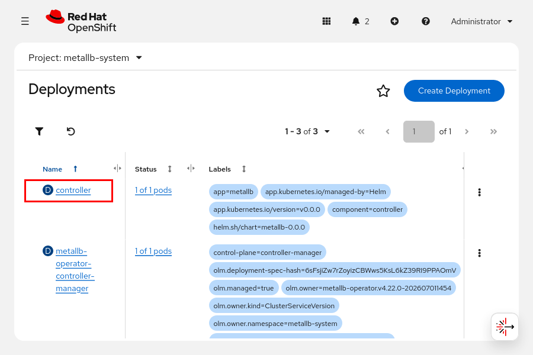
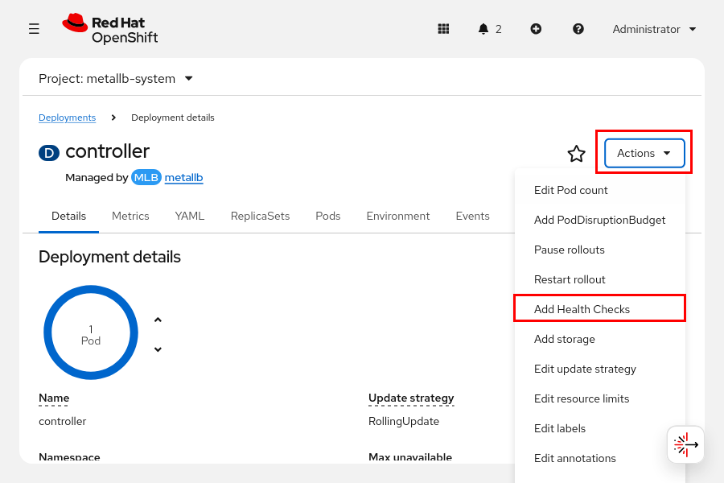
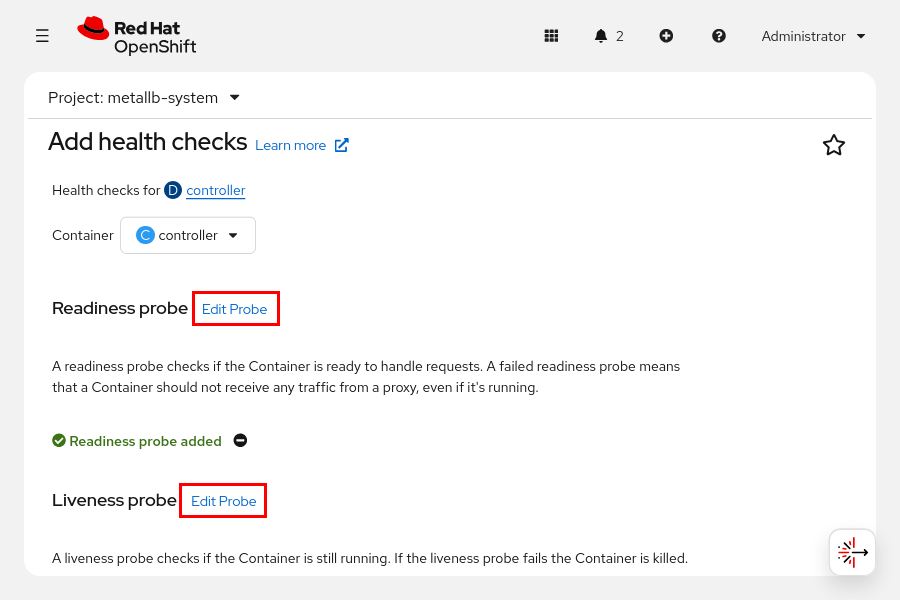
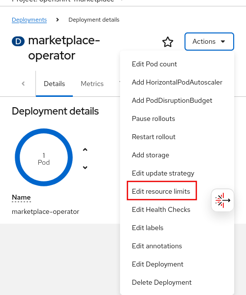
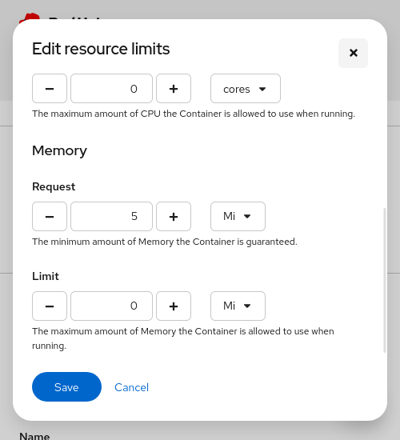
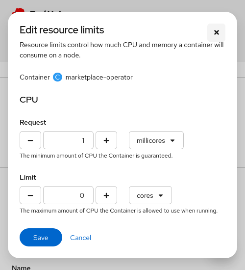
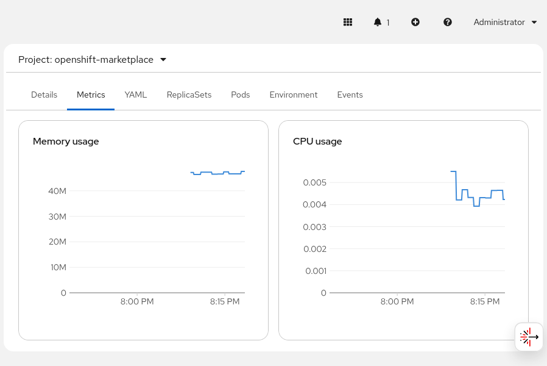
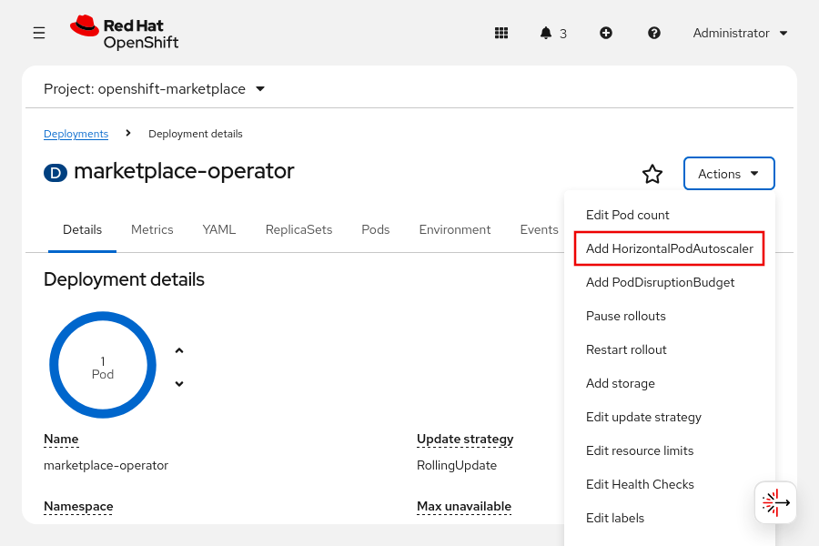
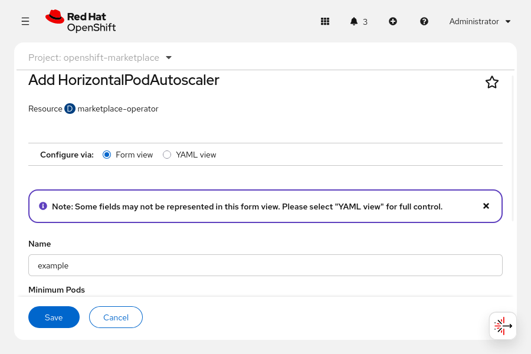

Quản trị Red Hat OpenShift I: Vận hành Cụm Môi trường Sản xuất
--------------------------------------------------------------

# Chương 6. Cấu hình ứng dụng để đảm bảo độ tin cậy
## Đảm bảo tính sẵn sàng cao cho ứng dụng với Kubernetes
### Các khái niệm về triển khai ứng dụng có tính sẵn sàng cao
Tính sẵn sàng cao (HA) giúp các ứng dụng trở nên vững chắc hơn và có khả năng chống chịu tốt hơn trước các sự cố trong quá trình vận hành. Việc triển khai các kỹ thuật HA giúp giảm thiểu nguy cơ ứng dụng bị gián đoạn hoàn toàn đối với người dùng.

Nhìn chung, HA có thể bảo vệ ứng dụng khỏi các sự cố trong những trường hợp sau:

* Từ chính bản thân ứng dụng dưới dạng các lỗi phần mềm
* Từ môi trường hoạt động, chẳng hạn như các vấn đề về mạng
* Từ các ứng dụng khác làm cạn kiệt tài nguyên của cụm (cluster)

Ngoài ra, các biện pháp đảm bảo tính sẵn sàng cao (HA) có thể bảo vệ cụm hệ thống khỏi các ứng dụng có vấn đề, chẳng hạn như ứng dụng bị rò rỉ bộ nhớ.

#### Viết các ứng dụng đáng tin cậy
Về cơ bản, các công cụ HA (tính sẵn sàng cao) ở cấp độ cụm giúp giảm thiểu tác động của các tình huống xấu nhất. Mặc dù HA không thay thế cho việc khắc phục các vấn đề ở cấp độ ứng dụng, nhưng nó bổ sung cho các biện pháp giảm thiểu rủi ro do nhà phát triển thực hiện. Các ứng dụng cần phối hợp nhịp nhàng với cụm để Red Hat OpenShift Container Platform có thể xử lý tối ưu các tình huống xảy ra sự cố.

Red Hat OpenShift Container Platform yêu cầu các ứng dụng tuân thủ những hành vi sau:

* Chịu được việc khởi động lại
* Phản hồi các kiểm tra trạng thái (health probes), chẳng hạn như kiểm tra khởi động (startup), sẵn sàng (readiness) và hoạt động (liveness)
* Hỗ trợ nhiều phiên bản (instance) chạy đồng thời
* Có cơ chế sử dụng tài nguyên được xác định rõ ràng và hoạt động ổn định
* Hoạt động với các đặc quyền bị hạn chế

Mặc dù cụm (cluster) có thể chạy các ứng dụng không có những đặc điểm nêu trên, nhưng các ứng dụng sở hữu các đặc điểm này sẽ tận dụng tốt hơn các tính năng về độ tin cậy và tính sẵn sàng cao (HA) mà Kubernetes cung cấp.

Hầu hết các ứng dụng dựa trên giao thức HTTP đều cung cấp một điểm cuối (endpoint) để kiểm tra tình trạng hoạt động của ứng dụng. Bạn có thể cấu hình cụm để theo dõi điểm cuối này và xử lý các vấn đề tiềm ẩn ảnh hưởng đến ứng dụng.

Việc cung cấp điểm cuối như vậy thuộc trách nhiệm của ứng dụng. Các nhà phát triển cần quyết định cách thức ứng dụng xác định trạng thái của chính nó.

Ví dụ: nếu một ứng dụng phụ thuộc vào kết nối cơ sở dữ liệu, ứng dụng đó có thể phản hồi trạng thái "khỏe mạnh" (healthy) chỉ khi kết nối được tới cơ sở dữ liệu. Tuy nhiên, không phải tất cả các ứng dụng có kết nối cơ sở dữ liệu đều cần thực hiện kiểm tra như vậy. Quyết định này hoàn toàn tùy thuộc vào các nhà phát triển.

### Độ tin cậy của ứng dụng trên Kubernetes
Nếu một pod ứng dụng bị treo (crash), nó sẽ không thể phản hồi các yêu cầu. Tùy thuộc vào cấu hình, cụm (cluster) có thể tự động khởi động lại pod đó. Nếu ứng dụng gặp lỗi nhưng không làm pod bị treo, pod vẫn tiếp tục chạy nhưng cụm sẽ không định tuyến các yêu cầu đến pod này. Cụm chỉ có thể phát hiện và xử lý các pod đang chạy nhưng không đảm bảo trạng thái hoạt động (unhealthy) nếu có các cơ chế kiểm tra sức khỏe (health probes) phù hợp.

Kubernetes sử dụng các kỹ thuật HA (Tính sẵn sàng cao) sau đây để nâng cao độ tin cậy của ứng dụng:

* Khởi động lại pod: Bằng cách cấu hình chính sách khởi động lại cho pod, cụm (cluster) sẽ khởi động lại các instance của ứng dụng đang hoạt động không ổn định.
* Kiểm tra trạng thái (Probing): Thông qua việc sử dụng các cơ chế kiểm tra sức khỏe (health probes), cụm có thể phát hiện khi ứng dụng không phản hồi yêu cầu và tự động thực hiện hành động để khắc phục vấn đề.
* Mở rộng theo chiều ngang (Horizontal scaling): Khi tải ứng dụng thay đổi, cụm có thể điều chỉnh số lượng bản sao (replica) để đáp ứng mức tải đó.

Các phần sau đây sẽ đi sâu vào chi tiết các kỹ thuật này.

#### Khởi động lại các Pod
Một container trong pod có thể kết thúc vì nhiều lý do khác nhau. Trường `restartPolicy` trong đặc tả pod quy định việc kubelet có khởi động lại các container trong pod đó hay không. Các giá trị có thể có là `Always`, `OnFailure` và `Never`. Giá trị mặc định là `Always`.

| Chính sách | Mô tả                                                                                     |
|------------|-------------------------------------------------------------------------------------------|
| Always     | Kubelet luôn khởi động lại container đã kết thúc. Đây là chính sách mặc định.             |
| OnFailure  | Kubelet chỉ khởi động lại một container đã kết thúc nếu nó thoát với mã thoát khác không. |
| Never      | Kubelet không bao giờ khởi động lại một container đã kết thúc.                            |

> **Lưu ý:** Đối với các khối lượng công việc ứng dụng, bạn thường sử dụng các bộ điều khiển (controller) cấp cao hơn như Deployment hoặc StatefulSet để quản lý các pod. Các bộ điều khiển này đảm bảo rằng luôn có một số lượng bản sao (replica) nhất định đang hoạt động. Nếu một pod do Deployment quản lý gặp sự cố, bộ điều khiển sẽ tự động tạo một pod khác để thay thế; đây là cơ chế cốt lõi để đảm bảo tính sẵn sàng cao (HA). Các bộ điều khiển này yêu cầu trường `restartPolicy` trong mẫu pod (pod template) phải được thiết lập là `Always`.

## Thăm dò tình trạng ứng dụng
### Các Probe trong Kubernetes
Các cơ chế kiểm tra trạng thái (health probes) đóng vai trò quan trọng trong việc duy trì sự ổn định và bền bỉ của cụm (cluster). Chúng cho phép cụm xác định trạng thái của ứng dụng thông qua việc liên tục gửi các yêu cầu kiểm tra và chờ phản hồi.

Việc triển khai các cơ chế kiểm tra trạng thái ảnh hưởng đến khả năng thực hiện các tác vụ sau của cụm:

* Giảm thiểu tác động của sự cố bằng cách tự động khởi động lại các pod đang gặp lỗi. 
* Quản lý chuyển đổi dự phòng (failover) và cân bằng tải bằng cách chỉ gửi yêu cầu đến các pod đang hoạt động bình thường. 
* Giám sát các pod để xác định xem chúng có đang gặp lỗi hay không và thời điểm xảy ra lỗi. 
* Mở rộng quy mô ứng dụng bằng cách xác định thời điểm một bản sao (replica) mới đã sẵn sàng tiếp nhận yêu cầu.

### Thiết lập các điểm cuối thăm dò
Các nhà phát triển ứng dụng sẽ lập trình các điểm cuối (endpoint) kiểm tra tình trạng sức khỏe trong quá trình phát triển ứng dụng. Các điểm cuối này giúp xác định tình trạng và trạng thái hoạt động của ứng dụng. Ví dụ, một ứng dụng dựa trên dữ liệu có thể chỉ báo cáo kết quả kiểm tra thành công nếu nó kết nối được với cơ sở dữ liệu.

Các điểm cuối kiểm tra tình trạng sức khỏe cần phải hoạt động nhanh chóng vì chúng thường xuyên được cụm (cluster) hệ thống gọi đến. Các điểm cuối này không được thực hiện các truy vấn cơ sở dữ liệu phức tạp hay quá nhiều lệnh gọi mạng.

### Các loại Probe
Kubernetes cung cấp các loại probe sau: startup, readiness và liveness. Tùy thuộc vào ứng dụng, bạn có thể cấu hình một hoặc nhiều loại trong số này.

#### Startup Probe (Kiểm tra khởi động)
Startup probe xác định thời điểm hoàn tất quá trình khởi động của ứng dụng. Khác với liveness probe, startup probe sẽ không được thực thi nữa sau khi đã kiểm tra thành công. Nếu startup probe không thành công trong khoảng thời gian chờ (timeout) được cấu hình, pod sẽ khởi động lại dựa trên giá trị `restartPolicy` của nó.

Hãy thêm startup probe cho các ứng dụng có thời gian khởi động lâu. Startup probe giúp duy trì thời gian kiểm tra ngắn và khả năng phản hồi nhanh cho liveness probe.

#### Readiness Probe (Kiểm tra trạng thái sẵn sàng)
Readiness probe xác định xem ứng dụng đã sẵn sàng phục vụ các yêu cầu hay chưa. Nếu quá trình kiểm tra này thất bại, Kubernetes sẽ loại bỏ địa chỉ IP của pod khỏi tài nguyên Service để ngăn lưu lượng truy cập từ client đến được ứng dụng.

Readiness probe giúp phát hiện các vấn đề tạm thời có thể ảnh hưởng đến ứng dụng của bạn. Ví dụ: ứng dụng có thể tạm thời không khả dụng khi mới khởi động do cần thiết lập kết nối mạng ban đầu, tải dữ liệu vào bộ nhớ đệm (cache) hoặc thực hiện các tác vụ khởi tạo tốn thời gian. Ứng dụng cũng có thể cần thực hiện các tác vụ xử lý hàng loạt (batch job) kéo dài, khiến nó tạm thời không thể phục vụ client.

Kubernetes vẫn tiếp tục thực hiện kiểm tra ngay cả khi ứng dụng đã thất bại ở lần kiểm tra trước đó. Nếu quá trình kiểm tra thành công trở lại, Kubernetes sẽ thêm lại địa chỉ IP của pod vào tài nguyên Service, và các yêu cầu sẽ được gửi đến pod đó một lần nữa.

Trong những trường hợp như vậy, readiness probe giúp giải quyết vấn đề tạm thời và cải thiện tính sẵn sàng của ứng dụng.

#### Liveness Probes (Kiểm tra trạng thái hoạt động)
Giống như readiness probe , liveness probe được thực hiện trong suốt vòng đời của ứng dụng. Liveness probe xác định xem container của ứng dụng có đang ở trạng thái hoạt động bình thường hay không. Nếu ứng dụng không vượt qua được liveness probe đủ số lần quy định, cụm (cluster) sẽ khởi động lại pod dựa trên chính sách khởi động lại (restart policy) đã được thiết lập.

Khác với startup probe, liveness probe chỉ chạy sau khi quá trình khởi động ban đầu của ứng dụng đã hoàn tất. Thông thường, biện pháp xử lý khi gặp sự cố là khởi động lại hoặc tạo mới pod.

### Các loại hình kiểm tra
Khi định nghĩa một probe, bạn phải chỉ định một trong các loại kiểm tra sau đây để thực hiện:

**HTTP GET**  
Mỗi khi probe (cơ chế kiểm tra) hoạt động, cụm (cluster) sẽ gửi một yêu cầu HTTP GET đến điểm cuối (endpoint) HTTP đã được chỉ định. Quá trình kiểm tra được coi là thành công nếu yêu cầu nhận được phản hồi HTTP với mã trạng thái nằm trong khoảng từ 200 đến 399. Các phản hồi khác sẽ khiến quá trình kiểm tra thất bại.

**Lệnh trong container**  
Mỗi khi probe hoạt động, cụm sẽ thực thi lệnh đã được chỉ định bên trong container. Nếu lệnh kết thúc với mã trạng thái là 0, quá trình kiểm tra sẽ thành công. Các mã trạng thái khác sẽ khiến quá trình kiểm tra thất bại.

**TCP socket**  
Mỗi khi probe hoạt động, cụm sẽ cố gắng mở một socket kết nối tới container thông qua cổng (port) đã được chỉ định. Quá trình kiểm tra chỉ thành công nếu kết nối được thiết lập thành công.

### Thời gian và Ngưỡng
Tất cả các loại probe (cơ chế kiểm tra) đều bao gồm các tham số về thời gian. Tham số "period seconds" (chu kỳ tính bằng giây) xác định tần suất thực hiện probe. Tham số "failure threshold" (ngưỡng lỗi) xác định số lần thất bại cho phép trước khi bản thân probe bị coi là thất bại.

Ví dụ, một probe có ngưỡng lỗi là 3 và chu kỳ là 5 giây có thể thất bại tối đa ba lần trước khi toàn bộ probe bị coi là thất bại. Với cấu hình này, một sự cố có thể tồn tại trong ít nhất 10 giây trước khi quá trình khắc phục bắt đầu. Việc chạy probe quá thường xuyên sẽ gây lãng phí tài nguyên của cụm (cluster). Hãy cân đối các giá trị này khi cấu hình probe.

### Thêm các probe bằng cách sử dụng tệp YAML
Vì các probe được định nghĩa trong template của pod, bạn có thể thêm chúng vào các tài nguyên workload như Deployment. Để thêm probe vào một Deployment hiện có, hãy cập nhật và áp dụng tệp YAML của nó hoặc sử dụng lệnh `oc edit`.

Đoạn mã YAML dưới đây định nghĩa một template pod cho Deployment có chứa liveness probe:

```yaml
apiVersion: apps/v1
kind: Deployment
...output omitted...
spec:
...output omitted...
  template:
    spec:
      containers:
      - name: web-server
        ...output omitted...
        livenessProbe: (1)
          failureThreshold: 6 (2)
          periodSeconds: 10 (3)
          httpGet: (4)
            path: /health (5)
            port: 3000 (6)
```

1. Định nghĩa một cơ chế kiểm tra trạng thái hoạt động (liveness probe).
2. Chỉ định số lần kiểm tra thất bại trước khi thực hiện biện pháp xử lý.
3. Xác định tần suất thực hiện kiểm tra.
4. Thiết lập cơ chế kiểm tra dưới dạng yêu cầu HTTP, đồng thời xác định cổng và đường dẫn của yêu cầu.
5. Chỉ định đường dẫn HTTP để gửi yêu cầu.
6. Chỉ định cổng để gửi yêu cầu HTTP.

### Thêm các probe thông qua CLI
Sử dụng lệnh `oc set probe` để thêm hoặc sửa đổi một probe trên một tài nguyên. Lệnh sau đây thêm một readiness probe vào deployment có tên là `front-end`:

```console
[user@host ~]$ oc set probe deployment/front-end \
--readiness \ 1
--failure-threshold 6 \ 2
--period-seconds 10 \ 3
--get-url http://:8080/healthz 4
```

1. Định nghĩa một probe kiểm tra trạng thái sẵn sàng (readiness probe).
2. Thiết lập số lần probe phải thất bại trước khi thực hiện biện pháp xử lý.
3. Thiết lập tần suất thực hiện probe.
4. Thiết lập probe dưới dạng yêu cầu HTTP, đồng thời xác định cổng và đường dẫn của yêu cầu đó.

> **Lưu ý:** Lệnh `set probe` chỉ dành riêng cho RHOCP và `oc`.

### Thêm các probe qua Web Console
Để thêm hoặc sửa đổi probe cho một deployment từ bảng điều khiển web, hãy truy cập menu **Workloads → Deployments** và chọn một deployment.



Nhấp vào Actions và nhấp vào Add Health Checks.



Nhấn vào **Edit probe** (Chỉnh sửa probe) bên cạnh mỗi probe kiểm tra trạng thái sẵn sàng (readiness probe) hoặc trạng thái hoạt động (liveness probe) để chỉ định loại probe, các tiêu đề HTTP, đường dẫn, cổng và các thông tin khác.



## Dành riêng năng lực tính toán cho các ứng dụng
### Lập lịch Pod trong Kubernetes
Bộ lập lịch pod của Red Hat OpenShift Container Platform xác định vị trí đặt các pod mới trên các node trong cụm. Việc lập lịch phù hợp giúp ngăn ngừa tình trạng tranh chấp tài nguyên và đặt các khối lượng công việc lên những node đáp ứng được các yêu cầu cụ thể của chúng. Thuật toán lập lịch pod tuân theo quy trình gồm ba bước:

**Lọc các node**  
Một pod có thể định nghĩa bộ chọn node (node selector) khớp với các nhãn (label) của các node trong cụm. Bộ lập lịch (scheduler) chỉ coi các node có nhãn phù hợp là những node đủ điều kiện. 

Ngoài ra, bộ lập lịch còn lọc danh sách các node đang hoạt động bằng cách đánh giá từng node dựa trên một tập hợp các điều kiện kiểm tra (predicates). Pod có thể định nghĩa các yêu cầu về tài nguyên tính toán như CPU, bộ nhớ và lưu trữ. Chỉ những node có đủ tài nguyên tính toán khả dụng mới được coi là đủ điều kiện. 

Bước lọc giúp thu hẹp danh sách các node đủ điều kiện. Trong một số trường hợp, pod có thể chạy trên bất kỳ node nào. Trong những trường hợp khác, tất cả các node đều bị loại bỏ qua quá trình lọc. Pod sẽ không thể được lập lịch cho đến khi có một node đáp ứng đầy đủ các điều kiện cần thiết. 

Nếu tất cả các node đều bị loại, một sự kiện `FailedScheduling` sẽ được tạo ra cho pod đó.

**Ưu tiên các node**  
Bằng cách sử dụng nhiều tiêu chí ưu tiên, bộ lập lịch sẽ xác định điểm số có trọng số cho từng node. Các node có điểm số cao hơn sẽ là những ứng viên tốt hơn để chạy pod.

**Chọn node**  
Bộ lập lịch sắp xếp danh sách ứng viên dựa trên các điểm số này và chọn node có điểm số cao nhất. Nếu có nhiều node cùng đạt điểm số cao nhất, một node sẽ được chọn theo cơ chế xoay vòng (round-robin). Sau khi một node được chọn, cụm sẽ tạo ra sự kiện `Scheduled` cho pod đó.

> **Lưu ý:** Bộ lập lịch có tính linh hoạt và có thể được tùy chỉnh cho các tình huống lập lịch nâng cao. Việc tùy chỉnh bộ lập lịch nằm ngoài phạm vi của khóa học này.

### Cấu hình các yêu cầu về tài nguyên tính toán
Đối với các ứng dụng yêu cầu một lượng tài nguyên tính toán cụ thể, bạn có thể định nghĩa yêu cầu tài nguyên (resource request) trong phần định nghĩa pod. Các yêu cầu tài nguyên này sẽ cấp phát tài nguyên phần cứng cho việc triển khai ứng dụng.

Yêu cầu tài nguyên xác định mức tài nguyên tính toán tối thiểu cần thiết để lập lịch (schedule) cho một pod. Bộ lập lịch sẽ cố gắng tìm một node có đủ tài nguyên tính toán khả dụng để đáp ứng các yêu cầu của pod đó.

Trong Kubernetes, tài nguyên bộ nhớ được đo bằng byte, còn tài nguyên CPU được đo bằng đơn vị CPU. Các đơn vị CPU được cấp phát dựa trên đơn vị millicore. Một millicore là một lõi CPU (dù là ảo hay vật lý) được chia thành 1000 đơn vị. Giá trị yêu cầu là "1000 m" sẽ cấp phát toàn bộ một lõi CPU cho pod. Bạn cũng có thể sử dụng các giá trị thập phân để cấp phát tài nguyên CPU. Ví dụ: bạn có thể đặt yêu cầu tài nguyên CPU là 0,1; giá trị này tương đương với 100 millicore (100 m). Tương tự, yêu cầu tài nguyên CPU với giá trị 1,0 đại diện cho toàn bộ một CPU hoặc 1000 millicore (1000 m).

Bạn có thể định nghĩa yêu cầu tài nguyên cho từng container trong tài nguyên deployment. Nếu bạn không định nghĩa tài nguyên, phần đặc tả container sẽ hiển thị dòng `resources: {}`.

Để chỉ định các yêu cầu, hãy sửa đổi phần `resources: {}` trong tệp manifest của deployment. Ví dụ dưới đây định nghĩa yêu cầu tài nguyên là 100 millicore (100m) CPU và một gibibyte (1Gi) bộ nhớ.

```yaml
...output omitted...
    spec:
      containers:
      - image: quay.io/redhattraining/hello-world-nginx:v1.0
        name: hello-world-nginx
        resources:
          requests:
            cpu: "100m"
            memory: "1Gi"
```

Nếu bạn sử dụng lệnh `oc edit` để sửa đổi một deployment, hãy đảm bảo sử dụng đúng định dạng thụt lề. Các lỗi về thụt lề có thể khiến trình soạn thảo không lưu lại các thay đổi. Ngoài ra, bạn có thể sử dụng lệnh `oc set resources` để chỉ định các yêu cầu tài nguyên. Lệnh dưới đây thiết lập các yêu cầu tương tự như ví dụ trước đó:

```console
[user@host ~]$ oc set resources deployment hello-world-nginx \
--requests cpu=100m,memory=1gi
```

Lệnh `oc set resources` hoạt động với bất kỳ tài nguyên nào có chứa pod template, chẳng hạn như các tài nguyên Deployment và Job.

### Kiểm tra tài nguyên tính toán của cụm
Quản trị viên cụm có thể xem các tài nguyên tính toán khả dụng và đã được sử dụng của một node. Lượng tài nguyên tính toán sẵn sàng để lập lịch cho các pod trên một node được gọi là tài nguyên có thể cấp phát (allocatable). OpenShift tính toán giá trị này bằng công thức sau:

```
[Allocatable] = [Node Capacity] - [system-reserved] - [Hard-Eviction-Thresholds]
```

Theo mặc định, OpenShift tự động tính toán và dành riêng một phần tài nguyên CPU và bộ nhớ cho các thành phần node nền tảng (như kubelet và kube-proxy) cũng như các thành phần hệ thống khác (như sshd và NetworkManager). Việc tính toán tài nguyên này dựa trên dung lượng CPU và bộ nhớ thực tế của từng node. Các node có cấu hình nhỏ hơn sẽ có tỷ lệ tài nguyên được dành riêng cao hơn, trong khi các node lớn hơn sẽ có tỷ lệ thấp hơn. Ví dụ, trên một node có 16 GiB bộ nhớ, OpenShift sẽ dành riêng khoảng 1,5 GiB cho các thành phần node và hệ thống.

> **Lưu ý:** OpenShift sử dụng công thức phân cấp để tính toán lượng bộ nhớ dành riêng: cố định 1 GiB cho 8 GiB đầu tiên, 6% của 120 GiB tiếp theo (tối đa 128 GiB) và 2% của phần bộ nhớ vượt quá 128 GiB.

OpenShift cũng dành riêng tài nguyên CPU cho các tiến trình nền (daemon) của hệ thống trên các node tính toán và thực thi việc phân bổ này thông qua cơ chế kiểm soát cgroup. Khi xảy ra tình trạng tranh chấp CPU, các tiến trình nền của hệ thống sẽ nhận được phần CPU đã được dành riêng cho chúng, trong khi các pod chứa khối lượng công việc (workload pod) sẽ nhận phần còn lại. Khi node không chịu áp lực về CPU, các tiến trình hệ thống có thể sử dụng bất kỳ phần CPU nào đang rảnh rỗi vượt quá hạn mức đã được dành riêng cho chúng.

Giá trị "allocatable" (có thể phân bổ) xác định số lượng pod mà bộ lập lịch (scheduler) có thể đặt lên một node. Khi tổng lượng tài nguyên được yêu cầu bởi tất cả các pod trên một node đạt đến giới hạn có thể phân bổ, bộ lập lịch sẽ không đặt thêm pod nào lên node đó nữa.

Với tư cách là quản trị viên cụm, bạn có thể sử dụng lệnh `oc describe node` để xác định năng lực tài nguyên tính toán của một node. Lệnh này hiển thị tổng năng lực của node và phần năng lực có thể phân bổ được. Nó cũng hiển thị lượng tài nguyên đã được cấp phát và lượng tài nguyên được yêu cầu trên node đó.

```console
[user@host ~]$ oc describe node master01
Name:               master01
Roles:              control-plane,master,worker
...output omitted...
Capacity:
  cpu:                  8
  ephemeral-storage:    125293548Ki
  hugepages-1Gi:        0
  hugepages-2Mi:        0
  memory:               20531668Ki
  pods:                 250
Allocatable:
  cpu:                  7500m
  ephemeral-storage:    114396791822
  hugepages-1Gi:        0
  hugepages-2Mi:        0
  memory:               19389692Ki
  pods:                 250
...output omitted...
Non-terminated Pods:                                (88 in total)
  ... Name           CPU Requests  CPU Limits  Memory Requests  Memory Limits ...
  ... ----           ------------  ----------  ---------------  -------------
  ... controller-... 10m (0%)      0 (0%)      20Mi (0%)        0 (0%)        ...
  ... metallb-...    50m (0%)      0 (0%)      20Mi (0%)        0 (0%)        ...
  ... metallb-...    0 (0%)        0 (0%)      0 (0%)           0 (0%)        ...
Allocated resources:
  (Total limits may be over 100 percent, i.e., overcommitted.)
  Resource           Requests       Limits
  --------           --------       ------
  cpu                3183m (42%)    1202m (16%)
  memory             12717Mi (67%)  1350Mi (7%)
...output omitted...
```

Quản trị viên cụm RHOCP cũng có thể sử dụng lệnh `oc adm top pods`. Lệnh này hiển thị mức sử dụng tài nguyên tính toán của từng pod trong một dự án. Bạn cần bao gồm tùy chọn `--namespace` hoặc `-n` để chỉ định dự án. Nếu không chỉ định dự án, lệnh sẽ trả về thông tin sử dụng tài nguyên của các pod trong dự án hiện tại.

Lệnh sau đây hiển thị mức sử dụng tài nguyên của các pod trong dự án `openshift-dns`:

```console
[user@host ~]$ oc adm top pods -n openshift-dns
NAME                  CPU(cores)   MEMORY(bytes)
dns-default-5kpn5     1m           33Mi
node-resolver-6kdxp   0m           2Mi
```

Ngoài ra, quản trị viên cụm có thể sử dụng lệnh `oc adm top nodes` để xem mức sử dụng tài nguyên của các nút trong cụm. Bạn có thể chỉ định tên nút để xem mức sử dụng tài nguyên của một nút cụ thể.

```console
[user@host ~]$ oc adm top node master01
NAME       CPU(cores)   CPU%   MEMORY(bytes)   MEMORY%
master01   1250m        16%    10268Mi         54%
```

## Giới hạn năng lực tính toán cho các ứng dụng
Các yêu cầu về bộ nhớ và CPU mà bạn xác định cho các container giúp Red Hat OpenShift Container Platform (RHOCP) chọn một node tính toán để chạy các pod của bạn. Tuy nhiên, các yêu cầu tài nguyên này không giới hạn lượng bộ nhớ và CPU mà container có thể sử dụng. Ví dụ, việc đặt yêu cầu bộ nhớ ở mức 1 GiB không ngăn cản container tiêu thụ nhiều bộ nhớ hơn mức đó.

Red Hat khuyến nghị bạn nên đặt các yêu cầu về bộ nhớ và CPU tương ứng với mức sử dụng cao nhất của ứng dụng. Ngược lại, nếu đặt các giá trị thấp hơn, bạn sẽ rơi vào tình trạng cam kết vượt mức (overcommit) tài nguyên của node. Nếu tất cả các ứng dụng đang chạy trên node đồng loạt sử dụng tài nguyên vượt quá mức đã yêu cầu, các node tính toán có thể sẽ bị cạn kiệt bộ nhớ và CPU.

Ngoài các yêu cầu, bạn còn có thể thiết lập giới hạn (limits) cho bộ nhớ và CPU để ngăn chặn việc ứng dụng tiêu thụ quá nhiều tài nguyên.

### Thiết lập giới hạn bộ nhớ
Khác với CPU – vốn bị giới hạn hiệu năng (throttled) khi container đạt đến ngưỡng giới hạn – bộ nhớ không thể được thu hồi từ một tiến trình đang chạy. Giới hạn bộ nhớ xác định lượng bộ nhớ mà một container có thể sử dụng cho tất cả các tiến trình bên trong nó.

Ngay khi container đạt đến giới hạn này, nút tính toán (compute node) sẽ chọn và chấm dứt (kill) một tiến trình trong container đó. Khi sự kiện này xảy ra, RHOCP phát hiện rằng ứng dụng không còn hoạt động nữa do tiến trình chính của container bị mất hoặc do các cơ chế kiểm tra trạng thái (health probes) báo lỗi. Sau đó, RHOCP sẽ khởi động lại container dựa trên thuộc tính `restartPolicy` của pod (với giá trị mặc định là `Always`).

RHOCP sử dụng Linux cgroups v2 để thiết lập các giới hạn tài nguyên và chấm dứt các tiến trình trong container khi chúng đạt đến giới hạn bộ nhớ:

**Control groups (cgroups v2)**  
RHOCP sử dụng control groups phiên bản 2 (cgroups v2) để thực thi các giới hạn tài nguyên. Control groups là một cơ chế của nhân Linux (Linux kernel) dùng để kiểm soát và giám sát các tài nguyên hệ thống, chẳng hạn như CPU ​​và bộ nhớ. Kể từ phiên bản RHOCP 4.19, cgroups v1 đã bị loại bỏ và cgroups v2 là cơ chế duy nhất được hỗ trợ.

**Out-of-Memory killer (OOM killer)**  
Khi một container đạt đến giới hạn bộ nhớ, nhân Linux sẽ kích hoạt hệ thống con OOM killer để chọn và chấm dứt một tiến trình.

> **Lưu ý:** Một số môi trường thực thi ứng dụng (runtime) chạy bên trong container dựa vào cgroups để xác định dung lượng bộ nhớ và tài nguyên CPU khả dụng cho pod. Các phiên bản cũ hơn của những runtime này không hỗ trợ cgroups v2 và có thể nhận diện sai tài nguyên khả dụng; điều này có thể khiến ứng dụng tiêu thụ nhiều bộ nhớ hơn dự kiến và dẫn đến trạng thái OOMKilled.  
> Các phiên bản runtime tối thiểu sau đây hỗ trợ đầy đủ cgroups v2: Java OpenJDK 8u372+, Node.js 22+ và .NET 5+. Nếu các image nền (base image) của container sử dụng phiên bản cũ hơn, runtime sẽ không nhận diện được các giới hạn tài nguyên trên OpenShift 4.22 của bạn.  
> Việc nâng cấp image nền lên phiên bản runtime hiện đại có hỗ trợ cgroups v2 là cách an toàn và đáng tin cậy nhất để đảm bảo sự ổn định cho các triển khai của bạn.

Bạn cần thiết lập giới hạn bộ nhớ khi ứng dụng có mô hình sử dụng bộ nhớ cần được kiểm soát, chẳng hạn như khi ứng dụng bị rò rỉ bộ nhớ. Rò rỉ bộ nhớ là một lỗi xảy ra khi ứng dụng sử dụng một phần bộ nhớ nhưng không giải phóng nó sau khi dùng xong. Nếu tình trạng rò rỉ xảy ra trong một vòng lặp dịch vụ vô hạn, ứng dụng sẽ ngày càng tiêu tốn nhiều bộ nhớ hơn theo thời gian và có thể dẫn đến việc chiếm dụng toàn bộ bộ nhớ khả dụng của hệ thống. Đối với các ứng dụng này, việc thiết lập giới hạn bộ nhớ sẽ ngăn chặn chúng tiêu thụ hết bộ nhớ của node. Giới hạn bộ nhớ cũng cho phép OpenShift định kỳ khởi động lại ứng dụng để giải phóng bộ nhớ khi chúng đạt đến giới hạn đã định.

Để thiết lập giới hạn bộ nhớ cho container trong một pod, hãy sử dụng lệnh `oc set resources`:

```console
[user@host ~]$ oc set resources deployment/hello --limits memory=1Gi
```

Ngoài lệnh `oc set resources`, bạn có thể xác định các giới hạn tài nguyên từ một tệp có định dạng YAML:

```yaml
apiVersion: apps/v1
kind: Deployment
...output omitted...
  spec:
    containers:
    - image: registry.access.redhat.com/ubi9/nginx-120:1-86
      name: hello
      resources:
        requests:
          cpu: 100m
          memory: 500Mi
        limits:
          cpu: 200m
          memory: 1Gi
```

Khi RHOCP khởi động lại một pod do sự cố OOM, nó sẽ cập nhật thuộc tính `lastState` của pod đó và đặt lý nguyên nhân là `OOMKilled`:

```console
[user@host ~]$ oc get pod hello-67645f4865-vvr42 -o yaml
...output omitted...
status:
...output omitted...
  containerStatuses:
  - containerID: cri-o://806b...9fe7
    image: registry.access.redhat.com/ubi9/nginx-120:1-86
    imageID: registry.access.redhat.com/ubi9/nginx-120:1-86@sha256:1403...fd34
    lastState:
      terminated:
        containerID: cri-o://bbc4...9eb2
        exitCode: 137
        finishedAt: "2023-03-08T07:56:06Z"
        reason: OOMKilled
        startedAt: "2023-03-08T07:51:43Z"
    name: hello
    ready: true
    restartCount: 1
...output omitted...
```

Để thiết lập giới hạn bộ nhớ cho container trong pod từ giao diện web, hãy chọn một deployment, sau đó nhấp vào **Actions → Edit resource limits**.



Thiết lập giới hạn bộ nhớ bằng cách tăng hoặc giảm dung lượng bộ nhớ trong phần Giới hạn (Limit).



### Thiết lập giới hạn CPU
CPU là một tài nguyên có thể nén được (compressible resource), nghĩa là cơ chế giới hạn CPU hoạt động khác với giới hạn bộ nhớ. Khi container đạt đến giới hạn CPU, RHOCP sẽ điều tiết (throttling) các tiến trình của container đó, ngay cả khi node vẫn còn chu kỳ CPU trống. Ứng dụng vẫn tiếp tục hoạt động nhưng với tốc độ chậm hơn. Khác với bộ nhớ—nơi việc vượt quá giới hạn sẽ dẫn đến việc tiến trình bị chấm dứt—việc vượt quá giới hạn CPU sẽ không làm container bị chấm dứt.

Ngược lại, nếu bạn không thiết lập giới hạn CPU, container có thể sử dụng toàn bộ tài nguyên CPU hiện có trên node. Nếu CPU của node chịu áp lực (ví dụ: do có nhiều container đang thực hiện các tác vụ tiêu tốn nhiều CPU), nhân Linux sẽ phân chia tài nguyên CPU cho các container này dựa trên giá trị yêu cầu CPU (CPU requests) đã được thiết lập cho chúng.

Bạn cần thiết lập giới hạn CPU khi muốn đảm bảo ứng dụng hoạt động ổn định và đồng nhất trên các cụm (cluster) và node khác nhau. Ví dụ: nếu ứng dụng chạy trên một node có sẵn tài nguyên CPU, nó có thể hoạt động với tốc độ tối đa; ngược lại, nếu chạy trên một node đang chịu áp lực về CPU, ứng dụng sẽ hoạt động chậm hơn.

Tình trạng tương tự cũng có thể xảy ra giữa cụm môi trường phát triển (development) và cụm môi trường sản xuất (production). Do cấu hình node ở hai môi trường này có thể khác nhau, ứng dụng có thể hoạt động theo cách khác khi được chuyển từ môi trường phát triển sang môi trường sản xuất.

> **Lưu ý:** Các cụm (cluster) có thể có sự khác biệt về cấu hình phần cứng vượt ra ngoài phạm vi mà các giới hạn (limits) kiểm soát. Ví dụ, các node của hai cụm có thể sử dụng CPU với cùng số lượng nhân nhưng lại có tốc độ xung nhịp khác nhau.  
> Các giá trị request và limit không tính đến những khác biệt về phần cứng này. Nếu các cụm của bạn có sự khác biệt như vậy, hãy đảm bảo rằng các giá trị request và limit phù hợp với cả hai cấu hình.

Việc thiết lập giới hạn CPU giúp giảm thiểu sự khác biệt về cấu hình giữa các node, mang lại hiệu năng hoạt động ổn định và đồng nhất hơn.

Để đặt giới hạn CPU cho container trong pod, hãy sử dụng lệnh `oc set resources`:

```console
[user@host ~]$ oc set resources deployment/hello --limits cpu=200m
```

Bạn cũng có thể xác định các giới hạn CPU từ một tệp có định dạng YAML:

```yaml
apiVersion: apps/v1
kind: Deployment
...output omitted...
  spec:
    containers:
    - image: registry.access.redhat.com/ubi9/nginx-120:1-86
      name: hello
      resources:
        requests:
          cpu: 100m
          memory: 500Mi
        limits:
          cpu: 200m
          memory: 1Gi
```

Để thiết lập giới hạn CPU cho container trong pod từ giao diện web, hãy chọn một deployment, sau đó nhấp vào **Actions** → **Edit resource limits**.

Thiết lập giới hạn CPU bằng cách tăng hoặc giảm giá trị CPU trong phần **Limit**.



Bắt đầu từ phiên bản RHOCP 4.22, tính năng thay đổi kích thước pod tại chỗ (in-place pod resizing) đã chính thức được phát hành rộng rãi. Bạn có thể thay đổi các giá trị yêu cầu (requests) và giới hạn (limits) về tài nguyên CPU và bộ nhớ được gán cho container mà không cần tạo lại hay khởi động lại pod. Trước đây, việc thay đổi các giới hạn này đòi hỏi phải tạo lại pod. Bạn có thể kiểm soát việc pod có bị khởi động lại hay không bằng cách cấu hình chính sách thay đổi kích thước trong phần đặc tả (specification) của pod; chính sách này cho phép thiết lập giá trị `NotRequired` hoặc `RestartContainer` cho từng loại tài nguyên. Để thay đổi kích thước một pod đang chạy từ dòng lệnh, hãy sử dụng cờ `--subresource resize` kết hợp với lệnh `oc edit` hoặc `oc patch`.

### Xem các yêu cầu, giới hạn và mức sử dụng thực tế
Thông qua giao diện dòng lệnh RHOCP, quản trị viên cụm có thể xem thông tin về mức sử dụng tài nguyên tính toán trên từng nút (node). Lệnh `oc describe node` hiển thị thông tin chi tiết về một nút, bao gồm thông tin về các pod đang chạy trên nút đó. Đối với mỗi pod, lệnh này hiển thị các giá trị yêu cầu (request) và giới hạn (limit) đối với CPU cũng như bộ nhớ. Nếu bạn không chỉ định giá trị yêu cầu hoặc giới hạn, cột tương ứng của pod đó sẽ hiển thị giá trị bằng không. Lệnh này cũng hiển thị bản tóm tắt về tổng các yêu cầu và giới hạn tài nguyên.

```console
[user@host ~]$ oc describe node master01
Name:               master01
Roles:              control-plane,master,worker
...output omitted...
Non-terminated Pods:                                (88 in total)
  ... Name           CPU Requests  CPU Limits  Memory Requests  Memory Limits ...
  ... ----           ------------  ----------  ---------------  -------------
  ... controller-... 10m (0%)      0 (0%)      20Mi (0%)        0 (0%)        ...
  ... metallb-...    50m (0%)      0 (0%)      20Mi (0%)        0 (0%)        ...
  ... metallb-...    0 (0%)        0 (0%)      0 (0%)           0 (0%)        ...
...output omitted...
Allocated resources:
  (Total limits may be over 100 percent, i.e., overcommitted.)
  Resource           Requests       Limits
  --------           --------       ------
  cpu                3183m (42%)    1202m (16%)
  memory             12717Mi (67%)  1350Mi (7%)
...output omitted...
```

Lệnh `oc describe node` hiển thị các giá trị request và limit. Lệnh `oc adm top` hiển thị mức sử dụng tài nguyên. Lệnh `oc adm top nodes` hiển thị mức sử dụng tài nguyên của các node trong cụm. Bạn phải thực thi các lệnh này với tư cách là quản trị viên cụm.

Lệnh `oc adm top pods` hiển thị mức sử dụng tài nguyên của từng pod trong một project.

Lệnh sau đây hiển thị mức sử dụng tài nguyên của các pod trong project `openshift-console`:

```console
[user@host ~]$ oc adm top pods -n openshift-console
NAME                         CPU(cores)   MEMORY(bytes)
console-6689c8589c-bcpb7     1m           48Mi
downloads-79658645bd-hx649   1m           31Mi
```

Để trực quan hóa mức tiêu thụ tài nguyên từ bảng điều khiển web, hãy chọn một triển khai và nhấp vào tab Metrics (Số liệu). Tại tab này, bạn có thể xem mức sử dụng bộ nhớ, CPU, hệ thống tệp cũng như lưu lượng truy cập vào và ra.



## Tự động mở rộng quy mô ứng dụng
Kubernetes có thể tự động điều chỉnh quy mô (autoscale) của một deployment dựa trên tải hiện tại của các pod ứng dụng, thông qua loại tài nguyên HorizontalPodAutoscaler.

### Tự động mở rộng Pod theo chiều ngang
Trong môi trường sản xuất, tải trọng của ứng dụng có thể biến động đáng kể. Việc điều chỉnh thủ công số lượng pod ứng dụng để đáp ứng nhu cầu thường kém hiệu quả và dễ xảy ra sai sót. Red Hat OpenShift Container Platform (RHOCP) cung cấp giải pháp tự động cho vấn đề này thông qua tính năng Horizontal Pod Autoscaler (HPA). HPA tự động điều chỉnh số lượng pod trong các đối tượng như replication controller, deployment, replica set hoặc stateful set dựa trên các chỉ số được giám sát, chẳng hạn như mức độ sử dụng CPU.

Đối với doanh nghiệp, khả năng tự động mở rộng hiệu quả đóng vai trò then chốt vì nhiều lý do:

* Tính sẵn sàng cao và Hiệu năng: Bằng cách tự động thêm các pod khi lưu lượng truy cập tăng đột biến, HPA đảm bảo ứng dụng luôn duy trì khả năng phản hồi và đáp ứng các mục tiêu về mức độ dịch vụ (SLO).
* Tối ưu hóa chi phí: Trong các giai đoạn lưu lượng truy cập thấp, HPA sẽ giảm số lượng pod. Việc loại bỏ các pod dư thừa giúp giải phóng tài nguyên chưa sử dụng về lại cho cụm (cluster), cho phép các tác vụ khác tận dụng nguồn lực này và tối ưu hóa việc sử dụng tài nguyên tổng thể.
* Hiệu quả vận hành: Việc tự động hóa quy trình mở rộng/thu hẹp quy mô giúp loại bỏ nhu cầu can thiệp thủ công từ đội ngũ vận hành. Cơ chế tự động này giúp giảm thiểu rủi ro do sai sót của con người, đồng thời cho phép các kỹ sư tập trung vào những nhiệm vụ khác.

### Quy trình tự động mở rộng trong Kubernetes
HPA được triển khai dưới dạng một vòng lặp điều khiển chạy bên trong Kubernetes controller manager. Tài nguyên HorizontalPodAutoscaler sử dụng các chỉ số hiệu năng do hệ thống giám sát của RHOCP thu thập; hệ thống giám sát này được cài đặt sẵn trong RHOCP. Cơ chế tự động mở rộng (autoscaler) hoạt động theo một vòng lặp liên tục. Theo mặc định, controller manager sẽ kiểm tra các tài nguyên HPA cứ sau mỗi 15 giây. Trong mỗi lần kiểm tra, nó thực hiện các bước sau:

* Autoscaler lấy chỉ số mục tiêu dùng để mở rộng/thu hẹp quy mô từ định nghĩa tài nguyên HPA.
* Đối với mỗi pod thuộc phạm vi quản lý của tài nguyên HPA, autoscaler thu thập giá trị hiện tại của chỉ số từ metrics server.
* Với mỗi pod mục tiêu, autoscaler tính toán tỷ lệ phần trăm sử dụng dựa trên chỉ số đã thu thập và các yêu cầu tài nguyên (resource requests) được định nghĩa trong đặc tả của pod.
* Autoscaler tính toán mức sử dụng trung bình trên tất cả các pod mục tiêu.
* Nó xác định tỷ lệ giữa giá trị chỉ số mục tiêu và giá trị chỉ số trung bình hiện tại.
* Autoscaler sử dụng tỷ lệ này để đưa ra quyết định điều chỉnh quy mô, cụ thể là tăng hoặc giảm số lượng bản sao (replicas) cho tài nguyên mục tiêu.

### Điều kiện tiên quyết cho tính năng tự động mở rộng quy mô
Để tự động điều chỉnh quy mô (autoscale) một deployment, bạn cần chỉ định các yêu cầu tài nguyên (resource requests) cho các container trong pod của mình. HPA sử dụng các giá trị tài nguyên được yêu cầu này để tính toán tỷ lệ phần trăm mức sử dụng. Cơ chế tự động điều chỉnh quy mô cần có các yêu cầu tài nguyên để tính toán mức sử dụng và thực hiện các thao tác điều chỉnh quy mô.

> **Quan trọng:** Các pod được tạo bằng lệnh `oc create deployment` không xác định các yêu cầu tài nguyên (resource requests) theo mặc định. Do đó, việc sử dụng tính năng tự động điều chỉnh quy mô (autoscaler) của RHOCP có thể đòi hỏi phải chỉnh sửa tài nguyên của deployment để bổ sung các yêu cầu này. Ngoài ra, bạn có thể tạo các tệp tài nguyên YAML tùy chỉnh cho ứng dụng của mình. Bạn cũng có thể thêm tài nguyên `LimitRange` vào dự án để xác định các yêu cầu tài nguyên mặc định cho các pod.

### Tạo Horizontal Pod Autoscaler
Bạn có thể tạo tài nguyên HPA bằng cách sử dụng dòng lệnh, tệp manifest YAML hoặc giao diện web.

#### Sử dụng lệnh oc autoscale
Để tạo tài nguyên HorizontalPodAutoscaler từ dòng lệnh, hãy sử dụng lệnh `oc autoscale`:

```console
[user@host ~]$ oc autoscale deployment/hello \
--min 1 --max 10 --cpu 80%
horizontalpodautoscaler.autoscaling/hello autoscaled
```

Lệnh này tạo ra một HPA nhắm vào deployment có tên là "hello". HPA này duy trì số lượng pod trong khoảng từ 1 đến 10 bản sao (replica). Nó tự động điều chỉnh quy mô của deployment để giữ mức sử dụng CPU trung bình của các pod ở mức bằng hoặc thấp hơn 80% so với lượng CPU được yêu cầu (requested CPU).

Các giá trị tối đa và tối thiểu của tài nguyên HPA giúp xử lý các đợt tăng tải đột biến và tránh gây quá tải cho cụm RHOCP. Nếu tải của ứng dụng thay đổi quá nhanh, việc duy trì một số pod dự phòng có thể giúp ứng phó kịp thời với các đợt yêu cầu tăng đột ngột từ người dùng. Ngược lại, nếu có quá nhiều pod, chúng có thể tiêu thụ toàn bộ tài nguyên của cụm và gây ảnh hưởng đến các ứng dụng khác đang sử dụng cùng cụm RHOCP đó.

#### Sử dụng tệp manifest YAML
Đối với các cấu hình nâng cao hơn và để quản lý cơ sở hạ tầng dưới dạng mã (IaC), bạn có thể định nghĩa tài nguyên HPA trong tệp YAML.

```yaml
apiVersion: autoscaling/v2
kind: HorizontalPodAutoscaler
metadata:
  name: hello
  namespace: test1
spec:
  scaleTargetRef:  (1)
    apiVersion: apps/v1
    kind: Deployment
    name: hello
  minReplicas: 1   (2)
  maxReplicas: 10  (3)
  metrics: (4)
    - type: Resource
      resource:
        name: cpu
        target:
          averageUtilization: 80  (5)
          type: Utilization
```

1. Trường `scaleTargetRef` trỏ đến tài nguyên mà HPA quản lý.
2. Trường `minReplicas` xác định số lượng pod tối thiểu.
3. Trường `maxReplicas` xác định số lượng pod tối đa.
4. Mảng `metrics` định nghĩa các chỉ số được sử dụng cho các quyết định mở rộng quy mô.
5. Trường `averageUtilization` xác định mức sử dụng CPU trung bình mục tiêu cho mỗi pod và được biểu thị dưới dạng phần trăm. Nếu mức sử dụng CPU trung bình tổng thể vượt quá giá trị đó, Horizontal Pod Autoscaler sẽ khởi tạo các pod mới. Nếu mức sử dụng CPU trung bình tổng thể thấp hơn giá trị đó, Horizontal Pod Autoscaler sẽ xóa bớt các pod.

Sử dụng lệnh `oc apply` để tạo tài nguyên từ tệp.

```console
[user@host ~]$ oc apply -f hello-hpa.yaml
horizontalpodautoscaler.autoscaling/example created
```

Ví dụ trước tạo ra một tài nguyên HPA có khả năng tự động mở rộng quy mô dựa trên mức sử dụng CPU. Ngoài ra, nó cũng có thể mở rộng quy mô dựa trên mức sử dụng bộ nhớ bằng cách đặt tên tài nguyên là `memory`.

```yaml
apiVersion: autoscaling/v2
kind: HorizontalPodAutoscaler
metadata:
  name: hello
spec:
  minReplicas: 1
  maxReplicas: 10
  metrics:
  - resource:
      name: memory (1)
      target:
        averageUtilization: 80
...output omitted...
```

1. Tên tài nguyên được đặt là memory để kích hoạt việc mở rộng quy mô dựa trên mức sử dụng bộ nhớ.

> **Lưu ý:** Tính năng tự động mở rộng quy mô dựa trên bộ nhớ không phù hợp với mọi ứng dụng. Ví dụ, các ứng dụng chạy trên Máy ảo Java (JVM) thường chiếm dụng lượng lớn bộ nhớ ngay khi khởi động và không giải phóng phần bộ nhớ đó. Nếu mức sử dụng bộ nhớ của ứng dụng không tương quan với tải xử lý, thì cơ chế tự động mở rộng quy mô dựa trên bộ nhớ có thể sẽ không mang lại hiệu quả.

#### Sử dụng Bảng điều khiển Web
Để tạo tài nguyên HPA từ giao diện web, hãy truy cập **Workloads** → **Deployments** và chọn một deployment. Sau đó, chọn **Actions** → **Add HorizontalPodAutoscaler**.



Sử dụng biểu mẫu "Add Horizontal Pod Autoscaler" hoặc chế độ xem YAML để thiết lập các tham số HPA.



### Xác minh trạng thái của Horizontal Pod Autoscaler
Sau khi tạo đối tượng HPA, bạn có thể theo dõi trạng thái và hoạt động của nó.

Để xem thông tin về các tài nguyên HPA trong dự án hiện tại, hãy sử dụng lệnh `oc get hpa`:

```console
[user@host ~]$ oc get hpa
NAME    REFERENCE          TARGETS              MINPODS   MAXPODS   REPLICAS   AGE
hello   Deployment/hello   cpu: <unknown>/80%   1         10        1          30s
```

Ban đầu, Horizontal Pod Autoscaler hiển thị giá trị `<unknown>` trong cột `TARGETS`. Có thể mất tới năm phút để giá trị `<unknown>` này thay đổi và hiển thị tỷ lệ phần trăm mức sử dụng hiện tại. Nếu giá trị `<unknown>` vẫn tồn tại trong cột `TARGETS`, điều này có thể cho thấy deployment đích chưa định nghĩa yêu cầu tài nguyên (resource requests) cho chỉ số (metric) được chỉ định. Horizontal Pod Autoscaler chỉ thực hiện tự động mở rộng quy mô đối với các pod có thiết lập yêu cầu tài nguyên.

### Kiểm tra chi tiết và sự kiện của HPA
Để biết thông tin chi tiết, hãy sử dụng lệnh `oc describe hpa`. Lệnh này hiển thị cấu hình của HPA, các chỉ số hiện tại và nhật ký của các sự kiện mở rộng quy mô gần đây.

```console
[user@host ~]$ oc describe hpa hello
...output omitted...
Events:
  Type    Reason             Age    From                       Message
  ----    ------             ----   ----                       -------
  Normal  SuccessfulRescale  16m    horizontal-pod-autoscaler  New size: 2; ...
  Normal  SuccessfulRescale  14m    horizontal-pod-autoscaler  New size: 4; ...
  Normal  SuccessfulRescale  14m    horizontal-pod-autoscaler  New size: 8; ...
...output omitted...
```

Mục Events (Sự kiện) rất hữu ích cho việc khắc phục sự cố, nhờ cung cấp bản ghi theo trình tự thời gian về thời điểm và lý do HPA thực hiện mở rộng hoặc thu hẹp quy mô tài nguyên mục tiêu.

Bên cạnh tính năng tự động mở rộng quy mô theo chiều ngang (horizontal autoscaling), RHOCP còn hỗ trợ Vertical Pod Autoscaler (VPA). VPA bổ sung cho HPA bằng cách thực hiện mở rộng theo chiều dọc; nghĩa là nó điều chỉnh các yêu cầu (requests) và giới hạn (limits) về CPU và bộ nhớ cho từng pod riêng lẻ, thay vì thêm hoặc bớt các bản sao (replica) của pod. Kể từ phiên bản RHOCP 4.21, VPA hỗ trợ chế độ cập nhật InPlaceOrRecreate, tận dụng khả năng thay đổi kích thước pod tại chỗ (in-place pod resize) đã được mô tả ở phần trước. Khi node có đủ dung lượng, VPA sẽ điều chỉnh tài nguyên của pod mà không cần khởi động lại pod đó. Nếu node không đáp ứng được các giá trị tài nguyên mới, VPA sẽ tạo lại pod trên một node khác có đủ tài nguyên.
