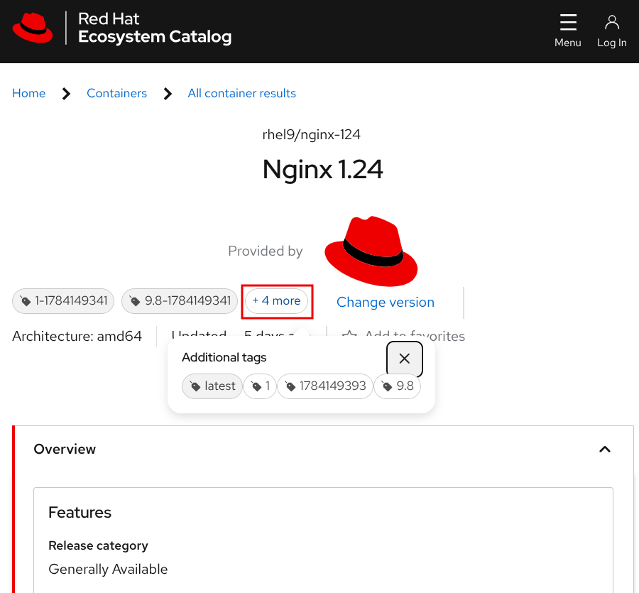
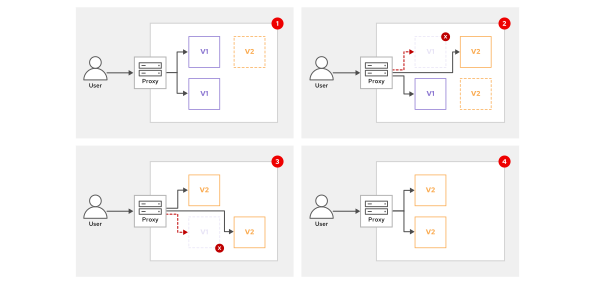
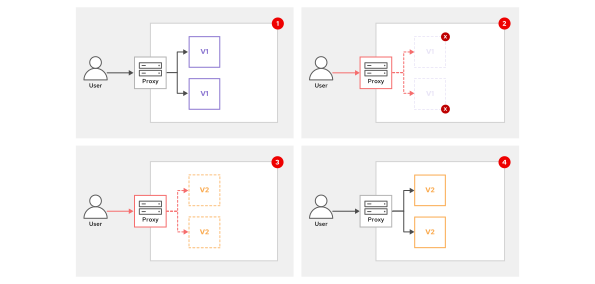
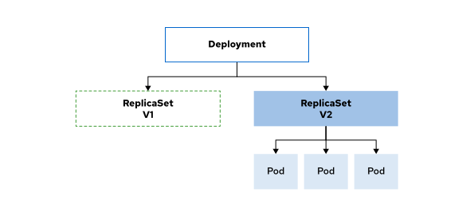
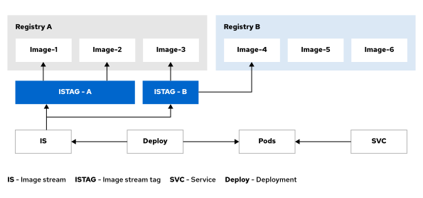

Quản trị Red Hat OpenShift I: Vận hành Cụm Môi trường Sản xuất
--------------------------------------------------------------

# Chương 7. Quản lý cập nhật ứng dụng
## Định danh và thẻ (tag) Container Image
### Các thẻ Kubernetes Image
Tên đầy đủ của một image container bao gồm nhiều thành phần. Ví dụ, tên image `registry.redhat.io/rhel9/nginx-124:9.8` được cấu tạo từ các yếu tố sau:

* Máy chủ registry là `registry.redhat.io`. 
* Namespace là `rhel9`. 
* Tên image là `nginx-124`. Trong ví dụ này, tên image bao gồm cả phiên bản phần mềm, cụ thể là Nginx phiên bản 1.24. 
* Tag (nhãn) xác định một phiên bản cụ thể của image là `9.8`. Nếu bạn bỏ qua tag, hầu hết các công cụ quản lý container sẽ mặc định sử dụng tag `latest` (phiên bản mới nhất).

Nhiều thẻ (tag) có thể cùng trỏ đến một phiên bản hình ảnh (image version). Ảnh chụp màn hình dưới đây của Red Hat Ecosystem Catalog tại https://catalog.redhat.com/software/containers/explore liệt kê các thẻ cho hình ảnh rhel9/nginx-124:



Trong trường hợp này, các thẻ `9.8`, `latest` và `1` đều trỏ đến cùng một phiên bản image. Bạn có thể sử dụng bất kỳ thẻ nào trong số này để tham chiếu đến phiên bản đó.

Các thẻ `latest` và `1` là các thẻ động (floating tags), vì chúng có thể trỏ đến các phiên bản image khác nhau theo thời gian. Ví dụ: khi các nhà phát triển phát hành một phiên bản image mới, họ sẽ thay đổi thẻ `latest` để trỏ đến phiên bản mới đó. Họ cũng cập nhật thẻ `1` để trỏ đến bản phát hành mới nhất của phiên bản đó, chẳng hạn như `1-1784149341`.

Là người sử dụng image, việc chỉ định một thẻ động giúp đảm bảo rằng bạn luôn sử dụng phiên bản image mới nhất tương ứng với thẻ đó.

#### Các vấn đề về thẻ nổi (Floating)
Các nhà cung cấp, tổ chức và nhà phát triển phát hành image sẽ quản lý các thẻ (tag) của họ và tự thiết lập vòng đời cho các thẻ động (floating tag). Họ có thể gán lại một thẻ động cho một phiên bản image mới mà không cần thông báo trước.

Là người sử dụng image, bạn có thể không nhận ra rằng thẻ mà bạn đang dùng hiện đang trỏ đến một phiên bản image khác.

Giả sử bạn triển khai một ứng dụng trên OpenShift và sử dụng thẻ "latest" (mới nhất) cho image. Chuỗi sự kiện sau đây có thể xảy ra:

1. Khi OpenShift triển khai container, nó sẽ tải image có gắn thẻ `latest` từ registry.
2. Sau đó, nhà phát triển image đẩy một phiên bản mới lên và gán lại thẻ `latest` cho phiên bản mới này.
3. OpenShift chuyển pod sang một node khác trong cụm, chẳng hạn như khi node ban đầu gặp sự cố.
4. Tại node mới này, OpenShift tải image có thẻ `latest`, qua đó lấy được phiên bản image mới.
5. Giờ đây, quá trình triển khai trên OpenShift đang chạy với phiên bản ứng dụng mới mà bạn không hề hay biết về việc cập nhật phiên bản đó.

Một vấn đề tương tự xảy ra khi bạn mở rộng quy mô triển khai (scale up), khiến OpenShift khởi tạo các pod mới. Trên các node, OpenShift sẽ tải về phiên bản image mới nhất cho những pod này. Hệ quả là, nếu có phiên bản mới, quá trình triển khai của bạn sẽ chạy các container sử dụng những phiên bản image khác nhau. Điều này có thể dẫn đến sự thiếu nhất quán trong ứng dụng và các hành vi không mong muốn.

Để ngăn ngừa các vấn đề này, hãy chọn một image được đảm bảo không thay đổi theo thời gian. Nhờ đó, bạn có thể kiểm soát vòng đời ứng dụng của mình; bạn được quyền quyết định thời điểm và cách thức OpenShift triển khai phiên bản image mới.

Bạn có thể chọn phiên bản image cố định theo một số cách sau:

* Hãy sử dụng thẻ (tag) cố định thay vì dựa vào các thẻ có thể thay đổi (floating tag).
* Sử dụng OpenShift image stream để kiểm soát chặt chẽ các phiên bản image. Một phần khác trong khóa học này sẽ đề cập chi tiết hơn về image stream.
* Sử dụng mã định danh image dựa trên thuật toán băm bảo mật (SHA) thay vì thẻ khi tham chiếu đến một phiên bản image.

Sự khác biệt giữa thẻ (tag) "floating" (có thể thay đổi) và "non-floating" (cố định) không nằm ở khía cạnh kỹ thuật mà là vấn đề quy ước. Các nhà phát triển được khuyến cáo không nên đẩy một image khác vào một thẻ đã tồn tại (dù hành động này không bị ngăn chặn về mặt kỹ thuật). Do đó, bạn cần chỉ định ID image (dạng mã SHA) để đảm bảo rằng image container được tham chiếu sẽ không bị thay đổi.

### Sử dụng SHA Image ID
Các nhà phát triển gán thẻ (tag) cho các image. Ngược lại, SHA image ID (hay còn gọi là digest) là một mã định danh duy nhất do registry container tính toán và gán cho image. SHA ID là một chuỗi ký tự bất biến dùng để tham chiếu đến một phiên bản image cụ thể. Việc sử dụng SHA ID để định danh image là phương pháp an toàn nhất.

Để tham chiếu đến một image bằng SHA ID, hãy thay thế phần `name:tag` bằng `name@SHA-ID` trong tên image. Ví dụ dưới đây sử dụng SHA image ID thay vì thẻ (tag):

```
registry.redhat.io/rhel9/nginx-124@sha256:b147...87fc
```

Để lấy ID hình ảnh SHA từ thẻ, hãy sử dụng lệnh `oc image info`.

> **Lưu ý:** Một image đa kiến trúc tham chiếu đến các image dành cho nhiều kiến trúc CPU khác nhau. Các image đa kiến trúc bao gồm một chỉ mục (index) trỏ đến các image dành cho những nền tảng và kiến trúc CPU khác nhau.  
> Đối với các image này, lệnh `oc image info` yêu cầu bạn chọn một kiến trúc bằng cách sử dụng tùy chọn `--filter-by-os`:
> 
> ```console
> [user@host ~]$ oc image info registry.redhat.io/rhel9/nginx-124:9.8
> error: the image is a manifest list and contains multiple images - use --filter-by-os to select from:
> 
>  OS               DIGEST
>  linux/amd64      sha256:b147...87fc
>  linux/arm64/v8   sha256:4759...913e
>  linux/ppc64le    sha256:d726...6655
>  linux/s390x      sha256:42b6...bc0d
> ```

Ví dụ sau đây hiển thị mã SHA của image mà thẻ 9.8 hiện đang trỏ tới:

```console
[user@host ~]$ oc image info --filter-by-os linux/amd64 \
registry.redhat.io/rhel9/nginx-124:9.8
Name:      registry.redhat.io/rhel9/nginx-124:9.8
Digest:    sha256:b147...87fc (1)
Manifest List: sha256:5c5d...b10c
Media Type:    application/vnd.oci.image.manifest.v1+json
...output omitted...
```

1. ID hình ảnh SHA (hay còn gọi là digest) tương ứng với thẻ hình ảnh và kiến trúc đã chỉ định. Tại thời điểm bạn chạy lệnh, giá trị digest có thể sẽ khác đi, do Red Hat có thể đã cập nhật hình ảnh và gán lại thẻ 9.8 cho hình ảnh mới đó.

Bạn cũng có thể sử dụng lệnh `skopeo inspect`. Định dạng đầu ra của lệnh này khác với lệnh `oc image info`, mặc dù cả hai đều cung cấp các thông tin tương tự nhau.

Nếu sử dụng lệnh `oc debug node/node-name` để kết nối với một node tính toán (compute node), bạn có thể liệt kê các image có sẵn cục bộ bằng cách chạy lệnh `crictl images --digests --no-trunc`. Tùy chọn `--digests` yêu cầu lệnh hiển thị các ID image dạng SHA, còn tùy chọn `--no-trunc` yêu cầu hiển thị toàn bộ chuỗi SHA; nếu không có tùy chọn này, lệnh sẽ chỉ hiển thị các ký tự đầu tiên.

```console
[user@host ~]$ oc debug node/node-name
Temporary namespace openshift-debug-csn2p is created for debugging node...
Starting pod/node-name-debug ...
To use host binaries, run `chroot /host`
Pod IP: 172.25.250.140
If you don't see a command prompt, try pressing enter.
sh-5.1# chroot /host
sh-5.1# crictl images --digests --no-trunc \
registry.redhat.io/rhel9/nginx-124:9.8
IMAGE                                TAG   DIGEST               IMAGE ID    ...
registry.redhat.io/rhel9/nginx-124:  9.8   sha256:5c5d...b10c   2e21...0d23 ...
```

Cột `IMAGE ID` hiển thị mã định danh cục bộ mà công cụ quản lý container gán cho image. Mã định danh này không liên quan đến SHA ID.

Định dạng image container sử dụng các giá trị băm SHA-256 để định danh một số thành phần của image, chẳng hạn như các lớp (layer) hoặc siêu dữ liệu (metadata) của image. Do một số lệnh cũng hiển thị các chuỗi SHA-256 này, bạn cần đảm bảo sử dụng đúng giá trị băm SHA-256 tương ứng với SHA image ID. Các lệnh thường gọi SHA image ID là "image digest".

### Chọn chính sách kéo (Pull Policy)
Khi bạn triển khai một ứng dụng, OpenShift sẽ chọn một nút tính toán để chạy pod. Trên nút đó, OpenShift sẽ tải image về và sau đó khởi động container.

Bằng cách thiết lập thuộc tính `imagePullPolicy` trong tài nguyên deployment, bạn có thể kiểm soát cách OpenShift tải image.

Ví dụ sau đây hiển thị tài nguyên deployment `myapp`:

```console
[user@host ~]$ oc get deployment myapp -o yaml
apiVersion: apps/v1
kind: Deployment
...output omitted...
  template:
    metadata:
      creationTimestamp: null
      labels:
        app: myapp
    spec:
      containers:
      - image: registry.redhat.io/rhel9/nginx-124:9.8
        imagePullPolicy: IfNotPresent (1)
        name: nginx-124
...output omitted...
```

1. Chính sách kéo ảnh được đặt là IfNotPresent.

Thuộc tính imagePullPolicy có thể nhận các giá trị sau:

**IfNotPresent**  
Nếu image (ảnh container) đã có sẵn trên compute node (do một container khác đang sử dụng hoặc do OpenShift đã tải image về trong lần chạy pod trước đó), OpenShift sẽ sử dụng image cục bộ đó. Ngược lại, OpenShift sẽ tải image từ container registry. 

Nếu bạn sử dụng floating tag (thẻ có thể thay đổi trỏ đến các phiên bản khác nhau) trong quá trình triển khai và image mang thẻ đó đã có sẵn trên node, OpenShift sẽ không tải lại image, ngay cả khi floating tag đó có thể đang trỏ đến một image mới hơn trên registry nguồn. 

OpenShift mặc định đặt thuộc tính imagePullPolicy là IfNotPresent khi bạn sử dụng tag hoặc SHA ID để định danh image.

**Always**  
OpenShift luôn kiểm tra xem có phiên bản cập nhật nào của image trên registry nguồn hay không. Để thực hiện việc này, OpenShift lấy SHA ID của image từ registry. Nếu image cục bộ có cùng SHA ID đó đã có sẵn trên compute node, OpenShift sẽ sử dụng image đó. Ngược lại, OpenShift sẽ tải image về. 

Nếu bạn sử dụng floating tag trong quá trình triển khai và image mang thẻ đó đã có sẵn trên node, OpenShift vẫn sẽ truy vấn registry để đảm bảo rằng thẻ đó vẫn trỏ đến cùng một phiên bản image. Tuy nhiên, nếu nhà phát triển đã đẩy (push) một phiên bản image mới và cập nhật floating tag, OpenShift sẽ tải phiên bản image mới đó về. 

OpenShift mặc định đặt thuộc tính imagePullPolicy là Always khi bạn sử dụng tag `latest` hoặc khi bạn không chỉ định tag nào.

**Never**  
OpenShift không tải image và mặc định rằng image đã có sẵn trên node. Nếu không, quá trình triển khai sẽ thất bại. 

Để sử dụng tùy chọn này, bạn phải nạp sẵn (prepopulate) các image dự định sử dụng vào compute node. Bạn sử dụng cơ chế này để tăng tốc độ hoặc tránh phụ thuộc vào container registry đối với các image đó.

### Loại bỏ bớt các image khỏi các node trong cụm
Khi OpenShift xóa một pod khỏi node tính toán, nó không xóa image đi kèm. OpenShift có thể tái sử dụng các image này mà không cần phải tải lại chúng từ registry từ xa.

Do các image chiếm dụng dung lượng đĩa trên các node tính toán, OpenShift cần loại bỏ (hay còn gọi là "prune") những image không được sử dụng khi dung lượng đĩa trở nên khan hiếm. Tiến trình kubelet, chạy trên các node tính toán, bao gồm một cơ chế thu gom rác (garbage collector) hoạt động định kỳ 5 phút một lần. Nếu mức sử dụng của hệ thống tệp lưu trữ các image vượt quá 85%, cơ chế thu gom rác sẽ loại bỏ các image không được sử dụng lâu nhất. Quá trình thu gom rác sẽ dừng lại khi mức sử dụng hệ thống tệp giảm xuống dưới 80%.

Phần tài liệu tham khảo có hướng dẫn cách điều chỉnh các ngưỡng mặc định này.

Từ một node tính toán, bạn có thể chạy lệnh `crictl imagefsinfo` để lấy tên của hệ thống tệp lưu trữ các image:

```console
[user@host ~]$ oc debug node/node-name
Temporary namespace openshift-debug-csn2p is created for debugging node...
Starting pod/node-name-debug ...
To use host binaries, run `chroot /host`
Pod IP: 172.25.250.140
If you don't see a command prompt, try pressing enter.
sh-5.1# chroot /host
sh-5.1# crictl imagefsinfo
{
  "status": {
    ...output omitted...
    "imageFilesystems": [
      {
        "fsId": {
          "mountpoint": "/var/lib/containers/storage/overlay-images"
        },
        "inodesUsed": {
          "value": "590"
        },
        "timestamp": "1784558354994244044",
        "usedBytes": {
          "value": "6088607"
        }
      }
    ]
  }
}
```

> **Lưu ý:** Các lệnh `oc debug node` và `crictl` yêu cầu quyền quản trị viên cụm.

Dựa trên kết quả đầu ra của lệnh trước đó, hệ thống tệp lưu trữ các image là `/var/lib/containers/storage/overlay-images`. Các image này chiếm dung lượng đĩa là 6.088.607 byte.

Từ node tính toán (compute node), bạn có thể sử dụng lệnh `crictl rmi` để xóa image không còn được sử dụng. Tuy nhiên, việc tự xóa bỏ (pruning) các đối tượng bằng lệnh `crictl` có thể gây xung đột với cơ chế thu gom rác (garbage collector) và tiến trình kubelet.

Bạn nên để cơ chế thu gom rác tự động loại bỏ các đối tượng, image và container không còn được sử dụng trên các node tính toán. Cơ chế này có thể được cấu hình để đáp ứng các nhu cầu tùy chỉnh cụ thể. Các ngưỡng hoạt động của cơ chế thu gom rác có thể được cấu hình thông qua Custom Resource (CR) có tên là KubeletConfig.

## Cập nhật Image và thiết lập ứng dụng
### Mã, cấu hình và dữ liệu ứng dụng
Các ứng dụng hiện đại thường tách biệt mã nguồn, cấu hình và dữ liệu thay vì gắn kết chặt chẽ chúng với nhau. Các tệp cấu hình và dữ liệu không được mã hóa cứng (hardcode) bên trong phần mềm; thay vào đó, phần mềm sẽ tải chúng từ một nguồn bên ngoài. Việc tách biệt cấu hình và dữ liệu ra bên ngoài cho phép triển khai ứng dụng trên nhiều môi trường khác nhau mà không cần thay đổi mã nguồn của ứng dụng.

OpenShift cung cấp các tài nguyên như ConfigMap, Secret và Volume để lưu trữ cấu hình và dữ liệu ứng dụng, trong khi mã nguồn ứng dụng được cung cấp thông qua các image container.

Do OpenShift triển khai ứng dụng từ các image container, các nhà phát triển cần xây dựng (build) một phiên bản image mới mỗi khi cập nhật mã nguồn ứng dụng. Các tổ chức thường sử dụng quy trình CI/CD (Continuous Integration/Continuous Delivery) để tự động xây dựng image từ mã nguồn và đẩy image đó lên một container registry.

Bạn có thể sử dụng các tài nguyên của OpenShift, chẳng hạn như ConfigMap và Secret, để cập nhật cấu hình ứng dụng. Để kiểm soát quy trình triển khai phiên bản image mới, bạn sử dụng đối tượng Deployment.

### Các chiến lược triển khai
Việc triển khai các thay đổi về chức năng hoặc phiên bản mới của ứng dụng tới người dùng là một giai đoạn quan trọng trong quy trình CI/CD, nơi bạn mang lại giá trị cho quá trình phát triển.

Việc triển khai các thay đổi cho ứng dụng luôn tiềm ẩn rủi ro, chẳng hạn như thời gian ngừng hoạt động (downtime) trong quá trình triển khai, lỗi phát sinh hoặc hiệu năng ứng dụng bị suy giảm. Bạn có thể giảm thiểu hoặc hạn chế một số rủi ro này thông qua các giai đoạn kiểm thử và xác thực trong quy trình triển khai.

Tình trạng ngừng hoạt động của ứng dụng hoặc dịch vụ có thể dẫn đến tổn thất kinh doanh, gián đoạn các dịch vụ khác phụ thuộc vào dịch vụ của bạn, cũng như vi phạm các thỏa thuận cấp độ dịch vụ (SLA), cùng nhiều hệ quả khác. Để giảm thiểu thời gian ngừng hoạt động và hạn chế rủi ro khi triển khai, hãy áp dụng một chiến lược triển khai cụ thể. Chiến lược triển khai giúp thực hiện các thay đổi hoặc nâng cấp ứng dụng theo cách giảm thiểu tối đa tác động của những thay đổi đó.

Trong OpenShift, bạn sử dụng các đối tượng Deployment để định nghĩa quy trình và chiến lược triển khai. RollingUpdate và Recreate là hai chiến lược triển khai chính của OpenShift.

Để chọn chiến lược RollingUpdate hoặc Recreate, bạn cần thiết lập thuộc tính `.spec.strategy.type` của đối tượng Deployment. Đoạn mã dưới đây minh họa một đối tượng Deployment sử dụng chiến lược Recreate:

```yaml
apiVersion: apps/v1
kind: Deployment
metadata:
...output omitted...
spec:
  progressDeadlineSeconds: 600
  replicas: 10
  revisionHistoryLimit: 10
  selector:
    matchLabels:
      app: myapp2
  strategy:
    type: Recreate
  template:
...output omitted...
```

#### Chiến lược cập nhật cuốn chiếu
Chiến lược RollingUpdate thay thế lần lượt từng instance cho đến khi tất cả các instance đều được thay thế. Với chiến lược này, cả hai phiên bản của ứng dụng đều chạy đồng thời, và hệ thống chỉ giảm số lượng instance của phiên bản cũ khi phiên bản mới đã sẵn sàng. Nhược điểm chính là chiến lược này đòi hỏi sự tương thích giữa các phiên bản trong quá trình triển khai.

Hình ảnh dưới đây minh họa việc triển khai một phiên bản ứng dụng mới sử dụng chiến lược RollingUpdate:



1. Một số instance (bản sao) của ứng dụng đang chạy phiên bản mã nguồn cần được cập nhật (v1). OpenShift triển khai thêm một instance mới chạy phiên bản ứng dụng đã cập nhật (v2). Do instance v2 mới này chưa sẵn sàng, nên chỉ các instance chạy phiên bản v1 mới xử lý yêu cầu từ khách hàng.
2. Instance v2 đã sẵn sàng và bắt đầu tiếp nhận yêu cầu từ khách hàng. OpenShift giảm bớt một instance chạy phiên bản v1 và triển khai thêm một instance mới chạy phiên bản v2. Lúc này, cả hai phiên bản ứng dụng đều xử lý yêu cầu từ khách hàng.
3. Instance v2 mới đã sẵn sàng và tiếp nhận yêu cầu từ khách hàng. OpenShift giảm bớt instance chạy phiên bản v1 còn lại.
4. Không còn instance nào cần thay thế. Quá trình cập nhật ứng dụng đã hoàn tất thành công mà không gây gián đoạn dịch vụ.

Chiến lược RollingUpdate hỗ trợ triển khai liên tục và loại bỏ thời gian gián đoạn của ứng dụng trong quá trình triển khai. Bạn có thể sử dụng chiến lược này nếu các phiên bản khác nhau của ứng dụng có thể chạy đồng thời.

> **Lưu ý:** RollingUpdate là chiến lược mặc định nếu bạn không chỉ định chiến lược cho các đối tượng Deployment.

Đoạn mã sau đây hiển thị một đối tượng Deployment sử dụng chiến lược RollingUpdate với các tham số maxSurge và maxUnavailable:

```yaml
apiVersion: apps/v1
kind: Deployment
metadata:
...output omitted...
spec:
  progressDeadlineSeconds: 600
  replicas: 10
  revisionHistoryLimit: 10
  selector:
    matchLabels:
      app: myapp2
  strategy:
    rollingUpdate:
      maxSurge: 25%
      maxUnavailable: 50%
    type: RollingUpdate
  template:
...output omitted...
```

Trong quá trình cập nhật cuốn chiếu (rolling update), số lượng pod của ứng dụng sẽ thay đổi do OpenShift khởi tạo các pod mới cho phiên bản mới và loại bỏ các pod thuộc phiên bản cũ. Tham số `maxSurge` xác định số lượng pod tối đa mà OpenShift có thể tạo thêm so với số lượng bản sao (replica) tiêu chuẩn. Tham số `maxUnavailable` xác định số lượng pod tối đa mà OpenShift có thể loại bỏ so với số lượng bản sao tiêu chuẩn. Bạn có thể thiết lập các tham số này dưới dạng tỷ lệ phần trăm hoặc số lượng pod cụ thể.

Nếu bạn không cấu hình readiness probe (cơ chế kiểm tra độ sẵn sàng) cho deployment, OpenShift sẽ bắt đầu chuyển hướng lưu lượng truy cập của người dùng đến các pod mới ngay khi chúng chuyển sang trạng thái đang chạy. Tuy nhiên, ứng dụng bên trong container có thể chưa sẵn sàng tiếp nhận yêu cầu từ người dùng ngay lập tức. Trước khi có thể xử lý các yêu cầu này, ứng dụng có thể cần thực hiện các tác vụ như tải dữ liệu vào bộ nhớ đệm (cache), thiết lập kết nối mạng tới cơ sở dữ liệu hoặc thực hiện các quy trình khởi tạo ban đầu. Hậu quả là OpenShift chuyển hướng yêu cầu đến một container chưa sẵn sàng, dẫn đến việc các yêu cầu này bị thất bại.

Việc thêm readiness probe vào deployment sẽ ngăn OpenShift chuyển hướng lưu lượng truy cập đến các pod mới chưa ở trạng thái sẵn sàng.

#### Chiến lược Tái tạo
Trong chiến lược này, trước tiên OpenShift sẽ dừng tất cả các instance (phiên bản chạy) của ứng dụng, sau đó khởi động các instance mới với phiên bản ứng dụng mới. Nhược điểm lớn nhất của chiến lược này là nó gây ra thời gian ngừng hoạt động (downtime) cho các dịch vụ của bạn. Trong một khoảng thời gian, sẽ không có instance ứng dụng nào khả dụng để xử lý các yêu cầu.

Hình ảnh dưới đây minh họa quá trình triển khai phiên bản ứng dụng mới sử dụng chiến lược Recreate:



1. Ứng dụng hiện có một số instance đang chạy phiên bản mã nguồn cần cập nhật (v1).
2. OpenShift giảm số lượng instance đang chạy xuống mức không (zero). Việc giảm xuống mức không gây ra tình trạng gián đoạn dịch vụ (downtime) vì không còn instance nào khả dụng để xử lý các yêu cầu.
3. OpenShift triển khai (tăng số lượng) các instance mới chạy phiên bản ứng dụng mới (v2). Trong quá trình các instance mới khởi động, tình trạng gián đoạn dịch vụ vẫn tiếp diễn.
4. Việc khởi động thành công các instance mới giúp khắc phục sự cố gián đoạn ứng dụng và hoàn tất chiến lược Recreate.

Chiến lược Recreate không được khuyến nghị cho các ứng dụng đòi hỏi tính sẵn sàng cao, chẳng hạn như các hệ thống y tế. Bạn có thể sử dụng chiến lược này khi ứng dụng của mình không cho phép các phiên bản mã nguồn khác nhau cùng chạy song song. Ngoài ra, bạn cũng có thể áp dụng chiến lược này để thực hiện di chuyển hoặc chuyển đổi dữ liệu trước khi phiên bản mã nguồn mới bắt đầu hoạt động.

### Triển khai ứng dụng
Khi bạn cập nhật một đối tượng Deployment, OpenShift sẽ tự động triển khai ứng dụng. Nếu bạn thực hiện liên tiếp nhiều thay đổi — chẳng hạn như thay đổi phiên bản image, cập nhật các biến môi trường và cấu hình readiness probe — thì OpenShift sẽ tiến hành triển khai ứng dụng cho từng thay đổi đó.

Để tránh việc triển khai nhiều lần như vậy, hãy tạm dừng quá trình triển khai, áp dụng tất cả các thay đổi vào đối tượng Deployment, rồi sau đó tiếp tục quá trình triển khai:

* Sử dụng lệnh `oc rollout pause` cho deployment `myapp`:

```console
[user@host ~]$ oc rollout pause deployment/myapp
```

* Các lệnh sau đây sửa đổi hình ảnh, biến môi trường và cơ chế kiểm tra trạng thái sẵn sàng (readiness probe):

```console
[user@host ~]$ oc set image deployment/myapp \
nginx-120=registry.access.redhat.com/ubi9/nginx-120:1-86
[user@host ~]$ oc set env deployment/myapp NGINX_LOG_TO_VOLUME=1
[user@host ~]$ oc set probe deployment/myapp --readiness --get-url http://:8080
```

* Tiếp tục triển khai myapp:

```console
[user@host ~]$ oc rollout resume deployment/myapp
```

OpenShift triển khai ứng dụng để áp dụng tất cả các thay đổi của bạn vào đối tượng Deployment.

Bạn có thể thực hiện quy trình tương tự khi tạo và cấu hình một triển khai mới:

* Tạo deployment và đặt số lượng bản sao (replica) về 0. Khi đặt số lượng bản sao là 0, OpenShift sẽ không triển khai ứng dụng của bạn và sẽ không có pod nào đang chạy:

```console
[user@host ~]$ oc create deployment myapp2 \
--image registry.access.redhat.com/ubi9/nginx-120:1-86 --replicas 0
```

* Xác nhận rằng deployment không có pod nào đang chạy:

```console
[user@host ~]$ oc get deployment/myapp2
NAME     READY   UP-TO-DATE   AVAILABLE   AGE
myapp2   0/0     0            0           9s
```

* Áp dụng cấu hình cho đối tượng Deployment. Lệnh sau đây thêm một readiness probe:

```console
[user@host ~]$ oc set probe deployment/myapp2 --readiness --get-url http://:8080
```

* Mở rộng quy mô triển khai và OpenShift sẽ triển khai ứng dụng:

```console
[user@host ~]$ oc scale deployment/myapp2 --replicas 10
```

```console
[user@host ~]$ oc get deployment/myapp2
NAME     READY   UP-TO-DATE   AVAILABLE   AGE
myapp2   10/10   10           10          18s
```

#### Giám sát Replica Set
Khi OpenShift triển khai một ứng dụng từ đối tượng Deployment, nó sẽ tạo ra một đối tượng ReplicaSet. Các ReplicaSet chịu trách nhiệm tạo và giám sát các pod. Nếu một pod gặp sự cố, đối tượng ReplicaSet sẽ triển khai một pod mới thay thế.

Để triển khai các pod, ReplicaSet sử dụng định nghĩa mẫu pod (pod template) từ đối tượng Deployment. OpenShift sao chép định nghĩa mẫu này từ đối tượng Deployment khi tạo đối tượng ReplicaSet.

Khi bạn cập nhật đối tượng Deployment, OpenShift không cập nhật đối tượng ReplicaSet hiện có. Thay vào đó, nó tạo ra một đối tượng ReplicaSet khác với định nghĩa mẫu pod mới. Sau đó, OpenShift triển khai ứng dụng theo chiến lược cập nhật đã định.

Do đó, nhiều đối tượng ReplicaSet cho cùng một deployment có thể cùng tồn tại trên hệ thống của bạn. Trong quá trình cập nhật cuốn chiếu (rolling update), các đối tượng ReplicaSet cũ và mới cùng tồn tại và phối hợp triển khai phiên bản ứng dụng mới. Sau khi quá trình triển khai hoàn tất, OpenShift vẫn giữ lại đối tượng ReplicaSet cũ để bạn có thể hoàn tác (roll back) nếu phiên bản ứng dụng mới không hoạt động đúng cách.

Hình ảnh dưới đây minh họa một đối tượng Deployment và hai đối tượng ReplicaSet. Đối tượng ReplicaSet cũ (dành cho phiên bản 1 của ứng dụng) không chạy pod nào. Đối tượng ReplicaSet hiện tại (dành cho phiên bản 2 của ứng dụng) quản lý ba pod được nhân bản.



Không được trực tiếp thay đổi hoặc xóa các đối tượng ReplicaSet, vì OpenShift quản lý chúng thông qua các đối tượng Deployment tương ứng. Thuộc tính `.spec.revisionHistoryLimit` trong các đối tượng Deployment quy định số lượng đối tượng ReplicaSet mà OpenShift sẽ lưu giữ; OpenShift sẽ tự động xóa các đối tượng ReplicaSet dư thừa. Ngoài ra, khi bạn xóa một đối tượng Deployment, OpenShift cũng sẽ xóa tất cả các đối tượng ReplicaSet có liên quan.

Hãy chạy lệnh `oc get replicaset` để liệt kê các đối tượng ReplicaSet. OpenShift sử dụng tên của đối tượng Deployment làm tiền tố cho các đối tượng ReplicaSet này.

```console
[user@host ~]$ oc get replicaset
NAME                DESIRED   CURRENT   READY   AGE
myapp2-574968dd59   0         0         0       3m27s
myapp2-76679885b9   10        10        10      22s
myapp2-786cbf9bc8   0         0         0       114s
```

Kết quả đầu ra ở trên hiển thị ba đối tượng ReplicaSet cho deployment `myapp2`. Mỗi khi bạn sửa đổi deployment `myapp2`, OpenShift sẽ tạo ra một đối tượng ReplicaSet. Đối tượng thứ hai trong danh sách đang hoạt động và quản lý 10 pod. Các đối tượng ReplicaSet còn lại không quản lý pod nào.

Trong quá trình cập nhật cuốn chiếu (rolling update), có hai đối tượng ReplicaSet cùng hoạt động. Đối tượng ReplicaSet cũ hơn đang giảm quy mô (scale down), đồng thời đối tượng ReplicaSet mới đang tăng quy mô (scale up):

```console
[user@host ~]$ oc get replicaset
NAME                DESIRED   CURRENT   READY   AGE
myapp2-574968dd59   0         0         0       13m
myapp2-5fb5766df5   4         4         2       21s  (1)
myapp2-76679885b9   8         8         8       10m  (2)
myapp2-786cbf9bc8   0         0         0       11m
```

1. Đối tượng ReplicaSet mới đã khởi chạy bốn pod, nhưng cột READY cho thấy tính đến thời điểm hiện tại, chỉ có hai pod vượt qua được bài kiểm tra sẵn sàng (readiness probe). Hai pod này nhiều khả năng sẽ tiếp nhận lưu lượng truy cập từ client.
2. Đối tượng ReplicaSet đã giảm quy mô từ 10 xuống còn 8 pod.

#### Quản lý triển khai
Do OpenShift lưu giữ các đối tượng ReplicaSet từ các phiên bản triển khai trước đó, bạn có thể thực hiện khôi phục (rollback) nếu nhận thấy phiên bản ứng dụng mới không hoạt động.

Hãy sử dụng lệnh `oc rollout undo` để khôi phục về phiên bản triển khai ngay trước đó. Lệnh này sử dụng đối tượng ReplicaSet hiện có của phiên bản đó để khôi phục các pod, đồng thời đưa đối tượng Deployment trở lại phiên bản trước đó.

```console
[user@host ~]$ oc rollout undo deployment/myapp2
```

Sử dụng lệnh `oc rollout status` để kiểm soát quy trình triển khai:

```console
[user@host ~]$ oc rollout status deployment/myapp2
deployment "myapp2" successfully rolled out
```

Nếu quá trình triển khai (rollout) thất bại do bạn chỉ định sai tên image của container hoặc do readiness probe không thành công, OpenShift sẽ không tự động hoàn tác (rollback) việc triển khai của bạn. Trong trường hợp này, hãy chạy lệnh `oc rollout undo` để khôi phục về cấu hình hoạt động trước đó.

Theo mặc định, lệnh `oc rollout undo` sẽ hoàn tác về phiên bản triển khai ngay trước đó. Nếu cần hoàn tác về một phiên bản (revision) cũ hơn, hãy liệt kê các phiên bản hiện có và thêm tùy chọn `--to-revision` vào lệnh `oc rollout undo`.

##### Sử dụng lệnh `oc rollout history` để liệt kê các phiên bản hiện có:

```console
[user@host ~]$ oc rollout history deployment/myapp2
deployment.apps/myapp2
REVISION  CHANGE-CAUSE
1         <none>
3         <none>
4         <none>
5         <none>
```

> **Lưu ý:** Cột `CHANGE-CAUSE` cung cấp một thông báo do người dùng định nghĩa để mô tả bản sửa đổi. Bạn có thể lưu thông báo này vào annotation `kubernetes.io/change-cause` của deployment sau mỗi lần triển khai (rollout):
> 
> ```console
> [user@host ~]$ oc annotate deployment/myapp2 \
> kubernetes.io/change-cause="Image updated to 1-86"
> deployment.apps/myapp2 annotated
> [user@host ~]$ oc rollout history deployment/myapp2
> deployment.apps/myapp2
> REVISION  CHANGE-CAUSE
> 1         <none>
> 3         <none>
> 4         <none>
> 5         Image updated to 1-86
> ```

##### Thêm tùy chọn `--revision` vào lệnh `oc rollout history` để biết thêm chi tiết về một phiên bản cụ thể:

```console
[user@host ~]$ oc rollout history deployment/myapp2 --revision 1
deployment.apps/myapp2 with revision #1
Pod Template:
  Labels: app=myapp2
          pod-template-hash=574968dd59
  Containers:
   nginx-120:
    Image:       registry.access.redhat.com/ubi9/nginx-120:1-86
    Port:        <none>
    Host Port:   <none>
    Environment: <none>
    Mounts:      <none>
  Volumes: <none>
```

Thuộc tính `pod-template-hash` là phần hậu tố của đối tượng ReplicaSet tương ứng. Ví dụ: bạn có thể kiểm tra đối tượng ReplicaSet để biết thêm chi tiết bằng cách sử dụng lệnh `oc describe replicaset myapp2-574968dd59`.

##### Hoàn tác về một phiên bản cụ thể bằng cách thêm tùy chọn `--to-revision` vào lệnh `oc rollout undo`:

```console
[user@host ~]$ oc rollout undo deployment/myapp2 --to-revision 1
```

Nếu bạn sử dụng các thẻ "floating" (thẻ có thể thay đổi trỏ đến các phiên bản khác nhau) để tham chiếu đến các phiên bản image container trong quá trình triển khai (deployment), thì image thu được khi thực hiện rollback (hoàn tác triển khai) có thể đã bị thay đổi trong container registry. Hệ quả là, image được chạy sau khi rollback có thể không còn là image gốc mà bạn đã sử dụng ban đầu.

Để tránh vấn đề này, hãy sử dụng tính năng "image stream" của OpenShift để tham chiếu image thay vì dùng các thẻ floating. Một phần sau của khóa học này sẽ đề cập chi tiết hơn về image stream trong OpenShift.

## Triển khai có khả năng tái lập với OpenShift Image Stream
### Image Streams
Image stream cung cấp một lớp trừu tượng hóa quan trọng để quản lý các image container trong môi trường Red Hat OpenShift Container Platform (RHOCP). Đối với các doanh nghiệp, lớp trừu tượng này đóng vai trò then chốt trong việc thiết lập chuỗi cung ứng phần mềm an toàn, nhất quán và hiệu quả. Bằng cách tách biệt định nghĩa ứng dụng khỏi vị trí và phiên bản cụ thể của image, image stream cho phép xây dựng các quy trình CI/CD mạnh mẽ, đơn giản hóa việc chuyển tiếp image giữa các môi trường, đồng thời tăng cường bảo mật thông qua việc kiểm soát các image được phép triển khai.

Sự khác biệt giữa thẻ (tag) "di động" (floating) và "cố định" (non-floating) chỉ là vấn đề quy ước chứ không phải là hạn chế về mặt kỹ thuật. Red Hat không khuyến khích nhưng cũng không ngăn cản các nhà phát triển đẩy (push) một image khác vào một thẻ đã tồn tại. Do đó, một pod tham chiếu đến một thẻ image không được đảm bảo sẽ lấy lại đúng image đó khi pod được khởi động lại. Image stream giải quyết vấn đề này và đồng thời cung cấp các khả năng khôi phục (rollback) cần thiết.

Image stream là một trong những điểm khác biệt chính giữa OpenShift và Kubernetes gốc (upstream). Trong khi các tài nguyên Kubernetes tham chiếu trực tiếp đến image container, thì các tài nguyên OpenShift—chẳng hạn như cấu hình build (build configuration)—lại tham chiếu đến image stream. OpenShift cũng mở rộng các tài nguyên Kubernetes (như Kubernetes Deployment) bằng các chú thích (annotation) cho phép chúng sử dụng image stream.

Nhờ có image stream, OpenShift có thể đảm bảo việc triển khai các ứng dụng container một cách ổn định và có khả năng tái lập, cũng như cho phép khôi phục các bản triển khai về trạng thái hoạt động tốt gần nhất đã biết.

Image stream cung cấp một tên gọi ngắn gọn và ổn định để tham chiếu đến image container, độc lập với bất kỳ máy chủ registry hay cấu hình môi trường thực thi container (container runtime) nào.

#### Thẻ Image Stream (Image Stream Tags)
Image stream đại diện cho một hoặc nhiều tập hợp các image container. Mỗi tập hợp (hay luồng) được định danh bằng một thẻ image stream (image stream tag). Khác với các image container trong máy chủ registry—nơi các image thuộc cùng một kho lưu trữ (repository) có thể có nhiều thẻ—một image stream có thể sở hữu nhiều thẻ image stream tham chiếu đến các image container từ những máy chủ registry và kho lưu trữ khác nhau.

Image stream cung cấp các cấu hình mặc định cho một tập hợp các thẻ image stream. Mỗi thẻ image stream tham chiếu đến một luồng image container và có thể ghi đè lên hầu hết các cấu hình từ image stream tương ứng của nó.

Trong hình minh họa dưới đây, một deployment đang sử dụng image Image-4 có thể được khôi phục (rollback) về sử dụng image Image-3, nhờ vào việc thẻ image stream ISTAG-B lưu giữ lịch sử của các image đã được sử dụng:



Một thẻ image stream (image stream tag) lưu trữ bản sao siêu dữ liệu (metadata) về image container hiện tại của nó, bao gồm cả ID image SHA. ID image SHA là một định danh duy nhất do registry container tính toán và gán cho các image. Việc lưu trữ siêu dữ liệu giúp đẩy nhanh quá trình tìm kiếm và kiểm tra image container, vì bạn không cần phải truy cập vào máy chủ registry nguồn để lấy thông tin về các image đó.

Bạn cũng có thể cấu hình thẻ image stream để lưu trữ các lớp (layer) của image nguồn trong registry container nội bộ của OpenShift; registry này đóng vai trò như một bộ nhớ đệm (cache) image cục bộ. Việc lưu trữ cục bộ các lớp image giúp loại bỏ nhu cầu phải tải chúng về từ máy chủ registry nguồn. Các thành phần sử dụng image đã được lưu vào bộ nhớ đệm—chẳng hạn như pod và deployment—sẽ tham chiếu đến registry nội bộ làm nguồn cung cấp image.

Để hình dung rõ hơn về mối quan hệ giữa image stream và thẻ image stream, bạn có thể khám phá dự án (project) `openshift` được tạo sẵn trong tất cả các cụm OpenShift. Bạn sẽ thấy nhiều image stream trong dự án đó, bao gồm cả image stream `postgresql`:

```console
[user@host ~]$ oc get is -n openshift -o name
...output omitted...
imagestream.image.openshift.io/network-tools
imagestream.image.openshift.io/oauth-proxy
imagestream.image.openshift.io/php
imagestream.image.openshift.io/postgresql
imagestream.image.openshift.io/tests
...output omitted...
```

> **Lưu ý:** Một quy trình cài đặt RHOCP tiêu chuẩn bao gồm một tập hợp phong phú các image stream và template trong dự án `openshift`. Môi trường thực hành tại lớp cung cấp một tập hợp con đã được chọn lọc từ các tài nguyên này, được tùy chỉnh để phù hợp với yêu cầu của khóa học. Do đó, số lượng image stream và template mà bạn thấy trong môi trường thực hành có thể khác so với những gì có trên một cụm (cluster) triển khai thực tế (production).

Có nhiều thẻ (tag) dành cho image stream postgresql, và ứng với mỗi thẻ đều có một tài nguyên image stream tag:

```console
[user@host ~]$ oc get istag -n openshift | grep postgresql
postgresql:13-el8   image-registry.openshift-image-registry.svc:5000/...   8 days ago
postgresql:15-el8   image-registry.openshift-image-registry.svc:5000/...   8 days ago
postgresql:15-el9   image-registry.openshift-image-registry.svc:5000/...   8 days ago
...output omitted...
```

Lệnh `oc describe` trên một image stream hiển thị thông tin từ cả image stream đó lẫn các thẻ image stream của nó:

```console
[user@host ~]$ oc describe is postgresql -n openshift
Name:                   postgresql
Namespace:              openshift
...output omitted...
Tags:                   12

10
  tagged from registry.lab.example.com:8443/rhscl/postgresql-10-rhel7:latest
...output omitted...

10-el7
  tagged from registry.lab.example.com:8443/rhscl/postgresql-10-rhel7:latest
...output omitted...

15-el8 (latest)
  tagged from registry.lab.example.com:8443/rhel8/postgresql-15:latest
...output omitted...

15-el9
  tagged from registry.lab.example.com:8443/rhel9/postgresql-15:latest
...output omitted...
```

Trong ví dụ trước, mỗi thẻ image stream của PostgreSQL tham chiếu đến một tên ảnh khác nhau.

#### Tên, thẻ và ID của Image
Tên dạng văn bản của một image container là một chuỗi ký tự. Mặc dù tên image đôi khi được hiểu là bao gồm nhiều thành phần—ví dụ: `registry-host-name/repository-or-organization-or-user-name/image-name:tag-name`—việc tách tên image thành các thành phần này chỉ là vấn đề quy ước chứ không phải là vấn đề về cấu trúc.

ID image dạng SHA là một mã băm SHA-256 giúp định danh duy nhất một image container bất biến (không thể thay đổi). Bạn không thể sửa đổi một image container; thay vào đó, bạn tạo ra một image container mới với ID mới. Khi bạn đẩy (push) một image container mới lên máy chủ registry, máy chủ sẽ liên kết tên dạng văn bản hiện có với ID image mới đó.

Khi khởi chạy một container dựa trên tên image, bạn sẽ tải xuống image đang được liên kết với tên đó tại thời điểm hiện tại. ID image đằng sau tên gọi này có thể thay đổi bất cứ lúc nào, và container tiếp theo mà bạn khởi chạy có thể sẽ sử dụng một ID image khác. Nếu image được liên kết với tên gọi đó gặp sự cố và bạn chỉ biết tên image, bạn sẽ không thể quay lại (roll back) phiên bản image trước đó.

Các thẻ image stream (image stream tags) trong OpenShift lưu giữ lịch sử các ID image mới nhất mà chúng đã lấy về từ máy chủ registry. Lịch sử các ID image này chính là luồng (stream) các image của thẻ image stream đó. Bạn có thể sử dụng lịch sử bên trong thẻ image stream để quay lại image trước đó—ví dụ: khi một image container mới gây ra lỗi triển khai.

Việc cập nhật image container trên registry bên ngoài không tự động cập nhật thẻ image stream. Thẻ image stream vẫn giữ tham chiếu đến ID image cuối cùng mà nó đã lấy về. Cơ chế hoạt động của thẻ image stream đóng vai trò quan trọng trong việc mở rộng quy mô ứng dụng, vì nó giúp tách biệt OpenShift khỏi các thay đổi diễn ra trên máy chủ registry.

Giả sử bạn triển khai một ứng dụng từ registry bên ngoài. Sau vài ngày thử nghiệm với một nhóm người dùng, bạn quyết định mở rộng quy mô triển khai để phục vụ lượng người dùng lớn hơn. Trong khoảng thời gian đó, nhà cung cấp của bạn cập nhật image container trên registry bên ngoài. Nếu OpenShift không sử dụng thẻ image stream, các pod mới sẽ nhận image container mới—loại image khác biệt so với image đang chạy trên pod ban đầu. Tùy thuộc vào các thay đổi, hình ảnh mới này có thể khiến ứng dụng của bạn bị lỗi. Do OpenShift lưu trữ ID của hình ảnh gốc trong thẻ image stream (image stream tag), nó có thể tạo các pod sử dụng cùng ID hình ảnh đó, qua đó tránh được các vấn đề không tương thích giữa hình ảnh gốc và hình ảnh đã cập nhật.

OpenShift lưu giữ ID hình ảnh của pod đầu tiên và đảm bảo rằng các pod mới cũng sử dụng cùng ID hình ảnh đó. OpenShift đảm bảo tất cả các pod đều sử dụng cùng một hình ảnh.

Để hình dung rõ hơn về mối quan hệ giữa image stream, thẻ image stream, tên hình ảnh và ID hình ảnh, hãy tham khảo lệnh `oc describe is` dưới đây; lệnh này hiển thị hình ảnh nguồn và ID hình ảnh hiện tại cho từng thẻ image stream:

```console
[user@host ~]$ oc describe is postgresql -n openshift
Name:                   postgresql
Namespace:              openshift
...output omitted...

15-el8 (latest)
  tagged from registry.lab.example.com:8443/rhel8/postgresql-15:latest
...output omitted...

  * registry.lab.example.com:8443/rhel8/postgresql-15@sha256:0aeb...d53e
      8 days ago

15-el9
  tagged from registry.lab.example.com:8443/rhel9/postgresql-15:latest
...output omitted...

  * registry.lab.example.com:8443/rhel9/postgresql-15@sha256:c33b...beb7
      8 days ago
```

Nếu quản trị viên cụm OpenShift của bạn đã cập nhật thẻ image stream `postgresql:15-el9`, lệnh `oc describe` sẽ hiển thị nhiều ID hình ảnh cho thẻ đó:

```console
[user@host ~]$ oc describe is postgresql -n openshift
Name:                   postgresql
Namespace:              openshift
...output omitted...

15-el9
  tagged from registry.lab.example.com:8443/rhel9/postgresql-15:latest
...output omitted...
  * registry.lab.example.com:8443/rhel9/postgresql-15@sha256:2b82...f544
      8 days ago
    registry.lab.example.com:8443/rhel9/postgresql-15@sha256:8840...94f0
      15 days ago
```

Trong ví dụ trước, dấu hoa thị (`*`) cho biết ID hình ảnh nào đang là ID hiện tại cho mỗi thẻ image stream. ID hình ảnh hiện tại thường là ID được nhập vào gần đây nhất và là mục đầu tiên trong danh sách.

Khi một thẻ image stream trong OpenShift tham chiếu đến một image container từ registry bên ngoài, bạn phải cập nhật thẻ image stream đó một cách thủ công để nhận các ID hình ảnh mới từ registry bên ngoài. Theo mặc định, OpenShift không theo dõi các registry bên ngoài để phát hiện thay đổi đối với ID hình ảnh gắn liền với một tên hình ảnh.

Bạn có thể cấu hình thẻ image stream để kiểm tra các bản cập nhật từ registry bên ngoài theo một lịch trình xác định. Theo mặc định, các thẻ image stream mới không tự động kiểm tra các hình ảnh đã được cập nhật.

#### Các trường hợp sử dụng Image Stream
Image stream mang lại một phương thức cải tiến cho quy trình làm việc với container của tổ chức, đồng thời giúp nâng cao độ tin cậy và khả năng phục hồi trong quá trình triển khai.

Ví dụ, một tổ chức có thể bắt đầu bằng việc tải trực tiếp các image container từ registry công khai của Red Hat, sau đó thiết lập một registry doanh nghiệp làm bản sao (mirror) của các image đó để tiết kiệm băng thông. Người dùng OpenShift sẽ không nhận thấy sự thay đổi nào vì họ vẫn tham chiếu đến các image này thông qua cùng một tên image stream. Tuy nhiên, người dùng các công cụ container trên RHEL sẽ nhận thấy sự khác biệt; họ sẽ cần thay đổi tên registry trong các lệnh thực thi hoặc điều chỉnh cấu hình công cụ container để ưu tiên tìm kiếm tại bản sao cục bộ trước.

Một trường hợp sử dụng phổ biến của image stream trong doanh nghiệp là quản lý việc chuyển tiếp image ứng dụng giữa các môi trường khác nhau, chẳng hạn như môi trường phát triển (development), kiểm thử (testing) và vận hành thực tế (production). Quy trình CI/CD có thể xây dựng một image và đẩy nó vào một thẻ (tag) của image stream, ví dụ như `myapp:latest-dev`. Sau khi vượt qua các bài kiểm thử tự động, cùng một mã định danh image (image digest) bất biến đó có thể được gán thẻ vào image stream của môi trường kiểm thử dưới tên `myapp:qa-stable`. Việc sử dụng các thẻ image stream như vậy đảm bảo rằng chính xác cùng một thành phần (artifact) đó được đưa vào kiểm thử. Cuối cùng, sau khi quy trình QA hoàn tất thành công, mã định danh image được gán thẻ là `myapp:prod-v1.2`, qua đó kích hoạt quá trình triển khai lên môi trường thực tế. Quy trình này đảm bảo khả năng truy xuất nguồn gốc và tính nhất quán trong suốt vòng đời của ứng dụng.

Trong các tình huống khác, sự linh hoạt không phụ thuộc vào registry cụ thể mà image stream mang lại cũng rất hữu ích. Giả sử bạn bắt đầu với một image container cơ sở dữ liệu có vấn đề về bảo mật, nhưng nhà cung cấp lại chậm trễ trong việc cập nhật bản vá lỗi. Sau đó, bạn tìm thấy một nhà cung cấp khác cung cấp image thay thế cho cùng loại cơ sở dữ liệu đó—một image đã được khắc phục các lỗ hổng bảo mật và thậm chí còn có lịch sử cập nhật kịp thời. Nếu các image container này có cấu hình tương thích về biến môi trường và volume, bạn có thể thay đổi image stream để trỏ đến image từ nhà cung cấp mới này.

Red Hat cung cấp các image container đã được tăng cường bảo mật và có hỗ trợ kỹ thuật—chẳng hạn như image cơ sở dữ liệu MariaDB—đóng vai trò là giải pháp thay thế trực tiếp (drop-in replacement) cho các image từ những dự án mã nguồn mở phổ biến. Việc thay thế các nguồn image thiếu độ tin cậy bằng các giải pháp thay thế được Red Hat hỗ trợ (khi có sẵn) là một cách sử dụng tối ưu cho image stream.

### Tạo Image Stream và thẻ
Ngoài các image stream trong dự án `openshift`, bạn có thể tạo image stream trong dự án của riêng mình để các tài nguyên thuộc dự án đó—chẳng hạn như các đối tượng Deployment—có thể sử dụng chúng.

Hãy sử dụng lệnh `oc create is` để tạo image stream trong dự án hiện tại. Ví dụ sau đây tạo một image stream có tên là `keycloak`:

```console
[user@host ~]$ oc create is keycloak
imagestream.image.openshift.io/keycloak created
```

Sau khi tạo image stream, bạn có thể thêm các thẻ (tag) cho nó. Một phương pháp phổ biến là nhập (import) một image từ registry từ xa; thao tác này sẽ tạo image stream nếu nó chưa tồn tại và đồng thời thêm thẻ vào đó. Hãy sử dụng lệnh `oc import-image` để thực hiện việc này. Ví dụ dưới đây thêm thẻ `25.0` vào image stream có tên `keycloak`. Trong ví dụ này, thẻ của image stream trỏ đến image `quay.io/keycloak/keycloak:25.0.2` từ kho lưu trữ công khai Quay.io.

```console
[user@host ~]$ oc import-image keycloak:25.0 \
--from=quay.io/keycloak/keycloak:25.0.2 --confirm
imagestream.image.openshift.io/keycloak imported
...output omitted...
```

Ngoài ra, hãy sử dụng lệnh `oc tag SOURCE-IMAGE IMAGE-STREAM-TAG` để thêm các thẻ image stream vào một image stream hiện có.

```console
[user@host ~]$ oc tag quay.io/keycloak/keycloak:25.0.2 keycloak:25.0
Tag keycloak:25.0 set to quay.io/keycloak/keycloak:25.0.2.
```

Lặp lại lệnh trước đó nếu bạn cần thêm các thẻ luồng hình ảnh:

```console
[user@host ~]$ oc tag quay.io/keycloak/keycloak:19.0 keycloak:19.0
Tag keycloak:19.0 set to quay.io/keycloak/keycloak:19.0.
```

Sử dụng lệnh `oc tag` để cập nhật thẻ image stream với tham chiếu đến hình ảnh nguồn mới. Ví dụ sau đây thay đổi thẻ image stream `keycloak:25.0` để trỏ tới hình ảnh `quay.io/keycloak/keycloak:25.0.4`:

```console
[user@host ~]$ oc tag quay.io/keycloak/keycloak:25.0.4 keycloak:25.0
Tag keycloak:25.0 set to quay.io/keycloak/keycloak:25.0.4.
```

Sử dụng lệnh `oc describe is` để xác minh rằng thẻ image stream trỏ đến SHA ID của image nguồn:

```console
[user@host ~]$ oc describe is keycloak
Name:             keycloak
Namespace:        myproject
Created:          5 minutes ago
Labels:           <none>
Annotations:      openshift.io/image.dockerRepositoryCheck=2026-07-17T11:12:44Z
Image Repository: image-registry.openshift-image-registry.svc:5000/.../keycloak
Image Lookup:     local=false
Unique Images:    3
Tags:             2

25.0
  tagged from quay.io/keycloak/keycloak:25.0.4

  * quay.io/keycloak/keycloak@sha256:dbc4...90d4
      26 seconds ago
    quay.io/keycloak/keycloak@sha256:c45e...c5c3
      About a minute ago

19.0
  tagged from quay.io/keycloak/keycloak:19.0

  * quay.io/keycloak/keycloak@sha256:40cc...ffde
      5 minutes ago
```

#### Kiểm tra định nghĩa Image Stream
Để tìm hiểu cấu trúc của một image stream, bạn có thể xem định nghĩa YAML của nó.

```console
[user@host ~]$ oc get is/keycloak -o yaml -n openshift
apiVersion: image.openshift.io/v1
kind: ImageStream
metadata:
...output omitted...
  name: keycloak (1)
  namespace: openshift (2)
...output omitted...
spec:
  lookupPolicy:
    local: false (3)
  tags: (4)
  - annotations: null
    from:
      kind: DockerImage
      name: quay.io/keycloak/keycloak:19.0
    generation: 6
    importPolicy:
      importMode: Legacy
    name: "19.0"
    referencePolicy:
      type: Source
...output omitted...
status:
  dockerImageRepository: image-registry.openshift-image-registry.svc:5000/openshift/keycloak (5)
  tags: (6)
  - items:
    - created: "2026-07-20T07:41:44Z"
      dockerImageReference: quay.io/keycloak/keycloak@sha256:40cc...ffde (7)
      generation: 6
      image: sha256:40cc...ffde
    tag: "19.0"
...output omitted...
```

1. Tên của đối tượng ImageStream.
2. Dự án (project) nơi image stream này tồn tại.
3. Thuộc tính lookupPolicy kiểm soát việc liệu image stream này có thể được sử dụng để đáp ứng các tên ảnh dạng rút gọn (short image names) trong các đặc tả pod (pod specifications) thuộc cùng một dự án hay không.
4. Phần spec.tags xác định trạng thái mong muốn, đồng thời liệt kê từng thẻ (tag) và ảnh nguồn tương ứng.
5. Trường status.dockerImageRepository hiển thị đường dẫn đến image stream này trong registry nội bộ của RHOCP.
6. Phần status.tags hiển thị trạng thái hiện tại, bao gồm lịch sử các mã định danh (digest) của ảnh cho từng thẻ.
7. Trường dockerImageReference trong phần status ghi lại mã định danh bất biến (SHA ID) của ảnh đã được nhập cho thẻ đó.

#### Nhập định kỳ các thẻ Image Stream
Khi bạn tạo một thẻ image stream (image stream tag), OpenShift sẽ cấu hình thẻ đó với mã SHA của hình ảnh nguồn mà bạn chỉ định. Sau khi được tạo, thẻ image stream này sẽ không thay đổi, ngay cả khi nhà phát triển đẩy (push) một phiên bản mới của hình ảnh nguồn lên.

Việc sử dụng các thẻ image stream giúp bạn kiểm soát được các hình ảnh mà ứng dụng của mình đang sử dụng. Nếu muốn dùng phiên bản hình ảnh mới, bạn phải cập nhật thủ công thẻ image stream để trỏ đến phiên bản mới đó.

Tuy nhiên, đối với một số kho chứa container (container registry) đáng tin cậy hoặc một số hình ảnh cụ thể, có thể bạn muốn các thẻ image stream tự động cập nhật.

Ví dụ: Red Hat thường xuyên cập nhật các hình ảnh từ Red Hat Ecosystem Catalog với các bản vá lỗi và bảo mật. Để tận dụng các bản cập nhật này ngay khi Red Hat phát hành, bạn có thể cấu hình để các thẻ image stream tự động cập nhật định kỳ.

OpenShift có thể định kỳ kiểm tra xem có phiên bản hình ảnh mới hay không. Khi phát hiện phiên bản mới, OpenShift sẽ tự động cập nhật thẻ image stream. Để kích hoạt tính năng cập nhật định kỳ này, hãy thêm tùy chọn `--scheduled` vào lệnh `oc tag`.

```console
[user@host ~]$ oc tag quay.io/keycloak/keycloak:25.0.3 keycloak:25.0 --scheduled
Tag keycloak:25.0 set to import quay.io/keycloak/keycloak:25.0.3 periodically.
```

Theo mặc định, OpenShift xác thực image 15 phút một lần. Chu kỳ làm mới này là một thiết lập mà các quản trị viên cụm có thể điều chỉnh.

#### Cấu hình tính năng Image Pull-through
Khi OpenShift khởi động một pod sử dụng thẻ image stream (image stream tag), nó sẽ kéo (pull) image tương ứng từ registry chứa container nguồn.

Nếu image nằm trên một registry trên Internet, quá trình kéo image có thể tốn nhiều thời gian hoặc thậm chí thất bại khi xảy ra sự cố mạng. Một số registry công khai còn áp dụng các quy tắc giới hạn băng thông, khiến tốc độ tải xuống càng chậm hơn nữa.

Để khắc phục các vấn đề này, bạn có thể cấu hình thẻ image stream để lưu trữ (cache) image trong registry container nội bộ của OpenShift. Lần đầu tiên OpenShift kéo image, nó sẽ tải image từ kho lưu trữ nguồn và sau đó lưu trữ image đó vào registry nội bộ. Sau lần kéo ban đầu đó, OpenShift sẽ lấy image từ registry nội bộ.

Để kích hoạt tính năng kéo image trung gian (image pull-through), hãy thêm tùy chọn `--reference-policy local` vào lệnh `oc tag`.

```console
[user@host ~]$ oc tag quay.io/keycloak/keycloak:25.0.3 keycloak:25.0 \
--reference-policy local
Tag keycloak:25.0 set to quay.io/keycloak/keycloak:25.0.3.
```

### Sử dụng Image Stream trong Deployments
Khi tạo đối tượng Deployment, bạn có thể chỉ định một image stream thay vì sử dụng image container từ registry. Việc sử dụng image stream trong các tài nguyên workload của Kubernetes (chẳng hạn như Deployment) đòi hỏi một số bước chuẩn bị:

* Tạo đối tượng image stream trong cùng project với đối tượng Deployment. 
* Bật chính sách tra cứu cục bộ (local lookup policy) cho đối tượng image stream đó. 
* Trong đối tượng Deployment, hãy tham chiếu đến thẻ (tag) của image stream bằng tên của nó (ví dụ: keycloak:25.0) thay vì sử dụng tên image đầy đủ từ registry nguồn.

#### Kích hoạt Chính sách Tra cứu Cục bộ
Khi bạn sử dụng một image stream trong đối tượng Deployment, OpenShift sẽ tìm kiếm image stream đó trong dự án hiện tại. Tuy nhiên, OpenShift chỉ xem xét các image stream có chính sách tra cứu cục bộ (local lookup policy) được kích hoạt.

Hãy sử dụng lệnh `oc set image-lookup` để kích hoạt chính sách tra cứu cục bộ cho một image stream:

```console
[user@host ~]$ oc set image-lookup keycloak
imagestream.image.openshift.io/keycloak image lookup updated
```

Sử dụng lệnh `oc describe` để xác minh rằng chính sách đang hoạt động:

```console
[user@host ~]$ oc describe is keycloak
Name:             keycloak
Namespace:        myproject
Created:          3 hours ago
Labels:           <none>
Annotations:      openshift.io/image.dockerRepositoryCheck=2026-07-17T11:12:44Z
Image Repository: image-registry.openshift-image-registry.svc:5000/.../keycloak
Image Lookup:     local=true
Unique Images:    3
Tags:             2
...output omitted...
```

Bạn cũng có thể truy xuất trạng thái chính sách tra cứu cục bộ cho tất cả các luồng hình ảnh (image stream) trong dự án hiện tại bằng cách chạy lệnh `oc set image-lookup` mà không cần tham số:

```console
[user@host ~]$ oc set image-lookup
NAME          LOCAL
keycloak      true
zabbix-agent  false
nagios        false
```

Để tắt chính sách tra cứu cục bộ, hãy thêm tùy chọn --enabled=false vào lệnh oc set image-lookup:

```console
[user@host ~]$ oc set image-lookup keycloak --enabled=false
imagestream.image.openshift.io/keycloak image lookup updated
```

#### Cấu hình Image Stream trong các Deployment
Khi tạo đối tượng Deployment bằng lệnh `oc create deployment`, hãy sử dụng tùy chọn `--image` để chỉ định thẻ image stream:

```console
[user@host ~]$ oc create deployment mykeycloak --image keycloak:25.0
deployment.apps/mykeycloak created
```

Khi bạn sử dụng tên ngắn, OpenShift sẽ tìm kiếm một image stream phù hợp trong dự án hiện tại. OpenShift chỉ xem xét các image stream có chính sách tra cứu cục bộ (local lookup policy) được kích hoạt. Nếu không tìm thấy image stream nào, OpenShift sẽ tìm kiếm một image container thông thường trong các registry container được cho phép. Tài liệu tham khảo ở cuối bài học này mô tả cách cấu hình các registry được cho phép đó.

Bạn cũng có thể sử dụng image stream với các tài nguyên workload khác của Kubernetes:

* Các đối tượng Job, mà bạn có thể tạo bằng cách sử dụng lệnh sau:

```console
[user@host ~]$ oc create job NAME --image IMAGE-STREAM-TAG -- COMMAND
```

* Các đối tượng CronJob, mà bạn có thể tạo bằng cách sử dụng lệnh sau:

```console
[user@host ~]$ oc create cronjob NAME --image IMAGE-STREAM-TAG \
--schedule CRON-SYNTAX -- COMMAND
```

* Các đối tượng Pod, mà bạn có thể tạo bằng cách sử dụng lệnh sau:

```console
[user@host ~]$ oc run NAME --image IMAGE-STREAM-TAG
```

Phần "Cập nhật hình ảnh tự động với OpenShift Image Change Triggers" trong khóa học này thảo luận về cách việc cập nhật thẻ image stream kích hoạt quá trình triển khai tự động cho các deployment có liên quan.

## Tự động cập nhật hình ảnh với các Trigger thay đổi hình ảnh (Image Change Triggers) trên OpenShift
### Sử dụng Trigger để quản lý Image
Các thẻ image stream (image stream tag) ghi lại mã SHA của image container nguồn. Do đó, một thẻ image stream luôn trỏ đến một image bất biến (không thể thay đổi).

Nếu có phiên bản mới của image nguồn, bạn có thể thay đổi thẻ image stream để trỏ đến image mới đó. Tuy nhiên, đối tượng Deployment sử dụng thẻ image stream này sẽ không tự động triển khai (roll out). Để thực hiện triển khai tự động, bạn cần cấu hình đối tượng Deployment với một image trigger.

Nếu bạn cập nhật thẻ image stream để trỏ đến phiên bản image mới và nhận thấy phiên bản này không hoạt động như mong đợi, bạn có thể hoàn tác (revert) thẻ image stream đó. Các đối tượng Deployment đã được cấu hình trigger sẽ tự động quay lui (roll back) về image trước đó.

Các workload khác của Kubernetes cũng hỗ trợ image trigger, chẳng hạn như các đối tượng Pod, CronJob và Job.

### Cấu hình Image Trigger cho Deployments
Trước khi cấu hình các trình kích hoạt hình ảnh (image triggers) cho đối tượng Deployment, hãy đảm bảo rằng đối tượng Deployment đó đang sử dụng các thẻ image stream cho các container của nó:

* Tạo đối tượng image stream trong cùng dự án với đối tượng Deployment. 
* Bật chính sách tra cứu cục bộ (local lookup policy) trong đối tượng image stream bằng cách sử dụng lệnh `oc set image-lookup`. 
* Trong đối tượng Deployment, hãy tham chiếu đến các thẻ image stream bằng tên của chúng (ví dụ: `keycloak:26`) thay vì sử dụng tên hình ảnh đầy đủ từ registry nguồn.

Các trình kích hoạt hình ảnh (image trigger) được áp dụng ở cấp độ container. Nếu đối tượng Deployment của bạn bao gồm nhiều container, bạn có thể chỉ định trình kích hoạt cho từng container đó. Trước khi thiết lập các trình kích hoạt, hãy lấy tên của các container:

```console
[user@host ~]$ oc get deployment mykeycloak -o wide
NAME         READY   UP-TO-DATE   AVAILABLE   AGE   CONTAINERS ...
mykeycloak   0/1     1            0           6s    keycloak   ...
```

Sử dụng lệnh `oc set triggers` để cấu hình trình kích hoạt hình ảnh (image trigger) cho container bên trong đối tượng Deployment. Sử dụng tùy chọn `--from-image` để chỉ định thẻ image stream cần theo dõi.

```console
[user@host ~]$ oc set triggers deployment/mykeycloak --from-image keycloak:26 \
--containers keycloak
```

Để hỗ trợ việc triển khai hình ảnh (image rollout) tự động cho các đối tượng Deployment, OpenShift thêm chú thích `image.openshift.io/triggers` nhằm lưu trữ cấu hình dưới định dạng JSON.

Ví dụ sau đây truy xuất nội dung của chú thích `image.openshift.io/triggers`, sau đó sử dụng lệnh `jq` để hiển thị cấu hình ở định dạng dễ đọc hơn:

```console
[user@host ~]$ oc get deployment mykeycloak \
-o jsonpath='{.metadata.annotations.image\.openshift\.io/triggers}' | jq .
[
  {
    "from": {
      "kind": "ImageStreamTag",
      "name": "keycloak:26"
    },
    "fieldPath": "spec.template.spec.containers[?(@.name==\"keycloak\")].image"
  }
]
```

Thuộc tính `fieldPath` là một biểu thức JSONPath được OpenShift sử dụng để xác định vị trí lưu trữ tên image của container. OpenShift sẽ cập nhật thuộc tính này bằng tên image và mã SHA mới mỗi khi thẻ image stream thay đổi.

Để có cái nhìn tổng quan và súc tích hơn, hãy sử dụng lệnh `oc set triggers` với tên của đối tượng Deployment làm tham số:

```console
[user@host ~]$ oc set triggers deployment/mykeycloak
NAME                    TYPE    VALUE                   AUTO
deployments/mykeycloak  config                          true (1)
deployments/mykeycloak  image   keycloak:26 (keycloak)  true (2)
```

1. OpenShift sử dụng cơ chế kích hoạt dựa trên cấu hình để triển khai cập nhật bất cứ khi nào bạn thay đổi cấu hình của nó, chẳng hạn như khi cập nhật các biến môi trường hoặc cấu hình readiness probe.
2. OpenShift theo dõi thẻ image stream `keycloak:26` mà container keycloak đang sử dụng.

Giá trị true trong cột AUTO cho biết trình kích hoạt (trigger) đang được bật.

Bạn có thể tắt trình kích hoạt cấu hình bằng lệnh `oc rollout pause` và bật lại bằng lệnh `oc rollout resume`.

Bạn có thể tắt trình kích hoạt hình ảnh bằng cách thêm tùy chọn `--manual` vào lệnh `oc set triggers`:

```console
[user@host ~]$ oc set triggers deployment/mykeycloak --manual \
--from-image keycloak:26 --containers keycloak
```

Bạn kích hoạt lại trình kích hoạt bằng cách sử dụng tùy chọn --auto:

```console
[user@host ~]$ oc set triggers deployment/mykeycloak --auto \
--from-image keycloak:26 --containers keycloak
```

Bạn có thể xóa các trigger khỏi tất cả các container trong đối tượng Deployment bằng cách thêm tùy chọn `--remove-all` vào lệnh:

```console
[user@host ~]$ oc set triggers deployment/mykeycloak --remove-all
```

#### Triển khai (Rolling out) Deployments
Một đối tượng Deployment có cơ chế kích hoạt dựa trên image (image trigger) sẽ tự động triển khai (roll out) khi thẻ image stream (image stream tag) thay đổi.

Thẻ image stream có thể thay đổi do bạn cập nhật thủ công để trỏ đến phiên bản mới của image nguồn. Thẻ này cũng có thể tự động thay đổi nếu bạn cấu hình chế độ làm mới định kỳ bằng cách thêm tùy chọn `--scheduled` vào lệnh `oc tag`. Khi thẻ image stream tự động thay đổi, tất cả các đối tượng Deployment có cơ chế kích hoạt tham chiếu đến thẻ đó cũng sẽ thực hiện triển khai.

#### Hoàn tác (Rolling Back) Deployments
Để hoàn tác các đối tượng Deployment, bạn khôi phục thẻ image stream. Khi thẻ image stream được khôi phục, OpenShift sẽ triển khai lại đối tượng Deployment để sử dụng hình ảnh trước đó mà thẻ này đang trỏ tới.

### Quản lý các thẻ Image Stream
Bạn có thể tạo image stream và image stream tag theo nhiều cách. Ba lệnh sau đây thực hiện cùng một thao tác: tất cả đều tạo image stream `keycloak` nếu nó chưa tồn tại, sau đó tạo image stream tag `keycloak:26.6`.

```console
[user@host ~]$ oc create istag keycloak:26.6 \
--from-image quay.io/keycloak/keycloak:26.6

[user@host ~]$ oc import-image keycloak:26.6 \
--from quay.io/keycloak/keycloak:26.6 --confirm

[user@host ~]$ oc tag quay.io/keycloak/keycloak:26.6 keycloak:26.6
```

Bạn có thể chạy lại các lệnh `oc import-image` và `oc tag` để cập nhật thẻ image stream dựa trên hình ảnh nguồn. Nếu hình ảnh nguồn thay đổi, các lệnh này sẽ cập nhật thẻ image stream để trỏ đến phiên bản mới đó. Tuy nhiên, bạn chỉ có thể sử dụng lệnh `oc create istag` để tạo thẻ image stream lần đầu; bạn không thể dùng lệnh này để cập nhật các thẻ hiện có.

Tùy chọn `--help` sẽ hiển thị thông tin chi tiết về các lệnh này.

Bạn có thể tạo nhiều thẻ image stream cùng trỏ đến một hình ảnh. Lệnh dưới đây tạo thẻ image stream `keycloak:26`, trỏ đến cùng một hình ảnh với thẻ `keycloak:26.6`. Trong ví dụ này, thẻ `keycloak:26` đóng vai trò là bí danh (alias) cho thẻ `keycloak:26.6`.

```console
[user@host ~]$ oc tag --alias keycloak:26.6 keycloak:26
```

Lệnh được mô tả cho biết cả hai thẻ đều trỏ đến cùng một hình ảnh:

```console
[user@host ~]$ oc describe is keycloak
Name:       keycloak
Namespace:  myproject
...output omitted...

26.6 (26)
  tagged from quay.io/keycloak/keycloak:26.6

  * quay.io/keycloak/keycloak@sha256:22c8...92e2
      3 minutes ago
```

Việc sử dụng bí danh (alias) cho các thẻ ảnh (image tag) có khái niệm tương tự như việc sử dụng thẻ động (floating tag) cho các ảnh container. Giả sử có một phiên bản ảnh mới trong kho lưu trữ Quay.io, bạn có thể tạo một thẻ luồng ảnh (image stream tag) cho ảnh mới đó:

```console
[user@host ~]$ oc create istag keycloak:26.7 \
--from-image quay.io/keycloak/keycloak:26.7
imagestreamtag.image.openshift.io/keycloak:26.7 created
[user@host ~]$ oc describe is keycloak
Name:       keycloak
Namespace:  myproject
...output omitted...

26.6 (26)
  tagged from quay.io/keycloak/keycloak:26.6

  * quay.io/keycloak/keycloak@sha256:22c8...92e2
      About an hour ago

26.7
  tagged from quay.io/keycloak/keycloak:26.7

  * quay.io/keycloak/keycloak@sha256:1362...0aa6
      36 seconds ago
```

Thẻ image stream `keycloak:26` không thay đổi. Do đó, các đối tượng Deployment sử dụng thẻ này sẽ không thực hiện triển khai lại (roll out).

Sau khi kiểm thử image mới, bạn có thể chuyển thẻ `keycloak:26` để trỏ tới thẻ image stream mới:

```console
[user@host ~]$ oc tag --alias keycloak:26.7 keycloak:26
Tag keycloak:26 set up to track keycloak:26.7.
[user@host ~]$ oc describe is keycloak
Name:       keycloak
Namespace:  myproject
...output omitted...

26.6
  tagged from quay.io/keycloak/keycloak:26.6

  * quay.io/keycloak/keycloak@sha256:22c8...92e2
      About an hour ago

26.7 (26)
  tagged from quay.io/keycloak/keycloak:26.7

  * quay.io/keycloak/keycloak@sha256:1362...0aa6
      10 minutes ago
```

Do thẻ image stream `keycloak:26` trỏ đến một image mới, OpenShift sẽ triển khai (roll out) tất cả các đối tượng Deployment đang sử dụng thẻ đó. Các deployment sử dụng image mới này cần được kiểm thử để đảm bảo chúng hoạt động đúng như mong đợi. Nếu ứng dụng mới không hoạt động như mong đợi, bạn có thể hoàn tác (roll back) các deployment bằng cách đặt lại thẻ `keycloak:26` về thẻ image stream trước đó, như được minh họa dưới đây:

```console
[user@host ~]$ oc tag --alias keycloak:26.6 keycloak:26
```
Bằng cách cung cấp một lớp trừu tượng, image stream cho phép bạn kiểm soát việc quản lý các image container được sử dụng trong cụm OpenShift của mình.
